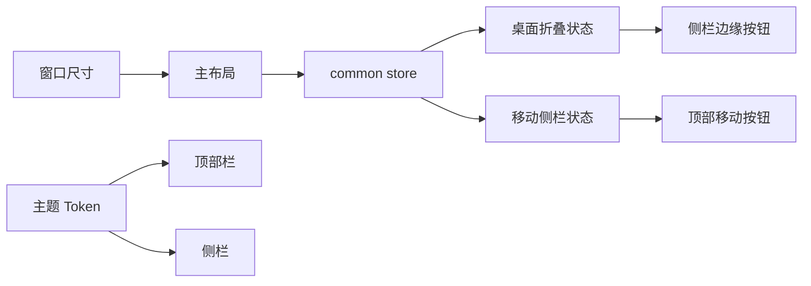
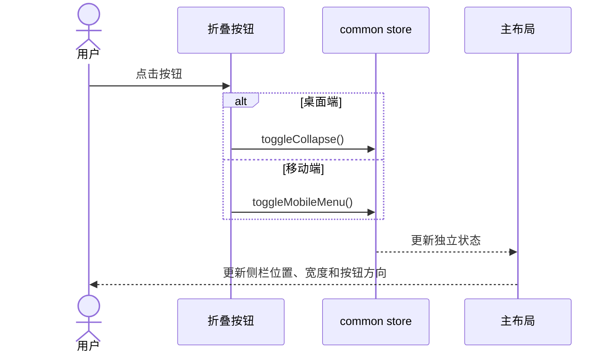

# 主导航折叠交互与导航背景统一详细设计文档

## 1. 文档信息

| 项目 | 内容 |
| --- | --- |
| 功能/模块 | 主布局、侧栏、顶部栏、响应式导航 |
| 设计编号 | DESIGN-REQ-2026-007 |
| 文档版本 | 0.2 |
| 关联需求 | [REQ-2026-007](../requirements/REQ-2026-007-sidebar-collapse-navigation-theme.md) |
| 关联测试 | [TEST-REQ-2026-007](../test/TEST-REQ-2026-007-sidebar-collapse-navigation-theme.md) |
| 目标版本/迭代 | Saber 5.x / 主布局体验优化 |
| 文档状态 | 已实现，部分验证 |
| 设计负责人 | Codex |
| 评审人 | 待指定 |
| 最后更新日期 | 2026-09-04 |

## 2. 设计摘要与范围

### 2.1 设计摘要

新增主布局内部的折叠按钮组件，桌面端将其定位到侧栏右边界，移动端继续放置在顶部栏。Pinia
分别维护桌面折叠状态、移动侧栏开关和当前响应式模式；主布局监听窗口尺寸并在跨断点时关闭移动侧栏。
侧栏背景 Token 直接引用顶部背景 Token，保证浅色和深色主题一致。

### 2.2 关键决策

| 编号 | 决策 | 原因 | 影响 |
| --- | --- | --- | --- |
| DEC-001 | 使用 Element Plus 箭头和折叠图标，不引入 Ant Design | 保持现有依赖和主题体系 | 无锁文件变化 |
| DEC-002 | 桌面折叠与移动侧栏开关使用独立状态 | 避免跨断点状态反转 | common store 增加移动状态 |
| DEC-003 | CSS 和脚本统一使用 992px | 与现有移动侧栏样式一致 | 修复 769px 至 992px 菜单折叠异常 |
| DEC-004 | 侧栏背景引用 `--saber-header-bg` | 同步所有主题模式且避免硬编码 | 设置预览自动同步 |

### 2.3 改动范围

| 层级 | 改动内容 | 不涉及内容 |
| --- | --- | --- |
| 后端 | 无 | API、认证、租户和菜单数据 |
| 前端 | 主布局、顶部栏、侧栏、Logo、Pinia 状态、主题和响应式样式 | 业务页面和动态路由契约 |
| 数据库 | 无 | 所有表结构和数据 |
| 配置/部署 | 无 | 环境变量和部署参数 |

## 3. 总体设计

### 3.1 架构图

### 3.2 组件职责

| 组件 | 职责 | 输入 | 输出 |
| --- | --- | --- | --- |
| `page/index/index.vue` | 监听视口、组装布局状态类 | store 状态、窗口宽度 | 桌面收起或移动打开样式类 |
| `sidebar/toggle.vue` | 渲染按钮、提示和图标 | `variant` | 调用对应 store action |
| `sidebar/index.vue` | 渲染桌面边缘按钮和菜单 | 菜单、布局和响应式状态 | Element Plus Menu |
| `top/index.vue` | 渲染移动端入口 | 响应式和设置状态 | 移动侧栏切换 |
| `store/common.ts` | 隔离桌面和移动状态 | 切换动作、窗口宽度 | 响应式布局状态 |

### 3.3 新增依赖

不适用。复用 Vue、Pinia、Element Plus Icons 和现有 Sass Token。

## 4. 核心流程设计

### 4.1 异常与边界流程

| 场景 | 处理位置 | 处理方式 | 数据是否改变 |
| --- | --- | --- | :---: |
| 跨越 992px 断点 | 主布局与 store | 更新 `isMobile`，关闭移动侧栏 | 仅界面状态 |
| 顶部布局 | 顶部栏、侧栏 | 不渲染折叠按钮 | 否 |
| 菜单不可见 | 主布局 | 侧栏和边缘按钮一并隐藏 | 否 |
| 移动菜单完成跳转 | 菜单项 | 调用 `closeMobileMenu()` | 仅界面状态 |

事务、并发与幂等：不适用；所有动作均为本地幂等界面状态切换。

## 5. 后端设计与 API 契约

不涉及后端、API、认证、权限、租户或数据归属变化。

## 6. 前端设计

### 6.1 状态设计

| 状态 | 存放位置 | 含义 | 失效条件 |
| --- | --- | --- | --- |
| `isCollapse` | common store | 桌面侧栏是否收起 | 当前会话结束 |
| `isMobileMenuOpen` | common store | 移动侧栏是否打开 | 菜单跳转或跨断点 |
| `isMobile` | common store | 当前是否为 992px 及以下 | 窗口尺寸变化 |

`isCollapse` 不再承担移动侧栏开关语义。`setViewportWidth` 只在响应式模式变化时关闭移动侧栏，
不会覆盖桌面折叠偏好。

### 6.2 组件与交互

- 桌面边缘按钮使用 28px 固定圆形尺寸，定位于 Logo 下方并跨在侧栏与内容边界上。
- 展开状态显示 `ArrowLeft`，收起状态显示 `ArrowRight`。
- 移动端顶部按钮使用 `Expand`/`Fold` 图标，保持顶部入口可达。
- 两种按钮共享 Tooltip、`aria-label`、`aria-expanded` 和键盘原生 button 行为。
- `setting.collapse=false`、顶部布局和隐藏菜单页面均不展示无效入口。

### 6.3 样式与主题

- `--saber-sidebar-bg: var(--saber-header-bg)` 同时应用于浅色和深色 Token。
- 边缘按钮背景使用 `--saber-surface-elevated`，边框使用 `--saber-border`，焦点使用主色。
- 侧栏展开/收起继续使用 216px/64px；移动端保持 216px 完整菜单。
- `media.scss` 使用 `saber-shell--mobile-open` 控制移动侧栏，不再复用桌面 collapsed 类。

## 7. 数据库、配置与发布影响

- 数据库：不涉及，不创建数据库设计文档。
- 配置：不涉及环境变量和网站配置结构变化。
- 发布：无新增依赖和迁移脚本，随前端静态资源发布。
- 兼容：保留 `getScreen` 全局能力，但将其兼容断点同步到 992px；主布局内部改用显式响应式状态。

## 8. 测试设计

1. 运行 `pnpm run type-check` 和 `pnpm run build:prod`。
2. 静态检索目标文件，确认无 Ant Design、Avue CRUD/Form 和 `.avue-*` 新增引用。
3. 在 1440px、1024px、375px 检查侧边、混合和顶部布局。
4. 检查浅色、深色和动态主色下导航背景、按钮和选中菜单对比度。
5. 检查跨越 992px、移动菜单点击关闭、隐藏菜单页面和关闭菜单折叠设置。
6. 浏览器不可连接真实后端时，将登录后业务流程标记为阻塞，不以构建代替业务验收。

## 9. 风险与回滚

| 风险 | 控制措施 | 回滚方式 |
| --- | --- | --- |
| 主布局状态改动影响三种导航模式 | 按布局条件渲染并执行多视口回归 | 恢复原单状态和顶部按钮 |
| 边缘按钮覆盖内容或被裁剪 | 固定尺寸、边界定位和多视口截图检查 | 将按钮恢复到顶部栏 |
| 主题统一后选中态对比不足 | 复用现有 active/text Token 并检查明暗主题 | 恢复独立 sidebar 背景 Token |

## 10. 实施状态与变更记录

- 当前状态：代码已实现，类型检查、静态门禁和浏览器定向验收通过，生产构建受本机原生进程
  退出阻塞。
- 已完成：新增共享折叠按钮组件；拆分桌面折叠与移动侧栏状态；统一 992px 断点；侧栏背景
  引用顶部背景 Token；菜单跳转关闭移动侧栏；顶部布局忽略桌面收起宽度；关闭折叠设置自动展开。
- 验证结果：Chrome 152 下完成 1280px、1024px、992px、375px，浅色、深色、自定义主色，
  侧边、顶部、混合布局及设置开关回归；控制台只有既有 vue-i18n Legacy API 弃用警告。
- 待完成：在可稳定执行 Rollup 的环境补跑 `pnpm run build:prod`，并完成最终发布验收。

| 日期 | 版本 | 变更内容 | 修改人 |
| --- | --- | --- | --- |
| 2026-09-04 | 0.2 | 完成实现、类型与浏览器验证，补充顶部布局和关闭折叠设置保护，记录构建阻塞 | Codex |
| 2026-09-04 | 0.1 | 创建详细设计，确定双状态、统一断点、边缘按钮和主题 Token 方案 | Codex |
