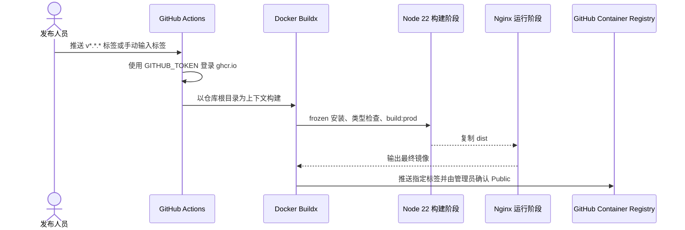

# GitHub Actions 构建并发布公开 GHCR 测试镜像详细设计文档

## 1. 文档信息

| 项目 | 内容 |
| --- | --- |
| 功能/模块 | CI/CD、Docker、Nginx、GHCR |
| 设计编号 | DESIGN-REQ-2026-008 |
| 文档版本 | 0.4 |
| 关联需求 | [REQ-2026-008](../requirements/REQ-2026-008-ghcr-image-publishing.md) |
| 关联测试 | [TEST-REQ-2026-008](../test/TEST-REQ-2026-008-ghcr-image-publishing.md) |
| 目标版本/迭代 | Saber 5.x / 容器化发布 |
| 文档状态 | 已实现，本地验证通过 |
| 设计负责人 | Codex |
| 评审人 | 待指定 |
| 最后更新日期 | 2026-09-04 |

## 2. 设计摘要与关键决策

GitHub Actions 在版本标签或人工触发时登录 GHCR，并使用 Docker Buildx 构建、缓存和推送镜像。
Dockerfile 使用 Node.js 22 构建阶段执行 frozen 依赖安装、类型检查和生产构建，再把 `dist` 复制到
Nginx 运行阶段。Nginx 提供 History 路由回退、静态资源缓存、入口文件禁用强缓存和健康检查。

| 编号 | 决策 | 原因 | 影响 |
| --- | --- | --- | --- |
| DEC-001 | 使用 `ghcr.io/aninterestingname/saber` | 与当前 GitHub 仓库同平台，且镜像路径满足全小写要求 | 仓库所有者或名称变化时需同步修改 |
| DEC-002 | Actions 使用 `GITHUB_TOKEN` | 避免在仓库保存长期写入 PAT | `permissions.packages` 必须为 `write` |
| DEC-003 | Dockerfile 内执行完整前端构建 | 本地、CI 共用同一 Linux 构建环境 | 镜像构建时间高于直接复制本地 `dist` |
| DEC-004 | 最终阶段仅保留 Nginx 和 `dist` | 降低镜像体积和攻击面 | 运行容器不能执行 Node.js 命令 |
| DEC-005 | 不在容器内终止 TLS | 证书生命周期应由反向代理或 Ingress 管理 | 容器只暴露 80 端口 |
| DEC-006 | 首次真实发布后人工确认 Public | 测试阶段需要匿名拉取，包可见性由管理员在 Package settings 设置 | Public 不可改回 Private |
| DEC-007 | Action 固定到当前发布版本的完整提交 SHA | 防止可变版本标签被重新指向未审查代码 | 升级 Action 时需显式更新 SHA 和注释版本 |
| DEC-008 | Compose 清单与镜像分离下载 | GHCR 只保存镜像，部署清单由 Git 仓库提供版本历史 | 服务器需先取得清单，再执行镜像拉取 |

## 3. 改动范围与组件职责

| 文件/组件 | 职责 | 输入 | 输出 |
| --- | --- | --- | --- |
| `.github/workflows/publish-ghcr.yml` | 定义触发、权限、GHCR 登录、Buildx 构建和推送 | Git 标签或人工输入 | 公开 GHCR 测试镜像 |
| `src/docker/Dockerfile` | 完成前端构建和最小运行镜像组装 | 源码、锁文件、生产环境配置 | Nginx OCI 镜像 |
| `src/docker/nginx.conf` | 提供静态站点、路由回退、缓存和探活 | HTTP 请求 | 静态资源或 `index.html` |
| `.dockerignore` | 限制发送给 Docker daemon 的上下文 | 仓库工作区 | 精简构建上下文 |
| `src/docker/docker-compose.yaml` | 定义公开镜像、端口、重启、安全和日志策略 | `compose.env` | 可运行的 Saber 服务 |
| `src/docker/compose.env.example` | 提供非敏感 Compose 参数示例 | 镜像标签、监听地址、端口 | 服务器本地变量文件模板 |
| `src/docker/README.md` | 说明部署文件下载、登录、拉取、启动、升级和回滚 | Git 版本、GHCR 只读凭据 | 运维操作步骤 |

不涉及后端、数据库、业务页面、API 契约、认证头或租户逻辑；不新增 npm 依赖。

## 4. 技术流程

失败边界：检出、登录、依赖安装、类型检查、生产构建、镜像组装或推送任一步失败，Job 均以非零状态
结束。Docker layer cache 只用于加速，不改变锁文件和构建命令。

## 5. GitHub Actions 设计

- 自动入口：推送 `v*.*.*` 标签。
- 手动入口：`workflow_dispatch` 输入 `image_tag`，默认值为 `manual`。
- 权限：`contents: read`、`packages: write`，不开放仓库内容写入权限。
- 并发：同一 Git 引用只允许一个发布任务，已开始的镜像发布不自动取消。
- 镜像：`ghcr.io/aninterestingname/saber:<image_tag>`。
- 缓存：使用 GitHub Actions Cache 保存和恢复 BuildKit 层。
- 标签校验：构建前检查字符范围和 128 字符长度上限，错误标签立即失败。
- 标签策略：版本发布使用不可变版本标签；手动 `manual` 标签允许覆盖，仅用于验证。
- 包归属：OCI `source` 标签指回当前 GitHub 仓库。

## 6. Docker 与 Nginx 设计

### 6.1 构建阶段

1. 使用 `node:22-alpine`，工作目录为 `/app`。
2. 固定启用 pnpm 10.23.0，避免 runner 全局工具版本漂移。
3. 先复制 `package.json` 与 `pnpm-lock.yaml`，使用 frozen 模式安装依赖以利用层缓存。
4. 再复制源代码，执行 `pnpm run type-check` 和 `pnpm run build:prod`。

### 6.2 运行阶段

1. 使用 `nginx:1.28-alpine`，覆盖默认站点配置。
2. 仅从构建阶段复制 `/app/dist`，不复制源代码和 `node_modules`。
3. `/healthz` 返回固定 `ok`，Docker HEALTHCHECK 通过本机 HTTP 请求验证 Nginx。
4. 容器只声明 80 端口，HTTPS 由外部网关负责。

### 6.3 History 路由与缓存

- `/` 使用 `try_files $uri $uri/ /index.html`：真实文件优先，不存在时返回 SPA 入口。
- `/index.html` 禁用缓存：新版本发布后客户端能及时获取新的资源引用。
- 带内容哈希的静态资源使用长期缓存；不存在的静态文件返回 404，不错误回退到 HTML。
- API 代理不在本次 Nginx 配置内；生产环境应由外部网关或后续部署配置处理。

### 6.4 Docker Compose 部署

- `docker-compose.yaml` 使用 `SABER_IMAGE_TAG` 选择版本，变量缺失时直接报错，避免隐式部署错误版本。
- `pull_policy: always` 使 up 和 pull 都会检查当前标签对应的远端镜像。
- 默认端口映射为 `127.0.0.1:8080:80`，防止绕过宿主机 HTTPS 反向代理直接访问容器。
- 不固定 `container_name`，由 Compose 使用项目名 `saber` 管理容器和网络资源。
- 启用 `no-new-privileges`，设置十秒优雅停止，并限制 JSON 日志为三个十兆字节文件。
- Compose 清单不保存 GHCR Token；包设为 Public 后由服务器匿名拉取。
- 生产环境从对应 Git 版本标签下载清单，避免使用随 `main` 变化的部署配置。

## 7. 配置与安全

| 检查项 | 设计 |
| --- | --- |
| GHCR 写认证 | 仓库运行时生成的 `GITHUB_TOKEN` |
| GHCR 读认证 | Public 包允许匿名拉取，部署端不保存 Token |
| 包可见性 | 首次发布后在 Packages 设置中确认 Public；该操作不可逆 |
| 敏感信息 | 不作为 Docker ARG、ENV、标签或日志内容 |
| Actions 来源 | 使用 GitHub 官方与 Docker 官方 Action，并固定到 2026-09-04 当前版本的完整提交 SHA |
| 构建输入 | 锁文件、源码和 `.env.production`；排除本地缓存、Git 元数据和构建产物 |

环境变量/API 地址未在工作流中新增。当前构建继续读取 `.env.production`；若后续需要同一镜像跨环境
复用，应另行设计运行时配置文件或由统一网关提供同源 API，不能把私密凭据编译进前端静态资源。

## 8. 测试、发布与回滚

测试范围包括配置静态检查、`pnpm run type-check`、Docker 构建、Nginx 配置检查、根路径、History
子路由、健康检查和 Docker Compose 渲染。本地检查均已通过；真实 GHCR 推送和 Compose 匿名拉取
需要配置提交后的 GitHub Actions 环境，当前标记为阻塞而不是以本地构建替代。

发布步骤：

1. 合并配置后在 GitHub Actions 手动使用 `manual` 标签验证首次发布。
2. 在 Packages 页面将 `ghcr.io/aninterestingname/saber` 确认为 Public 且已关联仓库。
3. 在未登录 GHCR 的目标服务器匿名拉取 `manual` 镜像并执行冒烟测试。
4. 创建正式版本标签，例如 `v5.0.1`，生成正式镜像。

回滚通过重新部署上一个已验证的版本标签完成，不覆盖历史版本标签。数据库不涉及，无迁移和降级步骤。

## 9. 风险与变更记录

| 风险 | 控制措施 | 状态 |
| --- | --- | --- |
| Public 设置不可逆 | 仅将当前测试包公开；未来私有发布使用新包名 | 已接受 |
| Docker Hub 或本地 daemon 不可用 | 将本地容器验证标记阻塞，以 GitHub Actions Linux 构建补验 | 开放 |
| API 地址与部署拓扑不一致 | 默认沿用现有生产配置，网关代理另行设计 | 开放 |
| 基础镜像标签后续变化 | 发布前定期升级并重新验证；正式高安全环境可进一步固定 digest | 接受 |

| 日期 | 版本 | 变更内容 | 修改人 |
| --- | --- | --- | --- |
| 2026-09-04 | 0.4 | 测试发布改为 Public，部署端改为匿名拉取并记录不可逆边界 | Codex |
| 2026-09-04 | 0.3 | 增加 Compose 部署清单、变量契约、下载流程、安全默认值和回滚设计 | Codex |
| 2026-09-04 | 0.2 | 完成实现，本地 Linux 镜像构建、Nginx 路由、缓存与健康检查通过 | Codex |
| 2026-09-04 | 0.1 | 确定 GHCR、Buildx、多阶段镜像、Nginx History 回退和最小权限方案 | Codex |
