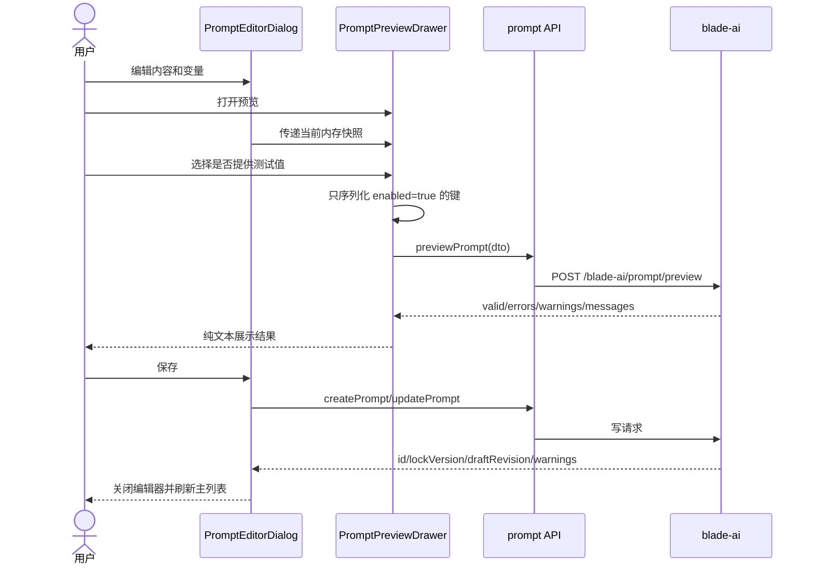
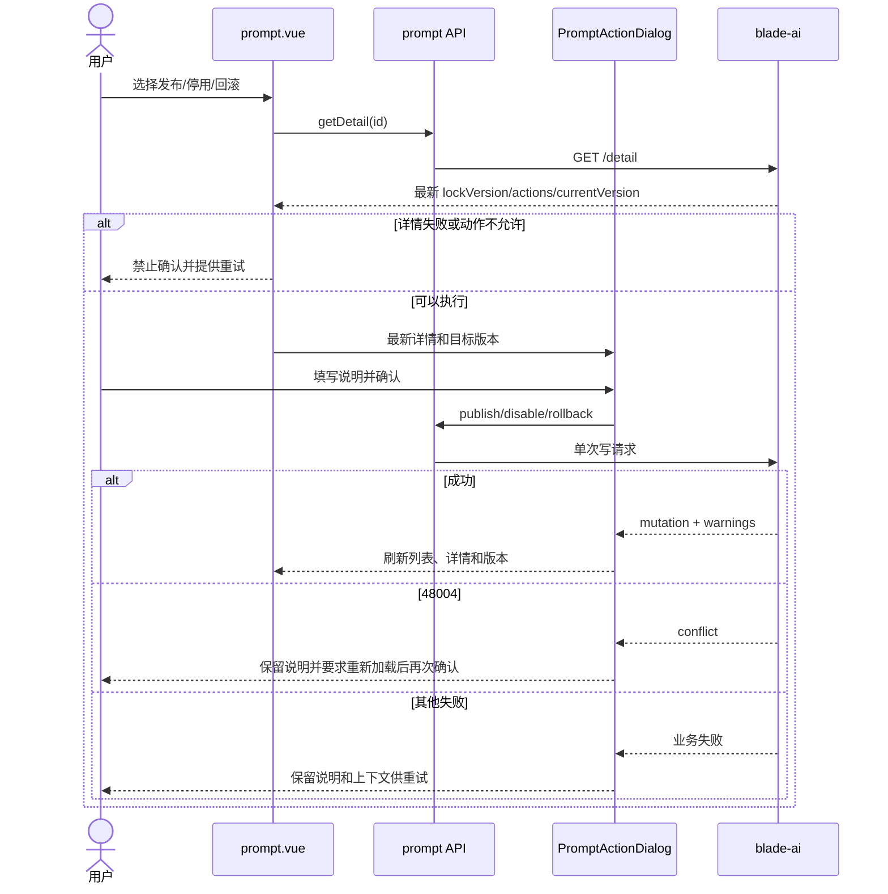

# Saber 提示词管理详细设计文档

## 1. 文档信息

| 项目 | 内容 |
| --- | --- |
| 功能/模块 | 资产管理、提示词草稿、预览与版本发布 |
| 设计编号 | DESIGN-REQ-2026-009 |
| 文档版本 | 0.3 |
| 关联需求 | [REQ-2026-009 Saber 提示词管理](../requirements/REQ-2026-009-prompt-management.md) |
| 关联测试 | [TEST-REQ-2026-009 Saber 提示词管理](../test/TEST-REQ-2026-009-prompt-management.md) |
| 后端基线 | SpringBlade `REQ-2026-001` 0.3、`DESIGN-REQ-2026-001` 0.4 及当前 `blade-ai` Java 契约 |
| 目标版本/迭代 | Saber 5.x / AI 能力第一阶段 |
| 文档状态 | 开发中（已实现，待联调与业务验收） |
| 设计负责人 | Codex |
| 评审人 | 前端、后端、安全、测试待指定 |
| 最后更新日期 | 2026-09-09 |

## 2. 设计摘要与范围

### 2.1 设计摘要

新增 `/asset/prompt` 动态菜单页面，以 `usePagedList` 管理主列表，以模块内组件承载草稿编辑、变量编辑、
无状态预览、版本历史和高风险操作说明。页面不建立 Pinia 业务 Store，提示词正文、预览值和版本快照只存在于
当前组件内存；切换目标、关闭视图、租户变化或退出登录时失效。

前端严格使用后端返回的字符串 Long、`lockVersion`、`draftDirty`、`actions` 和结构化预览结果。所有写操作
同时受按钮权限、服务端动作状态和独立执行锁控制。发布、停用和回滚前重新读取详情，发生 `48004` 冲突时
保留本地输入并要求人工核对，不自动覆盖或重放。

### 2.2 关键决策

| 编号 | 决策 | 原因 | 影响 |
| --- | --- | --- | --- |
| DEC-001 | 页面使用 `src/views/asset/prompt.vue`，菜单路径 `/asset/prompt`，菜单与页面标题均为“提示词管理” | 符合动态路由 `views/{path}.vue` 契约，并将提示词明确归入可复用资产 | 需后端新增资产管理父菜单和提示词管理子菜单 |
| DEC-002 | 不使用通用 CRUD 表单，采用模块内提示词编辑器 | 提示词包含长文本、有序变量和未保存预览，超出普通表单弹窗职责 | 新增模块组件但不扩展全局 CRUD 引擎 |
| DEC-003 | 保存成功后关闭编辑器并刷新主列表 | 保存作为一次完整编辑操作，返回列表可避免用户误以为仍有未提交内容 | 重新编辑时读取最新详情和并发版本，新增不会重复 create |
| DEC-004 | 变量使用可展开的有序编辑列表，不引入拖拽依赖 | 字段较多，普通横向表格在移动端不可用；上移/下移可满足有序要求 | 复用 Element Plus Collapse、Form 和图标按钮 |
| DEC-005 | 预览测试值采用“是否提供 + 类型控件”双层状态 | 必须区分缺失、空字符串、false 和 0；未提供键需从请求体省略 | 预览组件维护独立 enabled map 和 typed value map |
| DEC-006 | 在现有 Axios 层增加兼容的 `BladeBusinessError` | 当前 2xx 业务错误被转换为普通 Error，页面无法可靠识别 `48004` | 仍继承 Error 且保留统一消息；共享变更需回归现有请求 |
| DEC-007 | 版本历史使用大尺寸抽屉，列表与选中快照在同一上下文 | 避免多层弹窗，保持版本选择、详情和回滚目标一致 | 抽屉内部维护独立分页和详情请求序号 |
| DEC-008 | 不做前端模板解析和 HTML 渲染 | 防止与后端解析规则漂移及正文注入 | 引用、错误、警告完全以预览响应为准，正文使用纯文本 |
| DEC-009 | 按钮权限使用 `prompt_*`，接口授权继续使用 `ai:prompt:*` | Saber 按钮数据来自 `blade_menu`，SpringBlade `@PreAuth` 来自 API Scope | 上线必须同时配置两套资源及角色授权 |

### 2.3 改动范围

| 层级 | 改动内容 | 不涉及内容 |
| --- | --- | --- |
| 前端页面 | 新增提示词列表与模块内组件 | 模型调用、统计分析、模板市场 |
| 前端 API | 新增 `/blade-ai/prompt/**` 类型和请求函数 | Feign 运行时接口 |
| 前端基础能力 | Axios 业务错误保留数值码；新增 route i18n | 鉴权头、Token、动态路由算法 |
| 前端 Store | 无新增业务 Store | 不持久化正文、测试值和版本数据 |
| 后端 | 依赖菜单、按钮、Scope 绑定和角色授权数据 | 不修改提示词 Java、表结构和 Feign 契约 |
| 数据库 | Saber 不涉及 | SpringBlade 提示词表由后端需求负责 |
| 依赖/锁文件 | 无 | 不新增编辑器、拖拽或状态库 |

## 3. 总体设计

### 3.1 架构图

```mermaid
flowchart LR
    Menu[动态菜单 /asset/prompt] --> Page[prompt.vue]
    Page --> List[usePagedList]
    Page --> Editor[PromptEditorDialog]
    Editor --> Variables[PromptVariableEditor]
    Editor --> Preview[PromptPreviewDrawer]
    Page --> Versions[PromptVersionDrawer]
    Page --> Action[PromptActionDialog]
    List --> API[src/api/ai/prompt.ts]
    Editor --> API
    Preview --> API
    Versions --> API
    Action --> API
    API --> Axios[src/axios.ts]
    Axios --> Backend[/blade-ai/prompt/**]
    Permission[blade_menu prompt_*] --> Page
    ApiScope[blade_scope_api ai:prompt:*] --> Backend
```

### 3.2 文件与组件职责

| 文件/组件 | 职责 | 输入 | 输出 |
| --- | --- | --- | --- |
| `src/views/asset/prompt.vue` | 列表查询、权限计算、目标上下文、模块组件编排 | 菜单、用户权限、API 响应 | 页面与各操作入口 |
| `src/api/ai/prompt.ts` | 后端契约类型和十二个管理请求 | Query/DTO | `BladeResponse<T>` |
| `src/views/asset/components/prompt-editor-dialog.vue` | 新增、查看、编辑草稿，保存成功后关闭 | promptId、mode、权限 | saved/close/open-preview 事件 |
| `src/views/asset/promptVariable.ts` | 统一四类变量的最大长度规范化规则 | PromptVariable | 规范化后的变量 |
| `src/views/asset/components/prompt-variable-editor.vue` | 有序变量定义、类型控件和局部校验 | `PromptVariable[]`、disabled | `v-model` 变量数组 |
| `src/views/asset/components/prompt-preview-drawer.vue` | 临时测试值、预览请求和结构化结果 | 当前编辑快照 | preview result/close |
| `src/views/asset/components/prompt-version-drawer.vue` | 版本分页、版本详情、当前标记和回滚入口 | promptId、currentVersionId、权限 | rollback-request/close |
| `src/views/asset/components/prompt-action-dialog.vue` | 发布、停用、回滚的说明输入和后果确认 | action、最新详情、目标版本 | confirm/cancel |
| `src/axios.ts` | 保留 2xx 业务错误码并维持统一提示 | `R<T>` | `BladeBusinessError` |
| `src/lang/{zh,en,ja}.ts` | 资产管理和提示词管理菜单翻译 | i18n key | route title |

组件只服务提示词模块，不提升为全局组件。`PromptVariableEditor` 和 `PromptActionDialog` 分别有多个真实使用场景，
抽取可减少编辑、查看、发布和回滚中的重复逻辑。

### 3.3 新增依赖

不适用。复用 Vue、Element Plus、Pinia 用户权限状态、Axios、dayjs、现有公共组件和 composable。

## 4. 核心流程设计

### 4.1 草稿编辑与未保存预览



### 4.2 发布、停用与回滚



### 4.3 异常与边界流程

| 场景 | 处理位置 | 处理方式 | 错误码/结果 | 数据是否改变 |
| --- | --- | --- | --- | :---: |
| 未登录 | `axios.ts` | 复用现有会话清理 | 401 | 否 |
| 无按钮权限 | 页面 | 不渲染入口 | 本地权限 | 否 |
| 无 API Scope | 后端 + Axios | 统一错误提示，不显示成功 | 安全响应 | 否 |
| 详情不存在或越租户 | Editor/Version | 清空旧数据，显示加载失败 | 48001 | 否 |
| 预览 `valid=false` | Preview | 作为正常校验结果渲染 | code=200、valid=false | 否 |
| 并发冲突 | Editor/Action | 保留本地输入和说明；另存最新详情供核对 | 48004 | 否 |
| 模板非法 | 表单/Preview/Axios | 前端基础校验或显示后端具体 message | 48005/valid=false | 否 |
| 删除受限 | 页面 | 保留记录和查询，不隐藏为成功 | 48009 | 否 |
| 目标版本失效 | Version | 刷新版本列表并清空旧目标 | 48010 | 否 |
| 快速切换目标 | composable/组件 | 请求序号和上下文版本共同废弃迟到响应 | 不适用 | 否 |

### 4.4 并发与幂等

| 操作 | 前端并发控制 | 请求参数 | 重复/失败策略 |
| --- | --- | --- | --- |
| 列表查询 | `usePagedList.latestRequest` | current/size/query | 只接收最新响应 |
| 详情加载 | `useRemoteDetail` | id | 切换目标先 clear |
| 保存 | editor `saving` | id/lockVersion 或 create DTO | 禁止重复点击；成功后关闭并刷新列表；超时后先查详情，不盲目重放 |
| 预览 | preview `previewing` + request id | 当前未保存内容 | 新预览废弃旧结果；无持久化 |
| 发布 | `publishing` | id/lockVersion/changeNote | 失败保留说明；重新加载后再次确认 |
| 停用 | `disabling` | id/lockVersion/disableNote | 同上 |
| 删除 | `deletingPromptId` | id/lockVersion | 同一时间只处理一个目标 |
| 版本列表/详情 | drawer context version | promptId/versionId | 切换提示词时清空旧列表和详情 |
| 回滚 | `rollingBack` | id/targetVersionId/lockVersion/changeNote | 不自动重放，不允许当前版本目标 |

## 5. 后端契约与前端类型

### 5.1 类型设计

类型集中定义在 `src/api/ai/prompt.ts`，避免页面和五个模块组件各自复制后端字段。主要类型如下：

```ts
export type PromptValue = string | number | boolean | null;

export interface PromptValueMap {
  [name: string]: PromptValue;
}

export type PromptVariableType = 'TEXT' | 'MULTILINE_TEXT' | 'NUMBER' | 'BOOLEAN';

export interface PromptVariable {
  name: string;
  displayName: string;
  type: PromptVariableType;
  required: boolean;
  defaultValue: PromptValue;
  exampleValue: PromptValue;
  maxLength?: number;
  description?: string;
}
```

实体和响应类型按后端 VO 分为 `PromptListItem`、`PromptDetail`、`PromptVersion`、`PromptActionState`、
`PromptMutation`、`PromptRenderResult`、`PromptValidationIssue` 和 `PromptMessage`。所有 ID、`lockVersion`、
`draftRevision`、`sourceDraftRevision` 使用 `string`，不得转为 number。

### 5.2 状态与来源枚举

| 字段 | 值 | 前端标签 | 展示类型 |
| --- | ---: | --- | --- |
| `status` | 0 | 草稿 | info |
| `status` | 1 | 已发布 | success |
| `status` | 2 | 已停用 | danger |
| `sourceType` | 1 | 普通发布 | primary |
| `sourceType` | 2 | 回滚发布 | warning |

优先显示后端 `statusName`；本地映射只作为样式和未知值回退，不覆盖后端业务语义。未知状态显示“未知状态
({value})”，不得默认为草稿。

### 5.3 字段与前端校验

| 字段 | 前端处理 | 后端边界 |
| --- | --- | --- |
| `promptName` | trim、必填、max 100 | `@NotBlank @Size(100)` |
| `promptCode` | trim、lowercase、必填、max 64；edit 只读 | `@NotBlank @Size(64)` + 服务层不可修改 |
| 两段正文 | textarea、纯文本、至少一段非空 | 默认单项 max 32768、双空错误 |
| `variables` | max 100；名称正则、显示名、类型、required 必填 | 后端完整校验 |
| `defaultValue/exampleValue` | 按变量类型生成 string/number/boolean/null | 不接受字符串数字或字符串布尔 |
| `maxLength` | 只允许文本类型，正整数 | 非文本禁止，文本必须大于 0 |
| `description` | max 500 | `@Size(500)` |
| 操作说明 | trim、必填、max 500 | publish/disable/rollback 均必填 |

类型切换时执行以下规则：

1. TEXT 与 MULTILINE_TEXT 之间保留字符串默认值和示例值。
2. 切换到 NUMBER 或 BOOLEAN 时清空字符串值和 `maxLength`。
3. 切换到文本类型时清空 number/boolean 值；不做隐式字符串转换。
4. 已有非空不兼容值时先提示用户确认，取消则恢复原类型。

## 6. API 契约

### 6.1 接口清单

| 前端函数 | 方法与路径 | 请求 | 响应 data | 权限 |
| --- | --- | --- | --- | --- |
| `getPromptList` | `GET /blade-ai/prompt/list` | current/size/name/code/status | `PageResult<PromptListItem>` | `ai:prompt:view` |
| `getPromptDetail` | `GET /blade-ai/prompt/detail` | id | `PromptDetail` | `ai:prompt:view` |
| `createPrompt` | `POST /blade-ai/prompt/create` | `PromptCreatePayload` | `PromptMutation` | `ai:prompt:create` |
| `updatePrompt` | `POST /blade-ai/prompt/update` | `PromptUpdatePayload` | `PromptMutation` | `ai:prompt:edit` |
| `copyPrompt` | `POST /blade-ai/prompt/copy` | sourcePromptId/name/code | `PromptMutation` | `ai:prompt:copy` |
| `removePrompt` | `POST /blade-ai/prompt/remove` | id/lockVersion | boolean | `ai:prompt:delete` |
| `previewPrompt` | `POST /blade-ai/prompt/preview` | content/variables/testVariables | `PromptRenderResult` | `ai:prompt:preview` |
| `publishPrompt` | `POST /blade-ai/prompt/publish` | id/lockVersion/changeNote | `PromptMutation` | `ai:prompt:publish` |
| `disablePrompt` | `POST /blade-ai/prompt/disable` | id/lockVersion/disableNote | `PromptMutation` | `ai:prompt:disable` |
| `getPromptVersionList` | `GET /blade-ai/prompt/version/list` | promptId/current/size | `PageResult<PromptVersion>` | `ai:prompt:view` |
| `getPromptVersionDetail` | `GET /blade-ai/prompt/version/detail` | promptId/versionId | `PromptVersion` | `ai:prompt:view` |
| `rollbackPrompt` | `POST /blade-ai/prompt/rollback` | id/targetVersionId/lockVersion/changeNote | `PromptMutation` | `ai:prompt:rollback` |

请求统一经 `@/axios`，GET 使用 `params`，POST 使用 `data`，不提交 `tenantId`，不启用额外 Token 拼装。

### 6.2 预览请求序列化

组件内部状态分为：

```ts
interface PreviewFieldState {
  enabled: boolean;
  value: PromptValue;
}
```

构造 `testVariables` 时只加入 `enabled=true` 的字段。空字符串、`0` 和 `false` 是有效已提供值；
`enabled=false` 才表示缺失。默认不把 `null` 写入请求，以免覆盖后端默认值选择逻辑。

“填充示例值”只为 `exampleValue !== null` 的变量设置 `enabled=true` 并复制同类型值。关闭预览抽屉后清空
全部测试值和结果；再次打开从未提供状态开始。

### 6.3 业务错误类型

在 `src/axios.ts` 增加：

```ts
export class BladeBusinessError extends Error {
  constructor(
    public readonly code: number,
    message: string
  ) {
    super(message);
    this.name = 'BladeBusinessError';
  }
}
```

当 HTTP 2xx 但 `res.data.code !== 200` 时，仍按现有逻辑展示一次统一 `ElMessage.error`，随后 reject
`BladeBusinessError`。现有页面的普通 `catch` 兼容不变，提示词页面可使用 `instanceof` 精确识别 48004。
401、HTTP 网络错误和白名单行为保持现状。该变更不暴露完整响应体，不在错误对象保存提示词正文或变量值。

## 7. 前端页面设计

### 7.1 主列表

主页面复用 `SearchPanel`、`ListPanel`、`ListPagination` 和 `usePagedList`。

搜索区：

- 名称：`name`，文本输入。
- 编码：`code`，文本输入，查询时 trim 和 lowercase。
- 状态：本地枚举 Select，值保持 number。

列表列：

| 列 | 宽度策略 | 展示 |
| --- | --- | --- |
| 名称 | min 180 | 主文本，溢出提示 |
| 编码 | min 180 | 等宽或普通代码样式，纯文本 |
| 状态 | width 100 | 状态 Tag |
| 当前版本 | width 110 | `V{currentVersionNo}`，0 显示“-” |
| 草稿状态 | width 130 | `draftDirty=true` 显示“有待发布草稿” |
| 更新时间 | min 170 | 后端时间原样或 dayjs 格式化 |
| 操作 | fixed right 230 | 查看、编辑、更多下拉 |

列表不提供选择列和批量操作。`RowActions` 用于查看和编辑；复制、预览、版本、发布、停用、删除放入
“更多”下拉，危险动作使用图标、分组和危险色。动作计算为：

```text
visible = buttonPermission && serverAction && !contextLoading
```

查看和版本只依赖 `prompt_view`；预览需要先加载详情。任何动作开始前保存目标 ID，不直接持有可能被列表刷新替换的
row 对象。

### 7.2 提示词编辑器

使用模块内 `el-dialog`，桌面宽度 `min(1120px, calc(100vw - 32px))`，最大高度限制在视口内，正文独立滚动，
header/footer 固定。移动端占满可用宽度。

编辑器分区：

1. 基本信息：名称、编码、状态、当前版本、草稿修订。
2. 提示词内容：固定指令、用户输入模板，两者均为带字数提示的 textarea。
3. 变量定义：有序折叠列表，标题显示序号、变量名、类型、必填状态和警告标记。
4. 服务端警告：保存或详情响应的 warnings，按变量名和字段归组展示。

底部操作：取消/关闭、预览、保存。view 模式只显示关闭和有权限的预览；add/edit 模式显示保存。
保存成功后显示成功消息、触发主列表刷新并关闭窗口；重新编辑时重新读取详情及最新 `lockVersion`。保存失败时保持
窗口和用户输入，允许修正后重试。

详情加载失败时不渲染上一个目标表单，显示 `el-result` 和重试按钮。编辑器关闭时 clear detail、form、warnings、
conflict snapshot 和预览状态。

### 7.3 变量编辑器

每个变量项包含：变量名、显示名称、类型、是否必填、默认值、示例值、最大长度、输入说明。使用稳定本地 key
维护未保存新增项，提交时删除本地 key。

操作规则：

- 最多 100 项，达到上限禁用新增并显示说明。
- 上移/下移按钮保持固定尺寸并提供 Tooltip；首项/末项禁用对应方向。
- 删除有值变量前确认，空白新变量可直接删除。
- required 使用 Switch；类型使用 Select；布尔默认/示例值使用三态 Select（未设置/true/false）。
- NUMBER 使用 `el-input-number`；TEXT 使用 Input；MULTILINE_TEXT 使用 Textarea。
- TEXT、MULTILINE_TEXT 的 maxLength 缺省为 255，新增、详情回填、类型切换、预览和保存均通过
  `normalizePromptVariable` 规范化；NUMBER、BOOLEAN 删除 maxLength。
- maxLength 仅文本类型显示，使用 1 至 32768 的正整数输入。
- Element Plus 表单 path 使用 `variables.{index}.{field}`，服务端 issue 按 variableName 定位并展开对应项。

### 7.4 预览抽屉

抽屉宽度 `min(760px, 100vw)`，分为测试变量、校验结果和最终消息三个连续区段，不用嵌套卡片。

- 测试变量按定义顺序生成，显示“提供该值”控制和类型输入。
- 提供“填充示例值”和“清空测试值”命令。
- 点击执行预览后独立 loading，禁用关闭和重复提交。
- `valid=false` 展示错误、警告、引用变量、未解析变量，不显示成功结果。
- `valid=true` 展示 SYSTEM/USER 消息和完整顺序；内容使用 `<pre>` + `white-space: pre-wrap`。
- 新预览开始时清空上次结果；迟到响应不得覆盖最新输入对应结果。

### 7.5 版本抽屉

抽屉宽度 `min(1040px, 100vw)`。桌面和平板使用两列：左侧紧凑版本分页列表，右侧选中版本详情；列表和详情
分别在自身区域内滚动，不使用抽屉正文的页面级滚动。767px 及以下改为上下布局，并限制版本列表高度以保留详情空间。

版本列表显示 Vn、当前标记、来源、变更说明、发布人 ID、发布时间。首次打开默认选择当前版本；不存在当前版本时
选择最新版本。切换版本时使用独立 `useRemoteDetail` 清空旧快照。

详情顶部使用只读摘要带展示版本、名称、编码、来源、变更说明、发布人和发布时间；下方使用“内容快照”、
“变量快照”和“技术信息”三个页签，分别承载两段正文、变量只读表单、来源与发布技术信息表单。正文和内容哈希提供
只读复制操作；变量表单按变量分块，并展示名称、类型、必填、最大长度、默认值、示例值和说明。回滚按钮同时满足：

- `prompt_rollback` 为 true。
- 最新提示词详情 `actions.rollbackable=true`。
- 目标版本不是 `currentVersionId`。
- 当前无版本详情或其他写操作 loading。

回滚成功后刷新主列表、最新详情、版本列表和选中当前版本；服务端保留的草稿状态按最新详情展示，不在前端推断。

### 7.6 操作说明弹窗

统一处理 publish、disable、rollback 三种动作，标题和正文根据 action 变化。确认前再次核对传入详情仍是最近一次加载目标。

| 动作 | 说明字段 | 关键确认内容 |
| --- | --- | --- |
| publish | `changeNote` | 当前版本、草稿修订、是否有未发布草稿、将生成 V(n+1) |
| republish | `changeNote` | 当前已停用、将生成新版本并恢复运行时可用 |
| disable | `disableNote` | 新业务调用将失败，详情和历史保留 |
| rollback | `changeNote` | 目标版本、将生成 V(n+1)、当前草稿不会被覆盖 |

说明使用 textarea，maxlength 500，提交中禁止关闭。成功后关闭并发出 mutation；失败保留输入。

## 8. 权限、菜单与国际化

### 8.1 后端菜单数据依赖

SpringBlade 需在独立后端变更中提供下列数据，Saber 仓库不直接维护数据库 SQL：

1. 顶级菜单：code=`asset`、name=`资产管理`、path=`/asset`、category=1。
2. 子菜单：code=`prompt`、name=`提示词管理`、path=`/asset/prompt`、category=1；页面标题同为“提示词管理”。
3. 九个按钮：`prompt_view`、`prompt_add`、`prompt_edit`、`prompt_copy`、`prompt_delete`、
   `prompt_preview`、`prompt_publish`、`prompt_disable`、`prompt_rollback`。
4. 将现有九个管理 API Scope 的 `menu_id` 更新为提示词管理子菜单 ID；`ai:prompt:runtime` 不绑定前端按钮，
   是否放入该菜单的 API Scope 分组由后端权限设计确认。
5. 角色需同时授权资产管理/提示词管理菜单、按钮和 API Scope。默认不把高风险权限自动授予普通租户管理员。

若 Scope 保持 `menu_id=NULL`，当前 `grantApiScopeTree` 不会返回这些节点，角色页面无法配置对应 API 权限，必须在联调前解决。

### 8.2 前端权限计算

`useCrudPermission('prompt')` 提供 add/view/edit/delete；copy/preview/publish/disable/rollback 从
`useUserStore().permission` 通过 `validData` 计算。页面不把 `isAdmin` 当作高风险权限替代。

### 8.3 国际化

同步增加：

| key | zh | en | ja |
| --- | --- | --- | --- |
| `route.asset` | 资产管理 | Asset Management | 資産管理 |
| `route.prompt` | 提示词管理 | Prompt Management | プロンプト管理 |

业务表单文案本期沿用仓库现有中文页面风格；动态菜单具备 i18n 元数据时使用以上 route key。

## 9. 状态、缓存与安全

### 9.1 状态存放与失效

| 状态/数据 | 存放位置 | 获取方式 | 失效条件 |
| --- | --- | --- | --- |
| 列表、查询、分页 | `prompt.vue` + `usePagedList` | list API | 页面卸载/重新查询 |
| 当前详情 | editor/page `useRemoteDetail` | detail API | 切换目标/关闭/租户变化 |
| 编辑表单 | editor local ref | detail 或新建初值 | 关闭/明确重新加载 |
| 预览测试值与结果 | preview local ref | 用户输入/preview API | 关闭预览/编辑器 |
| 版本列表与详情 | version drawer local state | version APIs | 切换提示词/关闭 |
| 操作说明 | action dialog local ref | 用户输入 | 成功或取消；失败时保留 |
| 权限 | user store | `/blade-system/menu/buttons` | 重新登录/菜单刷新 |

不在 Pinia、localStorage、sessionStorage、URL query 或日志中保存提示词正文、变量值、测试值和渲染结果。

### 9.2 安全要求

| 检查项 | 设计 |
| --- | --- |
| 认证 | 复用现有 JWT/Token 请求拦截，不修改认证头 |
| 租户 | DTO 和 query 不包含 tenantId，后端按安全上下文隔离 |
| 授权 | 按钮权限只控制可见性，API Scope 是最终边界 |
| XSS | 正文、说明和渲染消息只使用文本插值或 `<pre>`，禁止 `v-html` |
| 输入 | 表单基础校验 + 后端完整模板/变量校验，不复制可执行解析器 |
| 日志 | 不打印请求体、正文、变量或响应消息；开发日志也不例外 |
| Long 精度 | 全部 ID 和版本字段保持 string |
| 删除 | 单条确认，显示编码不可复用，不能批量扩大范围 |

## 10. 测试与验证设计

### 10.1 工程检查

实现 `.ts` 或 `.vue` 后执行：

```bash
pnpm run type-check
pnpm run build:prod
rg -n -i "avue|ant-design|\.ant-|\.avue-" src/views/asset src/api/ai src/axios.ts
```

共享 `axios.ts` 发生变更，因此必须执行生产构建并回归至少一个普通列表成功请求、一个业务失败请求和 401 会话处理。
不提交 `dist/`。

### 10.2 测试矩阵

| 场景 | 层级 | 关键断言 | 关联需求 |
| --- | --- | --- | --- |
| 列表和状态组合 | 页面/集成 | 发布状态与 draftDirty 同时正确 | AC-001~004 |
| 草稿和变量编辑 | 页面/集成 | 类型、顺序、文本默认长度 255、非文本无长度、保存后关闭并刷新 | AC-005~009 |
| 未保存预览 | 页面/集成 | 省略未提供键、valid=false 正常展示、不持久化 | AC-010~013 |
| 发布和停用 | 页面/集成 | 最新 lockVersion、说明必填、成功与警告并存 | AC-014~017 |
| 版本和回滚 | 页面/集成 | 上下文隔离、不可变详情、非当前目标 | AC-018~021 |
| 复制和删除 | 页面/集成 | 新身份、单条删除、历史删除受限 | AC-022~024 |
| 权限与租户 | 集成 | 菜单/按钮/Scope 双轨，前端不提交 tenantId | AC-025~027 |
| 并发和失败恢复 | 集成 | 48004 保留输入、旧响应不覆盖、锁恢复 | AC-028~029 |
| 响应式和主题 | 浏览器 | 1440/1024/375、明暗主题、键盘 | AC-030~032 |

正式用例见关联测试文档。浏览器业务验收默认由用户在目标环境执行；只有用户明确要求代理执行时才启动服务和操作浏览器。

### 10.3 实现与工程检查记录

- 已新增 `src/views/asset/prompt.vue`、五个模块组件和 `src/api/ai/prompt.ts`，并完成 Axios 业务错误码与三语 route key 接入。
- `pnpm run type-check` 在 Node 24.11.1 下退出码为 0；新增文件 Prettier 检查和禁用引用静态检索通过。
- 初次 `pnpm run build:prod` 在 Vite 清理非空 `dist` 时以 Windows 异常码 `3221226505` 退出；改用全新 `outDir` 和干净 `HEAD` 均可构建，确认不是提示词代码、Node 或 Rollup 版本问题。
- 新增 `scripts/clean-dist.mjs`，由独立 Node 进程在 Vite 启动前完整删除 `dist`；`build` 和 `build:prod` 均复用该步骤，不新增依赖。
- 使用原始 Vite 5.4.21、Rollup 4.60.3 和 Node 24.11.1 连续两次执行 `pnpm run build:prod` 均退出码为 0，2030 个模块转换、产物生成和 gzip 压缩完成。`dist` 仍为忽略的构建产物，不提交。
- 普通列表成功、普通业务失败、401、动态菜单、API Scope、租户、写操作和多视口主题仍需目标环境联调与手工验收。

## 11. 发布与回滚

### 11.1 发布顺序

1. 后端确认 `blade-ai` 管理接口、网关路由和提示词数据库已部署。
2. 后端新增资产管理/提示词管理菜单、按钮，绑定 API Scope，并按最小权限授权测试角色。
3. 发布 Saber 静态资源，重新登录以刷新动态菜单和按钮权限。
4. 使用查看、编辑、发布三个分权账号完成菜单、API Scope、租户和高风险操作冒烟。
5. 确认 Console 无错误、Network 无重复写请求，再开放生产角色授权。

前端可先于菜单数据发布，但页面不会自动出现；不得通过手写静态路由绕过动态菜单依赖。

### 11.2 回滚

- 前端回滚：恢复上一版静态资源；不删除后端提示词数据和版本。
- 菜单回滚：在确认前端页面已回滚后撤销角色菜单/按钮授权，必要时停用菜单；API Scope 可保留供后端继续验证。
- 后端回滚：遵循 SpringBlade `DESIGN-REQ-2026-001`，先停止业务调用方，再处理 `blade-ai`。
- 已发布提示词是业务配置数据，前端回滚不得自动停用、删除或回滚提示词版本。

## 12. 风险、评审与变更

### 12.1 风险与开放问题

| 编号 | 类型 | 内容 | 负责人 | 状态/结论 |
| --- | --- | --- | --- | --- |
| DESIGN-ITEM-001 | 依赖 | 菜单、按钮和 Scope 绑定数据未实现 | 后端/部署 | 开放，联调阻塞项 |
| DESIGN-ITEM-002 | 权限 | 高风险权限默认角色尚未确认 | 产品/安全 | 开放，不在前端硬编码管理员 |
| DESIGN-ITEM-003 | 共享变更 | `BladeBusinessError` 修改 Axios 失败对象 | 前端 | 需回归普通失败、401 和白名单 |
| DESIGN-ITEM-004 | 契约 | 后端长度配置可覆盖但无读取接口 | 前后端 | 当前按默认值提示，服务端最终校验 |
| DESIGN-ITEM-005 | 体验 | 后端只返回用户 ID，责任人名称无法直接展示 | 产品/后端 | 本期不新增用户批量解析请求 |
| DESIGN-ITEM-006 | 后端行为 | `actions.publishable=true` 允许无草稿变化时再次发布 | 产品/后端 | 页面显示草稿状态和后果，不自行阻断服务端允许操作 |
| DESIGN-ITEM-007 | 后端行为 | create mutation 当前不回传草稿 warnings | 后端 | 新建后可重新读详情；预览仍是发布前主要校验入口 |

### 12.2 评审结论

| 领域 | 结论 | 评审人 | 日期 | 备注 |
| --- | --- | --- | --- | --- |
| 后端/API | 待评审 | 待指定 | 待指定 | 确认菜单、Scope 绑定和可配置长度 |
| 前端 | 待评审 | 待指定 | 待指定 | 确认组件拆分、保存后关闭和 Axios 错误类型 |
| 数据库/发布 | 有条件 | 待指定 | 待指定 | Saber 不改库，依赖 SpringBlade 菜单数据 |
| 安全/权限 | 待评审 | 待指定 | 待指定 | 确认高风险角色最小授权 |
| 测试 | 待评审 | 待指定 | 待指定 | 准备双租户和分权账号 |

### 12.3 变更记录

| 日期 | 版本 | 变更内容 | 原因 | 影响 | 修改人 |
| --- | --- | --- | --- | --- | --- |
| 2026-09-09 | 0.1 | 建立 Saber 提示词管理前端详细设计，映射实际 DTO/VO、权限和并发契约，菜单确定为“资产管理 > 提示词管理” | 启动前端规划并明确菜单领域和页面标题 | 资产管理页面、模块组件、API、Axios、i18n 和联调数据 | Codex |
| 2026-09-09 | 0.2 | 按设计完成前端实现，修复 Windows 重复构建时的 `dist` 清理崩溃，并完成类型、静态和生产构建检查 | 用户要求基于最新详细设计开始实现 | 页面、组件、API、Axios、i18n、构建脚本、验证记录和联调风险 | Codex |
| 2026-09-09 | 0.3 | 增加变量规范化工具，文本最大长度缺省为 255、非文本移除长度，并将保存成功行为改为关闭编辑器后刷新列表 | 修复文本长度被输入组件回填为 1 及保存后窗口未关闭的缺陷 | 变量编辑器、编辑弹窗、列表预览、测试与验收契约 | Codex |
