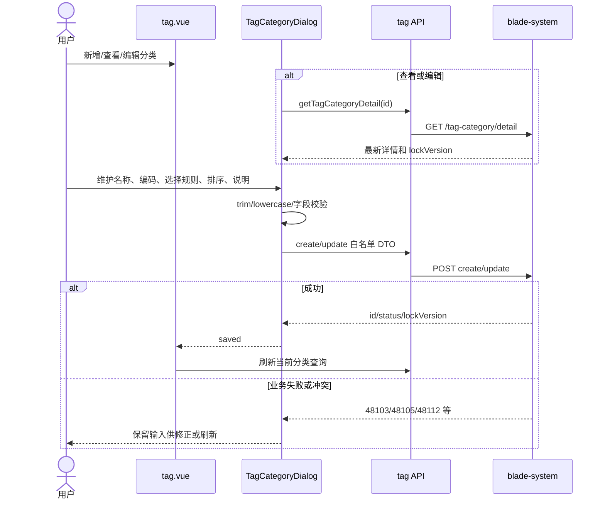
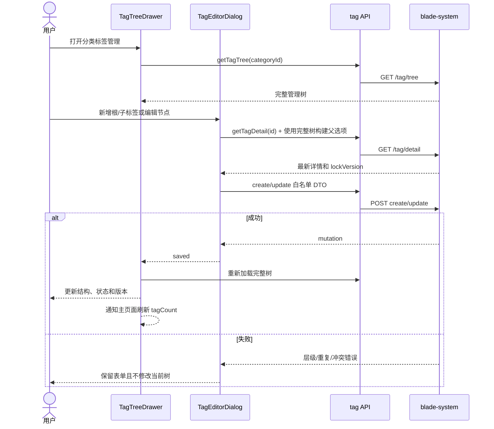

# Saber 标签分类与标签管理详细设计文档

## 1. 文档信息

| 项目 | 内容 |
| --- | --- |
| 功能/模块 | 系统管理、标签分类、层级标签 |
| 设计编号 | DESIGN-REQ-2026-010 |
| 文档版本 | 0.5 |
| 关联需求 | [REQ-2026-010 Saber 标签分类与标签管理](../requirements/REQ-2026-010-tag-management-frontend.md) |
| 关联测试 | [TEST-REQ-2026-010 Saber 标签分类与标签管理](../test/TEST-REQ-2026-010-tag-management-frontend.md) |
| 后端基线 | SpringBlade `REQ-2026-002` 0.2、`DESIGN-REQ-2026-002` 0.2 及当前 `blade-system` Java 契约 |
| 目标版本/迭代 | Saber 5.x / 标签基础能力前端第一阶段 |
| 文档状态 | 开发中（已实现，工程检查通过，待联调验收） |
| 设计负责人 | Codex |
| 评审人 | 产品、前端、后端、安全、测试待指定 |
| 最后更新日期 | 2026-09-10 |

## 2. 设计摘要与范围

### 2.1 设计摘要

新增 `/system/tag` 动态菜单页面，以分页分类列表作为主工作区，以大尺寸标签树抽屉作为分类内的层级维护工作区。
页面复用 `SearchPanel`、`ListPanel`、`ListPagination`、`FormDialog`、`DetailDrawer`、`RowActions`、
`usePagedList`、`useTreeList`、`useRemoteDetail` 和现有权限状态，不新增 CRUD 引擎或业务 Store。
这些项目组件只负责统一 Saber 的页面节奏和请求状态，实际输入、树、表格、状态、抽屉和反馈交互由 Element Plus
官方组件承担。

分类和标签使用后端返回的字符串 ID 与 `lockVersion`。分类写成功后刷新分类列表；标签写成功后重新加载完整树，
并通知主页面刷新分类标签数量。父节点调整可能同步改变全部后代的路径和版本，因此不对标签树做乐观局部修改。
所有明显非法操作在前端阻止，服务端权限、租户、并发、层级和删除校验仍是最终边界。

### 2.2 关键决策

| 编号 | 决策 | 原因 | 影响 |
| --- | --- | --- | --- |
| DEC-001 | 使用一个 `/system/tag` 页面，分类列表行内打开标签树抽屉 | 标签必须在分类上下文中维护，单页工作流比两个菜单页更紧凑且减少重复分类选择 | 菜单只新增一个页面入口 |
| DEC-002 | 标签树使用 `GET /tag/tree`，第一阶段不建设平铺分页视图 | 管理任务以父子结构为核心，后端已接受按分类全量加载 | `/tag/list` 保留给其他调用方或后续需求 |
| DEC-003 | 树内筛选在前端处理并保留祖先链 | 后端树接口不支持筛选，平铺分页结果无法安全恢复完整层级 | 需实现纯函数树过滤并保持原数组不变 |
| DEC-004 | 层级调整通过父节点 TreeSelect 和排序输入完成，不提供拖拽 | 后端每次更新需要版本校验，拖拽易产生误操作和多请求 | 操作明确、可确认、无需新增依赖 |
| DEC-005 | 分类和标签分别使用 `tag_category_*` 与 `tag_*` 按钮编码 | Saber 前端按钮权限来自 `blade_menu.code`，后端 `@PreAuth` 使用另一套 Scope | 部署必须同步两套权限资源 |
| DEC-006 | 状态使用 Switch，有权限可操作，无权限退化为 Tag | 状态是二元设置，Switch 比文本按钮更符合交互语义 | 停用前需要影响确认，行操作需独立锁 |
| DEC-007 | 删除不提供批量入口 | 后端仅提供单记录 DTO 且每条必须带独立版本、依赖校验 | 表格不显示 selection 列，避免伪批量能力 |
| DEC-008 | 标签任何写成功后重新加载完整树 | 移动会递增后代版本，局部 patch 无法保证所有节点一致 | 多一次树查询，换取结构和版本正确性 |
| DEC-009 | 不新增 Pinia Store 或本地缓存 | 数据绑定当前租户且维护频繁，缓存增加跨租户和过期风险 | 页面关闭或重登后重新请求 |
| DEC-010 | 不新增前端依赖 | Vue、Element Plus 和现有 composable 已覆盖全部交互 | `package.json` 和锁文件不变化 |
| DEC-011 | 基础控件优先使用 Element Plus 官方组件，模块组件只做业务编排 | 降低自定义交互、可访问性和主题维护成本 | 禁止复制 Table、TreeSelect、Drawer、Dialog 等基础能力 |
| DEC-012 | 参考 Ant Design Pro 的查询表格、页级操作和详情下钻结构，但不引入其组件 | 其信息架构适合中后台管理页，但当前项目是 Vue + Element Plus 技术栈 | 不新增 Ant Design Vue、React、Umi 或 `.ant-*` 样式 |
| DEC-013 | 首期不使用 Element Plus Splitter 作为分类/标签双栏主布局 | Splitter 仍为 beta；分类表格字段较多，双栏会压缩扫描宽度并增加移动端切换状态 | 保留分类列表 + Drawer，下阶段有高频横向对照需求再评估 |

### 2.3 改动范围

| 层级 | 改动内容 | 不涉及内容 |
| --- | --- | --- |
| 前端页面 | 新增分类列表、分类编辑弹窗、标签树抽屉、标签编辑弹窗 | 业务资源标签绑定、有效选项消费页 |
| 前端 API | 新增标签分类和标签类型、14 个请求函数 | 修改 Axios 鉴权、Token 或统一错误协议 |
| 前端权限 | 新增两组按钮编码计算和状态专项权限 | 修改 `useCrudPermission` 公共返回结构 |
| 国际化 | 新增 `route.tag_manage` 中英日标题 | 页面正文全量国际化 |
| 后端/部署 | 依赖菜单、按钮、Scope `menu_id` 绑定、角色和顶部菜单配置 | 修改标签 Java 服务和数据表 |
| 数据库 | Saber 不涉及 | SpringBlade 标签表由后端需求负责 |
| 依赖/锁文件 | 无 | 不新增拖拽、树、状态或表单库 |

## 3. 总体设计

### 3.1 架构图

```mermaid
flowchart LR
    Menu[动态菜单 /system/tag] --> Page[tag.vue]
    Page --> CategoryList[usePagedList]
    Page --> CategoryDialog[TagCategoryDialog]
    Page --> TreeDrawer[TagTreeDrawer]
    TreeDrawer --> TreeState[useTreeList]
    TreeDrawer --> TagDialog[TagEditorDialog]
    CategoryDialog --> API[src/api/system/tag.ts]
    CategoryList --> API
    TreeState --> API
    TagDialog --> API
    API --> Axios[src/axios.ts]
    Axios --> Backend[/blade-system/tag-category/** and /tag/**]
    ButtonPermission[blade_menu tag_category_* / tag_*] --> Page
    ApiScope[blade_scope_api system:tag-*:*] --> Backend
```

### 3.2 文件与组件职责

| 文件/组件 | 职责 | 输入 | 输出 |
| --- | --- | --- | --- |
| `src/views/system/tag.vue` | 分类查询、分页、权限计算、状态/删除、抽屉上下文编排 | 菜单、权限、分类 API | 分类页面和标签抽屉入口 |
| `src/api/system/tag.ts` | 后端类型、Query/DTO 和 14 个请求函数 | 页面请求参数 | `BladeResponse<T>` |
| `src/views/system/components/tag-category-dialog.vue` | 分类新增、查看、编辑和选择规则联动 | mode、categoryId、权限 | saved/cancel |
| `src/views/system/components/tag-tree-drawer.vue` | 分类摘要、完整树、筛选、状态、删除和标签弹窗编排 | category、标签权限 | changed/close |
| `src/views/system/components/tag-editor-dialog.vue` | 标签新增根/子节点、查看、编辑和父节点选择 | categoryId、tagId、parentContext、tree | saved/cancel |
| `src/views/system/tagTree.ts` | 树筛选、节点查找、后代 ID 收集、TreeSelect 映射纯函数 | `TagTreeNode[]` | 新树或 ID 集合 |
| `src/lang/{zh,en,ja}.ts` | 标签管理菜单标题 | `tag_manage` | route title |

模块组件只服务标签管理，不提升到 `src/components`。树算法抽成 `.ts` 是因为标签抽屉和编辑器都会使用节点查找、
后代禁用和 TreeSelect 映射，且纯函数便于类型检查和后续定向测试。

### 3.3 新增依赖

不适用。复用 Vue 3、TypeScript、Element Plus、Axios、dayjs、Pinia 用户权限状态及现有公共组件。

### 3.4 官方组件与布局评估

当前 `package.json` 已包含 Element Plus 2.14.3 和官方图标库，以下交互均有稳定的官方组件可用。现有 Saber
公共组件继续承担统一页面外观、标题、工具栏和请求状态，但不得重新实现官方组件的键盘、弹层、树、表格或表单能力。

| 页面区域/能力 | 采用方案 | 评估结论 |
| --- | --- | --- |
| 应用主框架 | 复用现有 `src/page/index`、动态菜单和标签页 | 已承担 Ant Design Pro `ProLayout` 类似的导航、内容区和页签职责，页面内不再嵌套 `el-container` |
| 页级查询与内容层级 | `SearchPanel` + `ListPanel` | 对应 Ant Design Pro 查询表格的“查询区 + 工具栏 + 数据区”结构，保持 Saber 现有页面一致性 |
| 分类查询 | `el-form`、`el-row/col`、`el-input`、`el-select` | 使用官方表单和栅格；查询字段较少，不新增 Schema Form 或配置驱动表单 |
| 分类列表 | `el-table`、`el-table-column`、`ListPagination` | 官方 Table 支持固定列、空状态和 loading；后端是单记录写操作，不显示 selection 列 |
| 选择模式 | `el-segmented` | 单选/多选是紧凑互斥选项，Segmented 比下拉更直观；最大数量使用 `el-input-number` |
| 状态显示与操作 | `el-switch` + `el-tag` | 有权限时 Switch，只有查看权限时 Tag；状态影响使用 `ElMessageBox` 确认 |
| 分类查看 | 语义化 `dl/dt/dd` + CSS Grid | 使用非表格详情网格代替禁用表单和 Descriptions 边框表格，提升扫描层级 |
| 标签下钻 | `DetailDrawer` 内部使用 `el-drawer` | 符合管理列表到详情/子资源的下钻模式，保留分类列表查询上下文 |
| 分类摘要 | 响应式 `el-descriptions` | 桌面 4 列、平板 2 列、移动端 1 列，展示分类编码、规则、状态和数量 |
| 标签管理树 | `el-table` tree-props | 标签需要名称、编码、层级、排序、状态和行操作多列，Tree Table 比单列 `el-tree` 更合适 |
| 父标签选择 | `el-tree-select` | 官方组件同时提供树结构、筛选和严格单选；禁用自身/后代由业务 props 提供 |
| 分类/标签编辑 | `FormDialog` 内部使用 `el-dialog` + `el-form` | 复用现有可滚动正文和提交锁，业务组件只构造字段、规则和 DTO |
| 空数据与加载失败 | `el-empty`、`el-result`、`el-alert`、`v-loading` | 区分无数据、查询无结果、依赖加载失败和提交失败，不创建自定义状态插画 |
| 工具图标 | `@element-plus/icons-vue` + `el-tooltip` | 使用官方图标并为仅图标按钮补充 tooltip/aria-label |
| 双栏可调布局 | 暂不采用 `el-splitter` | Splitter 适合持续并列浏览，但首期分类表格字段多、移动端切换成本高，且当前官方仍标记 beta |

Ant Design Pro 的参考范围仅限以下布局原则：页级操作集中、查询条件与数据表格靠近、列表操作保持稳定、复杂子资源通过
详情页或 Drawer 下钻、响应式下优先保留主任务。ProTable、ProLayout 和 PageContainer 不进入依赖或运行时，也不复制
其 React API；Saber 继续使用 Element Plus 和当前主题 Token。

## 4. 核心流程设计

### 4.1 分类新增与编辑



### 4.2 标签树维护



### 4.3 状态与删除

| 操作 | 前端确认 | 请求来源 | 成功处理 | 失败处理 |
| --- | --- | --- | --- | --- |
| 分类停用 | 说明全部标签暂不成为有效选项，标签自身状态不变 | 当前行 id/status/lockVersion | 刷新分类列表 | Switch 恢复原显示并保留列表 |
| 分类启用 | 说明启用路径可恢复 | 当前行 | 刷新分类列表 | 恢复原显示 |
| 分类删除 | 仅 tagCount=0；说明编码不可复用 | 当前行 id/lockVersion | 刷新分类列表 | 保留记录和查询 |
| 标签停用 | 说明节点及子树暂不成为有效选项，子标签自身状态不变 | 当前树节点 | 重新加载完整树 | 保留树、筛选和展开状态 |
| 标签启用 | 说明仍受分类和祖先状态影响 | 当前树节点 | 重新加载完整树 | 保留原树 |
| 标签删除 | 仅无 children；说明原分类内编码不可复用 | 当前树节点 | 重载树并刷新分类 tagCount | 保留原树 |

Switch 不直接修改源行状态后再提交。组件维护目标状态和 busy ID，确认后调用接口；取消或失败时源数据保持不变，
避免受控组件在请求失败后出现错误状态。

### 4.4 异常与边界流程

| 场景 | 处理位置 | 处理方式 | 错误码/结果 | 数据是否改变 |
| --- | --- | --- | --- | :---: |
| 未登录 | `axios.ts` | 复用现有 401 会话清理 | 401 | 否 |
| 无按钮权限 | 页面/组件 | 不渲染入口 | 本地权限 | 否 |
| 无 API Scope | 后端 + Axios | 统一错误提示，不显示成功 | 安全响应 | 否 |
| 分类/标签不存在 | 页面/抽屉 | 清空旧详情或树并刷新上级列表 | 48101/48102 | 否 |
| 重复编码 | 表单 | 保留输入并聚焦编码字段 | 48103/48104 | 否 |
| 选择规则非法 | 分类弹窗 | 保留输入，提示模式与数量规则 | 48105 | 否 |
| 父节点/循环/深度非法 | 标签弹窗 | 保留输入和原树 | 48107/48108/48109 | 否 |
| 删除存在下级 | 页面/抽屉 | 保留记录并提示先处理下级 | 48110/48111 | 否 |
| 并发冲突 | 表单/状态/删除 | 不重放；提示刷新后重新操作 | 48112 | 否 |
| 快速切换目标 | composable/组件 | 请求序号废弃迟到响应 | 不适用 | 否 |

### 4.5 并发与幂等

| 操作 | 前端并发控制 | 请求参数 | 重复/失败策略 |
| --- | --- | --- | --- |
| 分类列表 | `usePagedList.latestRequest` | current/size/query | 只接收最新响应 |
| 分类详情 | `useRemoteDetail` | id | 打开新目标前 clear |
| 分类保存 | dialog `submitting` | create DTO 或 id/lockVersion update DTO | 禁止重复点击；失败保留输入 |
| 分类状态/删除 | `categoryActionId` | id/status/lockVersion | 同一分类操作串行，成功后刷新 |
| 标签树 | `useTreeList.latestRequest` | categoryId | 切换分类先清空旧树 |
| 标签详情 | `useRemoteDetail` | id | 切换节点废弃旧响应 |
| 标签保存 | dialog `submitting` | create/update DTO | 成功后完整重载树，不局部 patch |
| 标签状态/删除 | `tagActionId` | id/status/lockVersion | 同一抽屉一次一个写操作 |

## 5. API 契约与前端类型

### 5.1 类型设计

类型集中定义在 `src/api/system/tag.ts`，所有 ID 和 `lockVersion` 使用 `string`：

```ts
export type TagStatus = 0 | 1;
export type TagSelectionMode = 1 | 2;

export interface TagCategoryListItem {
  id: string;
  categoryCode: string;
  categoryName: string;
  selectionMode: TagSelectionMode;
  selectionModeName?: string;
  maxSelectCount: number;
  sort: number;
  status: TagStatus;
  statusName?: string;
  tagCount: number;
  updateTime?: string;
  lockVersion: string;
}

export interface TagTreeNode {
  id: string;
  categoryId: string;
  parentId: string;
  tagCode: string;
  tagName: string;
  depth: number;
  sort: number;
  remark?: string;
  status: TagStatus;
  statusName?: string;
  lockVersion: string;
  children?: TagTreeNode[];
}
```

分类详情在列表字段基础上增加 `remark/createTime`。标签详情增加 `ancestors/createTime/updateTime`，但提交 DTO 只从
白名单字段构造，不能展开详情对象后直接提交。写响应统一为 `{ id, status, lockVersion }`。

### 5.2 接口清单

| 方法 | 前端函数 | 路径 | 用途 |
| --- | --- | --- | --- |
| GET | `getTagCategoryList` | `/blade-system/tag-category/list` | 分类分页 |
| GET | `getTagCategoryDetail` | `/blade-system/tag-category/detail` | 分类详情 |
| POST | `createTagCategory` | `/blade-system/tag-category/create` | 新增分类 |
| POST | `updateTagCategory` | `/blade-system/tag-category/update` | 编辑分类 |
| POST | `changeTagCategoryStatus` | `/blade-system/tag-category/status` | 分类启停 |
| POST | `removeTagCategory` | `/blade-system/tag-category/remove` | 删除空分类 |
| GET | `getTagList` | `/blade-system/tag/list` | 契约保留，首期页面不调用 |
| GET | `getTagDetail` | `/blade-system/tag/detail` | 标签详情 |
| GET | `getTagTree` | `/blade-system/tag/tree` | 完整管理树 |
| GET | `getTagOptions` | `/blade-system/tag/options` | 契约保留，首期管理页不调用 |
| POST | `createTag` | `/blade-system/tag/create` | 新增标签 |
| POST | `updateTag` | `/blade-system/tag/update` | 编辑/移动标签 |
| POST | `changeTagStatus` | `/blade-system/tag/status` | 标签启停 |
| POST | `removeTag` | `/blade-system/tag/remove` | 删除叶子标签 |

虽然首期页面不调用 `/tag/list` 和 `/tag/options`，API 文件仍定义完整后端契约，供后续业务选择组件复用；本需求不创建
全局 TagSelect 组件，避免在没有真实使用方时提前抽象。

### 5.3 请求白名单

| 请求 | 字段 |
| --- | --- |
| 分类查询 | `name/code/status/current/size` |
| 分类创建 | `categoryCode/categoryName/selectionMode/maxSelectCount/sort/remark` |
| 分类更新 | `id/categoryName/selectionMode/maxSelectCount/sort/remark/lockVersion` |
| 分类状态 | `id/status/lockVersion` |
| 分类删除 | `id/lockVersion` |
| 标签创建 | `categoryId/parentId/tagCode/tagName/sort/remark` |
| 标签更新 | `id/parentId/tagName/sort/remark/lockVersion` |
| 标签状态 | `id/status/lockVersion` |
| 标签删除 | `id/lockVersion` |

查询编码 trim 后转小写；创建编码在 blur 和提交前规范化。说明空字符串提交为 `undefined`，根父节点统一提交字符串 `'0'`。

## 6. 前端页面设计

### 6.1 分类主页面

- `SearchPanel`：名称、编码、状态；状态使用显式数值选项 `1=启用`、`0=停用`。
- `ListPanel` 工具栏：新增分类、刷新；不显示批量删除。
- 表格列：名称、编码、选择规则、标签数量、排序、状态、更新时间、操作。
- 标签数量显示为可扫描数字；具备标签查看权限时可点击或通过“管理标签”动作打开抽屉。
- 操作：查看、编辑、管理标签、删除；状态列使用 Switch，行操作宽度按权限动态保持稳定。
- 空状态：`el-empty` + 有权限用户的“新增分类”。

分类编辑弹窗宽度为 640px；查看弹窗宽度为 800px，并受 `FormDialog` 的视口最大宽度约束。编辑态名称和编码各占
一行，选择模式使用 `el-segmented`，最大数量和排序使用 `el-input-number`，说明使用 500 字符 textarea。查看态使用
语义化 `dl/dt/dd` 和 CSS Grid 展示编码、状态、选择规则、标签数量和创建/更新时间，不使用表格或禁用表单，也不提供
状态修改。桌面使用双列字段块，767px 以下切换为单列，说明始终独占整行；边框、背景和文字颜色复用 Saber 主题 Token。

### 6.2 标签树抽屉

- 桌面宽度建议 `min(960px, 92vw)`；375px 使用 100% 宽度。
- 顶部摘要使用不嵌套卡片的 `el-descriptions`，显示分类名称、编码、选择规则、状态和标签总数。
- 工具区：名称、编码、状态筛选；新增根标签、刷新。
- 树表 row-key=`id`，children=`children`，列为名称、编码、层级、排序、状态、操作。
- 行操作：查看、编辑、新增子标签、删除。新增子标签仅需标签新增权限。
- 空状态区分“分类无标签”和“筛选无结果”；只有前者显示新增根标签入口。
- 筛选只影响展示树，不改变作为父节点选项的数据源。
- 树加载失败时使用 `el-result` 提供重试，不在失败状态下保留上一分类数据。

### 6.3 标签编辑弹窗

- 新增根标签：固定 categoryId，parentId=`'0'`。
- 新增子标签：固定 categoryId，预填 parentId，父节点允许修改为同分类其他节点或根节点。
- 编辑：加载标签详情；编码和分类只读；父节点 TreeSelect 禁用自身和后代。
- TreeSelect 使用完整树的副本映射 `label=tagName`、`value=id`，增加人工根选项“顶级标签”。
- 当前树加载失败时禁用确认，不能用空父节点选项误提交移动。
- 表单保存失败保留所有输入；关闭后清空 mode、详情、父上下文、校验和失败状态。

### 6.4 树筛选算法

`filterTagTree` 递归处理每个节点：节点自身匹配，或任一后代匹配时保留节点；保留节点时创建新对象和新 children 数组，
不得直接修改 API 原树。名称和编码使用不区分大小写包含匹配，状态使用严格数值匹配。无筛选条件时直接返回原树引用，
减少不必要复制。

`collectDescendantIds` 从完整树查找目标节点并收集全部后代 ID；编辑父节点时禁用集合为自身 ID 加后代 ID。前端禁用只是
交互保护，后端循环和最大深度校验仍必须执行。

## 7. 权限、状态与错误处理

### 7.1 权限计算

分类基础权限使用 `useCrudPermission('tag_category')` 获取 add/view/edit/delete；状态权限通过
`permission.tag_category_status` 单独计算。标签使用 `useCrudPermission('tag')` 和 `permission.tag_status`。

| 页面能力 | 前端按钮编码 | 后端 Scope |
| --- | --- | --- |
| 分类查看 | `tag_category_view` | `system:tag-category:view` |
| 分类新增 | `tag_category_add` | `system:tag-category:create` |
| 分类编辑 | `tag_category_edit` | `system:tag-category:edit` |
| 分类状态 | `tag_category_status` | `system:tag-category:status` |
| 分类删除 | `tag_category_delete` | `system:tag-category:delete` |
| 标签查看 | `tag_view` | `system:tag:view` |
| 标签新增 | `tag_add` | `system:tag:create` |
| 标签编辑 | `tag_edit` | `system:tag:edit` |
| 标签状态 | `tag_status` | `system:tag:status` |
| 标签删除 | `tag_delete` | `system:tag:delete` |

### 7.2 业务错误处理

`src/axios.ts` 已提供 `BladeBusinessError` 并统一显示后端 message。本模块只对 `48112` 并发冲突增加局部恢复动作：
表单保持打开，提供“刷新最新数据”操作或明确提示用户关闭后重新打开；其他普通业务错误不重复弹消息。

删除和状态确认取消同接口失败都进入 catch，但取消不记录为错误、不刷新数据。若接口失败，Axios 已显示错误，组件只恢复
busy/submitting 并保持列表、树、筛选和表单。

## 8. 菜单、配置与发布影响

### 8.1 菜单与权限数据

SpringBlade 已新增 `doc/sql/blade/blade.mysql.upgrade.5.0.1.tag-menu-permission.sql`，以独立、可重复执行的方式配置菜单权限：

1. 在“系统管理”下新增 `tag_manage` 菜单，路径 `/system/tag`，组件由动态路由映射为 `views/system/tag.vue`。
2. 新增 10 个按钮菜单记录，编码使用本设计第 7.1 节定义。
3. 将 10 个标签 API Scope 的 `menu_id` 更新为标签管理页面菜单 ID。
4. 默认不授予角色，测试和上线环境通过角色管理显式授予页面、按钮和 API Scope；脚本也不自动挂载顶部菜单。
5. 若环境启用顶部菜单，按现有顶部菜单配置流程挂载标签管理页面。
6. 全量安装脚本和 5.0.1 升级脚本保持一致，并提供查询核验语句。

菜单/权限脚本属于 SpringBlade 交付，不在 Saber 仓库创建数据库脚本。Saber 只新增页面和 route i18n。

### 8.2 国际化

在 `src/lang/zh.ts`、`en.ts`、`ja.ts` 的 `route` 下增加：

| key | zh | en | ja |
| --- | --- | --- | --- |
| `tag_manage` | 标签管理 | Tag Management | タグ管理 |

### 8.3 发布顺序

1. 完成并验证 SpringBlade 后端标签接口、数据库、Nacos 租户表和 API Scope。
2. 执行菜单/按钮/Scope 绑定脚本，并为联调角色配置最小权限。
3. 发布 Saber 页面代码，重新登录以刷新动态菜单和按钮权限。
4. 执行分类查询、空分类创建、根/子标签创建、状态、移动和叶子删除冒烟验证。
5. 完成多租户、并发、三视口和主题验收后再向业务角色授权。

### 8.4 回滚

- Saber 可独立回滚页面代码；回滚前先从角色和顶部菜单移除入口，避免菜单指向不存在页面。
- 后端表和标签数据不随前端回滚删除；已有业务数据按 SpringBlade 后端回滚方案保留。
- 菜单和按钮可逻辑下线，API Scope 可保留以避免破坏其他调用方；需要删除时必须确认无调用方。

## 9. 验证计划

### 9.1 工程检查

- 修改 `.ts`/`.vue` 后运行 `pnpm run type-check`。
- 页面、公共组件或构建配置没有共享变更时不强制 `build:prod`；若修改共享 composable 或动态路由则运行。
- 执行 `rg -n -i "avue|ant-design|\.ant-|\.avue-" src/views/system/tag.vue src/views/system/components src/api/system/tag.ts`。
- 检查 API 请求体不包含 tenantId、categoryCode 更新、tagCode 更新、categoryId 更新、ancestors 和 depth。
- 检查 route i18n 三个语言文件同步更新。

2026-09-10 已完成上述工程检查：`pnpm run type-check` 与 `pnpm run build` 通过；目标代码未检出 Avue、
Ant Design、`.ant-*`、`.avue-*`、显式 `any`、调试日志或可伪造 `tenantId` 写入。构建保留仓库既有的动态/静态导入
和大 chunk 警告，不影响本需求页面产物生成。真实后端、权限、租户和三视口业务验收未执行。

### 9.2 用户手工验收

- 页面主流程：分类查询、新增、编辑、状态、删除；标签树、新增根/子标签、编辑、移动、状态、删除。
- 异常：重复编码、选择规则、循环、超深、非空删除、非叶子删除、详情/树失败和并发冲突。
- 权限：查看、分类各动作、标签各动作、按钮有而 Scope 无、重新登录权限刷新。
- 租户：两个租户同码数据、越租户 ID、同租户不同部门共享。
- 视觉：1440px、1024px、375px；浅色、深色、非默认主色；Console 和 Network 无异常。

后端 SpringBlade `TEST-REQ-2026-002` 当前全部未执行，前端测试只能验证页面可观察行为，不能替代后端数据库、事务、
租户插件和并发串行化验收。

## 10. 风险、评审与变更

### 10.1 风险与开放问题

| 编号 | 类型 | 内容 | 负责人 | 状态/结论 |
| --- | --- | --- | --- | --- |
| DESIGN-ITEM-001 | 依赖 | 页面菜单、10 个按钮、Scope `menu_id` 绑定和角色授权准备 | 后端/部署负责人 | 配置脚本已完成静态核对，默认不授权；待目标库执行并配置联调角色 |
| DESIGN-ITEM-002 | 风险 | 完整树规模未知，前端筛选和 TreeSelect 都依赖全量数据 | 产品/技术负责人 | 采集典型/最大节点数后确认 |
| DESIGN-ITEM-003 | 问题 | 是否首期加入有效选项预览 | 产品负责人 | 当前延期，不阻塞管理页 |
| DESIGN-ITEM-004 | 风险 | 状态 Switch 的确认频率可能影响高频维护效率 | 产品负责人 | 首期停用必确认、启用简短确认，验收后调整 |
| DESIGN-ITEM-005 | 风险 | 编辑父节点时完整树可能已被其他管理员改变 | 前端/后端负责人 | 提交依赖后端分类锁和版本校验，成功后全量刷新 |

### 10.2 评审结论

| 领域 | 结论 | 评审人 | 日期 | 备注 |
| --- | --- | --- | --- | --- |
| 产品范围 | 待评审 | 待指定 | 待指定 | 单页面、无拖拽、无有效选项预览 |
| 前端 | 待评审 | 待指定 | 待指定 | 文件拆分、树筛选、状态交互 |
| 后端/API | 待评审 | 待指定 | 待指定 | 当前契约和错误码基线 |
| 数据库/发布 | 待评审 | 待指定 | 待指定 | 菜单、按钮、Scope 绑定和授权脚本 |
| 测试 | 待评审 | 待指定 | 待指定 | 多租户、多角色、并发和容量环境 |

### 10.3 变更记录

| 日期 | 版本 | 变更内容 | 原因 | 影响 | 修改人 |
| --- | --- | --- | --- | --- | --- |
| 2026-09-10 | 0.1 | 建立标签管理前端详细设计，确定单页面、树抽屉、权限双轨和全量刷新策略 | 用户要求开始规划前端功能 | 页面、API、权限、部署与测试 | Codex |
| 2026-09-10 | 0.2 | 完成 Element Plus 官方组件映射和 Ant Design Pro 布局评估，明确不引入第二套 UI 库和首期不使用 Splitter | 用户要求优先复用官方组件并评估中后台布局 | 组件选择、页面结构、依赖边界和视觉验收 | Codex |
| 2026-09-10 | 0.3 | 按设计完成 API、分类主页面、分类弹窗、标签树抽屉、标签弹窗、树算法和 route i18n，并记录工程检查结果 | 用户要求开始实现 | 前端实现、异常恢复、权限、响应式与验证记录 | Codex |
| 2026-09-10 | 0.4 | 关联 SpringBlade 幂等菜单脚本，确认固定菜单 ID、10 个按钮、Scope 绑定及默认不授权策略 | 用户要求编写菜单配置 SQL | 部署顺序、权限数据、开放问题和测试准备 | Codex |
| 2026-09-10 | 0.5 | 分类查看态由 Descriptions 表格改为语义化详情网格，查看弹窗调整为 800px 并补充移动端单列规则 | 用户要求优化查看样式且不使用表格 | 分类详情组件、响应式与主题适配 | Codex |
