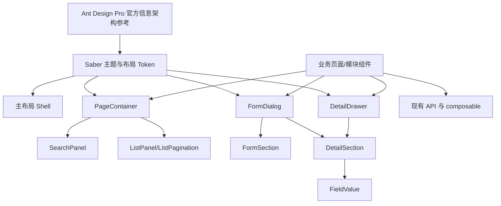
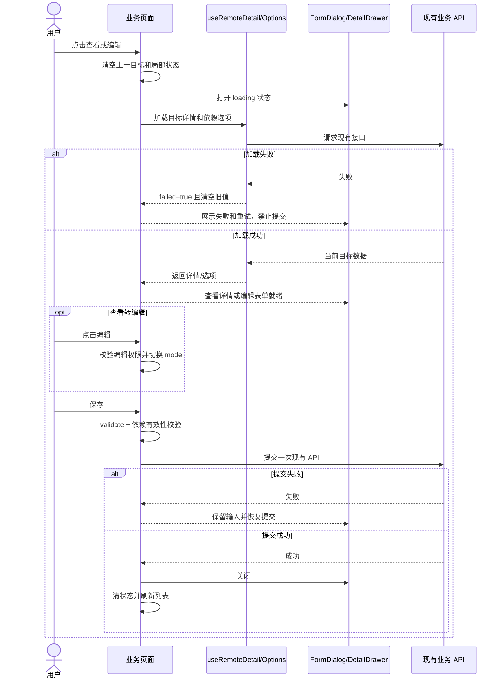

# Saber 中前台视觉体系与记录弹层统一详细设计文档

## 1. 文档信息

| 项目 | 内容 |
| --- | --- |
| 功能/模块 | 前端主布局、工作台、页面容器、查询列表、记录弹窗与记录抽屉 |
| 设计编号 | DESIGN-REQ-2026-011 |
| 文档版本 | 0.9 |
| 关联需求 | [REQ-2026-011](../requirements/REQ-2026-011-pro-style-ui-record-panels.md) |
| 关联测试 | [TEST-REQ-2026-011](../test/TEST-REQ-2026-011-pro-style-ui-record-panels.md) |
| 目标版本/迭代 | Saber 5.x / 中前台体验升级第一阶段 |
| 文档状态 | 开发中 |
| 设计负责人 | Codex |
| 评审人 | 前端、产品/设计、测试待指定 |
| 最后更新日期 | 2026-09-11 |

## 2. 设计摘要与范围

### 2.1 设计摘要

本设计在现有 Vue 3、Element Plus、Pinia、动态菜单和主题 Token 基础上建设 Saber 自有的 Pro 风格界面体系。
主框架增加统一页级信息结构，查询列表继续复用 `SearchPanel`、`ListPanel` 和 `ListPagination`；标准记录弹层通过
增强 `FormDialog` 与 `DetailDrawer` 实现，并新增 `FormSection`、`DetailSection` 和 `FieldValue` 等轻量展示组件。

通用组件负责容器、尺寸、分区、状态和基础展示，不接收字段 JSON，不调用业务 API，不推断权限码和租户字段。
页面继续显式维护表单、详情、校验、远程选项、权限、DTO 转换和提交结果。第一阶段先完成公共能力与首页、参数、
用户、菜单、日志代表页，评审通过后再批量迁移其余活动页面。

### 2.2 关键决策

| 编号 | 决策 | 原因 | 影响 |
| --- | --- | --- | --- |
| DEC-001 | Ant Design Pro 仅作为布局和交互参考，运行时继续使用 Element Plus | 保持现有技术栈、主题和组件生态 | 不修改依赖与锁文件 |
| DEC-002 | 使用 Token、公共组件和代表页形成视觉基线，不复制第三方 CSS | 避免主题失效和 DOM 耦合 | 需要多主题截图评审 |
| DEC-003 | 第一阶段增强现有 `FormDialog`，不新增并行的 `RecordDialog` 包装层 | 已有 18 个页面使用，直接增强可减少迁移和双标准 | API 采用向后兼容的可选属性 |
| DEC-004 | `FormDialog` 与 `DetailDrawer` 保持独立实现，共享弹层 Token 和内容组件 | Dialog/Drawer 的焦点、尺寸和关闭行为不同 | 不使用复杂 `variant` 分支合并 |
| DEC-005 | 查看态使用显式详情模板，编辑态使用显式表单模板 | 可读性和业务语义优于 disabled 表单 | 页面需维护字段一致性检查 |
| DEC-006 | 不创建字段配置驱动 CRUD 引擎 | 复杂联动、权限和远程状态无法稳定抽象 | 业务规则留在页面或模块组件 |
| DEC-007 | 页面通过 `dirty` 明确声明未保存状态，公共弹层负责统一关闭确认 | 避免通用组件猜测表单模型变化 | 页面负责设置和重置 dirty |
| DEC-008 | 工作台只使用现有可靠数据源 | 避免用静态演示数字冒充业务结果 | 缺少接口的模块暂不展示 |
| DEC-009 | 第一阶段先做五类代表场景，再决定全量迁移批次 | 降低公共 API 未稳定时的返工 | 全量工期在代表页后校准 |
| DEC-010 | 侧边模式、混合模式使用不同壳层结构，而不是只切换菜单显示 | 两种模式的顶栏和侧栏空间关系不同 | 主布局按 `layout` 条件装配，账户工具抽为共享组件 |

### 2.3 改动范围

| 层级 | 改动内容 | 不涉及内容 |
| --- | --- | --- |
| 后端 | 无 | API、服务、权限、租户、认证和业务模型 |
| 前端基础 | 主题 Token、主布局、页容器、弹层和详情/表单分组组件 | 第二套 UI 库和动态 CRUD 引擎 |
| 前端页面 | 工作台及活动业务页的继承、适配和专项弹层治理 | 改变业务字段和接口契约 |
| 数据库 | 无 | 表、字段、索引和数据迁移 |
| 配置/部署 | 无新增配置 | 环境变量和部署拓扑 |

### 2.4 当前影响面

| 类型 | 当前页面数量 | 处理方式 |
| --- | ---: | --- |
| 使用 `FormDialog` | 18 | 通过可选 API 继承，再逐页迁移查看态 |
| 使用 `DetailDrawer` | 4 | 统一 header/body/footer 与失败状态 |
| 直接使用 `el-dialog` | 6 | 转标准弹窗或登记专项例外 |
| 直接使用 `el-drawer` | 4 | 转标准抽屉或登记专项例外 |
| 活动 Vue 业务页面 | 44 | 分类为继承、局部适配、专项改造或评审例外 |

## 3. 总体设计

### 3.1 架构图



### 3.2 组件职责

| 组件 | 职责 | 输入 | 输出 |
| --- | --- | --- | --- |
| `PageContainer` | 面包屑、标题、描述、状态、页级操作和内容层级 | route meta、标题插槽和操作插槽 | 稳定页头和正文容器 |
| `FormDialog` | 标准 add/view/edit 弹窗、尺寸、状态和关闭保护 | mode、size、loading、failed、submitting、dirty | confirm、cancel、retry、edit |
| `DetailDrawer` | 长详情和复杂记录抽屉、状态和固定操作区 | title、size、loading、failed、submitting、dirty | close、retry、confirm |
| `FormSection` | 编辑表单内的语义分组和响应式布局 | title、description、columns | 表单内容插槽 |
| `DetailSection` | 查看态字段分组和响应式网格 | title、description、columns | 详情内容插槽 |
| `FieldValue` | 空值、文本、状态、复制、长文本和脱敏展示 | label、value、copyable、span | 语义化只读字段 |
| `SearchPanel` | 查询布局和折叠 | 查询模型、loading | search、reset |
| `ListPanel` | 列表标题、工具栏、表格和 footer 层级 | title、slots | 列表内容 |
| `user-actions.vue` | 复用账户菜单、锁屏、语言、全屏、日志和界面设置入口 | placement、Pinia 用户与设置状态 | 顶栏横向工具区或侧栏底部工具区 |
| 业务页面 | 字段、校验、权限、请求、转换和业务成功判定 | API 和用户操作 | 业务结果与页面状态 |

### 3.3 新增依赖

不适用。复用 Vue、Element Plus、Element Plus Icons、Pinia、现有 composable 和 Sass。

## 4. 核心流程设计

### 4.1 查看与编辑流程



### 4.2 异常与边界流程

| 场景 | 处理位置 | 处理方式 | 数据是否改变 |
| --- | --- | --- | :---: |
| 详情乱序响应 | `useRemoteDetail`/页面 | 请求序号只允许最后目标更新 | 否 |
| 依赖选项失败 | `useRemoteOptions`/页面 | 清空旧选项，`confirmDisabled=true` | 否 |
| 校验失败 | 页面表单 | 不发送请求，定位字段 | 否 |
| 提交失败 | 页面 + Axios | 保留输入，恢复按钮，不关闭 | 由后端决定 |
| dirty 状态关闭 | 弹层组件 | 展示放弃修改确认 | 否 |
| submitting 状态关闭 | 弹层组件 | 阻止关闭、Esc 和遮罩操作 | 否 |
| 专项内容不适合标准弹层 | 页面设计 | 改用标准抽屉、全屏容器或独立页面 | 否 |

### 4.3 事务、并发与幂等

本需求不改变后端事务和幂等语义。前端 `submitting` 只保证同一弹层不重复提交；并发更新、乐观锁和服务端
错误继续由各业务接口定义，前端不得宣称自动回滚。

## 5. 后端设计与 API 契约

不涉及后端和数据库变化。全部页面继续使用 `@/axios`、现有 API 函数、请求参数位置和响应解析方式。
如果工作台需要现有接口无法提供的聚合数据，必须另行建立后端需求，REQ-2026-011 不允许临时拼接虚假指标。

## 6. 前端设计

### 6.1 设计 Token

在 `src/styles/theme/tokens.scss` 中补充或收敛以下语义 Token，具体颜色继续由浅色、深色和动态主色计算：

| Token 类别 | 用途 |
| --- | --- |
| 页面背景与 surface | 应用工作区、普通内容面、抬升弹层、弱背景 |
| 侧栏背景与状态 | 侧栏与页面共用 `--saber-page-bg`；`--saber-sidebar-hover` 提供菜单和账户入口悬停反馈；`--saber-sidebar-active` 保留主色浅色选中底；`--saber-sidebar-tip-bg` 在灰底上改用可辨识的 surface 色 |
| 顶栏背景 | `--saber-header-bg` 同样指向 `--saber-page-bg`，顶栏与侧栏底色一致，内容卡片保持 surface 白 |
| 导航动效 | `--saber-nav-duration`（260ms）与 `--saber-nav-ease`（起步快、收尾柔）统一侧栏、顶栏、Logo、主内容和混合模式栅格列的收展节奏 |
| 文本层级 | 主文本、次文本、辅助文本、禁用文本 |
| 边界与阴影 | 普通分隔、强调分隔、浮层阴影、抽屉阴影 |
| 页面间距 | 4、8、12、16、20、24、32px 语义间距 |
| 控件尺寸 | 32px 默认控件，必要场景保留 Element Plus small/large |
| 弹层尺寸 | Dialog `sm=560`、`md=720`、`lg=880`；Drawer `md=640`、`lg=800`、`xl=960` |
| 弹层分区 | header 60px 基线、正文 24px padding、footer 60px 基线 |

所有弹层宽度同时受 `max-width: calc(100vw - 32px)` 约束。375px 视口下正文左右 padding 降为 16px，
抽屉占满可用宽度，header/footer 保持可见。具体内容需要更大尺寸时必须登记专项原因，不新增随意像素值。

### 6.2 主布局与 PageContainer

- 保留 `src/page/index` 的侧边、顶部和混合布局状态以及动态菜单调用方式。
- 桌面侧边模式使用横向 flex 壳层：左侧栏独立包含 Logo、菜单和底部 `user-actions`，右侧主内容从标签页开始，不渲染 `saber-top`。
- 侧栏宽度由 `$sidebar_width` 统一控制，取值为 240px；收起宽度保持 64px，移动端断点和混合模式栅格列同步复用该变量。
- 侧栏背景、菜单背景、账户工具区背景和顶栏背景统一使用页面底色：`--saber-sidebar-bg` 与 `--saber-header-bg` 都指向 `--saber-page-bg`（深浅色各一份），侧边模式下 Logo 区显式跟随侧栏底色。
- 侧边模式下侧栏顶部 Logo 区的分割线由 `::after` 绘制、两侧各内缩 12px，不再通铺整栏、也不与内容区相连；导航标签栏保持 50px（与 `$top_height` 一致）。关闭“导航标签”开关时该分割线仍然存在，只是不再有等高对象，属于已知边界条件。
- 子元素高度取值规则：父级容器按 `border-box` 计算时，内部 Logo、菜单项、顶栏内容等一律取 `height: 100%` 并配合 `box-sizing: border-box`，禁止写与容器总高相同的固定像素值，避免 1px 溢出覆盖父级边界（历史上曾导致收起态侧栏右边界断开、混合模式顶栏下边界在 Logo 处断开）。
- 混合模式使用两列两行 CSS Grid：`saber-top` 位于第一行并跨越全部列，侧栏与主内容位于第二行；Logo 进入完整顶栏，侧栏不再单独渲染 Logo；顶栏只包含 Logo、一级菜单（`top-menu.vue`，数据来自 `GetTopMenu()`）、搜索和账户工具，不再包含固定“首页”项。
- 顶部模式桌面端为单行结构：`.saber-sidebar` 作为顶栏，按 `Logo → 菜单区域 → .saber-top（搜索 + 账户工具）` 排列；`.saber-top` 按自身宽度占位（`flex: 0 1 auto`），菜单区域占满剩余空间（`flex: 1 1 auto; min-width: 0`），避免任一侧把对方压成 0 宽（曾因角色写反导致菜单宽度被量成 0、全部菜单折进“更多”）。
- 移动端（992px 及以下）沿用各自的原结构：侧边模式保留只承担菜单开关的精简顶栏；混合模式的侧栏作为位于完整顶栏下方的移动面板；顶部模式的顶栏仍渲染在内容区（该模式下侧栏在移动端是离屏抽屉），因此 `index.vue` 用两个互斥实例承载顶栏——桌面 `isHorizontal && !isMobile`、移动端 `isMobile && !isMixed`。
- 顶部模式的菜单区域由 `.saber-menu-shell` + `el-scrollbar` + 两侧 `.saber-menu-arrow` 组成：菜单 `:ellipsis="false"` 不使用折叠式“更多”，菜单项 `flex: 0 0 auto` 不压缩、`el-menu` 取 `width: max-content`；装不下时用区域外侧的左右箭头按区域宽度 70%（最小 180px）平滑滚动；到端点时箭头保留占位（`visibility: hidden`）以免菜单宽度跳动；`ResizeObserver` 加 2px 容差保证首次渲染不误判溢出；`overflow-x` 保持隐藏，只用箭头移动。
- 顶部模式的子菜单面板：EP 的 `.el-menu--popup` 默认 `min-width: 200px` 过宽，覆盖为 160px；面板与父级菜单项左对齐；条目隐藏业务图标（保留展开箭头）并左内缩 20px。
- 顶部模式的菜单项悬停需给出底色：移除项目原有的“横向菜单 hover/focus 背景置透明”覆盖，并显式补一条与侧栏一致的悬停底色，避免 EP 更高优先级选择器回落到浅蓝底。
- 顶部模式使用悬浮触发（`menu-trigger="hover"`，`show-timeout=100`、`hide-timeout=250`，EP 默认均为 300ms）；EP 的 `mouseInChild` 判断保证鼠标从菜单项移入面板时不会被误关。
- 导航模式切换时 `el-menu` 以 `:key="sidebarMode"` 重建：EP 的 `openedMenus` 是根菜单共享状态，纵向模式展开过的子菜单在切到横向后会让弹层直接以“打开”状态渲染且无法自动收起，重建实例即可归零；纵向模式重建后由 EP 的 `initMenu()` 按当前激活项自动展开所属一级菜单，不损失体验。
- 账户与工具入口由 `user-actions.vue` 复用：顶部/混合模式横向显示在顶栏右侧，侧边模式显示在侧栏底部；侧栏底部为“账户入口 + 锁屏/语言/日志”等距单行结构，工具组用 `display: contents` 展平以参与同一行的等距分配；全屏入口已移除；侧栏收起时保留头像入口并隐藏辅助工具。
- 界面设置统一使用 `setting.vue` 的 `floating` 触发器：`top: 40%` 配 `translateY(-50%)`（百分比代表中心点），尺寸 `clamp(44px, 4.8vh, 56px)`，图标字号随尺寸缩放；触发器可鼠标拖拽（Pointer Events + 指针捕获，4px 阈值区分点击与拖拽），松手后按中心点吸附到最近的左右边缘并保持完整可见、不做隐藏，贴左时圆角镜像，窗口缩放时保持吸附侧；抽屉展开时按钮保持原位、不随之位移，触发器不显示提示气泡（仅保留 `aria-label`）；收展菜单按钮同样不显示提示气泡。
- 收起与展开动效：侧栏、顶栏、Logo、主内容与 `.saber-layout` 的 `grid-template-columns` 使用同一 `--saber-nav-duration` / `--saber-nav-ease`；收起态侧栏宽度带 50ms 延迟（文案先退场），菜单文案展开时 90ms 无延迟淡入，收起态文案 `opacity: 0` 并隐藏内联二级菜单（`.el-menu--inline`），避免收缩过程中出现被裁切的文字残留；`logo.vue` 改为常驻品牌元素加 `.saber-logo--compact` 状态类，文字用 `max-width` + `opacity` 过渡，不再依赖无对应样式的 `<transition name="fade">`。
- 菜单搜索组件 `top-search.vue` 与 `header/sidebar` 两个变体样式保留；当前阶段侧栏不渲染侧栏变体，仅顶栏/混合模式使用 `header` 变体，恢复时只需在 `sidebar/index.vue` 重新挂载。
- 顶部栏、Logo、侧栏、标签页和内容区由统一 Token 控制边界、背景、高度和 z-index；混合模式的侧栏边界从顶栏下方开始，不能贯穿完整顶栏。
- `PageContainer` 不解析业务 API，只接收标题、描述、状态、面包屑和操作插槽。
- 默认标题可以来自 route meta；页面可显式覆盖，缺少可选插槽时不保留空白区域。
- 页面内容继续使用全宽中后台布局，不设置营销式窄版文章容器。

建议组件契约：

```ts
interface PageContainerProps {
  title?: string;
  description?: string;
  showBreadcrumb?: boolean;
  contentPadding?: boolean;
}
```

插槽包括 `breadcrumb`、`title`、`status`、`actions`、`tabs` 和默认内容。首期只实现真实调用方需要的插槽，
不提前建立复杂 headerRender 配置。

### 6.3 FormDialog 增强

现有 `FormDialog` 保留 `modelValue`、`mode`、`entityName`、`loading`、`submitting`、
`confirmDisabled` 和 `destroyOnClose`。新增属性全部可选，避免代表页开发前破坏现有 18 个调用方。

```ts
type DialogSize = 'sm' | 'md' | 'lg';

interface FormDialogProps {
  modelValue: boolean;
  mode: CrudMode;
  entityName: string;
  size?: DialogSize;
  subtitle?: string;
  loading?: boolean;
  failed?: boolean;
  submitting?: boolean;
  confirmDisabled?: boolean;
  dirty?: boolean;
  canEdit?: boolean;
  destroyOnClose?: boolean;
}
```

新增事件：

| 事件 | 触发时机 | 所有者 |
| --- | --- | --- |
| `retry` | failed 状态点击重新加载 | 页面重新调用详情/选项 API |
| `edit` | view 模式点击编辑 | 页面校验权限并切换 mode |
| `confirm` | add/edit 点击创建或保存 | 页面校验并提交 |
| `cancel` | 完成关闭或确认放弃修改 | 页面清理局部状态 |

关闭规则按以下优先级执行：`submitting` 直接阻止；`dirty` 弹出统一放弃修改确认；其他状态正常关闭。
查看模式不显示确认按钮，`canEdit=true` 时显示编辑主操作。组件不自动改变 mode，也不读取用户权限。

### 6.4 DetailDrawer 增强

`DetailDrawer` 增加与 FormDialog 一致的 subtitle、loading、failed、retry、footer、submitting 和 dirty 语义，
但保留 Drawer 独立的 size 档位、方向和移动端行为。日志纯查看默认无 footer；权限、主子表或抽屉编辑场景
可以通过 footer 插槽提供操作。

不得将 Drawer 作为 FormDialog 的 `variant` 分支，也不允许页面在抽屉内部再放置相同层级的大型抽屉。
确需二级弹层时，优先使用小型确认框或重新设计为独立页面。

### 6.5 FormSection、DetailSection 与 FieldValue

`FormSection` 只提供分组标题、描述、分隔和响应式 slot 容器，业务页面继续直接声明 `el-form-item`。

`DetailSection` 提供一至三列详情网格，列数按容器响应式下降；不接收字段数组。页面通过默认插槽显式排列
`FieldValue` 或业务自定义内容。

`FieldValue` 支持：

- `label`、普通文本和空值 `-`。
- 单行截断与 Tooltip、长文本完整换行、整行 span。
- 状态、字典等通过值插槽使用 `DictTag` 或 `el-tag`。
- `copyable` 仅在页面显式开启时显示复制按钮。
- `masked` 只显示页面传入的脱敏值，不持有脱敏算法或原始敏感值。

### 6.6 查看与编辑模板边界

标准页面使用同一份分组定义作为人工检查依据，但不将字段声明转换为配置数据：

```vue
<detail-section v-if="mode === 'view'" title="基本信息">
  <field-value label="用户姓名" :value="form.realName" />
  <field-value label="登录账号" :value="form.account" copyable />
</detail-section>

<el-form v-else ref="formRef" :model="form" :rules="formRules">
  <form-section title="基本信息">
    <el-form-item label="用户姓名" prop="realName">...</el-form-item>
    <el-form-item label="登录账号" prop="account">...</el-form-item>
  </form-section>
</el-form>
```

评审清单检查两种模式的字段顺序、分组、格式和权限条件。特殊字段可以在查看态和编辑态使用不同组件，但业务
含义必须一致。密码、密钥和 Token 不因统一详情组件增加回显能力。

### 6.7 状态与请求所有权

| 状态 | 存放位置 | 说明 |
| --- | --- | --- |
| `mode`、`visible`、`form` | 业务页面或模块组件 | 通用弹层不持有业务实体 |
| `detailLoading/failed` | `useRemoteDetail` | 目标切换时清空旧详情并使旧响应失效 |
| 选项 loading/failed | `useRemoteOptions` | 租户或依赖变化时清空旧选项 |
| `submitting` | 业务页面 | 控制一次有效提交和关闭锁 |
| `dirty` | 业务页面 | 用户修改后设为 true；成功、取消确认或重新初始化后清零 |
| 列表查询与分页 | `usePagedList` | 弹层关闭后保留列表上下文 |

不新增全局弹层 store。每个业务页面保留自己的并发、选择和业务状态，避免跨页面记录泄漏。

### 6.8 工作台

- 移除现有演示彩色磁贴作为默认工作台内容。
- 布局优先包含：可靠指标、待办、公告、快捷入口、最近操作或趋势；只渲染具有真实来源的模块。
- 快捷入口只链接当前用户可访问的现有菜单，不绕过动态路由和权限。
- 数据失败按模块隔离，不允许一个模块失败导致整个工作台空白。
- 若第一阶段没有可靠统计数据，允许先交付快捷入口、公告和当前用户信息，不伪造数字。

### 6.9 样式所有权

- 通用弹层样式由组件和主题 Token 所有，业务页面不再重复 header/body/footer 样式。
- 页面只为业务专属布局编写 scoped 样式，不通过大范围 `:deep()` 修改 Element Plus 弹层内部 DOM。
- 全局 Element Plus 覆盖只处理真正的基础主题问题；组件特有规则留在组件内。
- 不新增 `.ant-*`、`.avue-*`、硬编码 Ant Design 颜色或复制的第三方 CSS。

## 7. 数据库、配置与发布影响

| 影响项 | 是否涉及 | 说明 | 关联文档 |
| --- | :---: | --- | --- |
| 新表/改表/索引 | 否 | 纯前端体验改造 | 不涉及数据库设计 |
| 数据迁移/回填 | 否 | 不改变业务数据 | 不适用 |
| API | 否 | 保留全部现有接口；新增工作台接口另立需求 | 不适用 |
| 环境变量/配置 | 否 | 复用现有主题与布局设置 | 不适用 |
| 依赖/锁文件 | 否 | 不新增运行时依赖 | 不适用 |
| 发布顺序 | 是 | 公共组件和代表页先发布验证，再迁移其他页面 | 本文第 9 节 |

## 8. 安全、测试与可观测性

### 8.1 认证与安全要求

| 检查项 | 设计 |
| --- | --- |
| 身份认证 | 复用现有 OAuth、Token 和 Axios 处理，不修改认证头 |
| 角色授权 | 页面继续使用现有按钮权限；通用组件不推断权限 |
| 租户 | 页面继续按 `website.tenantMode` 和后端契约处理，通用组件不写 tenantId |
| 敏感字段 | 查看态只接收已脱敏展示值，不增加密码、密钥、Token 回显或日志 |
| 文件与下载 | 保留现有认证 Blob/Upload 流程，不将 Token 放入 URL |

### 8.2 测试矩阵

| 场景 | 层级 | 关键断言 | 关联需求 |
| --- | --- | --- | --- |
| 设计与依赖边界 | 静态/构建 | 无 Ant/Avue 新引用、无新增依赖 | AC-001、AC-013 |
| 主框架三种布局 | 浏览器 | 路由、标签页、标题和操作可用 | AC-004 至 AC-006 |
| 查询列表 | 浏览器/Network | 一次有效请求、操作与分页可达 | AC-007、AC-008 |
| 标准弹窗 | 浏览器 | 尺寸、固定 footer、查看转编辑和权限正确 | AC-010 至 AC-013 |
| 语义化详情 | 浏览器/DOM | 无 disabled 表单、空值/状态/敏感字段正确 | AC-014 至 AC-016 |
| 失败与竞态 | 浏览器/Network | 旧响应不覆盖、失败可重试、提交锁 | AC-017 至 AC-020 |
| 抽屉和专项容器 | 浏览器/文档 | 上下文保留、共享视觉、例外登记 | AC-021 至 AC-023 |
| 代表页和兼容 | 浏览器/Network | 五类场景覆盖且接口契约不变 | AC-024 至 AC-026 |
| 主题与响应式 | 浏览器截图 | 1440/1024/375、浅深和动态主色无重叠 | AC-002、AC-003 |

### 8.3 工程检查

改动 `.ts` 或 `.vue` 后至少运行 `pnpm run type-check`。主布局、主题、共享组件或构建相关改动完成后运行
`pnpm run build:prod`。同时执行目标范围 Ant Design、Avue、显式 `any`、调试日志和页面重复弹层样式静态检索。
真实业务验收按测试文档由用户或明确授权的代理在目标环境执行，类型检查和构建不能替代业务验收。

## 9. 实施、发布与回滚

### 9.1 实施阶段

| 阶段 | 范围 | 进入下一阶段条件 |
| --- | --- | --- |
| Phase 1 | Token、PageContainer、FormDialog、DetailDrawer、FormSection、DetailSection、FieldValue | 组件 API 评审和静态示例通过 |
| Phase 2 | 首页、参数、用户、菜单、监控日志代表页 | 五类场景、多主题和多视口通过 |
| Phase 3 | 其余标准 CRUD 和详情页面 | 页面清单逐项完成且无未登记直接弹层 |
| Phase 4 | 权限树、导入、代码生成、报表、编辑器等专项页面 | 专项业务回归和例外文档完成 |

当前进度（2026-09-10）：

- Phase 1 已实现主题语义 Token、`PageContainer`、`FormDialog`、`DetailDrawer`、`FormSection`、
  `DetailSection` 和 `FieldValue`。新增属性保持可选，旧 `width`/`size` 调用继续兼容。
- Phase 2 已开始：参数管理完成页容器、语义化查看、查看转编辑和 dirty 关闭保护；通用日志完成页容器、
  语义化长详情、抽屉失败重试和语义尺寸接入。
- 导航模式以 `setting.layout` 为唯一渲染依据：`side` 仅显示垂直侧栏，`top` 使用横向菜单，`mix` 才显示
  垂直侧栏与顶部一级菜单；旧 `menu/sidebar` 字段仅保留为缓存兼容结果，不再直接决定组件显示。
- 桌面侧边模式不再渲染顶部栏，Logo、侧栏搜索、菜单和底部账户工具组成完整侧栏；侧栏右边界连续贯穿视口高度，主内容从标签页开始。
- 混合模式改为两列两行 Grid，完整顶栏跨越 Logo、一级菜单、搜索和账户工具；侧栏从顶栏下方开始，其右边界不会进入顶栏。
- 顶栏和侧栏复用 `user-actions.vue`，设置入口改为可内联图标；`top-search.vue` 增加顶栏/侧栏变体，避免侧边模式移除顶栏后丢失菜单搜索。
- 992px 及以下保留移动菜单开关：侧边模式显示精简移动顶栏，混合模式移动侧栏从完整顶栏下方展开。
- 首页、用户管理、菜单管理及另外两类监控日志尚未改造；浅色/深色/动态主色与多视口业务验收待执行。

### 9.2 发布与回滚

- 公共组件新增属性保持可选，Phase 1 不要求同步改完所有页面。
- 代表页可按模块提交和发布，不修改后端或数据，不需要数据库迁移。
- 若公共组件产生阻断性回归，回滚公共组件与对应代表页提交即可；业务数据无需恢复。
- 不保留长期的新旧弹层兼容包装层。全量迁移完成后删除无调用的旧样式和直接弹层公共补丁。
- 回滚后执行代表页查询、查看、编辑、权限和主题冒烟，确认旧页面行为恢复。

## 10. 风险、评审与变更

### 10.1 风险与开放问题

| 编号 | 类型 | 内容 | 负责人 | 状态/结论 |
| --- | --- | --- | --- | --- |
| ITEM-001 | 风险 | FormDialog 可选 API 过多会降低可读性 | 前端负责人 | 仅加入代表页真实需要的属性，保持 slots 优先 |
| ITEM-002 | 风险 | 查看/编辑双模板可能字段漂移 | 前端负责人 | 使用分组清单和代表页 code review 检查 |
| ITEM-003 | 风险 | 全局样式影响未迁移页面 | 前端负责人 | Token 优先，组件样式局部所有 |
| ITEM-004 | 问题 | `FormDialog` 是否在全量完成后重命名为 `RecordDialog` | 前端负责人 | 第一阶段不重命名，代表页后再评审 |
| ITEM-005 | 问题 | 全部 44 页是否纳入同一迭代 | 产品/技术负责人 | 代表页后按实际复用率排期 |

### 10.2 评审结论

| 领域 | 结论 | 评审人 | 日期 | 备注 |
| --- | --- | --- | --- | --- |
| 后端/API | 不适用 | 待指定 | 待评审 | 不改变接口 |
| 前端 | 阶段性通过 | Codex | 2026-09-10 | Phase 1 API 已实现并通过类型检查和生产构建，代表页继续评审 |
| 数据库/发布 | 不适用 | 待指定 | 待评审 | 无数据库变化，前端分阶段发布 |
| 测试 | 待评审 | 待指定 | 待评审 | 需确认目标环境和截图基线 |

### 10.3 变更记录

| 日期 | 版本 | 变更内容 | 原因 | 影响 | 修改人 |
| --- | --- | --- | --- | --- | --- |
| 2026-09-10 | 0.1 | 创建设计，确定增强现有弹层、轻量分组组件、显式业务模板和分阶段代表页方案 | 关联需求进入评审 | 主布局、主题、公共组件和业务页面迁移 | Codex |
| 2026-09-10 | 0.2 | 落实 Phase 1 组件契约，并记录参数管理与通用日志首批接入范围 | 需求进入开发阶段 | 主题 Token、公共组件、首批代表页 | Codex |
| 2026-09-10 | 0.3 | 将顶部菜单和侧栏模式判断统一收口到 `setting.layout` | 修复导航模式选中状态与实际功能不一致 | 主布局、顶部菜单、侧栏菜单 | Codex |
| 2026-09-10 | 0.4 | 固定非顶部布局的侧栏 flex 列与层叠上下文 | 修复侧边模式下顶部栏覆盖侧栏区域 | 主布局和响应式侧栏 | Codex |
| 2026-09-10 | 0.5 | 将右边界所有权从菜单区调整到完整侧栏容器 | 修复 Logo 区域与菜单区域分隔线不贯穿 | Logo 与侧栏视觉边界 | Codex |
| 2026-09-10 | 0.6 | 增加侧边与混合布局 class，并分别设置侧栏边界所有者 | 同时满足侧边贯穿与混合顶部连续 | 主布局、Logo、侧栏菜单 | Codex |
| 2026-09-10 | 0.7 | 按模式重组主布局，新增共享账户工具区和侧栏搜索变体 | 侧边模式需要无桌面顶栏，混合模式需要真实跨页完整顶栏 | 主布局、顶部栏、侧栏、设置触发器、响应式样式 | Codex |
| 2026-09-11 | 0.8 | 侧栏宽度取 240px 并统一使用页面底色 Token，新增侧栏悬停 Token 和 Logo 背景所有权规则；侧边模式标签栏与 Logo 区等高形成通长分割线；底部精简为三项工具加紧凑账户行，界面设置改为侧栏悬浮触发；侧栏变体搜索暂不渲染 | 用户依据 Ant Design Pro 参考截图确认四项侧栏调整 | 主布局、侧栏、Logo、标签栏、账户工具区、界面设置触发器 | Codex |
| 2026-09-11 | 0.9 | 追加导航细节设计：Logo 分割线改为两侧内缩并新增“子元素高度取内容盒”的硬性规则（修 1px 覆盖导致的边界断口）；底部账户与工具合并为等距单行；导航动效 Token 与收展节奏（文案先退场、展开不裁切、Logo 文案过渡化）；顶栏底色与侧栏统一；顶部模式单行结构与 `.saber-menu-shell` + 左右箭头滚动区域（禁用“更多”折叠、ResizeObserver 防误判）；子菜单面板宽度与图标内缩规则；悬停触发与悬停底色；切换导航模式以 `:key="sidebarMode"` 重建菜单；界面设置统一悬浮并按视口比例取尺寸；混合模式顶栏移除固定“首页”项；移除收展菜单按钮与界面设置入口的提示气泡，界面设置按钮不再随抽屉展开位移，并支持拖拽后吸附到最近的左右边缘（吸附后完整可见、不隐藏） | 用户逐轮截图反馈导航视觉与交互问题并要求归档实现细节 | 主布局、侧栏、顶栏、标签栏、菜单与弹层、动效 Token、界面设置触发器 | Codex |
