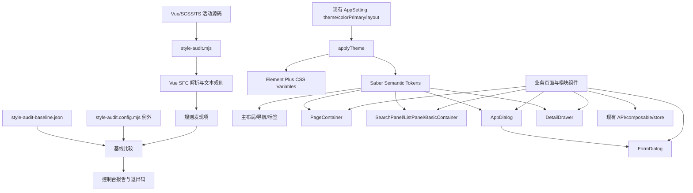
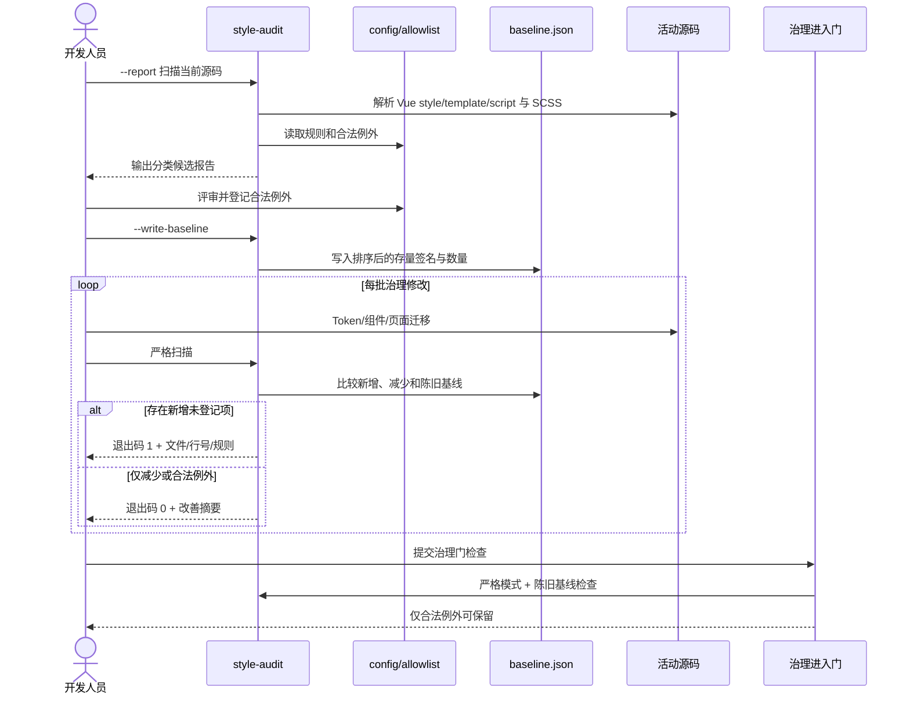
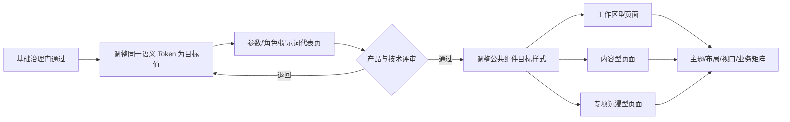

# Saber 界面基础归一化与松散型中前台视觉升级详细设计文档

## 1. 文档信息

| 项目 | 内容 |
| --- | --- |
| 功能/模块 | 样式审计、主题 Token、主布局、页面容器、查询列表、弹窗抽屉、活动业务页面与公共页面 |
| 设计编号 | DESIGN-REQ-2026-012 |
| 文档版本 | 0.4 |
| 关联需求 | [REQ-2026-012](../requirements/REQ-2026-012-ui-normalization-spacious-visual-refresh.md) |
| 关联前置 | [REQ-2026-011](../requirements/REQ-2026-011-pro-style-ui-record-panels.md) |
| 关联测试 | [TEST-REQ-2026-012 0.2](../test/TEST-REQ-2026-012-ui-normalization-spacious-visual-refresh.md) |
| 目标版本/迭代 | Saber 5.x / 界面基础治理与视觉升级单阶段 |
| 文档状态 | 开发中 |
| 设计负责人 | Codex |
| 评审人 | 产品/视觉、前端、测试待指定 |
| 最后更新日期 | 2026-09-14 |

## 2. 设计摘要与范围

### 2.1 设计摘要

本设计在 REQ-2026-011 已实现的 Vue 3、Element Plus、主题 Token、三种导航布局、`PageContainer`、
`FormDialog`、`DetailDrawer` 和表单/详情分组组件之上继续演进，不重建第二套页面体系。实现分为同一需求内的
两个有序技术阶段：首先以无新增依赖的静态审计、语义 Token 和公共组件收敛完成基础治理；治理门通过后，
再通过调整同一组 Token 和公共组件样式启用松散型视觉。

基础治理阶段保持主要视觉和业务行为不变。新增 `style-audit` 工程检查，通过 Vue SFC 解析和 SCSS/TypeScript
文本规则识别主题硬编码、直接弹层、高风险 Element Plus 内部覆盖和未分类页面；使用可审查的存量基线与例外清单
阻止新增风险，并随着迁移逐步归零。视觉阶段不增加永久“经典/年轻”设置，不改变 `AppSetting` 持久化结构，
因此不会产生双模板和长期双主题维护成本。

目标视觉采用白色主工作区、极浅中性导航区域、无阴影普通表面、40px 默认控件、48px 左右表格行、分级圆角和
更充分页面留白。页面按 `workspace`、`content`、`immersive` 三类显式声明布局：后台表格继续使用可用满宽，
内容型页面限制为 1280px，专项编辑器保留满宽能力。业务请求、权限、租户、认证、动态路由和数据模型不变。

### 2.2 关键决策

| 编号 | 决策 | 原因 | 影响 |
| --- | --- | --- | --- |
| DEC-001 | 基础治理和视觉升级属于一个需求，但以治理门作为强制技术前置 | 用户要求统一阶段实施，同时必须先消除硬编码风险 | 最终统一验收，实施提交仍按可回滚批次拆分 |
| DEC-002 | 保留 REQ-2026-011 已实现且不冲突的导航、弹层状态和公共组件行为 | 避免重做已验证能力 | 本设计只覆盖其紧凑密度与缺少硬编码门禁的部分 |
| DEC-003 | 不在 `AppSetting` 增加视觉风格字段 | 不长期维护两套页面视觉和持久化兼容 | 治理完成后新视觉成为统一默认值 |
| DEC-004 | 样式审计使用现有 `@vue/compiler-sfc`、Node.js 和正则/结构规则，不新增 Stylelint | 当前依赖足以解析 Vue SFC，新增完整 lint 工具成本较高 | 增加两个脚本文件和一个基线文件，不修改锁文件 |
| DEC-005 | 审计采用“存量基线 + 评审例外 + 新增阻断”模型 | 当前候选项较多，直接一次性严格会阻断迁移 | 基线只能减少；合法例外必须包含类别和原因 |
| DEC-006 | Token 继续集中在 `src/styles/theme/tokens.scss`，按语义分组，不拆出并行主题框架 | 现有导入链稳定且调用方已使用 CSS 变量 | 降低跨文件迁移和加载顺序风险 |
| DEC-007 | 默认 Element Plus 控件高度为 40px，small 为 32px，large 为 48px | 用户明确倾向松散风格，同时保留工作区紧凑档 | 需回归输入、按钮、选择器、分页和工具栏布局 |
| DEC-008 | 内容型页面最大宽度固定为 1280px，工作区和沉浸型不设统一最大宽度 | 1280px 可兼顾内容阅读和常见业务表格 | 不开放任意页面像素宽度属性 |
| DEC-009 | 新增通用 `AppDialog`；`FormDialog` 包装它提供 CRUD 标题和默认 footer | 现有直接 Dialog 场景不都属于 CRUD，继续扩展 FormDialog 会污染语义 | 最终只有 `AppDialog` 直接持有 `el-dialog` |
| DEC-010 | `DetailDrawer` 继续作为统一通用抽屉，不新增平行 `AppDrawer` | 当前 API 已具备通用 title、size、状态和 footer 插槽 | 专项抽屉迁移到 DetailDrawer，避免同义组件 |
| DEC-011 | Dialog 与 Drawer 共用 `useOverlayCloseGuard`，但保持不同容器组件 | 关闭保护逻辑重复，容器布局和方向语义不同 | 复用状态逻辑，不用复杂 variant 合并 DOM |
| DEC-012 | `SearchPanel`、`ListPanel` 不再通过 `BasicContainer` 包裹 | 页面 Section 不应继续表现为嵌套卡片 | 两组件直接拥有自身语义结构和间距 |
| DEC-013 | `BasicContainer` 保留为兼容 Surface，移除无调用的任意 `radius/background` API | 当前属性作用在外层，不能稳定控制可见卡片 | 迁移现有调用后仅保留语义 variant、padding 和 block |
| DEC-014 | 每个路由页面显式传入 `PageContainer layout`，不建立运行时路径映射表 | 布局类型是页面设计事实，放在页面模板更易审查 | 新页面缺少分类由 style-audit 报错 |
| DEC-015 | 深色动态主色使用深色表面作为浅阶混合目标，并同步维护 `--el-color-primary-rgb` | 当前始终向白色混合，深色弱选中态可能过亮，RGB 变量也未同步 | `applyTheme()` 需要按主题生成完整调色板 |
| DEC-016 | 治理提交与视觉 Token 提交分离，但最终作为同一需求发布 | 视觉不满意时可以只回滚视觉而保留治理收益 | Git 提交和发布说明必须标明依赖顺序 |
| DEC-017 | 不修改任何业务 API、权限码、租户字段和成功判断 | 本需求是前端基础与视觉改造 | 业务差异一律视为回归缺陷 |

### 2.3 改动范围

| 层级 | 改动内容 | 不涉及内容 |
| --- | --- | --- |
| 工程脚本 | 新增样式审计、基线比较、例外配置和 `package.json` 命令 | 新增 lint 框架、CI 平台改造 |
| 主题基础 | 扩展 Saber/Element Plus 语义 Token，修正动态主色调色板 | 新增用户主题服务和后端配置 |
| 主布局 | 页面画布、导航表面、选中态、标签页和统一间距 | 三种导航的路由、滚动、折叠和账户行为 |
| 公共组件 | PageContainer、BasicContainer、SearchPanel、ListPanel、AppDialog、FormDialog、DetailDrawer、Form/Detail Section | 配置驱动 CRUD、字段引擎和业务 API |
| 业务页面 | 全部活动页面的布局分类、标准容器迁移和专项例外收敛 | 字段、校验、请求参数、权限和业务流程变更 |
| 公共页面 | 登录、锁屏、错误页、欢迎页、个人中心和界面设置的主题归一化 | 登录方式、加密、上传协议和路由守卫 |
| 后端/API | 无 | Controller、Service、数据模型和接口契约 |
| 数据库 | 无 | 表、字段、索引和数据迁移 |
| 部署 | 增加本地工程验证命令 | 环境变量、镜像、Nginx 和部署拓扑 |

### 2.4 当前影响面基线

以下数量来自 2026-09-14 初始文本扫描，用于确定治理范围，不作为最终严格审计结果：

| 候选类型 | 当前数量 | 设计处理 |
| --- | ---: | --- |
| 含原始颜色的文件 | 49 | 由 SFC 分区解析后分类为主题风险、数据色、媒体色或主题预览 |
| 含固定设计间距的文件 | 42 | 公共布局迁移 Token；组件几何和专项编辑器按例外保留 |
| 含圆角覆盖的文件 | 23 | 标准圆角迁移到分级 Token |
| 含阴影覆盖的文件 | 13 | 普通表面移除，浮层/媒体保留语义阴影 |
| 直接 `el-dialog` 文件 | 10 | 除新增 `AppDialog` 外全部迁移 |
| 直接 `el-drawer` 文件 | 6 | 除 `DetailDrawer` 外全部迁移 |
| `src/views/**/*.vue` 文件 | 44 | 路由页显式分类，模块子组件继承所属页面类型 |
| 当前显式使用 PageContainer 的路由页 | 2 | 全部路由页迁移到显式 PageContainer 布局 |

## 3. 总体设计

### 3.1 架构图



### 3.2 组件职责

| 组件/文件 | 职责 | 输入 | 输出 |
| --- | --- | --- | --- |
| `scripts/style-audit.mjs` | 扫描源码、生成签名、比较基线和例外、设置退出码 | 扫描模式、源码、配置、基线 | 分类报告、成功/失败退出码 |
| `scripts/style-audit.config.mjs` | 定义扫描根、规则级别、路由页判定和合法例外 | 人工维护配置 | 审计配置对象 |
| `scripts/style-audit-baseline.json` | 保存治理开始时的存量风险签名和数量 | 显式生成命令 | 新增风险比较基线 |
| `src/styles/theme/tokens.scss` | 定义明暗主题和布局语义 Token，映射 Element Plus 变量 | CSS 主题上下文 | 全局 CSS 变量 |
| `src/utils/theme.ts` | 根据主题和主色生成 Element Plus/Saber 动态色阶 | `AppSetting.theme/colorPrimary` | 根元素类名和动态颜色变量 |
| `PageContainer` | 显式页面类型、标题、描述、操作、Tab 和内容宽度 | layout、标题与 slots | 稳定页级结构 |
| `BasicContainer` | 兼容独立 Surface，不承担页面骨架 | variant、padding、block | 语义表面 |
| `SearchPanel` | 查询表单、自适应折叠和松散搜索区域 | model、loading、响应式列 | search、reset、expandChange |
| `ListPanel` | 列表标题、工具栏、表格区域和 footer | title、compact、slots | 稳定列表 Section |
| `AppDialog` | 通用 Dialog 壳层、尺寸、加载失败和关闭保护 | title、size、状态、slots | close、cancel、retry |
| `FormDialog` | 基于 AppDialog 提供 add/view/edit 标题和默认操作 | CrudMode、entityName、权限与提交状态 | edit、confirm、cancel、retry |
| `DetailDrawer` | 通用 Drawer 壳层、方向圆角、尺寸、状态和 footer | title、direction、size、状态 | close、cancel、retry |
| `useOverlayCloseGuard` | 统一 submitting/dirty 关闭判断 | submitting、dirty、确认文案 | `canClose()`、confirming 状态 |
| `FormSection/DetailSection` | 表单和详情分组、列布局与松散间距 | title、description、columns | 业务内容 slots |
| 业务页面 | 布局类型、字段、请求、权限、业务状态和专项内容 | 用户操作、现有 API | 原业务结果和可见页面 |

### 3.3 新增依赖

不新增依赖。`@vue/compiler-sfc` 已存在于 `devDependencies`，样式审计直接复用；Node.js 文件遍历、哈希和参数解析
使用标准库。`pnpm-lock.yaml` 不应因本需求变化。

## 4. 核心流程设计

### 4.1 基础治理流程



### 4.2 视觉启用流程



### 4.3 异常与边界流程

| 场景 | 处理位置 | 处理方式 | 数据是否改变 |
| --- | --- | --- | :---: |
| 扫描规则误报 | `style-audit.config.mjs` | 缩小规则或登记带原因例外，不整文件忽略 | 否 |
| 新增发现与存量签名相同 | 审计比较器 | 比较同签名出现次数，超过基线仍失败 | 否 |
| 基线包含已删除项 | 审计比较器 | 报告 stale baseline；治理门要求清理 | 否 |
| Vue SFC 无法解析 | `@vue/compiler-sfc` | 输出解析错误并退出 1，不跳过文件 | 否 |
| 公共组件迁移产生视觉差异 | 代表页对照 | 基础治理批次退回现有值，视觉差异留到视觉阶段 | 否 |
| 专项弹层无法满足公共 API | 组件评审 | 使用 AppDialog/DetailDrawer slots；仍不满足则登记最小例外 | 否 |
| 松散尺寸导致窄屏不可用 | 页面类型响应式规则 | 移动端缩减页面 gutter、全宽浮层、工具栏换行或表格横向滚动 | 否 |
| 动态主色在深色主题过亮 | `applyTheme()` | 使用深色 surface 作为混色目标并回归状态色 | 否 |
| 视觉改造影响请求或权限 | 业务页面 | 视为阻断回归，恢复原业务逻辑 | 由原接口决定 |

### 4.4 事务、并发与幂等

本需求没有后端事务。样式审计是只读操作，除显式 `--write-baseline` 外不修改文件；写入基线时采用先生成完整内容、
再一次性替换的方式，失败时不保留部分 JSON。业务页面继续使用现有 composable 和提交锁，视觉迁移不得增加请求、
自动重试写操作或改变后端并发控制。

## 5. 后端设计

### 5.1 路由、模型与服务

不涉及。Saber 继续调用现有 SpringBlade API；本需求不新增 Controller、Service、请求/响应模型或数据库模型。

### 5.2 认证与数据归属

- 是否需要登录：沿用各页面现有规则。
- 资源归属：沿用各业务模块现有实例级或租户级归属。
- 客户端写入：不新增或修改 `tenantId`、Token、权限 keys 等字段。
- 角色权限：沿用现有菜单和 `{module}_{action}` 按钮权限，后端仍为最终安全边界。
- 公共组件与样式脚本不得导入业务权限、用户信息或 API。

### 5.3 查询、归档与错误

不涉及接口查询和归档语义变更。页面迁移过程中必须保持：

- GET/POST 参数位置不变。
- 分页 records/total 解析不变。
- 查询、重置、刷新和删除后的页码语义不变。
- Axios 普通错误不重复提示，页面独立恢复 loading 和提交锁。
- 失败路径不得显示成功或用旧数据冒充当前结果。

## 6. API 契约

### 6.1 接口清单

无新增、修改或废弃接口。

### 6.2 兼容要求

| 契约 | 设计要求 |
| --- | --- |
| URL 和方法 | 保持现有 `src/api/**` 定义，不因页面容器迁移改变 |
| 请求参数 | GET 继续使用 params，POST 继续使用 data，字段白名单不变 |
| 响应结构 | 保持各模块现有分页、树和详情解析方式 |
| 权限 | 保持现有菜单、按钮权限和管理员专项判断 |
| 租户 | 保持 `website.tenantMode` 和后端安全上下文，不新增前端硬编码租户 |
| 认证 | 不修改 `Blade-Auth`、Cookie Key、OAuth Basic 头和 SM2 公钥 |
| 上传/下载 | 不修改现有 Upload、Blob、认证头和文件校验流程 |

### 6.3 业务请求回归方法

代表页面迁移前后分别记录查询、详情、保存、删除或专项操作的 Network 方法、URL、参数键和请求次数。视觉阶段只允许
DOM 层级、class、CSS 变量和公共组件 props 变化；发现请求次数或参数变化时，必须按业务回归缺陷处理，而不是作为
视觉实现差异接受。

## 7. 前端设计

### 7.1 文件结构

计划新增和修改的核心文件如下，业务页面按后续迁移清单逐批处理：

```text
scripts/
├── style-audit.mjs                         # 新增：扫描、基线比较、报告和退出码
├── style-audit.config.mjs                  # 新增：规则级别、页面分类与合法例外
└── style-audit-baseline.json               # 新增：初始存量签名，治理完成后仅保留合法例外需要的基线

src/
├── components/
│   ├── app-dialog/main.vue                 # 新增：通用 Dialog 壳层
│   ├── basic-container/main.vue            # 修改：语义 Surface，移除任意颜色/圆角 API
│   ├── detail-drawer/main.vue              # 修改：统一 Drawer 与方向圆角
│   ├── form-dialog/main.vue                 # 修改：组合 AppDialog，保留 CRUD 语义
│   ├── form-section/main.vue                # 修改：松散分组间距
│   ├── detail-section/main.vue              # 修改：松散分组间距
│   ├── list-panel/main.vue                  # 修改：移除 BasicContainer 包裹
│   ├── page-container/main.vue              # 修改：workspace/content/immersive 模式
│   └── search-panel/main.vue                # 修改：移除 BasicContainer 包裹
├── composables/
│   └── useOverlayCloseGuard.ts              # 新增：dirty/submitting 关闭保护
├── styles/
│   ├── common.scss                          # 修改：页面 gutter 与画布
│   ├── element-plus.scss                    # 修改：公开变量映射和基础状态
│   ├── login.scss                           # 修改：公共中性色映射
│   ├── sidebar.scss                         # 修改：圆角选中态和导航间距
│   ├── tags.scss                            # 修改：圆角路由标签
│   ├── top.scss                             # 修改：顶部导航状态
│   └── theme/tokens.scss                    # 修改：完整语义 Token
├── types/
│   └── page.ts                              # 新增：PageLayout 类型
└── utils/
    └── theme.ts                             # 修改：RGB 与明暗动态色阶

package.json                                 # 修改：新增 style-audit 命令
doc/design/                                  # 本设计与后续页面/例外清单
doc/test/                                    # 后续 TEST-REQ-2026-012
```

### 7.2 样式审计设计

#### 7.2.1 扫描范围

`style-audit.mjs` 从仓库根目录运行，默认扫描：

- `src/**/*.vue`
- `src/**/*.scss`
- `src/**/*.css`
- 与主题和内联样式有关的 `src/**/*.ts`
- `package.json` 中禁用 UI 依赖

明确排除 `node_modules/`、`dist/`、Git 历史、Markdown 文档和第三方生成文件。Vue 文件使用
`@vue/compiler-sfc.parse()` 分离 template、script/script setup 和 style block；报告行号加上 block 起始行，确保能够
定位到原文件。SCSS/CSS 直接按文件解析，TypeScript 仅报告颜色字面量和内联 style 对象候选，不对普通业务数值报错。

#### 7.2.2 规则清单

| 规则 | 默认级别 | 检查内容 | 默认允许位置 |
| --- | --- | --- | --- |
| `UI001 raw-theme-color` | error | CSS 颜色字面量、主题相关模板属性和内联样式颜色 | `tokens.scss`、评审例外 |
| `UI002 raw-radius` | warning -> error | 业务样式中的普通 border-radius 字面量 | Token 定义、圆形媒体、评审例外 |
| `UI003 raw-shadow` | error | 业务样式中的 box-shadow 字面量 | Token 定义、媒体专项例外 |
| `UI004 raw-spacing` | warning -> error | padding/margin/gap 等设计间距字面量 | Token 定义、组件几何、评审例外 |
| `UI005 direct-dialog` | error | `src/views`、`src/page` 和普通组件直接使用 `el-dialog` | `components/app-dialog/main.vue` |
| `UI006 direct-drawer` | error | 直接使用 `el-drawer` | `components/detail-drawer/main.vue` |
| `UI007 element-internal` | warning -> error | `:deep()`/`:global()` 下的 `.el-*__*` 内部结构覆盖 | 公共组件所属根类、第三方专项例外 |
| `UI008 important` | warning -> error | 新增 `!important` | 已登记第三方优先级兼容 |
| `UI009 page-layout` | error | 路由页未使用 PageContainer 或未显式声明 layout | 经评审独立壳层页面 |
| `UI010 forbidden-ui` | error | Avue、Ant Design Vue、`.avue-*`、`.ant-*` 活动引用 | 无 |
| `UI011 raw-overlay-size` | warning -> error | 业务弹层使用任意 px/% 宽度 | 语义 size、经评审专项尺寸 |
| `UI012 unscoped-global` | error | 业务页面无根类约束的全局 Element Plus 覆盖 | 全局基础样式所有者 |

`warning -> error` 表示初始报告阶段为 warning，完成对应治理批次后在配置中提升为 error。规则级别只允许全仓统一提升，
不得为了单个页面把 error 降级；单页保留使用例外项。

#### 7.2.3 发现项签名

每个发现项生成不含行号的稳定签名，行号只用于展示：

```text
rule | relativePath | blockKind | normalizedSelectorOrContext | propertyOrTag | normalizedValue
```

同一签名记录 `count`。例如同一个选择器新增第二个相同硬编码时，实际 count 超过基线仍视为新增风险；仅移动代码行
不会造成无意义基线变化。签名按规则、路径和上下文排序后写入 JSON，保证 diff 稳定。

基线结构：

```json
{
  "version": 1,
  "generatedAt": "2026-09-14",
  "findings": [
    {
      "rule": "UI001",
      "path": "src/components/error-page/style.scss",
      "context": ".error-page",
      "property": "background",
      "value": "#f0f2f5",
      "count": 1
    }
  ]
}
```

`generatedAt` 用本地日期，只作审计记录，不参与比较。

#### 7.2.4 合法例外

合法例外集中维护在 `style-audit.config.mjs`，不在业务代码中散落 ignore 注释：

```js
export const exceptions = [
  {
    rule: 'UI001',
    path: 'src/views/wel/dashboard.vue',
    scope: 'script',
    match: '#d56259',
    category: 'data-color',
    reason: '演示磁贴的数据分类色，不参与主题表面层级',
    owner: 'welcome',
  },
];
```

允许的 `category` 固定为：`data-color`、`media-overlay`、`theme-preview`、`component-geometry`、
`third-party-adapter`、`special-overlay`。例外必须精确到 rule、path 和 match/context，不允许 `path: src/views/**` 形式的
目录级放行。`reason` 和 `owner` 不能为空。

#### 7.2.5 命令与退出码

`package.json` 增加：

```json
{
  "scripts": {
    "style-audit": "node scripts/style-audit.mjs"
  }
}
```

运行方式：

```bash
pnpm run style-audit -- --report
pnpm run style-audit
node scripts/style-audit.mjs --write-baseline
```

- `--report`：输出全部候选和分类统计，不因 warning/error 退出失败，用于首次盘点。
- 默认模式：对比基线和例外；新增 error、解析失败或非法配置时退出 1。
- `--write-baseline`：显式重写基线；仅用于首次建立或评审后更新，不加入普通 package script。
- `--fail-on-stale`：存在已经消失但未清理的基线项时退出 1，治理门和最终验收使用。
- 报告必须包含规则、级别、文件、行号、值/标签、是否基线项和例外原因。

### 7.3 页面布局分类设计

新增 `src/types/page.ts`：

```ts
export type PageLayout = 'workspace' | 'content' | 'immersive';
```

路由页必须显式使用：

```vue
<page-container layout="workspace" title="参数管理">...</page-container>
<page-container layout="content" title="提示词管理">...</page-container>
<page-container layout="immersive" title="代码生成">...</page-container>
```

`layout` 不写入路由 meta 和 Pinia，不持久化，不由后端菜单控制。页面类型只决定内容宽度、页头尺寸、Section 间距和
响应式密度，不影响路由、权限或请求。

初始分类：

| 类型 | 页面范围 |
| --- | --- |
| `workspace` | `system/*`、`authority/*`、`base/region.vue`、`desk/notice.vue`、`monitor/log/*`、`report/reportlist.vue`、`tool/datasource.vue` |
| `content` | `asset/prompt.vue`、`user/info.vue`、`wel/index.vue`、`wel/dashboard.vue`、`util/*` 和测试展示页 |
| `immersive` | `tool/code.vue` 及后续明确需要满宽编辑画布的路由页 |

`src/views/**/components/*.vue` 是模块组件，不单独声明页面类型，继承所属路由页。style-audit 通过路径规则区分路由页
与模块组件；新增独立路由页必须加入显式分类，不能依赖默认值蒙混通过。

### 7.4 主题 Token 设计

#### 7.4.1 分层原则

`tokens.scss` 保留单文件入口，内部按以下顺序定义：

1. Element Plus 主色默认值。
2. Saber 基础尺寸和间距。
3. 浅色语义表面、文字、边界和阴影。
4. Element Plus 公开变量到 Saber 语义的映射。
5. 深色语义覆盖。
6. 响应式 gutter 覆盖。

业务组件只能引用 Saber 语义 Token 或 Element Plus 状态 Token，不引用基础色值。`tokens.scss`、主题预览和评审例外
是原始颜色的主要合法所有者。

#### 7.4.2 浅色目标值

| Token | 目标值 | 用途 |
| --- | --- | --- |
| `--saber-canvas` | `#ffffff` | 主工作区和页面画布 |
| `--saber-chrome-bg` | `#f7f8fa` | 侧栏、顶部导航和次级应用外壳 |
| `--saber-surface` | `#ffffff` | 普通内容表面 |
| `--saber-surface-muted` | `#f6f8fa` | 搜索区、表头、hover 和弱容器 |
| `--saber-surface-subtle` | `#f1f4f7` | 更低层级背景和禁用区域 |
| `--saber-surface-overlay` | `#ffffff` | Dialog、Drawer、Popover |
| `--saber-border` | `#e7ebf0` | 普通分隔和控件边界 |
| `--saber-border-strong` | `#d6dce4` | 强调边界和拖拽分隔 |
| `--saber-text-primary` | `#1f2329` | 标题和主要正文 |
| `--saber-text-secondary` | `#5f6875` | 普通标签和辅助正文 |
| `--saber-text-tertiary` | `#858e9b` | 次要说明和占位 |
| `--saber-text-disabled` | `#b4bbc5` | 禁用文本 |
| `--saber-shadow-popover` | `0 8px 24px rgba(31, 35, 41, 0.1)` | 下拉、右键菜单和悬浮工具 |
| `--saber-shadow-overlay` | `0 18px 48px rgba(31, 35, 41, 0.16)` | Dialog |
| `--saber-shadow-drawer` | `-12px 0 36px rgba(31, 35, 41, 0.12)` | 右侧 Drawer |

`--saber-page-bg` 保留为兼容别名并指向 `--saber-canvas`；`--saber-header-bg`、`--saber-sidebar-bg` 指向
`--saber-chrome-bg`。现有调用方完成迁移后再评审是否移除 `--saber-page-bg`，本需求内不强制删除兼容别名。

#### 7.4.3 深色目标值

| Token | 目标值 |
| --- | --- |
| `--saber-canvas` | `#111318` |
| `--saber-chrome-bg` | `#171a20` |
| `--saber-surface` | `#1b1f26` |
| `--saber-surface-muted` | `#22272f` |
| `--saber-surface-subtle` | `#292f39` |
| `--saber-surface-overlay` | `#242a33` |
| `--saber-border` | `#303744` |
| `--saber-border-strong` | `#46505f` |
| `--saber-text-primary` | `rgba(255, 255, 255, 0.9)` |
| `--saber-text-secondary` | `rgba(255, 255, 255, 0.68)` |
| `--saber-text-tertiary` | `rgba(255, 255, 255, 0.48)` |
| `--saber-text-disabled` | `rgba(255, 255, 255, 0.3)` |
| `--saber-shadow-popover` | `0 10px 28px rgba(0, 0, 0, 0.36)` |
| `--saber-shadow-overlay` | `0 20px 52px rgba(0, 0, 0, 0.48)` |
| `--saber-shadow-drawer` | `-12px 0 40px rgba(0, 0, 0, 0.4)` |

深色主题不要求主画布为白色，也不通过简单反色生成；页面模式、间距和圆角与浅色保持一致，表面层级使用独立值。

#### 7.4.4 尺寸、间距和圆角

| Token | 目标值 | 说明 |
| --- | ---: | --- |
| `--saber-space-1` 至 `--saber-space-9` | `4/8/12/16/20/24/32/40/48px` | 全局间距刻度 |
| `--saber-page-gutter-x` | `24px` | 1024 至 1439px 页面左右留白 |
| `--saber-page-gutter-x-wide` | `32px` | 1440px 及以上 |
| `--saber-page-gutter-x-mobile` | `16px` | 767px 及以下 |
| `--saber-section-gap` | `32px` | 默认页面 Section 间距 |
| `--saber-form-row-gap` | `24px` | 表单项纵向间距 |
| `--saber-content-max-width` | `1280px` | 内容型页面最大宽度 |
| `--saber-control-height` | `40px` | 默认控件 |
| `--saber-control-height-small` | `32px` | 紧凑工具和低频辅助操作 |
| `--saber-control-height-large` | `48px` | 登录主操作和少量强调控件 |
| `--saber-nav-item-height` | `44px` | 侧栏菜单项 |
| `--saber-table-cell-padding-y` | `12px` | 默认表格单元格纵向 padding |
| `--saber-table-cell-padding-y-compact` | `8px` | 抽屉内紧凑列表 |
| `--saber-radius-xs` | `4px` | 极小控件和预览缩略图 |
| `--saber-radius-control` | `6px` | 输入、按钮和小型工具 |
| `--saber-radius-surface` | `8px` | 搜索区、菜单选中和普通 Surface |
| `--saber-radius-overlay` | `12px` | Dialog 和非贴边浮层 |
| `--saber-radius-round` | `999px` | 胶囊、头像和圆形按钮 |
| `--saber-motion-fast` | `160ms` | hover、focus、颜色反馈 |
| `--saber-motion-normal` | `200ms` | 浮层和普通位移 |
| `--saber-nav-duration` | `260ms` | 保留现有导航收展节奏 |

Element Plus 映射：

```scss
--el-component-size: var(--saber-control-height);
--el-component-size-small: var(--saber-control-height-small);
--el-component-size-large: var(--saber-control-height-large);
--el-border-radius-base: var(--saber-radius-control);
--el-border-radius-small: var(--saber-radius-xs);
--el-border-radius-round: var(--saber-radius-round);
--el-bg-color: var(--saber-surface);
--el-bg-color-page: var(--saber-canvas);
--el-bg-color-overlay: var(--saber-surface-overlay);
--el-text-color-primary: var(--saber-text-primary);
--el-text-color-regular: var(--saber-text-secondary);
--el-text-color-secondary: var(--saber-text-tertiary);
--el-text-color-disabled: var(--saber-text-disabled);
--el-border-color: var(--saber-border);
--el-border-color-light: var(--saber-border);
--el-fill-color-light: var(--saber-surface-muted);
--el-fill-color-lighter: var(--saber-surface-subtle);
--el-fill-color-blank: var(--saber-surface);
```

Success、warning、danger 等业务状态继续使用 Element Plus 状态变量，本设计不重新定义第二套状态色。

#### 7.4.5 弹层尺寸

| 档位 | Dialog | Drawer |
| --- | ---: | ---: |
| `sm` | 600px | 不适用 |
| `md` | 760px | 680px |
| `lg` | 920px | 840px |
| `xl` | 不适用 | 1040px |

浮层公共尺寸：header 最小 64px、正文默认 padding 32px、footer 最小 68px。767px 及以下正文左右 padding 降为
16px；Dialog 最大宽度为 `calc(100vw - 24px)`，Drawer 使用 100% 可用宽度且移除贴边圆角。

### 7.5 动态主题应用

`applyTheme()` 保持现有调用位置和同步执行方式，补齐以下变量：

```ts
interface ThemePaletteTarget {
  lightTarget: string;
  darkTarget: string;
}

const paletteTarget = setting.theme === 'dark' ? '#1b1f26' : '#ffffff';
```

- 设置 `--el-color-primary-rgb`，值为 `r, g, b`，避免依赖 RGB 的 Element Plus 状态仍使用默认蓝色。
- 浅色主题的 `light-3/5/7/8/9` 继续向白色混合。
- 深色主题的 `light-3/5/7/8/9` 改为向 `--saber-surface` 对应基础色混合，生成暗背景可用的弱主色层级。
- `dark-2` 继续向黑色混合。
- 增加 `--saber-accent-soft`、`--saber-accent-hover`、`--saber-focus-ring-color` 动态变量，供菜单、页签、
  选择项和焦点环使用。
- 不改变 `AppSetting`、`commonStore` 和本地存储结构；已有用户打开新版后直接获得新的统一视觉。

主色切换只修改动态颜色变量，不重写表面、间距、圆角和布局 Token。

### 7.6 PageContainer 设计

组件契约：

```ts
import type { PageLayout } from '@/types/page';

interface PageContainerProps {
  layout: PageLayout;
  title?: string;
  description?: string;
  showBreadcrumb?: boolean;
  contentPadding?: boolean;
}
```

`layout` 在过渡期可以保留默认 `workspace` 以避免一次提交破坏旧调用方，但 style-audit 对路由页要求显式传入。
全部活动页面迁移完成后，将 `layout` 改为必填且移除运行时默认。

结构规则：

- `#saber-view` 继续作为滚动容器，负责统一页面 gutter；不再由每个页面自己复制外边距。
- PageContainer 页头不表现为独立卡片，使用透明/画布背景和下方间距；是否分隔由内容层级决定，不默认绘制整宽边框。
- `workspace`：宽度 100%，标题 20px，数据区允许使用可用满宽。
- `content`：容器 `max-width: var(--saber-content-max-width)`、`margin-inline: auto`，标题 24px，描述最大 800px。
- `immersive`：宽度 100%，最小高度可继承视口；允许页面通过 slots 建立编辑画布，但仍使用统一页头和主题。
- 页头与正文属于同一个最大宽度容器，避免标题和内容左右边界不一致。
- actions 在桌面右对齐；1024px 下允许换行；767px 下位于标题下方并保持主要操作在前。
- breadcrumb、title、status、actions、tabs 任一缺失时不产生空节点和额外高度。

响应式 gutter：

```scss
#saber-view {
  padding: var(--saber-page-gutter-x);
}

@media (min-width: 1440px) {
  #saber-view {
    padding: var(--saber-page-gutter-x-wide);
  }
}

@media (max-width: 767px) {
  #saber-view {
    padding: var(--saber-page-gutter-x-mobile);
  }
}
```

### 7.7 BasicContainer、SearchPanel 与 ListPanel

#### 7.7.1 BasicContainer

`radius` 和 `background` 当前没有有效业务调用，且只能影响外层 div，不能可靠控制可见 `el-card`。迁移后删除这两个 props，
保留：

```ts
type SurfaceVariant = 'plain' | 'subtle' | 'outlined';
type SurfacePadding = 'none' | 'sm' | 'md' | 'lg';

interface BasicContainerProps {
  variant?: SurfaceVariant;
  padding?: SurfacePadding;
  block?: boolean;
}
```

- `plain`：白色/深色普通表面，无边框、无阴影。
- `subtle`：弱表面背景，无边框。
- `outlined`：普通表面加 1px 语义边界，无阴影。
- padding 映射 0、16、24、32px，不允许任意像素值。
- 组件改为 `<script setup lang="ts">`；继续保留全局注册名称以兼容现有模板。
- 路由页面不得只使用 BasicContainer 作为页面骨架，必须外层使用 PageContainer。

#### 7.7.2 SearchPanel

SearchPanel 直接渲染 `<section class="search-panel">`，不再嵌套 BasicContainer/ElCard。目标样式：

- 背景 `--saber-surface-muted`，无边框、无阴影、8px 圆角。
- 默认 padding 24px，移动端 16px。
- 字段 row-gap 24px；操作按钮 gap 8px。
- 输入和选择继续保留 1px 内边界，不执行全局无边框。
- 现有 ResizeObserver、MutationObserver、自动折叠和请求事件保持不变。
- 折叠测量在控件升高到 40px 后重新验证，但算法仍按实际宽度，不硬编码字段数量。

#### 7.7.3 ListPanel

ListPanel 直接渲染 `<section class="list-panel">`，默认透明/画布背景，无外框、无阴影。目标样式：

- header 最小高度 40px，底部间距 24px。
- title 18px/600；工具栏允许换行，主操作与工具区 gap 8px。
- 默认表格 cell 纵向 padding 12px；`compact` 保留为 8px，仅用于抽屉内嵌列表和明确紧凑场景。
- footer 顶部间距 24px。
- 表格外框和顶部伪边界隐藏，行分隔使用 `--saber-border`，表头使用 muted surface。
- hover/selected 使用动态弱主色或 muted surface；表格行不强制圆角，以免固定列和虚拟滚动出现断裂。
- 内容区使用 `overflow-x: auto` 作为通用兜底；Element Plus Table 继续拥有实际列滚动，页面根节点不得因宽表产生横向滚动。
- 关键操作列固定在右侧；行内高频操作最多保留查看、编辑、删除等 2 至 3 项，第四项及以后通过 RowActions 的 `more` 槽进入下拉菜单。
- 固定操作列内容不得依赖溢出显示；RowActions 的 `scrollWidth` 不应大于 `clientWidth`。移动端允许横向滑动数据列，但固定操作和“更多”入口必须可达。
- 移动端工具栏主操作优先，低频 tools 换到下一行；表格最小宽度由具体页面按字段决定。

`src/styles/element-plus.scss` 中旧 `.saber-list-panel` 兼容类在调用方归零后删除，避免与 ListPanel scoped 样式形成双重所有权。

### 7.8 Dialog 与 Drawer 设计

#### 7.8.1 useOverlayCloseGuard

```ts
interface OverlayCloseGuardOptions {
  submitting: () => boolean;
  dirty: () => boolean;
  title?: string;
  message?: string;
}

interface OverlayCloseGuard {
  confirming: Readonly<Ref<boolean>>;
  canClose: () => Promise<boolean>;
}
```

默认文案沿用当前“放弃未保存修改”。`canClose()` 顺序固定：submitting 或 confirming 时返回 false；dirty=false 返回
true；否则调用 `ElMessageBox.confirm`。组件通过 getter 读取 props，避免复制 watch 状态。

#### 7.8.2 AppDialog

```ts
type DialogSize = 'sm' | 'md' | 'lg';

interface AppDialogProps {
  modelValue: boolean;
  title: string;
  subtitle?: string;
  size?: DialogSize;
  width?: string | number;
  loading?: boolean;
  failed?: boolean;
  submitting?: boolean;
  dirty?: boolean;
  destroyOnClose?: boolean;
  showClose?: boolean;
}
```

插槽：`header-status`、默认正文、`failed`、`footer-extra`、`footer`。事件：`update:modelValue`、`retry`、`cancel`、
`close`。`width` 只用于存量兼容和专项弹层，style-audit 对业务页面任意宽度发出 `UI011`；标准场景必须使用 size。

AppDialog 是唯一允许直接使用 `el-dialog` 的组件。样式：12px 圆角、overlay surface、overlay shadow、64px header、
32px body padding、68px footer、正文独立滚动。header/footer 使用弱边界，不使用厚边框或额外卡片。

#### 7.8.3 FormDialog

FormDialog 改为组合 AppDialog，保留现有 props/events 和 CRUD 默认 footer：

- `add`：取消、创建。
- `edit`：取消、保存。
- `view`：关闭；`canEdit` 时显示编辑。
- `loading/failed/submitting/dirty` 直接转交 AppDialog。
- `modeTitle`、`entityName` 和 `confirmDisabled` 保持在 FormDialog。
- 页面原有调用不需要了解 AppDialog，标准 CRUD 迁移不改变业务模板。

#### 7.8.4 DetailDrawer

DetailDrawer 是唯一允许直接使用 `el-drawer` 的组件。保持现有 API，增加统一失败 footer 和方向 class：

- `rtl`：`12px 0 0 12px`。
- `ltr`：`0 12px 12px 0`。
- `ttb`：`0 0 12px 12px`。
- `btt`：`12px 12px 0 0`。
- 767px 及以下占满视口时圆角为 0。
- header/body/footer 与 AppDialog 使用相同尺寸和语义边界。
- 关闭保护复用 `useOverlayCloseGuard`。

#### 7.8.5 直接弹层迁移表

| 当前文件 | 当前容器 | 目标容器 | 分类 |
| --- | --- | --- | --- |
| `src/views/base/region.vue` | 调试 Dialog | AppDialog | 专项工具弹窗 |
| `src/views/authority/role.vue` | 权限配置 Dialog | AppDialog | 专项授权弹窗 |
| `src/views/system/user.vue` | 角色配置、导入 Dialog | AppDialog | 专项授权/导入弹窗 |
| `src/views/system/topmenu.vue` | 下级菜单配置 Dialog | AppDialog | 专项授权弹窗 |
| `src/views/asset/components/prompt-action-dialog.vue` | 操作 Dialog | AppDialog | 专项确认弹窗 |
| `src/views/asset/components/prompt-editor-dialog.vue` | 编辑器 Dialog | AppDialog | 专项编辑弹窗 |
| `src/page/index/top/top-lock.vue` | 锁屏密码 Dialog | AppDialog | 标准小型弹窗 |
| `src/page/index/top/top-logs.vue` | 日志 Dialog | AppDialog | 标准信息弹窗 |
| `src/components/third-register/main.vue` | 注册 Dialog | AppDialog | 公共表单弹窗 |
| `src/views/authority/apiscope.vue` | Scope Drawer | DetailDrawer | 专项配置抽屉 |
| `src/views/authority/datascope.vue` | Scope Drawer | DetailDrawer | 专项配置抽屉 |
| `src/views/asset/components/prompt-preview-drawer.vue` | 预览 Drawer | DetailDrawer | 专项预览抽屉 |
| `src/views/asset/components/prompt-version-drawer.vue` | 版本 Drawer | DetailDrawer | 专项主子抽屉 |
| `src/page/index/setting.vue` | 设置 Drawer | DetailDrawer | 应用设置抽屉 |

迁移完成后，`rg -n "<el-dialog|<el-drawer" src` 只允许命中 AppDialog 和 DetailDrawer 两个公共组件。

### 7.9 导航、页签与选中态

#### 7.9.1 侧栏

保持 240px 展开宽度、64px 收起宽度和现有收展动效。仅调整菜单项视觉：

```scss
.saber-sidebar .el-menu-item,
.saber-sidebar .el-sub-menu__title {
  min-height: var(--saber-nav-item-height);
  margin: 2px var(--saber-space-2);
  border-radius: var(--saber-radius-surface);
}
```

- 删除选中态 `::before` 左侧 3px 色条。
- hover 使用 `--saber-accent-hover`，selected 使用 `--saber-accent-soft`。
- selected 文本/图标使用主色，字重 500；普通文本继续使用 secondary。
- 收起态菜单项保持 48px 左右有效点击区并在 64px 侧栏内居中，选中底不贴边。
- 子菜单缩进继续由 Element Plus 层级处理，圆角和左右 margin 由统一规则提供。
- 侧栏边界仍使用 1px 弱边界，不用阴影分隔主内容。

#### 7.9.2 顶部导航

- 保留 Logo、菜单区域、左右箭头、搜索和账户工具的现有布局与滚动算法。
- 一级菜单项在顶栏高度内使用 8px 圆角弱背景；hover/selected 状态与侧栏同源。
- 不恢复 Element Plus “更多”折叠，不修改 hover 展开和模式切换重建规则。
- 下拉菜单使用 overlay surface、12px 非贴边圆角和 popover shadow；业务图标隐藏规则保持现状。

#### 7.9.3 路由标签

标签栏保持应用级导航，不与页面内容 Tab 使用相同视觉：

- 标签栏高度保持 50px，与 Logo/顶栏对齐。
- item 高度 36px，纵向居中，左右 padding 12px，圆角 8px。
- inactive 为透明背景和 tertiary 文本；hover 使用 accent-hover；active 使用 accent-soft 和主色文本。
- 删除 active 底部 2px 主色线，避免同时出现线性和块状两套选中反馈。
- 关闭图标保持固定尺寸，hover 只改变自身背景，不撑开标签宽度。
- 右键菜单使用 popover Token，不再单独硬编码宽度以外的颜色、圆角和阴影。

页面内业务 Tab 默认继续使用 Element Plus 下划线或 `el-segmented`，只有明确属于对象切换的控件才使用圆角分段选择。

#### 7.9.4 焦点与动效

- 图标按钮、菜单、页签、预览选择和自定义 button 使用统一 focus-visible 环。
- focus ring 使用动态 `--saber-focus-ring-color`，不得被 `overflow: hidden` 裁切；必要时在外层保留 3px 空间。
- hover 和 focus 过渡使用 160ms，普通弹层/位移使用 200ms，导航收展继续使用 260ms。
- 不新增弹跳、缩放 1.1、连续浮动或影响点击位置的动画；媒体预览允许不超过 2px 的轻微位移。

### 7.10 表格、表单、详情与状态

#### 7.10.1 表格

- 默认 header cell 和 body cell 的纵向 padding 分别使用 12px；抽屉内 `compact` 使用 8px。
- 表头使用 muted surface、primary 文本和 600 字重；普通行使用 surface。
- 行 hover 使用 muted/accent-hover；selection checkbox 仍作为明确选择依据。
- 不给普通 table 外层增加卡片边框或阴影，不对每行强行圆角，避免固定列背景和横向滚动断层。
- fixed column 背景必须跟随普通/hover/selected 行状态，不能保持独立白块。
- 空状态最小高度保持稳定，但在松散模式下不得占据整屏；有新增权限时可以提供明确主操作。
- RowActions 的图标/链接按钮使用 small 32px 点击高度，保持列宽可控。

#### 7.10.2 搜索与普通表单

- 默认输入、选择、日期、数字和按钮使用 40px 高度；搜索区域 field gutter 24px。
- `el-form-item` label 保持 14px，正文 line-height 1.5；错误文案不改变同一行控件高度。
- FormSection 默认分组间距 32px，header 与内容间距 20px，字段 row-gap 24px。
- 两列和三列布局继续使用 container query；容器小于阈值时降列，不以浏览器视口代替实际弹层宽度。
- 登录主按钮和极少数强调操作可使用 large 48px；表格工具和抽屉内辅助操作可显式使用 small 32px。
- 不通过全局去边框改变输入控件可发现性，输入 wrapper 继续保留 1px 语义边界和主色 focus 状态。

#### 7.10.3 详情与只读内容

- DetailSection 默认分组间距 32px，字段网格 column-gap 32px、row-gap 24px。
- 内容型页面的只读长文本允许完整换行，表格和工作区列表继续使用 tooltip/省略。
- 空值、字典、日期、状态和敏感字段继续由 FieldValue、DictTag 和页面业务模板处理。
- 详情区域不使用大面积 disabled 输入框，不把每个字段包成独立卡片。

#### 7.10.4 状态反馈

- loading 只覆盖所属区域，搜索 loading 不遮挡整个列表，弹层 loading 不改变 header/footer。
- failed 清空旧目标并提供重试；普通 Axios 错误不重复 toast。
- disabled、hover、selected、focus 和 error 必须使用不同 Token/状态，不能仅降低 opacity 导致不可读。
- success/warning/danger/info 继续使用 Element Plus 状态色和 DictTag，不在业务页面重新定义近似颜色。

### 7.11 登录、错误页、欢迎页、个人中心与设置

#### 7.11.1 登录与锁屏

`login.scss` 可以保留 `--auth-*` 模块 Token，但中性色改为引用 Saber 语义：

```scss
--auth-text: var(--saber-text-primary);
--auth-muted: var(--saber-text-tertiary);
--auth-border: var(--saber-border);
--auth-field: var(--saber-surface);
--auth-field-muted: var(--saber-surface-muted);
--auth-panel: var(--saber-surface);
--auth-divider: var(--saber-border);
```

登录品牌 accent 可继续独立于应用主色，但需在浅色/深色分别定义并登记为模块主题色。登录表单默认控件 48px，保持内容型
松散体验；第三方登录品牌色登记为 data/brand 例外。现有认证、验证码、SM2 和第三方登录流程不变。

#### 7.11.2 错误页

错误页背景、标题和描述改用 canvas/text Token，移除固定 `#f0f2f5`、`#434e59` 和黑色透明文本。布局改为内容型居中，
保持现有 403/404/500 图片资源，不修改错误路由。

#### 7.11.3 欢迎页与工作台

- `wel/index.vue`、`wel/dashboard.vue` 使用 content PageContainer。
- 演示磁贴的分类色和背景图片登记为 data/media 例外，不提升为全局主题 Token。
- 普通信息区域使用统一 Surface/Section，不再叠加多个 BasicContainer 卡片。
- 没有真实业务数据时不新增伪造指标；本需求只做结构和视觉治理。

#### 7.11.4 个人中心

- `user/info.vue` 改为 `PageContainer layout="content"`，表单内容限制在 1280px 内。
- 头像尺寸、媒体遮罩和第三方 Upload 内部适配作为组件局部几何/媒体例外；边框、背景、文字和普通阴影改用 Token。
- 个人信息和密码使用独立提交 loading，保持原 API；视觉治理不顺带改变密码规则或上传协议。
- 移除调试 `window.console.log` 属于既有工程规范修复，但不得改变错误提示和 loading 恢复。

#### 7.11.5 界面设置

- 设置触发器拖拽、吸附和三种布局选择行为保持不变。
- 设置抽屉迁移为 DetailDrawer，size 使用 320px 专项例外并在 audit 配置登记。
- 主题/布局缩略图使用 `theme-preview` 例外，允许明确的浅/深固定色以真实预览目标主题。
- choice、swatch 和 layout preview 的圆角、选中环和阴影改用语义 Token；品牌色 swatch 值继续来自
  `primaryColorOptions`。
- 不新增“松散/紧凑”永久开关；工作区紧凑需求通过组件 `small` 或 ListPanel `compact` 处理。

### 7.12 页面迁移批次

虽然需求作为一个阶段统一验收，代码仍按以下批次实施，以保证每批可以审查和回滚：

| 批次 | 主要范围 | 完成条件 |
| --- | --- | --- |
| G0 风险基线 | audit 脚本、规则配置、初始 baseline、当前页面分类 | 新增风险可被识别，报告已人工分类 |
| G1 基础 Token | Token 别名、Element Plus 映射、applyTheme RGB 修复 | 主要视觉无主动变化，浅深主题可用 |
| G2 公共组件 | PageContainer、Panel、BasicContainer、AppDialog、FormDialog、DetailDrawer、close guard | API 通过评审，现有调用兼容 |
| G3 标准页面 | system、monitor、desk、report、datasource | 标准页面使用 PageContainer 和公共弹层 |
| G4 复杂页面 | authority、region、user/topmenu 专项弹层 | 专项弹层完成迁移或登记 |
| G5 内容与公共页 | asset、user/info、welcome、login、error、setting、util | 全部路由页分类，治理门通过 |
| V1 视觉原型 | param、role、prompt | 40px/1280px/圆角/表面基线评审通过 |
| V2 全量视觉 | 工作区、内容型和沉浸型全部页面 | 主题、布局和视口矩阵通过 |
| V3 收尾 | 删除陈旧基线、旧兼容类和无调用样式 | style-audit strict + fail-on-stale 通过 |

G0 至 G5 期间不得提前提交全局白色画布、40px 控件和松散间距目标值；可新增目标 Token 名称，但值先映射到当前视觉。
V1 通过后再调整目标值，确保视觉变化集中、diff 可审查。

### 7.13 页面状态、请求与缓存

本需求不新增全局 UI store。页面类型是静态 props，主题仍由 `commonStore.setting` 管理。业务状态所有权保持：

| 状态 | 所有者 | 本需求处理 |
| --- | --- | --- |
| theme/colorPrimary/layout | `useCommonStore` | 保持字段与持久化格式，调整 applyTheme 输出 |
| 页面 layout | 各路由页 PageContainer prop | 不持久化、不动态切换 |
| 查询/分页/loading | `usePagedList` 或现有页面 | 不修改请求流程 |
| 树列表 | `useTreeList` | 不修改展开和错误恢复 |
| 详情/选项 | `useRemoteDetail/useRemoteOptions` | 弹层迁移继续复用 |
| submitting/dirty | 业务页面 | AppDialog/DetailDrawer 只消费状态，不持有业务模型 |
| 弹层可见性 | 业务页面/模块组件 | 容器通过 v-model 同步 |
| 设置抽屉位置 | `setting.vue` 局部状态 | 保持拖拽吸附，不新增持久化 |

迁移页面时模板和 CSS 可以改变，API 调用、watch、请求序号、提交锁和成功刷新逻辑原则上不动。确需修复既有阻断缺陷时，
必须在变更记录和测试文档中单独列出，不能隐藏在视觉改造中。

## 8. 数据库、配置与发布影响

| 影响项 | 是否涉及 | 说明 | 关联文档 |
| --- | :---: | --- | --- |
| 新表/改表/索引 | 否 | 纯前端基础和视觉改造 | 数据库设计不涉及 |
| 数据迁移/回填 | 否 | 不改变业务数据和浏览器数据结构 | 不适用 |
| API | 否 | 沿用全部现有接口 | 本文第 6 节 |
| AppSetting | 否 | 不新增风格、密度或内容宽度字段 | 本文第 7.5 节 |
| package scripts | 是 | 新增 `style-audit` 命令 | 本文第 7.2.5 节 |
| 环境变量 | 否 | 不新增 Vite 或部署环境变量 | 不适用 |
| 依赖/锁文件 | 否 | 复用现有 `@vue/compiler-sfc` 和 Node 标准库 | 不适用 |
| 构建产物 | 是 | CSS 和组件产物随正常构建更新，不提交 dist | 发布时重新构建 |
| 发布顺序 | 是 | 治理提交先于视觉提交，最终同一需求发布 | 本文第 10 节 |

`style-audit-baseline.json` 是受版本控制的工程基线，不包含用户名、Token、接口地址或业务数据。其变更必须能够解释为
减少存量风险、更新规则签名或新增经评审合法例外。

## 9. 安全、测试与可观测性

### 9.1 认证与安全要求

| 检查项 | 设计 |
| --- | --- |
| 身份认证 | 复用现有 OAuth、Token、Axios 未授权处理和路由守卫，不修改认证头 |
| 角色授权 | 页面按钮和入口继续使用现有权限；公共组件不读取权限 Store |
| 租户 | 保持 `website.tenantMode` 和各 API 契约；页面容器不接收 tenantId |
| 敏感字段 | 详情和弹层迁移不增加密码、Token、密钥和授权 keys 的展示或日志 |
| 上传下载 | 保留现有 Upload/Blob 和认证头；不将 Token 放入 URL |
| 审计基线 | 只记录源码相对路径和样式签名，不记录本机绝对路径和环境秘密 |
| 外部依赖 | 不引入网络字体、远程主题 CSS 或第二套 UI 包 |

### 9.2 测试矩阵

正式测试文档按 `doc/templates/test-document-template.md` 建立，并将 `AC-001` 至 `AC-042` 全量映射。设计层矩阵如下：

| 场景 | 层级 | 关键断言 | 关联需求 |
| --- | --- | --- | --- |
| 审计报告模式 | 工程脚本 | 六类以上候选可定位，合法数据色可分类 | AC-001、AC-002 |
| 新增硬编码阻断 | 工程脚本 | 新增颜色、圆角、阴影、直接弹层使退出码为 1 | AC-003、AC-004 |
| Token 来源 | 静态/主题 | 主框架、公共组件和公共页可追溯到语义变量 | AC-005、AC-006、AC-008 |
| 治理无主动改版 | 对照/Network | 代表页主要视觉、请求和业务行为保持 | AC-007、AC-021 |
| 页面类型 | 静态/浏览器 | 路由页显式分类，workspace/content 宽度符合设计 | AC-009 至 AC-012 |
| 公共弹层 | 静态/浏览器 | 只有 AppDialog/DetailDrawer 直接持有 EP 弹层 | AC-013、AC-014、AC-017 |
| 弹层滚动和关闭 | 浏览器 | header/footer 可达，dirty/submitting 行为一致 | AC-015、AC-016 |
| 页面级样式治理 | 静态 | 无未登记主题硬编码，内部覆盖具备根类作用域 | AC-018 至 AC-020 |
| 治理进入门 | 工程/评审 | strict、fail-on-stale、页面分类和代表页结果完整 | AC-022 至 AC-024 |
| 松散型表面 | 视觉 | 白色主工作区、浅色 chrome、无多层卡片和无意义阴影 | AC-025、AC-026、AC-029 |
| 控件与表格密度 | 视觉/交互 | 40px 控件、48px 左右行高且主要操作可达 | AC-027、AC-028 |
| 导航和页签 | 视觉/键盘 | 圆角选中、状态可区分、焦点环不裁切、原行为不变 | AC-030 至 AC-033 |
| 参数管理代表页 | 浏览器/Network | 查询、分页、编辑和请求次数正确 | AC-034 |
| 角色管理代表页 | 浏览器/Network | 树、Tab、授权和弹层在松散布局下可用 | AC-035 |
| 提示词代表页 | 浏览器/Network | 列表、编辑、预览、版本符合内容型产品体验 | AC-036、AC-037 |
| 主题矩阵 | 视觉 | 浅色、深色、非默认主色无固定错误色和不可读状态 | AC-038 |
| 视口矩阵 | 视觉/交互 | 1440、1024、375px 无重叠且主要操作可达 | AC-039 |
| 禁用依赖 | 静态/依赖 | 无 Avue、Ant Design Vue 和第二套 UI 运行时 | AC-040 |
| 工程门禁 | 命令 | style-audit、type-check、build:prod、diff check 通过 | AC-041 |
| 真实业务边界 | 手工/目标环境 | 未执行登录、权限、租户、文件流程不得推断通过 | AC-042 |

### 9.3 工程验证命令

基础治理阶段和最终交付至少运行：

```bash
pnpm run style-audit -- --fail-on-stale
pnpm run type-check
pnpm run build:prod
rg -n -i "avue|ant-design-vue|\\.ant-|\\.avue-" src package.json pnpm-lock.yaml
git diff --check
```

每批 `.ts`/`.vue` 修改后运行 `pnpm run type-check`；修改主题、主布局、公共组件、package script 或 Vite 可见样式后运行
`pnpm run build:prod`。浏览器测试只在用户明确要求代理执行时启动服务；否则由用户按正式测试文档在目标环境完成。

### 9.4 可观测性与性能

- `style-audit` 控制台输出汇总、按规则列表和首个失败原因；不发送网络请求，不写运行日志文件。
- 扫描复杂度为 O(源码总字符数)，目标是在常规开发机上 5 秒内完成；若超过，优先缓存文件内容或缩小 TS 扫描范围，
  不引入守护进程。
- 运行时视觉改造主要是 CSS 变量和组件结构，不增加轮询、全局 watch 或页面请求。
- ResizeObserver 只保留 SearchPanel 和现有导航实际需要的实例，组件卸载时必须 disconnect。
- 不在生产环境输出样式审计、视觉调试或页面分类日志。

### 9.5 实现与验证记录

2026-09-14 已完成 G0-G5 与 V1-V3 实现，当前结果如下：

| 批次 | 已完成内容 | 当前结果 |
| --- | --- | --- |
| G0 风险基线 | 新增 `style-audit.mjs`、规则配置、页面分类登记和初始基线 | 扫描覆盖 12 类规则；基线现为 0 个未登记项；报告模式、默认新增门禁和 `--fail-on-stale` 均可执行 |
| G1 基础 Token | 增加 canvas/chrome、尺寸、间距、圆角、动效和 Element Plus 映射；补齐主色 RGB、深色混合目标和弱主色变量 | 已启用 40px 控件、44px 菜单、48-52px 表格行、24/32px gutter 和分级圆角目标 |
| G2 公共组件 | 增加 `PageLayout`、`AppDialog`、`useOverlayCloseGuard`；FormDialog 组合 AppDialog；DetailDrawer 复用关闭保护；PageContainer、BasicContainer、SearchPanel、ListPanel 和 Section 建立语义契约 | 公共组件已承载全部标准弹层和活动路由页骨架 |
| G3-G5 页面治理 | 全部活动路由页增加 `PageContainer` 显式分类；角色、用户、区域、顶部菜单、权限范围、设置和提示词专项弹层迁移 | `rg -n "<el-dialog|<el-drawer" src` 仅命中 AppDialog 和 DetailDrawer |
| V1-V3 视觉收尾 | 切换画布、chrome、控件、表格、导航、标签和浮层 Token，清理旧列表兼容类，登记第三方适配例外 | 登录、参数、角色、提示词代表页面已在 1440/1024/375 中完成部分视觉检查；完整主题/导航/键盘矩阵记录在测试文档 |

已执行并取得结果：`pnpm run style-audit -- --fail-on-stale`、`pnpm run type-check`、
`pnpm run build:prod` 和 `git diff --check`。另使用临时未登记颜色探针验证默认门禁以退出码 1 阻断，验证后已删除探针。
已启动本地开发服务并执行登录、主框架、参数、角色授权和提示词页面的浏览器检查，证据保存在 `output/playwright/`。
生产构建仅出现仓库既有的动态/静态导入和大 chunk 警告。完整三种导航模式、键盘焦点矩阵、提示词预览/版本完整流程
以及真实后端权限、租户、文件和业务流程仍按正式测试文档保持未执行或阻塞。

## 10. 发布与回滚

### 10.1 实施与发布顺序

虽然产品上作为一个需求统一发布，代码必须保持以下依赖顺序：

1. 新增 style-audit 报告模式、基线和例外配置。
2. 增加 Token 别名和 `applyTheme()` 完整调色板，保持现有视觉值。
3. 实现 AppDialog、close guard、PageContainer 模式和 Panel/BasicContainer 兼容改造。
4. 完成标准页面、复杂弹层、内容页和公共页基础治理。
5. 执行 `style-audit --fail-on-stale`，确认治理门通过。
6. 单独提交松散型目标 Token、导航、页签、表格、表单和浮层视觉。
7. 在 param、role、prompt 代表页确认后推广至其余活动页面。
8. 删除陈旧兼容类、过期基线和无调用样式。
9. 执行工程检查并按测试文档完成统一验收。

不单独发布一个长期可见的“半改版”版本；若必须分批部署，G0 至 G5 只能作为无主动视觉变化的基础版本，V1 至 V3
作为同一个视觉发布窗口完成。

### 10.2 回滚策略

| 故障类型 | 回滚范围 | 保留内容 | 回滚验证 |
| --- | --- | --- | --- |
| 视觉偏好未通过 | 回滚 V1/V2 视觉 Token 和组件样式提交 | 保留 audit、Token 别名和公共组件治理 | 代表页恢复治理阶段视觉，业务请求不变 |
| 公共弹层阻断 | 回滚 AppDialog/DetailDrawer 迁移批次及对应页面 | 保留无关 Token 和审计能力 | 查看、编辑、dirty、提交锁和移动端弹层 |
| 页面容器布局异常 | 回滚对应页面批次或 PageContainer 变更 | 保留 style-audit | 路由、标题、查询、分页和滚动恢复 |
| 动态主题异常 | 回滚 `applyTheme()` 调色板变更 | 保留静态语义 Token | 浅色、深色、默认/非默认主色 |
| 审计误阻断 | 修正规则或精确例外，不通过删除脚本绕过 | 保留已确认治理结果 | report 与 strict 输出一致 |

- 数据库 downgrade：不适用。
- 不可逆数据变化：无。
- 回滚不得恢复 Avue、Ant Design Vue、无所有者全局覆盖或已经确认的主题缺陷。
- 视觉提交必须与治理提交分离，确保回滚视觉时不丢失硬编码治理成果。

## 11. 风险、评审与变更

### 11.1 风险与开放问题

| 编号 | 类型 | 内容 | 负责人 | 状态/结论 |
| --- | --- | --- | --- | --- |
| ITEM-001 | 风险 | 基线重写命令可能被用于静默接受新问题 | 前端负责人 | 不提供普通 package script；基线 diff 必须人工评审 |
| ITEM-002 | 风险 | 40px 全局控件可能使复杂工具栏溢出 | 前端/产品 | 默认 40px，明确工具区使用 small 32px，代表页验证 |
| ITEM-003 | 风险 | 1280px 内容宽度可能限制提示词列表字段 | 前端/产品 | 列表支持横向滚动；原型不通过时调整页面类型而非任意宽度 |
| ITEM-004 | 风险 | 删除 BasicContainer 卡片包裹可能改变遗留欢迎/示例页面 padding | 前端负责人 | 先迁移 PageContainer，再逐页对照 padding |
| ITEM-005 | 风险 | AppDialog 抽象可能形成过多 props | 前端负责人 | 只承载壳层状态，业务 footer 和内容使用 slots |
| ITEM-006 | 风险 | 专项 Prompt/授权弹层存在复杂局部样式 | 模块负责人 | 保留专项内容 class，公共 header/body/footer 归一化 |
| ITEM-007 | 风险 | 深色动态色阶改动影响 Element Plus 状态组件 | 前端负责人 | 默认主色和至少一种非默认主色全组件回归 |
| ITEM-008 | 风险 | style-audit 的 CSS 文本规则不是完整 CSS AST | 前端负责人 | 使用 SFC 结构解析、稳定上下文和精确例外；复杂语法先报告不自动改写 |
| ITEM-009 | 风险 | 路由页面判定依赖目录约定，未来新增特殊入口可能误判 | 前端负责人 | 配置提供精确 routePageExceptions，不允许目录级放行 |
| ITEM-010 | 问题 | 是否将 style-audit 纳入远端 CI | 项目负责人 | 本需求先提供本地门禁；CI 接入另行确认，不阻塞实现 |

### 11.2 评审结论

| 领域 | 结论 | 评审人 | 日期 | 备注 |
| --- | --- | --- | --- | --- |
| 后端/API | 不适用 | 待指定 | 待评审 | 不改变接口、认证、权限和数据 |
| 前端架构 | 已实现，待评审 | Codex | 2026-09-14 | audit、AppDialog、PageContainer、页面分类和迁移顺序已落地 |
| 产品/视觉 | 已实现，待视觉复核 | Codex | 2026-09-14 | 40px 控件、1280px 内容宽度和目标 Token 已在代表页面检查 |
| 数据库/发布 | 不适用 | 待指定 | 待评审 | 无数据库变化，视觉可独立回滚 |
| 测试 | 部分执行 | Codex | 2026-09-14 | 已创建测试文档并执行工程/代表页面检查，完整矩阵待目标环境 |

### 11.3 变更记录

| 日期 | 版本 | 变更内容 | 原因 | 影响 | 修改人 |
| --- | --- | --- | --- | --- | --- |
| 2026-09-14 | 0.1 | 创建设计初稿，确定无新增依赖的样式审计、存量基线与例外机制、三类页面模式、40px 默认控件、1280px 内容宽度、AppDialog/DetailDrawer 弹层收敛、分批治理与视觉独立回滚方案 | 用户要求开始编写 REQ-2026-012 详细设计 | 工程脚本、主题、主布局、公共组件、活动页面、测试和发布 | Codex |
| 2026-09-14 | 0.2 | 记录 G0-G2 首批实现：样式审计、479 项基线、页面分类、语义 Token、动态主色色阶、公共容器契约、AppDialog 和统一关闭保护已落地；明确 G3-G5 与 V1-V3 尚未完成及未执行业务验收 | 用户要求开始实现最新需求 | 工程门禁、主题基础、公共组件、代表页和验证记录 | Codex |
| 2026-09-14 | 0.3 | 完成 G3-G5、V1-V3 和代表页面浏览器检查；基线清理为 0 个未登记项，正式测试文档已创建并记录 35 通过、6 未执行、1 阻塞 | 用户要求继续执行后续计划 | 全部活动页面、主题、导航、公共组件、弹层和测试归档 | Codex |
| 2026-09-14 | 0.4 | 增加列表溢出治理：ListPanel 横向滚动兜底、固定操作列规则和 RowActions `more` 槽；多操作页面将第四项操作收进下拉菜单并完成宽屏/窄屏回归 | 用户反馈菜单管理固定操作列裁剪“新增子项” | ListPanel、RowActions、树表、多操作列表和测试证据 | Codex |
