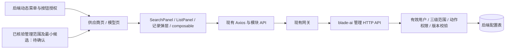
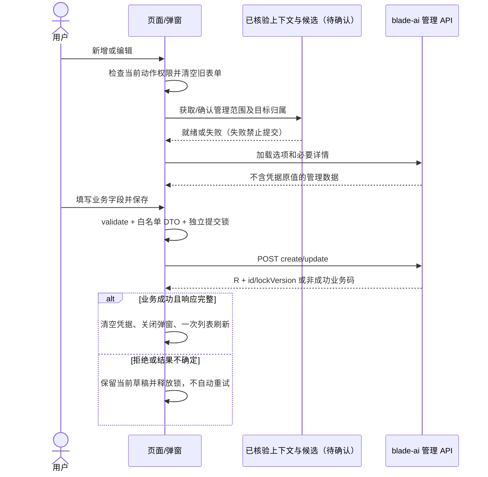

# Saber 大模型供应商与模型配置管理详细设计

## 1. 文档信息

| 项目 | 内容 |
| --- | --- |
| 功能/模块 | 资产管理 / 供应商接入与独立模型配置 |
| 设计编号 | DESIGN-REQ-2026-014 |
| 关联需求 | [REQ-2026-014](../requirements/REQ-2026-014-ai-model-configuration-frontend.md) 0.3 |
| 文档版本 / 文档状态 | 0.3 / 开发中 |
| 实施阶段 | 第一阶段，完整契约仍待评审 |
| 目标版本/迭代 | Saber 5.x / 模型配置管理首期 |
| 设计负责人 / 评审人 | Codex / 产品、前端、后端、认证、测试待指定 |
| 创建日期 / 最后更新日期 | 2026-09-30 / 2026-09-30 |
| 关联交付物 | [需求索引](../requirements-index.md)；[测试文档](../test/TEST-REQ-2026-014-ai-model-configuration-frontend.md) 0.3；Saber 数据库不涉及 |
| 后端基线 | [需求 0.9](../../../SpringBlade/doc/requirements/REQ-2026-008-ai-model-configuration.md)；[详细设计 0.4](../../../SpringBlade/doc/design/DESIGN-REQ-2026-008-ai-model-configuration.md)；[数据库设计 0.4](../../../SpringBlade/doc/database/DB-REQ-2026-008-ai-model-configuration.md) |

本设计完整目标仍保留，2026-09-30 按用户要求开始第一阶段实现。API、分页状态及两页只读能力已落地；
两个编辑弹窗、管理上下文/候选与页面写操作尚未实现。实施状态和暂行安全策略见第12节，不能把设计全部视为已完成。
第一阶段未修改菜单种子；本次按用户要求补齐后端只读菜单与查看授权种子，未修改后端接口或正式业务测试结果。
后端基线来自工作区，数据库迁移、实际授权及接口联调仍未确认。

## 2. 设计摘要与范围

### 2.1 设计摘要

采用两张独立分页管理页：供应商页维护接入账号，模型页维护独立模型行。供应商行的“模型配置”跳转到带
`providerId` 初始筛选的模型页，不再实现另一套嵌套列表。两页复用 Element Plus 和现有搜索、列表、记录弹层及请求状态能力。

前端只消费 `/blade-ai/ai/...` 管理 API，不消费 `/feign/client/...`。动作按钮来自 Saber 菜单权限，数据范围由
后端有效身份核验；二者不能相互替代。管理员归属控件依赖尚待确认的最小上下文/候选契约，不能开放内部 Feign 或
扩大系统用户列表权限来补洞。

### 2.2 关键决策

| 编号 | 决策 | 原因 / 影响 |
| --- | --- | --- |
| DEC-001 | 资产管理下两个动态菜单 | 用户已要求补齐两页只读菜单；两类实体独立授权、分别分页，管理员写交互仍待确认 |
| DEC-002 | 两种记录独立编辑，供应商行通过路由下钻模型列表 | 不存供应商完整 models JSON，不重复实现子列表 |
| DEC-003 | 状态使用标签与“启用/停用”确认操作，不乐观翻转 Switch | 无论失败或超时，都不伪造已生效状态；启停共用 edit 权限 |
| DEC-004 | 不提供批量删除或级联删除 | 当前 HTTP API 仅支持逐记录 id/lockVersion，并有供应商引用限制 |
| DEC-005 | 凭据仅存在当前供应商编辑会话与写请求正文 | 查询只读 credentialConfigured；成功、关闭或身份/目标租户切换清空 |
| DEC-006 | 字典来自单个 config/options 请求，友好名称映射未知值回退原值 | 不调用受限 dict/list，不猜测整数字典 ID，不硬编码有效候选集合 |
| DEC-007 | 请求 DTO 按动作显式构造，不展开 form 或列表实体 | 避免提交所有人、归属、审计字段及旧凭据；update 不能顺便改变 status |
| DEC-008 | 前端 ID 与 lockVersion 全程字符串 | 复用后端 Long 序列化约定，不做 Number、parseInt 或前端版本加一 |
| DEC-009 | 不新增 Pinia 业务域、持久缓存或第三方依赖 | 降低凭据泄露、跨租户缓存及过期数据风险 |
| DEC-010 | 最小扩展 usePagedList 的 failed/clear 状态与失效能力 | 第一阶段已兼容增加返回值；范围切换清空旧记录并失效旧响应。现有调用方仍需真实页面回归 |

### 2.3 改动范围

| 层级 | 完整目标 | 本次及范围外 |
| --- | --- | --- |
| 页面 | 两个 asset 页面、供应商/模型编辑弹窗和详情编排 | 本次实现查询、详情和下钻；编辑/写操作未实现；不改提示词、图片反推和主布局 |
| API/模块工具 | 明确管理 DTO/VO、请求函数、字段白名单及选项名称映射 | 本次已实现；不新建 Axios，不改全局业务错误协议 |
| 公共能力 | usePagedList 兼容增加 failed/clear；其余复用 | 本次已增加返回值；不重写分页引擎、不批量重构所有使用方 |
| 路由/权限/语言 | 后端下发菜单、完整目标8个按钮编码、2个三语route key | 已补两页及两个view按钮种子、查看Scope绑定；写按钮未开放，不手写静态路由、不授予运行读取 |
| 后端协同 | 管理范围/最小候选契约、菜单与Scope绑定 | SpringBlade只补SQL及部署文档；上下文/候选与写流程仍待评审 |
| 数据库/依赖/环境 | Saber 不涉及 | 后端建表引用原设计，不创建空 DB 文档或修改锁文件 |

## 3. 总体设计

### 3.1 架构图

### 3.2 组件职责与文件规划

| 文件/能力 | 职责 | 输入 / 输出 |
| --- | --- | --- |
| `src/views/asset/ai-provider.vue` | 供应商查询、分页、详情、行操作、到模型页跳转 | ProviderQuery / 当前记录 ID |
| `src/views/asset/ai-model.vue` | 模型查询、分页、详情、供应商选择、行操作 | ModelQuery / 当前记录 ID |
| `src/views/asset/components/ai-provider-editor-dialog.vue` | 接入及归属录入、凭据只写、表单校验 | mode/id / saved 事件，不回传凭据 |
| `src/views/asset/components/ai-model-editor-dialog.vue` | 单模型参数录入、有效供应商及选项校验 | mode/id/初始 providerId / saved 事件 |
| `src/views/asset/aiModelConfig.ts` | 已实现选项映射、查询白名单、响应校验及安全字段投影；表单参数校验后续实现 | 明确模型类型，不存储会话或凭据 |
| `src/api/ai/modelConfig.ts` | 已实现管理 DTO/VO、13个请求函数及逐动作请求字段白名单 | BladeResponse、PageResult 及模块契约 |
| `usePagedList`、`useRemoteDetail`、`useRemoteOptions` | 分页/版本失效、详情与候选竞态隔离 | 不在页面重复实现通用请求序号 |
| BasicContainer、SearchPanel、ListPanel、ListPagination、FormDialog、DetailDrawer、RowActions | 现有紧凑页面和记录交互 | 直接复用，业务字段留在模块 |

详情优先在页面内组合 DetailDrawer，不为每种记录再包一层只透传属性的基础组件。推理档位使用 Element Plus 的
键值行编辑，尚无多个真实使用方时不抽成公共组件。业务 Vue 使用 script setup lang=ts，实体/表单保持局部类型；
API 的传输契约按模块定义，不建设跨模块巨型实体。

### 3.3 新增依赖

不涉及。现有 Vue、Element Plus、Axios 及 TypeScript 已覆盖本需求；不引入 Avue、第二套 UI、JSON 编辑器或新表单引擎。

## 4. 核心流程设计

### 4.1 技术流程图

### 4.2 异常与边界流程

| 场景/码 | 页面处理 | 恢复及边界 |
| --- | --- | --- |
| 401 / 无动作权限 | 走现有会话处理；关闭记录上下文，不发无权限写请求 | 重新登录/更新授权，不覆写全局拦截器 |
| 48401 NOT_FOUND | 清空目标详情，禁止用旧详情保存 | 返回列表或手工刷新；不泄露其他归属 |
| 48402 OWNER_INVALID、48403 PROVIDER_UNAVAILABLE | 标记归属/供应商不再可用，保存不可继续 | 重新加载并确认有效候选；不自动改选 |
| 48404 DUPLICATE_CODE | 保留编码与输入，普通错误由 Axios 提示 | 新增修改编码后人工重试；删除记录仍占编码 |
| 48405 HAS_MODELS | 删除失败保留记录 | 指引有模型查看权限者处理模型；不级联、不伪造计数 |
| 48406 CONFLICT | 标记当前草稿过期，禁止直接再次提交旧版本 | “重新加载”先确认放弃输入；不递增版本或静默覆盖 |
| 48407 OPTION_INVALID | 重新核验选项与参数，保留用户输入 | 当前 DTO 必须使用有效值；不默认跳到第一个选项 |
| 48409 SERVICE_UNAVAILABLE | 释放锁并保留失败提示；上下文失败则清空数据 | 局部重试，不能回退旧 Token/角色扩大范围 |
| 超时/网络失败/成功响应结构缺失 | 不关闭为成功，不自动补发写请求 | 先核验记录；请求可能已生效，不宣称前端自动回滚 |
| 48408 CONFIG_UNAVAILABLE | 不设计运行读取分支或调用该内部接口 | 若管理接口出现此码按统一失败处理，记录契约差异 |

### 4.3 事务、并发与幂等

前端不承诺事务回滚。每次写入由后端独立事务与版本控制；前端有表单 submitting 和行操作 actionId/actionType 锁。
执行锁在 finally 释放，成功仅触发一次服务端重查。写请求没有自动重试或前端幂等键。

更新用新加载详情的 lockVersion；启停/删除用当前已成功加载行的 lockVersion，冲突后人工刷新。确认操作前固定
记录 ID、版本与资源 tenantId，不能因列表刷新而误操作另一条记录。新 id/lockVersion 必须完整，删除响应须 data=true。

## 5. 后端设计与对接边界

### 5.1 路由、模型与服务

本期后端实现由 SpringBlade REQ-2026-008 负责。已核对 AiProviderController、AiModelController、管理 DTO/VO、
AiConfigAccessService 及升级 SQL。两表、唯一键、关联锁、字典、内部运行读取和存储保护不在前端仓库重写。

### 5.2 认证与数据归属

后端通过内部 managementScope 核对有效用户及角色；不是仅靠登录 Token。平台/租户管理员不能共用一个客户端
isAdmin 布尔值推导范围；现有 userInfo.authority.includes('admin') 只适用于原有专项入口，不解决本需求三级区分。
前端上下文失败应阻止数据和操作初始化，后端用户范围服务失败同样拒绝管理读写。

### 5.3 查询、删除与错误

供应商和模型分别有列表、详情、create、update、status、remove。没有 submit、批量 ids、模型名称筛选或
模型自动选项接口。使用服务端 records/total，不全量抓取伪造分页。未知 business code 不当作成功。

## 6. API 契约

### 6.1 已存在管理接口清单

后端设计中的服务内 `/ai/...` 经网关的前端调用路径为 `/blade-ai/ai/...`；现有 Axios 按环境追加 /api 等基地址。
所有 GET 使用 params，POST 使用 data；不手工重复添加环境前缀。响应为 BladeResponse<T>；Axios 已拒绝非 200 业务码。

| 前端函数 | 方法与网关路径 | 参数/返回 data | 后端 API Scope |
| --- | --- | --- | --- |
| getConfigOptions | GET /blade-ai/ai/config/options | 无 / AiConfigOptions | 已登录 |
| getProviderList | GET /blade-ai/ai/provider/list | current,size,tenantId?,ownerUserId?,code?,name?,status? / PageResult<ProviderListItem> | ai:model:provider:view |
| getProviderDetail | GET /blade-ai/ai/provider/detail | id / ProviderDetail | 同上 |
| addProvider | POST /blade-ai/ai/provider/create | ProviderCreatePayload / ConfigMutation | ai:model:provider:create |
| updateProvider | POST /blade-ai/ai/provider/update | ProviderUpdatePayload / ConfigMutation | ai:model:provider:edit |
| setProviderStatus | POST /blade-ai/ai/provider/status | ConfigStatusPayload / ConfigMutation | 同上 |
| removeProvider | POST /blade-ai/ai/provider/remove | ConfigRemovePayload / boolean | ai:model:provider:delete |
| getModelList | GET /blade-ai/ai/model/list | current,size,providerId?,tenantId?,ownerUserId?,code?,status? / PageResult<ModelListItem> | ai:model:config:view |
| getModelDetail | GET /blade-ai/ai/model/detail | id / ModelDetail | 同上 |
| addModel | POST /blade-ai/ai/model/create | ModelCreatePayload / ConfigMutation | ai:model:config:create |
| updateModel | POST /blade-ai/ai/model/update | ModelUpdatePayload / ConfigMutation | ai:model:config:edit |
| setModelStatus | POST /blade-ai/ai/model/status | ConfigStatusPayload / ConfigMutation | 同上 |
| removeModel | POST /blade-ai/ai/model/remove | ConfigRemovePayload / boolean | ai:model:config:delete |

### 6.2 类型与写入白名单

| 模型 | 字段与类型 |
| --- | --- |
| ProviderListItem | id、providerCode、providerName、presetDictId（可空）、baseUrl、tenantId、ownerUserId、status:0或1、credentialConfigured:boolean、lockVersion、updateTime |
| ProviderDetail | 列表字段，加 createUser/createTime/updateUser；绝不声明 apiKeyValue 查询字段 |
| ModelListItem | id、providerId、modelCode、modelName、upstreamModelId、apiProtocol、capabilityType、tenantId、ownerUserId、status、lockVersion、updateTime；无 providerName、modelCount 或动作布尔值 |
| ModelDetail | 列表字段，加 contextWindow:number或null、inputTypes:string[]、reasoningEfforts:字符串映射或null、createUser/createTime/updateUser |
| AiConfigOptions | providerPresets:{id:string,value:string}[]；apiProtocols:{value:string}[]；capabilityTypes:{value:string}[] |
| ConfigMutation | id:string、lockVersion:string |

全部 ID（含 ownerUserId、presetDictId、createUser/updateUser）和 lockVersion 为字符串；status 和 contextWindow
为数值，credentialConfigured 是布尔值。协议及能力不建仅包含首期值的封闭 union，动态字典扩展后仍能显示稳定值。
inputTypes/reasoningEfforts 已是数组/对象，不能再把 API 详情当存储层 JSON 字符串解析。

| 动作 | 允许提交字段 | 省略/清空规则 |
| --- | --- | --- |
| 供应商创建 | providerCode/providerName/baseUrl/presetDictId?/apiKeyValue?/ownerUserId?/tenantId?/status=0 | 本人不提交他人归属；平台代建 tenantId、ownerUserId 必填；无新凭据则省略 |
| 供应商更新 | id/lockVersion/providerName/baseUrl/presetDictId/apiKeyValue?/tenantId? | 自定义或清除预设传 presetDictId=null；无新凭据省略 apiKeyValue；不提交 code、owner、status |
| 模型创建 | providerId/modelCode/modelName/upstreamModelId/apiProtocol/capabilityType/contextWindow?/inputTypes/reasoningEfforts?/tenantId?/status=0 | 归属从供应商继承，不能提交 ownerUserId |
| 模型更新 | id/lockVersion/modelName/upstreamModelId/apiProtocol/capabilityType/contextWindow/inputTypes/reasoningEfforts/tenantId? | 清空 contextWindow/reasoningEfforts 显式传 null；不提交 code、providerId、owner、status |
| 启停 | id/lockVersion/status/tenantId? | 目标 status 数值；其他字段禁止展开 |
| 删除 | id/lockVersion/tenantId? | 单记录正文，不能拼 ids、DELETE 或 query 写入 |

所有平台超级管理员写入均传目标资源 tenantId：创建来自已核验归属，更新/启停/删除来自目标管理详情或列表行。
其他身份可省略 tenantId 或提交已核验当前租户，不用硬编码平台编号。凭据不 trim 改写；全空白新输入前端拒绝。

### 6.3 列表与关联供应商

- searchForm 与已执行 query 分离，只有查询按钮调用 search；重置调用 reset；刷新调用 refresh；分页仅调用对应 composable 方法。
- status=0 必须保留，不能用真假值判空。白名单以第 6.1 节为准；模型协议/能力仅展示，不增加假筛选。
- 超管可不传 tenantId 查全局，租户管理员只能本租户，普通用户不传自选 owner/tenant。列表列按实际返回 ID 展示归属，不伪造用户名。
- 模型创建的供应商候选复用 provider/list 的分页搜索，按目标租户和所有人限定，显示名称、编码和归属。不能只抓第一页当全部；停用/无凭据项不因运行限制而隐藏。
- 新选中 providerId 后加载 provider/detail，确认归属并填只读信息。编辑 providerId 不可变；仅有模型查看权限时仍可用模型自身字段查看，不强制为了只读展示去取无权供应商详情。
- 供应商下钻仅将 providerId 放入路由查询；模型页在首个列表请求前校验该参数并载入供应商详情，详情中的归属才是当前上下文。无效、不可见参数不展示缓存记录。
- 创建/选择供应商需要 provider:view；没有该权限但有 model:create 时不给出伪候选，说明需补足查看授权。部署时明确这一权限依赖。

### 6.4 管理范围与最小候选：待后端确认的协同提案

以下不是当前已存在接口，不纳入已存在的 13 个接口清单。推荐后端评审专用 HTTP 契约；若选择复用现有接口，
必须先证实其身份核验、字段最小化、分页和跨租户边界等效，再更新双方文档，不能直接写前端调用。

| 建议网关路径（未实现） | 请求/建议 data | 边界 |
| --- | --- | --- |
| GET /blade-ai/ai/config/context | 无 / userId:string、tenantId:string、scope:SELF或TENANT或PLATFORM | 按当前有效身份实时核验，失败拒绝；无凭据、不接受客户端 scope |
| GET /blade-ai/ai/config/tenants | current,size,name? / 分页 tenantId、tenantName | 仅平台管理员的最小有效租户候选；无跨租户授权不得调用 |
| GET /blade-ai/ai/config/owners | tenantId,current,size,name? / 分页 ownerUserId、displayName、tenantId | 只返回允许管理范围内有效用户；平台必须明确 tenantId；不返回用户管理详情 |

普通用户不调用 tenants/owners，以 context 的本人信息和服务端归属赋值为准。字典 options 保持现有三组结构，
不为上下文扩展而改变它“仅登录、读取全局选项”的现有依赖语义。
上下文初始化失败不降级为平台/租户管理员；关闭本页写入口并清空旧记录。候选失败只禁用依赖其数据的代建/选择动作。
建议接口具体权限与分页 VO 需后端确认，不临时授予 user:list 或直接暴露 managementScope/ownerScope Feign。

## 7. 前端设计

### 7.1 页面、表单与组件

页面外层使用 basic-container，内部组合 SearchPanel、ListPanel、ElTable、ListPagination；表格 row-key=id，
不显示 selection 列。行操作由 RowActions 按实际授权折叠，详情为 DetailDrawer，编辑为 FormDialog。

| 区域 | 主要内容 |
| --- | --- |
| 供应商列表 | 名称、管理编码、预设/自定义、接入地址、租户/所有人、凭据已配置标记、启停状态、更新时间、行操作 |
| 模型列表 | 名称、编码、providerId及可获名称、上游模型、协议、主要能力、归属、启停状态、更新时间、行操作 |
| 供应商表单 | 目标归属（管理员新增）、预设/自定义、编码、名称、地址、可选新凭据；状态只读初始说明或独立行操作 |
| 模型表单 | 供应商与只读归属、编码、名称、上游标识、协议、主要能力、输入模态、可选窗口与推理档位 |
| 详情 | 业务配置、实际归属、创建/更新记录；供应商仅凭据标记，模型展示结构化参数 |

| 字段 | 前端校验/交互 | 后端基线 |
| --- | --- | --- |
| providerCode/modelCode | trim、必填、最大64；创建后只读，不自动 lowercase | NotBlank/Size，归属内唯一且删除后不复用 |
| providerName/modelName | trim、必填、最大100 | NotBlank/Size |
| baseUrl | 必填、最大1024；URL 解析为 http或https，拒绝内嵌 username/password | 合法根地址；本期不请求该地址 |
| upstreamModelId | trim、必填、最大128 | NotBlank/Size |
| presetDictId | 有效预设 ID 或 null；选择预设辅助名称但不覆盖已手填名称 | 有效字典 ID；用户名称快照 |
| apiProtocol/capabilityType | 已加载有效稳定值，最大32/16 | 有效字典校验 |
| contextWindow | 可空；填写为1~2147483647的整数 | Java Integer、数据库 INT，正数 |
| inputTypes | 同能力字典的非空去重多选；不强制等于主要能力 | List<String>，有效输入值 |
| reasoningEfforts | 动态键值行，key/value非空字符串、key不能重复；完全清空提交 null | Map<String,String> 或 null |
| apiKeyValue | 可选密码输入，新输入全空白拒绝；不填掩码，不设“清除已有凭据” | 留空不提交/或null保留，非空替换 |

供应商预设不提供地址或协议默认值，不能猜测接入 URL。首期名称映射：openai-completions → OpenAI Chat
Completions、openai-responses → OpenAI Responses、anthropic-messages → Anthropic Messages；text/image/video
→ 文本/图像/视频。未知值回退稳定原值；预设标签直接使用服务端 value。
旧值失效时只读标记“已失效”，不能默默选中新值；更新 DTO 会重新校验相关字段，保存前更换有效值或显式清空可选预设。

### 7.2 状态、缓存与请求

| 状态 | 管理方式 | 清理/失效 |
| --- | --- | --- |
| 已核验管理上下文 | 页面内 useRemoteDetail；等待协同契约确认 | 重新登录、身份或租户变化；失败清空 |
| 两页 data/query/page/loading | 各自 usePagedList | 身份/租户上下文变化调用 clear 后重新初始化，不把旧记录当新范围 |
| 单记录 detail/mode/form | useRemoteDetail + 局部 ref | 每次打开、关闭、切记录均 clear/reset，模式与校验重置 |
| 配置选项聚合对象 | 一个 useRemoteDetail 维护 options API 对象并映射三组 | 每次新的编辑会话核验；失败清空；不拆成三次请求 |
| 列表型候选 | useRemoteOptions 维护当前分页候选；记录分页元信息 | 租户/所有人变化清空，旧响应不回填，加载下一页为明确动作 |
| 提交及行操作 | 独立 submitting/actionId，操作前再次检查权限 | finally恢复；请求中禁止改变操作上下文 |
| 新凭据输入 | 仅当前弹窗 ref，不放 Store 或持久缓存 | 保存成功、关闭、身份/目标租户变化均清空 |

第一阶段对现有 usePagedList 只增加公开 failed 与 clear：clear 递增其内部请求序号、清空 records/total/query/页码、
恢复 loading/failed；load 开始复位失败、仅当前请求失败时标记。现有 load/search/reset/refresh 等行为保持兼容。
当前代码已具备这两项状态，类型与production构建检查已通过；真实使用方业务回归仍待执行。

列表普通失败保留同一查询的上次结果并说明未刷新；身份/上下文变化必须 clear，使旧响应失效。
单删时当前页仅一条且页码大于1，先回退一页再一次重查；总数仍以服务端 total 为准，不先请求已知空页再机械二次刷新。
若其他会话同时删除导致页数进一步减少，再按最新服务端响应做必要页码纠偏，不伪造总数或宣称只有本次删除影响数据。
详情/字典/候选清理用已有 clear；管理目标租户变化先清所有人、供应商上下文和输入，再请求新候选，不双向 watch 自动提交。

### 7.3 交互状态、权限与语言

| 场景 | 展示/操作 | 恢复 |
| --- | --- | --- |
| 只读 | 不加载凭据；无保存或启停入口 | 更新权限后重新进入 |
| 新增 | 全新 form、默认停用、无前次选择 | 表单合法且必要依赖就绪后保存 |
| 编辑 | 最新详情；不可变字段只读 | 失败保留当前输入，不自动覆盖 |
| 冲突 | 明确过期与“重新加载”操作 | 确认放弃草稿后重载 |
| 危险操作 | 确认目标名称与归属；停用供应商说明所有关联模型运行读取受影响 | 取消不发请求；确认只单条请求 |
| 删除模型 | 说明已有任务关联 ID 可能失效，不宣称自动迁移或回滚 | 用户明确确认 |

按钮用 useCrudPermission('ai_provider') / useCrudPermission('ai_model')。入口可见性、行操作和处理函数均核对；
页面 view 是查询/编辑依赖，部署时 edit/delete 不应只授予按钮而缺少 view API。供应商“模型配置”入口还需模型 view。

| 前端按钮 | 后端 Scope | 说明 |
| --- | --- | --- |
| ai_provider_view/add/edit/delete | ai:model:provider:view/create/edit/delete | add 对应 create；启停对应 edit |
| ai_model_view/add/edit/delete | ai:model:config:view/create/edit/delete | 同上；创建供应商选择依赖 provider:view |

菜单 path 为 /asset/ai-provider、/asset/ai-model，组件分别映射 views/asset/ai-provider.vue、
views/asset/ai-model.vue。由现有 dynamic-router.ts 装配，不改后端组件路径契约或主布局。

| i18n key（拟） | 中文 | 英文 | 日文 |
| --- | --- | --- | --- |
| route.ai_provider | 供应商配置 | Provider Configuration | プロバイダー設定 |
| route.ai_model | 模型配置 | Model Configuration | モデル設定 |

同步 zh.ts/en.ts/ja.ts，并确认菜单 code 与 route key 一致。控件布局沿用共享 theme/tokens，不硬编码主题色。
1440px 正常扫描，1024px 搜索换行，375px 单列搜索及表格横向滚动；弹层正文独立滚动，header/footer 和主要操作可达。
保留键盘焦点顺序、Esc 关闭（提交中按现有锁策略处理）、确认焦点及错误提示关联，不新增大范围 deep 或第三方内部 DOM 补丁。

## 8. 数据库、配置与发布影响

| 影响项 | 是否涉及 | 说明 |
| --- | --- | --- |
| Saber 数据库、历史数据迁移 | 否 | 不涉及，不创建空 DB 文档 |
| 后端两表、字典、租户表登记 | 后端依赖 | 引用后端 DB-REQ-2026-008；目标环境迁移尚待确认 |
| 菜单、按钮、Scope绑定、角色授权 | 是 | 已补只读菜单增量及全量种子：两查看Scope绑定页面，种子超管仅新增查看授权；写Scope与内部运行Scope不绑定本阶段页面 |
| 环境变量、Token、构建依赖 | 否 | 沿用现有网关代理和鉴权；不提交本机地址/密钥 |

## 9. 安全、测试与可观测性

### 9.1 认证与安全要求

- 不在 URL、Pinia、localStorage/sessionStorage、浏览器历史、Console、遥测或测试证据中保存新凭据。
- 不提供已有凭据复制、显示、清除或内部运行读取操作；不直连供应商地址，不把“启用”说成“运行可用”。
- 对越权和不存在一律按后端非可见结果恢复，不披露其他租户详情；前端范围控制不能替代后端权限。
- 新增凭据输入仅在当前弹窗内短暂保留，普通写失败可继续编辑；关闭或改变归属必须清除。
- 候选请求不得返回密码、Token、完整用户管理对象或其他无关字段；具体协同方案待确认。

### 9.2 测试矩阵与工程检查

正式用例见[测试文档](../test/TEST-REQ-2026-014-ai-model-configuration-frontend.md)，22 项均未执行。

| 层级 | 检查/验收 | 状态 |
| --- | --- | --- |
| 本次文档自检 | 相对链接、编号唯一、20项前端AC映射、22用例汇总、规划与实现状态一致 | 交付前执行，实际结果由交付说明记录 |
| 类型检查 | 修改 ts/vue 后执行 pnpm run type-check | 第一阶段通过；不是业务验收 |
| 生产构建 | 共享 composable 扩展后执行 pnpm run build:prod | 第一阶段通过；不提交 dist；非阻断构建警告见第12节 |
| 静态扫描 | 目标模块无 Avue/Ant Design/旧 option 或 CRUD mixin；检查活动引用 | 第一阶段通过；无新增运行时框架、存储、日志或内部 Feign 调用 |
| 人工业务验收 | 三种身份、两套授权、归属、凭据、状态、并发、异常、主题和三个视口 | 待执行，由目标环境验证 |

真实业务回归包括参数/岗位等 usePagedList 调用方，以及提示词、标签、用户、角色、已有图片反推。规划阶段不启动服务、
不操作浏览器、不分派测试代理，不根据静态检查标记业务用例通过。

### 9.3 日志、指标与性能

不新增审计产品、日志接口、指标系统或性能 SLA。现有 Console/Network 用于人工核验，只归档去除敏感信息后的
路径、业务码、ID、版本和结果。禁止导出含认证头或凭据写入正文的 HAR。按后端分页请求，候选不全量拉取，普通错误由 Axios
统一显示；页面仅增加必要恢复操作，不重复弹相同错误。

## 10. 发布与回滚

### 10.1 迁移与发布

1. 确认前后端待评审状态、两个菜单结构、管理上下文/候选契约；记录已冻结文档版本和实际提交。
2. 后端完成配置表/字典升级、租户表登记、管理 API、已核验上下文与候选联调；前端不代执行生产迁移。
3. 补齐菜单及8按钮种子，将8管理 API Scope 关联各自菜单，按真实角色显式授权；内部运行权限不授予浏览器。
4. 实现页面/API及最小公共状态扩展；执行类型、构建、静态扫描和受影响范围检查后发布 Saber。
5. 在目标环境人工执行用例，必要回归全部通过前保持未验收。缺少归属核验或授权绑定时不对目标账号开放相关入口。

### 10.2 回滚与恢复

出现范围泄露、凭据回显、越权写或严重阻断时关闭新增菜单/授权并回退前端版本，必要时由后端处置接口。
前端回滚不删除已经写入的后端配置，不恢复被删除的逻辑记录、不释放已占用编码；数据与凭据处置由后端管理员按原需求执行。
最小 usePagedList 扩展若回退，应连同依赖新增 clear/failed 的新页面一起回退，不能只回退公共返回值留下新调用方。

## 11. 风险、评审与变更

### 11.1 风险、开放问题与实施顺序

| 编号 | 优先级 | 内容 | 负责人 | 状态/结论 |
| --- | --- | --- | --- | --- |
| ITEM-001 | P0 | 已核验管理上下文、最小租户/用户候选契约缺失 | 后端/认证/前端待指定 | 未关闭；6.4仅推荐提案，不是当前接口 |
| ITEM-002 | P0 | 两页与两查看按钮、查看Scope页面绑定及种子超管授权脚本已补齐；写权限尚未开放 | 后端/部署待指定 | 实际迁移、顶部菜单和授权树/角色生效待验证，不临时全员授权 |
| ITEM-003 | P0 | 后端正文待评审、索引开发中；工作区未全部提交且未迁移 | 产品/后端待指定 | 冻结基线前不能把实现当已验收 |
| ITEM-004 | P1 | 模型创建依赖供应商查看，独立菜单权限需明确最小授权组合 | 产品/认证待指定 | 待评审；模型纯查看不强制供应商详情 |
| ITEM-005 | P1 | 最小 usePagedList 扩展影响既有分页调用方 | 前端/测试待指定 | 兼容增加返回值，工程检查和真实页面回归必需 |

实施按依赖而不是未经估算的工期划分：

| 阶段 | 交付内容 | 进入/退出条件 |
| --- | --- | --- |
| P0 契约评审 | 关闭上述上下文、候选、菜单授权与基线问题 | 产品/前后端评审确认，不提交假接口实现 |
| P1 API与状态基础 | 管理类型、白名单、选项映射、分页clear/failed最小扩展 | 类型门禁通过，兼容性检查完成 |
| P2 供应商页面 | 归属、预设/自定义、凭据、详情及单条操作 | 主流程及拒绝状态具备联调条件 |
| P3 模型页面 | 有效供应商、结构化参数、独立写入、下钻 | 不修改其他模型，参数和版本正确 |
| P4 联调与验收 | 两套权限、三级范围、错误、主题及回归归档 | 用例实际执行并关闭阻断问题后才标已验收 |

### 11.2 评审结论

| 领域 | 结论 | 评审人 | 日期 | 备注 |
| --- | --- | --- | --- | --- |
| 产品/前端 | 待评审 | 待指定 | 待评审 | 确认信息架构与最小公共扩展 |
| 后端/API/认证 | 待评审 | 待指定 | 待评审 | 关闭 ITEM-001~004 |
| 数据库/发布 | 待评审 | 待指定 | 待评审 | Saber数据库不涉及，核对后端升级及授权 |
| 测试 | 待评审 | 待指定 | 待评审 | 22项待执行，不代表业务通过 |

### 11.3 变更记录

| 日期 | 版本 | 变更内容 | 原因 | 影响 | 修改人 |
| --- | --- | --- | --- | --- | --- |
| 2026-09-30 | 0.1 | 根据后端需求0.8、设计0.3及工作区实现形成两页管理、API契约、权限、异常、实施和回滚方案 | 用户要求规划前端需求与设计 | 独立前端设计、协同缺口及待执行验收 | Codex |
| 2026-09-30 | 0.2 | 落地API/分页基础及两页只读查询、详情、下钻与菜单名称；记录暂行失败关闭策略、工程检查和未实现写流程 | 用户要求按最新设计开始实现 | 第一阶段实现与原完整目标分开记录；契约缺口仍开放，业务验收未执行 | Codex |
| 2026-09-30 | 0.3 | 补齐SpringBlade全量与增量只读菜单种子、查看Scope页面绑定、种子超管授权及部署指引 | 用户要求补齐不可见菜单 | SQL与文档交付，未执行迁移或业务验收，写流程仍未开放 | Codex |

## 12. 第一阶段实施记录（2026-09-30）

### 12.1 完成范围与未完成项

| 范围 | 实际完成 | 边界 |
| --- | --- | --- |
| 管理API | 第6.1节13个请求函数、模块DTO/VO和逐动作字段白名单 | 只读页面使用GET；8个写函数仅为后续基础，页面没有写入口或提交处理器 |
| 供应商页面 | 名称/编码/状态筛选、查询/重置/刷新/分页、详情、凭据标记及模型下钻 | 无租户/所有人范围选择，无新增/编辑/启停/删除，不读取凭据原值 |
| 模型页面 | 编码/状态筛选、分页、独立详情、输入模态/推理档位展示及供应商筛选 | 无模型表单/供应商候选选择；纯模型查看不请求供应商详情；下钻必须先核验供应商详情 |
| 字典/响应 | 单个options请求、友好名称/原值回退、失效标记、字符串Long/版本校验、响应白名单投影 | 选项失败不把原值判为失效；不解析存储层JSON、不保留意外凭据字段 |
| 会话/竞态 | 身份、登录Token、角色或查看权限变化立即清理；停用缓存页面及卸载时清理；路由筛选变化失效旧请求 | 使用既有useRemoteDetail及新增usePagedList.clear，不在页面新增请求序号或业务Store |
| 动态页面/语言 | 两个组件按规划路径创建，zh/en/ja增加route.ai_provider/ai_model | 初次交付未补菜单；现已补只读种子与种子超管查看授权，实际部署待执行；没有临时静态路由 |

根据用户“开始实现”的要求，先推进P1及P2/P3的只读部分，不把P0待确认项伪装成已关闭。
写入流程、管理员代建、上下文/候选加载、表单校验、提交/行操作锁、冲突重载及删除后翻页均待后续实现。
这不是完整CRUD交付，也不是已具备全部验收条件的发布版本。Saber数据库不涉及；初次实现未修改SpringBlade，
本次仅补齐其只读菜单SQL与关联文档，不修改业务接口和配置数据。

### 12.2 暂行安全策略与设计差异

1. 第6.4节仍是未确认提案。没有发送context/tenants/owners请求，也没有通过user/list或内部Feign绕过缺口。
   当前只读请求依赖后端每次管理GET的有效身份核验；客户端只检查登录及view按钮权限，不推导SELF/TENANT/PLATFORM。
2. 未开放任何页面写入口。未完成的编辑弹窗不以假接口、模拟候选或推断管理员身份的方式替代。
3. 在独立上下文契约缺失的阶段，新两页对所有列表失败采用**失败关闭**：清空记录、总数和已打开详情，保留已执行查询用于人工重试。
   此策略暂时比第7.2节普通网络失败保留同查询旧结果更严格，以免把管理范围核验失败展示为旧范围仍有效。
   共享usePagedList仍保留原有失败保留结果行为，只兼容增加failed/clear，不改变其他调用方策略。
4. 新查询/重置先清空旧列表，再单次请求；刷新保留最后执行查询。分页由统一change事件调用changePage或changeSize，
   不同时绑定双向分页更新产生重复请求。无效、不可见或缺少provider:view的下钻不回退成无筛选全量模型。

### 12.3 工程检查与人工验收边界

| 检查 | 结果 | 说明 |
| --- | --- | --- |
| pnpm run type-check | 通过 | vue-tsc及Node侧tsc，不代表后端契约联调通过 |
| pnpm run build:prod | 通过 | 初次受沙箱dist目录权限限制；确认目录位于工作区后重试通过，不提交产物 |
| Prettier目标文件检查 | 通过 | 通过本地Prettier CLI仅格式化本次修改代码；未格式化范围外文件 |
| 活动Avue扫描及目标模块安全扫描 | 通过 | 无Avue/第二套UI、旧option/mixin、显式any/unknown、存储、调试日志或内部Feign请求 |
| 工程内存断言 | 9组通过 | 使用现有TypeScript/Vue、Vue编译器和模拟传输；检查ID边界、查询/请求白名单、响应投影、写成功判定、分页clear、最新响应/失败隔离及两页查询/权限撤销/下钻竞态/缓存路由生命周期；无真实网络或业务写入，无新增测试基础设施 |
| 浏览器与正式业务用例 | 未执行 | 未启动服务、未操作浏览器，22项正式用例保持未执行 |

构建存在VueUse注解、既有动态/静态混合导入与大包体积的非阻断警告；本次不修改范围外构建策略。
受影响的既有分页页面包括参数、岗位、用户、租户、标签、客户端、顶级菜单、通知、权限范围、API范围、数据源、
代码生成、报表、监控日志及提示词。人工回归还包括角色与既有图片反推入口。

待用户在已部署后端环境核验：查看权限与API Scope、三种有效身份范围、status=0查询、刷新/分页请求次数、
下钻核验先后与拒绝分支、详情失败重试、身份/租户及缓存页面清理、Console/Network无敏感值；
同时检查浅色/深色/自定义主色及1440px、1024px、375px、键盘关闭和详情滚动。
菜单/Scope未准备或完整归属契约未确认时，不把未实现写流程列为已完成，不更新正式用例通过结果。

## 13. 只读菜单与查看授权补齐（2026-09-30）

用户反馈菜单未显示并要求补齐，本次在SpringBlade中新增
[菜单增量脚本](../../../SpringBlade/doc/sql/blade/blade.mysql.upgrade.5.0.1.ai-model-menu-permission.sql)，
并同步[全量初始化种子](../../../SpringBlade/doc/sql/blade/blade.mysql.all.create.sql)。
不是新增前端静态路由，也不执行实际数据库变更。

- 两个页面菜单为`ai_provider`、`ai_model`，父级复用`asset`；只增加`ai_provider_view`、`ai_model_view`两个按钮。
- 两查看Scope的`menu_id`必须绑定`category=1`页面，不能绑定`category=2`按钮，以匹配现有接口授权树。
- 默认只给唯一有效的`000000/administrator`种子角色增加五项菜单与两项查看API授权；普通用户/租户管理员仍需显式授权。
- 复用同编码有效记录的实际ID；冲突、已删除/停用资源或管理员不唯一时`ready=0`，所有持久表写入被跳过。
- 单个启用平台顶部菜单补三项关联；多个分组不猜测目标，管理员显式勾选并保留原配置。
- 不创建写按钮、不授予写API或内部运行权限；不修改接口、两业务表、凭据及范围契约。

具体备份、单连接串行执行、结果核验、系统权限缓存、角色全量授权风险及精确回滚见
[部署说明](../../../SpringBlade/doc/guide/ai-model-menu-permission-deployment.md)。
当前交付为SQL与文档：数据库迁移、真实角色授权、缓存生效、菜单下发及接口/浏览器联调均未执行。
前端22项、后端14项正式业务用例仍未执行。仅SQL和Markdown变更，不重跑TypeScript或Maven构建。

本次已执行工程检查（2026-09-30）：

- PowerShell here-string传入`python -`的只读静态检查共8组通过：全量/增量菜单ID和路径一致、
  两查看Scope页面绑定、种子超管授权ID一致、7条持久表DML均受ready保护、插入存在性和冲突条件、
  不新增写/运行授权、SQL分号/括号结构、文档版本/链接/用例数量核对。不是MySQL引擎执行或完整SQL语法验证。
- 核对70条本地文档链接可达，两个索引仍为开发中；22项前端及14项后端正式结果仍为未执行，验收标准引用完整。
- 两个仓库目标文件的`git diff --check`通过；仅有既有LF/CRLF转换提示，不修改无关文件的换行格式。
- 没有执行SQL、连接数据库、启动服务或浏览器，没有将上述工程检查计为正式业务通过。
