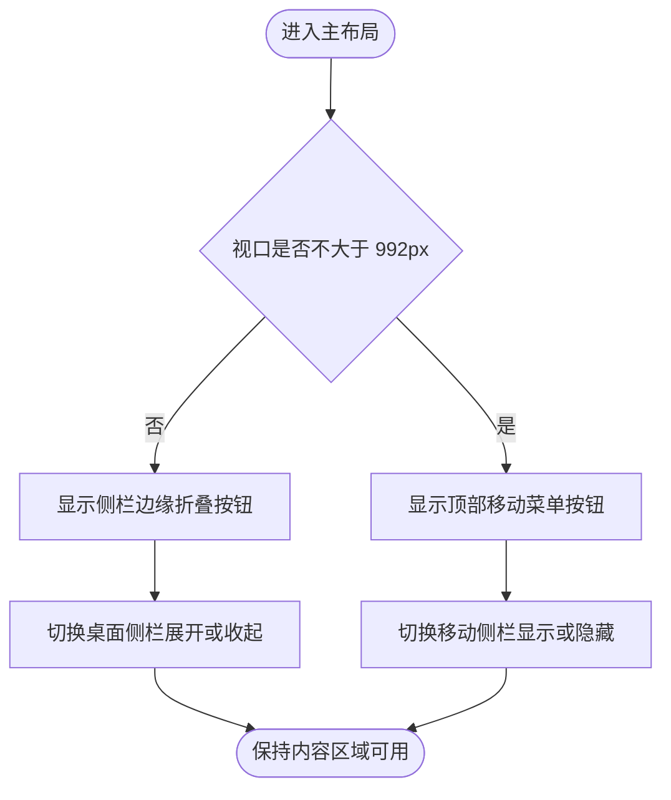

# 主导航折叠交互与导航背景统一需求文档

## 1. 文档信息

| 项目 | 内容 |
| --- | --- |
| 需求名称 | 主导航折叠交互与导航背景统一 |
| 需求编号 | REQ-2026-007 |
| 文档版本 | 0.2 |
| 所属模块 | 前端主布局、侧栏、顶部栏、响应式导航 |
| 目标版本/迭代 | Saber 5.x / 主布局体验优化 |
| 文档状态 | 开发中 |
| 产品负责人 | 待指定 |
| 技术负责人 | 待指定 |
| 创建日期 | 2026-09-04 |
| 最后更新日期 | 2026-09-04 |
| 关联事项 | [需求索引](../requirements-index.md)；[详细设计 0.2](../design/DESIGN-REQ-2026-007-sidebar-collapse-navigation-theme.md)；[测试文档 0.1](../test/TEST-REQ-2026-007-sidebar-collapse-navigation-theme.md)；数据库设计不涉及 |

## 2. 摘要与目标

### 2.1 摘要

当前桌面端菜单折叠入口位于顶部栏，与侧栏的空间关系不够直接；侧栏与顶部栏使用不同背景
Token，视觉上存在分区差异。同时，移动端侧栏样式与菜单折叠判断分别使用 992px 和 768px，且共用
同一个折叠状态，窗口跨断点变化时可能产生状态反转。本需求参考 Ant Design Pro 的交互组织，使用
Saber、Element Plus 和现有主题 Token 独立实现。

### 2.2 需求目标

1. 桌面端将折叠入口调整为贴合侧栏右边界的圆形箭头按钮。
2. 左侧导航背景与顶部导航背景保持一致，并兼容浅色、深色和动态主色。
3. 桌面折叠状态与移动端侧栏开关状态相互隔离，统一响应式断点。
4. 保持侧边、顶部、混合布局以及隐藏菜单页面的可用性。

### 2.3 非目标

- 不引入 Ant Design Vue、Ant Design Icons 或其运行时样式。
- 不修改动态菜单、权限、租户、路由和后端接口契约。
- 不重构主布局全部 Options API 组件。

## 3. 用户故事与范围

### 3.1 用户故事

| 故事编号 | 优先级 | 用户故事 | 典型场景 | 依赖 |
| --- | --- | --- | --- | --- |
| US-001 | Must | 作为桌面端用户，我希望在侧栏边界直接收起或展开菜单，以便快速调整内容空间。 | 侧边或混合布局 | 无 |
| US-002 | Must | 作为移动端用户，我希望侧栏关闭后仍能从顶部重新打开菜单。 | 992px 及以下视口 | 无 |
| US-003 | Must | 作为主题使用者，我希望顶部和侧栏背景一致。 | 浅色、深色和自定义主色 | 无 |

### 3.2 范围内

- 主布局折叠按钮的位置、图标、提示、键盘焦点与响应式显示。
- 侧栏和顶部栏背景 Token 统一。
- 桌面折叠状态、移动端侧栏状态和 992px 断点处理。
- 菜单点击后关闭移动端侧栏。

### 3.3 范围外

- 页面业务功能、菜单数据和接口调整。
- 新增主题模式或更改品牌主色配置。
- 将移动端侧栏改造成新的第三方 Drawer 组件。

## 4. 业务流程

### 4.1 流程说明

- 前置条件：用户已进入主布局，界面设置已启用“菜单折叠”。
- 触发入口：桌面侧栏边缘按钮或移动端顶部菜单按钮。
- 最终结果：对应视口下导航状态切换，另一类视口状态不被覆盖。

1. 系统根据 992px 断点识别桌面端或移动端。
2. 桌面端切换侧栏展开/收起；移动端切换侧栏显示/隐藏。
3. 用户跨断点调整窗口时，系统关闭移动端侧栏并保留桌面折叠偏好。

### 4.2 业务流程图

### 4.3 异常与替代流程

| 编号 | 触发条件 | 系统行为 | 用户提示 | 数据是否改变 |
| --- | --- | --- | --- | :---: |
| EX-001 | 当前为顶部布局 | 不显示侧栏折叠入口 | 无 | 否 |
| EX-002 | 页面通过路由配置隐藏菜单 | 隐藏侧栏及边缘按钮 | 无 | 否 |
| EX-003 | 设置关闭“菜单折叠” | 不显示桌面和移动端折叠入口 | 无 | 否 |
| EX-004 | 窗口跨越 992px 断点 | 重算布局并关闭移动端侧栏 | 无 | 仅界面状态 |

## 5. 功能需求与验收标准

### 5.1 REQ-001 桌面端侧栏边缘折叠

- 关联用户故事：`US-001`
- 优先级：Must
- 处理规则：
  1. 仅在侧边或混合布局、桌面视口且菜单可见时展示。
  2. 按钮贴合侧栏右边界，展开时显示向左箭头，收起时显示向右箭头。
  3. 按钮具备 Tooltip、可访问名称、焦点状态和稳定尺寸。
- 输出：侧栏在展开宽度和收起宽度之间平滑切换。

- `AC-001`：Given 桌面端侧边或混合布局，When 点击侧栏边缘按钮，Then 侧栏和 Logo 同步收起或展开，按钮方向同步变化且内容不被遮挡。
- `AC-002`：Given 顶部布局、隐藏菜单页面或关闭菜单折叠设置，When 页面渲染，Then 不展示侧栏边缘按钮。
- `AC-003`：Given 使用键盘导航，When 聚焦并触发折叠按钮，Then 可完成切换并看到清晰焦点状态和操作提示。

### 5.2 REQ-002 导航背景统一

- 关联用户故事：`US-003`
- 优先级：Must
- 处理规则：侧栏背景复用顶部栏背景 Token，不复制固定颜色。
- 输出：Logo、顶部栏和侧栏形成一致导航背景。

- `AC-004`：Given 浅色或深色主题，When 页面显示顶部栏和侧栏，Then 两者背景颜色一致，边界仍可辨识。
- `AC-005`：Given 用户切换动态主色，When 菜单项处于悬浮或选中状态，Then 文字和选中背景仍具有可读对比度。

### 5.3 REQ-003 响应式状态隔离

- 关联用户故事：`US-002`
- 优先级：Must
- 处理规则：
  1. 响应式样式和脚本统一使用 992px 断点。
  2. 桌面折叠状态与移动端侧栏显示状态分别维护。
  3. 进入移动端后顶部按钮始终可达；选择菜单后关闭移动端侧栏。
- 输出：窗口缩放和移动端导航不会反转桌面折叠偏好。

- `AC-006`：Given 桌面侧栏已收起，When 视口缩小到 992px 及以下，Then 移动侧栏默认关闭，顶部入口可见且桌面折叠偏好被保留。
- `AC-007`：Given 移动侧栏已打开，When 点击任一可导航菜单项，Then 完成路由跳转并关闭移动侧栏。
- `AC-008`：Given 视口位于 769px 至 992px，When 打开移动侧栏，Then 菜单以完整宽度和非折叠模式显示。

## 6. 业务规则与状态

| 规则编号 | 规则 | 适用范围 | 违反时行为 |
| --- | --- | --- | --- |
| BR-001 | 992px 及以下统一视为移动导航 | 主布局 | 不允许出现 CSS 与脚本断点不一致 |
| BR-002 | 桌面折叠和移动侧栏开关分别存储 | 主布局状态 | 不允许跨断点反向解释同一布尔值 |
| BR-003 | Ant Design Pro 仅作为视觉参考 | 前端实现 | 不允许新增 Ant Design 运行时引用 |

## 7. 认证与访问边界

本需求不新增权限资源、接口或数据归属。所有已能进入主布局的用户使用相同行为，后端权限边界不变。

## 8. 页面与交互要求

| 页面/入口 | 用户目标 | 主要操作 | 可见角色 | 原型链接 |
| --- | --- | --- | --- | --- |
| 主布局侧栏 | 调整桌面内容空间 | 点击边缘箭头 | 已登录用户 | 用户提供的 Ant Design Pro 参考截图 |
| 主布局顶部栏 | 打开或关闭移动菜单 | 点击移动菜单按钮 | 已登录用户 | 现有交互 |

| 状态 | 展示与行为 |
| --- | --- |
| 桌面展开 | 216px 侧栏，按钮显示向左箭头 |
| 桌面收起 | 64px 侧栏，按钮显示向右箭头 |
| 移动关闭 | 侧栏移出视口，顶部入口保持可见 |
| 移动打开 | 216px 完整菜单可操作，选择菜单后关闭 |
| 顶部布局 | 不显示侧栏折叠入口 |

## 9. 质量要求与影响

| 类别 | 要求 | 验证标准 |
| --- | --- | --- |
| 响应式 | 1440px、1024px、375px 下入口和内容可达 | 浏览器截图与交互检查 |
| 主题 | 浅色、深色和动态主色下背景与对比度正确 | 主题切换检查 |
| 可访问性 | 按钮支持键盘、Tooltip 和可访问名称 | DOM 与键盘检查 |
| 工程 | 不新增依赖，不产生 Ant Design 运行时引用 | 静态检索、类型检查和生产构建 |

- API 影响：不涉及。
- 数据库影响：不涉及。
- 配置与部署影响：不涉及。
- 已知风险：主布局相关文件与 REQ-2026-005、REQ-2026-006 有交叉，实施时保留已有 Pinia 和布局行为。

## 10. 验收与变更记录

- 当前完成范围：桌面侧栏边缘箭头、移动端顶部入口、导航背景 Token 统一、桌面与移动状态
  隔离、992px 统一断点、菜单跳转关闭移动侧栏、顶部布局宽度保护和关闭折叠设置自动展开均已实现。
- 验证结果：`AC-001` 至 `AC-008` 已通过 Chrome 152 浏览器定向验收；`pnpm run type-check`
  与静态门禁通过，控制台无本需求错误。生产构建在 Node 24.11.1 和 Node 22.3.0 下均完成 2011
  个模块转换后以 Windows 原生退出码 `3221226505` 终止，记为环境阻塞，详见测试文档 `ENV-001`。
- 未完成验收项：需在可稳定执行 Rollup 的构建环境补跑 `pnpm run build:prod`；因此需求保持
  “开发中（开发完成，待验收）”，不标记已验收。
- 已执行命令：`pnpm run type-check`、`pnpm run build:prod`、目标文件禁用引用静态检索、
  Playwright CLI 多视口与主题验收。

| 日期 | 版本 | 变更内容 | 修改人 |
| --- | --- | --- | --- |
| 2026-09-04 | 0.2 | 完成代码实现和多视口验收，记录生产构建环境阻塞并关联测试文档 | Codex |
| 2026-09-04 | 0.1 | 创建需求，确定侧栏边缘折叠、导航背景统一和响应式状态隔离范围 | Codex |
