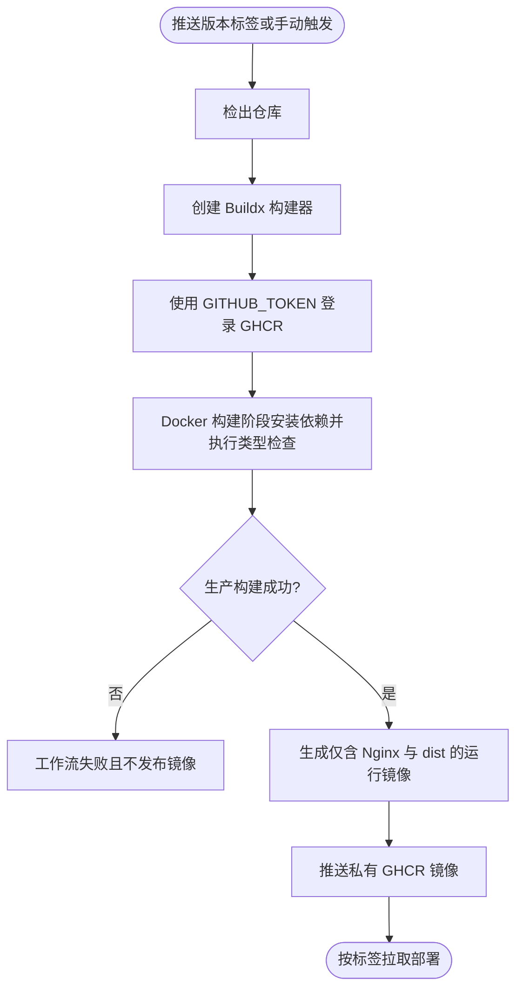

# GitHub Actions 构建并发布私有 GHCR 镜像需求文档

## 1. 文档信息

| 项目 | 内容 |
| --- | --- |
| 需求名称 | GitHub Actions 构建并发布私有 GHCR 镜像 |
| 需求编号 | REQ-2026-008 |
| 文档版本 | 0.3 |
| 所属模块 | CI/CD、Docker、Nginx、GHCR |
| 目标版本/迭代 | Saber 5.x / 容器化发布 |
| 文档状态 | 开发中 |
| 产品负责人 | 用户 |
| 技术负责人 | Codex |
| 创建日期 | 2026-09-04 |
| 最后更新日期 | 2026-09-04 |
| 关联事项 | [需求索引](../requirements-index.md)；[详细设计](../design/DESIGN-REQ-2026-008-ghcr-image-publishing.md)；[测试文档](../test/TEST-REQ-2026-008-ghcr-image-publishing.md)；数据库设计不涉及 |

## 2. 摘要与目标

### 2.1 摘要

当前仓库只有将本地 `dist` 复制到 Nginx 的基础 Dockerfile，没有自动构建和镜像发布链路。
本需求使用 GitHub Actions 完成类型检查、生产构建、Docker 镜像构建和私有 GHCR 发布，并为新增
部署配置的每个有效行提供紧邻的中文解释，便于维护者学习和调整。

### 2.2 需求目标

1. 推送符合 `v*.*.*` 的 Git 标签或手动触发工作流时，构建并发布私有 GHCR 镜像。
2. 使用 Node.js 22、固定 pnpm 版本和锁文件完成可重复的 Linux 容器构建。
3. 最终运行镜像只包含 Nginx、静态资源和必要配置，不包含源码及 Node.js 依赖。
4. Nginx 支持 Vue Router History 模式刷新回退及容器健康检查。
5. GHCR 发布使用仓库自带 `GITHUB_TOKEN`，权限限制为读取代码和写入 Packages。
6. GitHub Actions、Dockerfile、Nginx 和 `.dockerignore` 的每个有效配置行均有中文解释。
7. 提供服务器可下载的 Docker Compose 清单、非敏感变量示例及拉取、启动、升级和回滚说明。

### 2.3 非目标

- 不在本次工作中推送真实版本标签、创建 Git 提交或发布正式镜像。
- 不配置生产服务器自动部署、域名、HTTPS 证书或 SpringBlade 网关地址。
- 不修改前端 API、认证、多租户和业务功能。
- 不创建数据库设计，数据库不受影响。

## 3. 用户故事与范围

| 故事编号 | 优先级 | 用户故事 | 典型场景 | 依赖 |
| --- | --- | --- | --- | --- |
| US-001 | Must | 作为发布人员，我希望打版本标签后自动生成私有镜像，以便稳定部署 Saber。 | GitHub Release 前后 | GitHub Actions、GHCR |
| US-002 | Must | 作为维护人员，我希望每行配置都有中文说明，以便理解并安全修改发布参数。 | 学习或排查 CI/CD | 无 |
| US-003 | Must | 作为运维人员，我希望前端子路由刷新可用且容器可被探活。 | Docker、Kubernetes 或反向代理部署 | Nginx |

### 3.1 范围内

- 新增 GHCR 发布工作流和手动发布入口。
- 将现有 Dockerfile 改为 Node 构建与 Nginx 运行的多阶段镜像。
- 新增 Nginx History 路由回退、静态资源缓存和健康检查配置。
- 新增 Docker 构建上下文排除规则。
- 新增 Docker Compose 清单、变量示例、发布操作说明和关联测试文档。

### 3.2 范围外

- GHCR 包可见性的人工确认、生产服务器拉取凭据和仓库环境保护规则由仓库管理员配置。
- 不把 Token、PAT、密码或后端地址写入仓库。
- 不执行线上容器替换、数据库操作或业务验收。

## 4. 发布流程

异常行为：登录失败、类型检查失败、生产构建失败或镜像推送失败时，工作流必须失败；不得输出成功结论，
也不得在日志中打印凭据。

## 5. 功能需求与验收标准

### 5.1 REQ-001 私有 GHCR 发布

- `AC-001`：Given 仓库 Actions 具备 Packages 写权限，When 推送 `v*.*.*` 标签，Then 工作流将
  `ghcr.io/aninterestingname/saber:<标签>` 推送到 GHCR。
- `AC-002`：Given 维护者手动触发工作流，When 输入合法镜像标签，Then 工作流按该标签构建并发布。
- `AC-003`：Given 工作流执行，When 登录 GHCR，Then 仅使用 `GITHUB_TOKEN`，仓库中不存在明文 PAT。

### 5.2 REQ-002 可重复且最小化的镜像构建

- `AC-004`：Given Docker 构建开始，When 安装依赖，Then 使用 Node.js 22、pnpm 10.23.0 和
  `pnpm-lock.yaml` 的 frozen 模式。
- `AC-005`：Given 类型检查或生产构建失败，When Docker 构建执行，Then 镜像构建立即失败且不推送。
- `AC-006`：Given 构建成功，When 检查最终阶段，Then 最终镜像不包含 Node.js、源码和 `node_modules`。

### 5.3 REQ-003 Nginx 运行行为

- `AC-007`：Given 请求真实静态文件，When Nginx 处理请求，Then 返回该文件并使用静态缓存策略。
- `AC-008`：Given 直接访问或刷新 Vue History 子路由，When服务器不存在同名文件，Then 返回
  `index.html` 并由 Vue Router 接管路径。
- `AC-009`：Given 容器正常运行，When 请求 `/healthz`，Then 返回 HTTP 200 和文本 `ok`。

### 5.4 REQ-004 中文解释

- `AC-010`：Given 打开新增或修改的发布配置，When 逐行阅读，Then 每个有效配置行均有紧邻的中文注释。

### 5.5 REQ-005 Docker Compose 部署

- `AC-011`：Given 服务器已登录私有 GHCR，When 使用变量文件执行 `docker compose pull`，Then 按
  `SABER_IMAGE_TAG` 拉取 `ghcr.io/aninterestingname/saber` 镜像。
- `AC-012`：Given 镜像拉取成功，When 执行 `docker compose up -d`，Then 服务默认只绑定
  `127.0.0.1:8080`，继承镜像健康检查并配置自动重启。
- `AC-013`：Given 需要升级或回滚，When 修改 `SABER_IMAGE_TAG` 后再次执行 pull 和 up，Then
  Compose 使用目标版本重建服务，不需要修改清单文件。

## 6. 业务规则与安全边界

| 规则编号 | 规则 | 适用范围 | 违反时行为 |
| --- | --- | --- | --- |
| BR-001 | GHCR 镜像路径必须使用全小写 | 镜像名称 | Docker 构建或推送失败 |
| BR-002 | 正式发布标签采用 `v主版本.次版本.修订版本` | Git 标签触发 | 不自动触发发布 |
| BR-003 | Actions 不保存长期 GHCR 写凭据 | 工作流认证 | 安全审查不通过 |
| BR-004 | 部署端只授予 `read:packages` | 服务器拉取 | 不允许使用写权限 Token |
| BR-005 | TLS 在外部反向代理或 Ingress 终止 | 运行容器 | 容器只监听 HTTP 80 |

GitHub Actions 通过仓库 `GITHUB_TOKEN` 写入 Packages。生产服务器拉取私有镜像所需的凭据不属于
仓库文件，不得提交到 Git；凭据应通过服务器密钥管理、CI 环境密钥或 Kubernetes Secret 提供。

## 7. 页面、API、数据库与兼容影响

- 页面与交互：不涉及业务页面变化。
- API：不涉及；镜像默认沿用 `.env.production` 的 API 配置。
- 数据库：不涉及，不创建数据库设计文档。
- 路由：不修改 Vue Router，仅由 Nginx 为现有 `createWebHistory` 提供入口回退。
- 兼容：现有本地 `pnpm run dev`、`pnpm run type-check` 和 `pnpm run build:prod` 命令保持不变。

## 8. 质量要求、风险与开放问题

| 类别 | 要求 | 验证标准 |
| --- | --- | --- |
| 安全 | 最小 Actions 权限、无明文凭据、私有包 | 静态检查和首次发布后人工确认 |
| 可重复性 | 固定 Node 主版本、pnpm 精确版本和锁文件 | Docker 构建日志 |
| 可维护性 | 配置有效行均有中文解释 | 人工逐行审查 |
| 可用性 | History 路由回退和 `/healthz` 探活 | 容器请求验证 |

开放项：首次真实推送后，需要仓库管理员在 GitHub Packages 页面确认镜像可见性为 Private，并验证
目标服务器能够使用只读 Token 拉取镜像。当前代码仓库为 Public 不改变镜像必须保持 Private 的要求。

## 9. 实施与变更记录

- 当前完成范围：GHCR 工作流、多阶段 Dockerfile、Nginx History 回退、缓存、健康检查、
  `.dockerignore`、Docker Compose 清单、变量示例和服务器操作说明已实现，每个有效配置行均具有
  紧邻中文解释。
- 本地验证结果：`pnpm run type-check`、actionlint 1.7.12、Linux Docker 多阶段构建、`nginx -t`、
  `/healthz`、History 子路由回退和缓存响应头均通过。最终镜像约 33.2 MB，不包含 Node.js 和源码目录。
- 未完成验收项：配置尚未提交并推送，真实 GHCR 私有发布、Packages 可见性和目标服务器只读拉取
  尚未执行，因此需求保持“开发中（开发完成，待远端验收）”。
- 数据库设计：不涉及。

| 日期 | 版本 | 变更内容 | 修改人 |
| --- | --- | --- | --- |
| 2026-09-04 | 0.3 | 增加 Docker Compose 清单、变量示例和服务器拉取、启动、升级及回滚流程 | Codex |
| 2026-09-04 | 0.2 | 完成配置实现和本地容器验证，记录真实 GHCR 发布待验收 | Codex |
| 2026-09-04 | 0.1 | 建立 GHCR 私有镜像发布、容器构建、Nginx 回退和逐行中文解释需求 | Codex |
