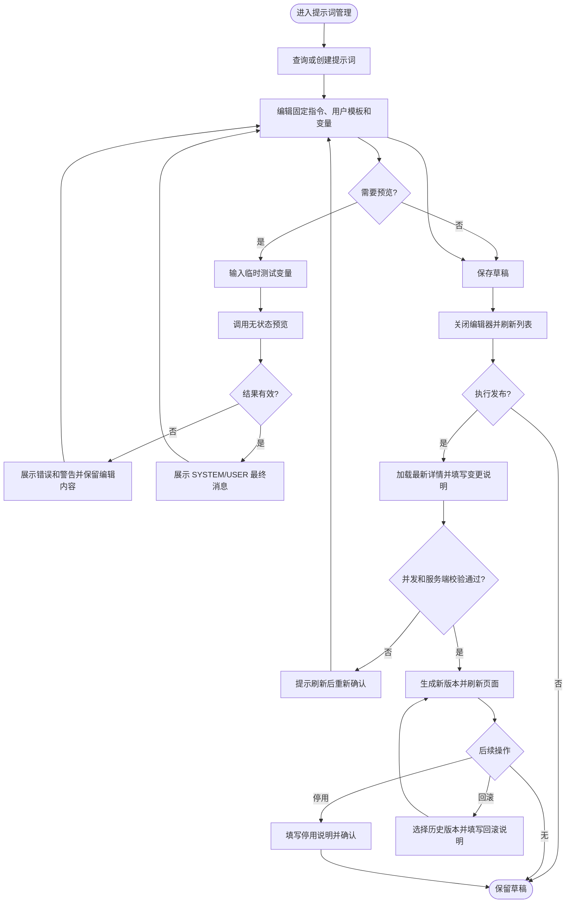
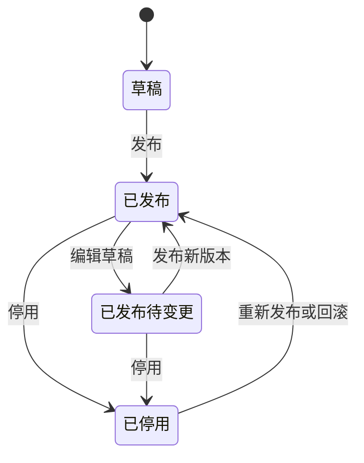

# Saber 提示词管理需求文档

## 1. 文档信息

| 项目 | 内容 |
| --- | --- |
| 需求名称 | Saber 提示词管理 |
| 需求编号 | REQ-2026-009 |
| 文档版本 | 0.3 |
| 所属模块 | 资产管理、提示词草稿、预览与版本发布 |
| 目标版本/迭代 | Saber 5.x / AI 能力第一阶段 |
| 文档状态 | 开发中 |
| 产品负责人 | 待指定 |
| 技术负责人 | 待指定 |
| 创建日期 | 2026-09-09 |
| 最后更新日期 | 2026-09-09 |
| 关联事项 | [需求索引](../requirements-index.md)；[详细设计 0.3](../design/DESIGN-REQ-2026-009-prompt-management.md)；[测试文档 0.3](../test/TEST-REQ-2026-009-prompt-management.md)；数据库设计不涉及 |
| 后端基线 | SpringBlade `REQ-2026-001` 0.3、`DESIGN-REQ-2026-001` 0.4 及当前 `blade-ai` 实现 |

## 2. 摘要与目标

### 2.1 摘要

SpringBlade 已新增提示词草稿、无模型预览、发布、停用、版本历史和回滚接口，但 Saber 尚无对应管理入口。
本需求为具备相应权限的租户用户提供完整的提示词管理页面，使其能够在不接触数据库或业务代码的情况下维护、
验证和发布提示词，并清楚区分当前草稿与线上已发布版本。

### 2.2 需求目标

1. 提供租户隔离的提示词分页查询、详情和状态识别能力。
2. 支持创建、编辑和复制草稿，并以类型安全的方式维护有序变量定义。
3. 支持使用未保存内容和临时测试值执行无模型渲染预览，完整展示错误、警告和最终消息顺序。
4. 支持受控发布、停用、版本查看和回滚，并在高风险操作前展示明确影响。
5. 将前端按钮权限、后端 API Scope、动态菜单和并发版本组合为一致的访问与失败恢复体验。
6. 在 1440px、1024px 和 375px 视口及浅色、深色主题下保持主要操作可达且内容可读。

### 2.3 非目标

- 不在 Saber 中调用大模型、展示模型响应、统计 Token 或成本。
- 不提供提示词标签、分类树、收藏、评分、A/B 测试、审批流、灰度或定时发布。
- 不提供跨租户共享、导入导出、模板市场或运行时业务调用页面。
- 不提供富文本、Markdown 所见即所得或可执行表达式编辑器；提示词内容按纯文本处理。
- 不修改 SpringBlade 提示词数据表和运行时 Feign 契约。
- 不在前端保存预览测试值、预览历史或提示词正文缓存。

## 3. 用户故事与范围

### 3.1 用户故事

| 故事编号 | 优先级 | 用户故事 | 典型场景 | 依赖 |
| --- | --- | --- | --- | --- |
| US-001 | Must | 作为提示词管理员，我希望查询并查看提示词状态，以便判断线上版本和待发布草稿。 | 日常巡检、变更前确认 | 后端查看权限 |
| US-002 | Must | 作为提示词编辑人员，我希望维护提示词内容和变量定义，以便形成可发布草稿。 | 新建、优化业务提示词 | 后端新增/编辑权限 |
| US-003 | Must | 作为提示词编辑人员，我希望用临时变量预览未保存内容，以便在保存或发布前发现问题。 | 模板校验、评审 | 后端预览权限 |
| US-004 | Must | 作为发布人员，我希望发布、停用和重新发布提示词，以便控制线上业务使用版本。 | 上线、紧急停用、恢复 | 后端发布/停用权限 |
| US-005 | Must | 作为发布人员，我希望查看完整历史并回滚到指定版本，以便恢复稳定内容且保留审计线索。 | 故障恢复 | 后端查看/回滚权限 |
| US-006 | Should | 作为提示词管理员，我希望复制现有草稿并受控删除从未发布的草稿，以减少重复录入并保持数据整洁。 | 创建相似提示词、清理误建草稿 | 后端复制/删除权限 |

### 3.2 范围内

- 新增“资产管理 > 提示词管理”动态菜单页面，目标路径为 `/asset/prompt`。
- 按名称、编码和状态查询提示词，显示发布状态、当前版本、草稿变更和更新时间。
- 提示词新增、查看、编辑、复制及从未发布草稿的单条删除。
- 固定指令、用户输入模板和有序变量定义的维护。
- 文本、多行文本、数字和布尔四种变量类型，以及必填、默认值、示例值、最大长度和说明。
- 未保存内容的无状态预览、测试变量录入、结构化校验问题和最终消息展示。
- 发布说明、停用说明、版本分页、版本详情、回滚说明和高风险确认。
- `lockVersion` 并发冲突恢复、旧响应隔离和操作级提交锁。
- 菜单按钮权限与后端 API Scope 的联合授权说明及上线检查。
- 中文、英文、日文菜单名称，以及明暗主题和三档视口适配。

### 3.3 范围外

- 批量删除、批量发布、批量停用和批量回滚。
- 提示词差异算法和逐字符版本对比；本期仅并列展示草稿和版本快照。
- 创建人、更新人、发布人 ID 到用户姓名的额外远程解析，后端未提供对应聚合字段。
- 环境级提示词长度配置查询；前端按当前已确认上限提供输入提示，服务端仍是最终校验边界。
- 无登录上下文的后台任务、消息消费者或服务身份管理。

## 4. 业务流程

### 4.1 流程说明

- 前置条件：用户已登录当前租户，动态菜单、按钮权限和 API Scope 已配置并授权。
- 触发入口：主导航“资产管理 > 提示词管理”。
- 最终结果：草稿可以独立保存和预览；只有明确发布后才切换线上版本；失败时保留用户输入和原线上版本。

1. 用户查询或创建提示词并维护两段内容与变量定义。
2. 用户可直接使用当前未保存表单打开预览，输入临时测试值并查看结构化结果。
3. 用户保存草稿后关闭编辑器并刷新列表；已发布提示词的线上版本保持不变。
4. 发布人员加载最新详情，填写说明并确认发布；成功后页面刷新当前版本和并发版本。
5. 发布人员可停用当前提示词，或从版本历史选择非当前版本并回滚生成新版本。

### 4.2 业务流程图

### 4.3 异常与替代流程

| 编号 | 触发条件 | 系统行为 | 用户提示 | 数据是否改变 |
| --- | --- | --- | --- | :---: |
| EX-001 | 菜单或查看权限未授权 | 不展示入口或由后端拒绝访问 | 无权限或接口错误 | 否 |
| EX-002 | 详情、版本或预览请求失败 | 清空对应旧数据并保留重试入口 | 加载失败，请重试 | 否 |
| EX-003 | 模板或变量定义非法 | 定位表单字段；预览展示结构化问题 | 具体字段或变量错误 | 否 |
| EX-004 | 保存、发布、停用、删除或回滚发生 `48004` 冲突 | 保留当前输入，刷新服务端详情后要求重新确认 | 数据已变化，请核对后重试 | 否 |
| EX-005 | 发布、停用或回滚失败 | 不显示成功，不覆盖当前页面为目标状态 | 沿用后端错误并可重试 | 否 |
| EX-006 | 用户打开记录 A 后快速切换记录 B | 废弃 A 的迟到响应，只显示 B | 无 | 否 |
| EX-007 | 当前操作不被 `actions` 允许 | 隐藏或禁用对应动作，不发送请求 | 当前状态不允许此操作 | 否 |
| EX-008 | 用户取消高风险确认 | 关闭确认层并保留列表、详情和选择 | 无 | 否 |

## 5. 功能需求与验收标准

### 5.1 REQ-001 菜单、查询与详情

- 关联用户故事：`US-001`
- 优先级：Must
- 页面支持按名称、编码和状态分页查询，查询只提交白名单字段。
- 列表显示名称、稳定编码、状态、当前版本号、草稿变更标记和更新时间。
- “已发布且有新草稿”必须同时表达发布状态与待发布变更，不能只显示一个状态标签。
- 查看详情时展示当前草稿、服务端警告、当前发布版本摘要和可执行动作状态。

验收标准：

- `AC-001`：Given 当前租户存在多条提示词，When 按名称、编码或状态查询，Then 页面只显示后端返回的匹配记录并正确维护分页总数。
- `AC-002`：Given 记录状态为已发布且 `draftDirty=true`，When 查看列表或详情，Then 同时显示“已发布”和“有待发布草稿”。
- `AC-003`：Given 详情请求失败或用户快速切换记录，When 旧请求结束，Then 不展示旧正文且提供当前目标的重试入口。
- `AC-004`：Given 当前租户没有提示词，When 页面加载完成，Then 显示空状态和有权限用户可用的新增入口。

### 5.2 REQ-002 草稿与变量编辑

- 关联用户故事：`US-002`
- 优先级：Must
- 新增和编辑使用同一编辑器，保存成功后关闭窗口并使用服务端结果刷新列表。
- 名称必填且不超过 100 字符；编码必填且不超过 64 字符，提交前去除首尾空格并转小写。
- 编辑已有记录时编码只读，但仍按后端契约回传原编码。
- 固定指令和用户输入模板按纯文本多行输入，至少一项非空。
- 变量保持用户定义顺序，支持新增、编辑、删除和上移/下移，最多 100 项。
- 变量名遵循 `^[A-Za-z][A-Za-z0-9_]{0,63}$` 且区分大小写；默认值和示例值必须按类型提交真实 JSON 类型。
- 单行文本和多行文本的最大长度缺省为 255；数字和布尔变量不显示且不提交最大长度。

验收标准：

- `AC-005`：Given 合法名称、编码和至少一段内容，When 保存新增或编辑草稿，Then 保存成功后关闭编辑器并刷新列表；重新进入编辑时加载最新草稿且不重复创建记录。
- `AC-006`：Given 已有提示词，When 进入编辑，Then 编码不可修改且提交体包含原编码、字符串 ID 和字符串 `lockVersion`。
- `AC-007`：Given 两段内容均为空或变量定义非法，When 保存，Then 前端校验阻止明显非法输入；服务端拒绝时保留全部表单内容。
- `AC-008`：Given 用户新增、重新打开或切换变量类型，When 文本最大长度未设置或类型不支持最大长度，Then 单行/多行文本使用 255，数字/布尔清除最大长度；存在其他不兼容值时要求用户确认后清理。
- `AC-009`：Given 变量超过视口宽度或数量较多，When 在桌面或移动端编辑，Then 控件不重叠，顺序操作和删除入口保持可达。

### 5.3 REQ-003 未保存内容预览

- 关联用户故事：`US-003`
- 优先级：Must
- 预览直接使用编辑器当前内容和变量定义，不要求先保存。
- 每个测试变量必须区分“未提供”和类型值；未提供时请求体省略该键，以允许服务端使用默认值。
- 页面支持按变量类型录入文本、多行文本、数字和布尔值，并提供使用示例值的快捷填充。
- 预览结果展示 `valid`、引用变量、未解析变量、错误、警告、最终固定指令、最终用户消息和消息顺序。
- 所有渲染结果按纯文本显示，不使用 `v-html`，测试值和结果不写入本地持久化。

验收标准：

- `AC-010`：Given 表单尚未保存，When 输入完整测试变量并预览，Then Network 请求包含当前表单内容且列表数据、草稿 ID 和表单并发版本不改变。
- `AC-011`：Given 变量配置默认值，When 测试变量保持“未提供”，Then 请求体省略该变量键并展示服务端默认值渲染结果。
- `AC-012`：Given 预览响应 `valid=false`，When 页面收到 HTTP 成功响应，Then 将其展示为模板校验结果而不是通用请求异常。
- `AC-013`：Given 预览有效，When 查看结果，Then `SYSTEM`、`USER` 消息按响应顺序显示，变量值中的双花括号保持普通文本。

### 5.4 REQ-004 发布、停用与恢复

- 关联用户故事：`US-004`
- 优先级：Must
- 发布和停用前必须重新加载最新详情，使用最新 `lockVersion` 和服务端 `actions` 判断操作可用性。
- 发布和重新发布必须填写不超过 500 字符的变更说明；停用必须填写不超过 500 字符的停用说明。
- 确认界面展示提示词名称、编码、当前版本、草稿修订和操作后果。
- 发布成功后刷新列表、详情和版本上下文；停用成功后保留详情与历史入口但更新为已停用。
- 已停用提示词通过发布操作恢复为已发布，并生成新版本，不提供前端本地状态切换。

验收标准：

- `AC-014`：Given 用户有发布权限且草稿可发布，When 填写说明并确认，Then 只发送一次发布请求并显示后端返回的新版本号。
- `AC-015`：Given 发布响应包含警告，When 发布成功，Then 页面同时显示成功结果和警告，不把已成功操作误报为失败。
- `AC-016`：Given 已发布提示词，When 填写停用说明并确认，Then 状态更新为已停用，历史和详情仍可查看。
- `AC-017`：Given 提示词已停用，When 使用发布入口重新发布，Then 页面明确提示将生成新版本并在成功后显示已发布状态。

### 5.5 REQ-005 版本历史与回滚

- 关联用户故事：`US-005`
- 优先级：Must
- 版本历史按版本号倒序分页，显示版本号、来源、变更说明、发布人 ID 和发布时间。
- 版本详情只读展示两段内容、变量快照、内容哈希、来源版本和来源草稿修订。
- 当前版本必须有明确标记，当前版本不提供无意义的回滚入口。
- 回滚前重新加载提示词最新详情，确认目标版本、预计新版本号和草稿保留规则。

验收标准：

- `AC-018`：Given 提示词存在多个版本，When 打开版本历史，Then 按版本号倒序显示且列表切换不会串入其他提示词版本。
- `AC-019`：Given 选择任一版本，When 查看详情，Then 完整快照只读展示，正文和变量值按纯文本处理。
- `AC-020`：Given 选择非当前历史版本且具备回滚权限，When 填写说明并确认，Then 成功后新增版本、刷新当前版本并保留现有草稿状态。
- `AC-021`：Given 选择当前版本、无回滚权限或服务端动作不允许，When 页面渲染，Then 不提供可执行回滚按钮且不发送请求。

### 5.6 REQ-006 复制与受控删除

- 关联用户故事：`US-006`
- 优先级：Should
- 复制只要求新名称和新编码，正文与变量由服务端从来源当前草稿复制。
- 删除仅支持单条记录，并同时满足前端删除权限和服务端 `actions.removable=true`。
- 删除请求必须携带当前字符串 ID 和 `lockVersion`，确认文案说明编码删除后仍不可复用。

验收标准：

- `AC-022`：Given 选择任一提示词并具备复制权限，When 输入新的合法名称和编码，Then 新记录为独立草稿且列表显示无发布版本。
- `AC-023`：Given 从未发布且允许删除的草稿，When 确认删除，Then 请求成功后从当前列表移除并保持查询条件。
- `AC-024`：Given 提示词已有发布历史或服务端动作不允许，When 页面渲染，Then 删除入口不可执行；接口拒绝时原列表和记录保持不变。

### 5.7 REQ-007 权限、租户、并发与失败恢复

- 关联用户故事：`US-001` 至 `US-006`
- 优先级：Must
- 页面可见性由动态菜单控制；按钮显隐使用 `prompt_*` 菜单按钮码；接口最终授权使用 `ai:prompt:*` API Scope。
- 可执行动作必须同时满足前端按钮权限、服务端 `actions` 和当前加载状态。
- 前端请求不得携带 `tenantId`，不得在租户切换或重新登录后复用旧详情、预览或版本数据。
- 写操作使用独立执行锁，关闭、切换目标和重复点击不得造成重复请求。
- 并发冲突后保留未提交编辑内容，加载服务端最新详情供用户人工核对，不自动覆盖或重放请求。

验收标准：

- `AC-025`：Given 用户只有查看和预览权限，When 进入页面，Then 可查询和预览，但新增、编辑、复制、删除、发布、停用和回滚入口不显示。
- `AC-026`：Given 菜单按钮权限存在但 API Scope 未授权，When 发起操作，Then 后端拒绝且页面不显示成功或伪造状态变化。
- `AC-027`：Given 当前租户切换或会话失效，When 页面重新加载，Then 不展示上一租户正文、测试变量或历史版本。
- `AC-028`：Given 两个客户端持有相同 `lockVersion`，When 后提交者发生冲突，Then 页面保留输入、提示刷新核对且不自动重放。
- `AC-029`：Given 任一详情、预览、版本或写请求失败，When 用户重试或关闭，Then loading 和执行锁恢复，旧数据不会被继续展示为当前结果。

### 5.8 REQ-008 响应式、主题与可访问性

- 关联用户故事：`US-001` 至 `US-006`
- 优先级：Must
- 页面保持后台管理系统的紧凑、可扫描布局，不使用营销式大标题或装饰性卡片。
- 1440px 下编辑与预览充分利用宽度；1024px 下允许分区换行；375px 下表格横向滚动、抽屉全宽且主要操作可达。
- 所有图标按钮提供 Tooltip 和可访问名称；危险操作使用明确颜色、说明和二次确认。
- 浅色、深色和动态主色下，状态、错误、警告、正文和禁用态保持可读。

验收标准：

- `AC-030`：Given 1440px、1024px 和 375px 视口，When 使用查询、编辑、预览和版本功能，Then 文字与控件不重叠且主要按钮可操作。
- `AC-031`：Given 浅色或深色主题，When 展示状态、警告、错误和纯文本内容，Then 对比度清晰且不依赖单一颜色表达结果。
- `AC-032`：Given 用户使用键盘操作，When 在弹窗、抽屉和确认层中切换焦点并提交或取消，Then 焦点顺序合理，提交中不能关闭或重复提交。

## 6. 业务规则与状态

### 6.1 业务规则

| 规则编号 | 规则 | 适用范围 | 违反时行为 |
| --- | --- | --- | --- |
| BR-001 | 编码提交前 trim 并转小写，编辑时不可修改 | 新增、编辑、复制 | 阻止提交或由后端拒绝 |
| BR-002 | 固定指令和用户模板不得同时为空 | 保存、预览、发布 | 展示字段错误且保留内容 |
| BR-003 | 变量名区分大小写并遵循后端正则 | 变量定义 | 定位具体变量并阻止明显非法提交 |
| BR-004 | “未提供测试值”必须从 `testVariables` 中省略，不能发送 `null` 冒充缺失 | 预览 | 使用默认值或服务端缺失规则 |
| BR-005 | ID、版本 ID、修订号和 `lockVersion` 在前端均按字符串处理 | 全部 API | 禁止转为 JS number |
| BR-006 | 可执行动作等于按钮权限、服务端 `actions` 和非忙碌状态的交集 | 行操作和详情操作 | 隐藏或禁用且不发请求 |
| BR-007 | 发布、停用和回滚前重新加载最新详情 | 高风险操作 | 加载失败时禁止确认 |
| BR-008 | 预览值、渲染结果和提示词正文不进入 localStorage/sessionStorage | 编辑和预览 | 关闭页面后清空 |
| BR-009 | 提示词正文和渲染结果只按纯文本展示 | 所有详情 | 禁止 `v-html` |
| BR-010 | 页面不提交租户字段，资源边界由后端安全上下文确定 | 全部 API | 后端拒绝越租户访问 |

### 6.2 状态与迁移

| 页面状态 | 后端字段 | 页面表达 | 允许的主要操作 |
| --- | --- | --- | --- |
| 首个草稿 | `status=0`、`currentVersionId=null` | 草稿、未发布 | 编辑、预览、发布、受控删除 |
| 已发布无新草稿 | `status=1`、`draftDirty=false` | 已发布、当前 Vn | 查看、编辑、预览、发布、停用、版本 |
| 已发布有新草稿 | `status=1`、`draftDirty=true` | 已发布 + 待发布草稿 | 编辑、预览、发布、停用、版本 |
| 已停用 | `status=2` | 已停用、保留当前 Vn | 查看、编辑、预览、重新发布、版本、回滚 |

## 7. 认证与访问边界

### 7.1 资源归属

| 资源 | 归属类型 | 归属字段 | 字段来源 | 说明 |
| --- | --- | --- | --- | --- |
| 提示词及版本 | 租户级 | `tenant_id` | SpringBlade 安全上下文 | 前端不展示或提交租户字段 |
| 预览测试值 | 当前页面临时状态 | 不持久化 | 用户当前输入 | 关闭预览或编辑器后清空 |

### 7.2 权限映射

| 页面动作 | Saber 按钮码 | 后端 API Scope | 额外状态条件 |
| --- | --- | --- | --- |
| 查看列表、详情、版本 | `prompt_view` | `ai:prompt:view` | 无 |
| 新增 | `prompt_add` | `ai:prompt:create` | 无 |
| 编辑 | `prompt_edit` | `ai:prompt:edit` | `actions.editable` |
| 复制 | `prompt_copy` | `ai:prompt:copy` | 来源详情可加载 |
| 删除 | `prompt_delete` | `ai:prompt:delete` | `actions.removable` |
| 预览 | `prompt_preview` | `ai:prompt:preview` | 编辑器数据可用 |
| 发布/重新发布 | `prompt_publish` | `ai:prompt:publish` | `actions.publishable` |
| 停用 | `prompt_disable` | `ai:prompt:disable` | `actions.disableable` |
| 回滚 | `prompt_rollback` | `ai:prompt:rollback` | `actions.rollbackable` 且目标非当前版本 |

运行时 `ai:prompt:runtime` 只供内部业务服务使用，不生成 Saber 按钮或页面入口。前端按钮显隐不是安全边界，
角色必须同时获得对应 `blade_menu` 按钮记录和 `blade_scope_api` 记录。

## 8. 页面与交互要求

### 8.1 页面与操作

| 页面/入口 | 用户目标 | 主要操作 | 可见角色 | 原型链接 |
| --- | --- | --- | --- | --- |
| `/asset/prompt` 提示词管理 | 查询和判断当前状态 | 查询、查看、新增、编辑、更多操作 | 具有菜单和查看权限的用户 | 无 |
| 提示词编辑器 | 维护草稿和变量 | 保存草稿、预览、查看警告 | 新增或编辑人员 | 无 |
| 预览抽屉 | 验证未保存模板 | 提供测试值、填充示例、执行预览 | 具有预览权限的用户 | 无 |
| 版本抽屉 | 查看不可变历史 | 分页、查看版本、回滚 | 查看或回滚人员 | 无 |
| 操作说明弹窗 | 执行高风险动作 | 填写说明、核对影响、确认 | 发布、停用或回滚人员 | 无 |

### 8.2 页面状态

| 状态 | 展示与行为 |
| --- | --- |
| 列表加载中 | 表格 loading；刷新和行操作禁用；保持上次已执行查询 |
| 空数据 | 展示空状态；有新增权限时提供新增按钮 |
| 详情加载失败 | 清空旧详情，显示错误结果和重试按钮，禁止编辑或高风险操作 |
| 预览未执行 | 展示测试变量区和“执行预览”，不显示伪造结果 |
| 预览无效 | 展示错误、警告、引用变量和未解析变量，不显示成功标识 |
| 提交中 | 对应操作按钮 loading；阻止关闭、切换目标和重复提交 |
| 提交成功 | 使用响应更新当前上下文并刷新相关列表；发布警告继续可见 |
| 并发冲突 | 保留本地输入，展示服务端最新详情入口，要求人工核对后重试 |
| 已停用 | 使用危险状态标签；保留查看、编辑、版本和重新发布入口 |

## 9. 质量要求与影响

### 9.1 非功能要求

| 类别 | 要求 | 验证标准 |
| --- | --- | --- |
| 安全 | 正文和测试值不持久化、不使用 HTML 渲染、不提交租户字段 | Storage、DOM、Network 和代码检查 |
| 一致性 | 旧响应不覆盖新目标；写操作成功后使用最新并发版本 | 快速切换和并发冲突测试 |
| 可用性 | 预览无效、详情失败和高风险失败均可恢复且不丢失编辑内容 | 异常流程手工测试 |
| 响应式 | 1440px、1024px、375px 下主要操作可达 | 多视口截图与交互检查 |
| 主题 | 浅色、深色和动态主色下状态与正文可读 | 主题切换检查 |
| 兼容性 | 复用现有 Vue 3、Element Plus、Pinia、Axios 和动态路由 | 类型检查、构建和静态检索 |

### 9.2 数据与接口影响

| 影响项 | 是否涉及 | 需求层说明 | 关联设计 |
| --- | :---: | --- | --- |
| 前端页面与模块组件 | 是 | 新增提示词管理页面、编辑器、预览和版本视图 | [详细设计](../design/DESIGN-REQ-2026-009-prompt-management.md) |
| 前端 API | 是 | 接入 `/blade-ai/prompt/**` 十二个管理接口 | [详细设计](../design/DESIGN-REQ-2026-009-prompt-management.md) |
| 前端持久化数据 | 否 | 不新增 Store 持久化或浏览器数据库 | 不涉及 |
| 后端数据库 | 否 | 提示词表已由 SpringBlade 需求处理 | SpringBlade `DB-REQ-2026-001` |
| 菜单与权限数据 | 是，外部依赖 | 后端需新增菜单/按钮并将现有 API Scope 绑定菜单和角色 | [详细设计](../design/DESIGN-REQ-2026-009-prompt-management.md) |
| 新增依赖 | 否 | 复用现有 Element Plus 和项目 composable | 不涉及 |

### 9.3 依赖、风险与开放问题

| 编号 | 类型 | 内容 | 负责人 | 截止日期 | 状态/结论 |
| --- | --- | --- | --- | --- | --- |
| ITEM-001 | 依赖 | SpringBlade 尚未提供“资产管理/提示词管理”菜单和 `prompt_*` 按钮数据 | 后端/部署 | 开发联调前 | 开放 |
| ITEM-002 | 依赖 | 现有十条提示词 API Scope 的 `menu_id` 为 NULL，需绑定提示词菜单后才能进入角色 API Scope 树 | 后端/部署 | 开发联调前 | 开放 |
| ITEM-003 | 问题 | 提示词管理员默认角色和发布、停用、回滚的授权策略尚未确认 | 产品/安全 | 需求评审 | 开放 |
| ITEM-004 | 风险 | 后端正文长度上限可按环境覆盖但没有查询接口，前端提示值可能与环境实际值不一致 | 前后端 | 联调前 | 服务端最终校验；是否新增配置查询待评审 |
| ITEM-005 | 风险 | 当前 Axios 对 2xx 业务错误只保留 message，无法稳定按 `48004` 分支处理 | 前端 | 设计评审 | 已实现兼容的 `BladeBusinessError`，待普通失败和 401 联调回归 |
| ITEM-006 | 问题 | 后端列表和版本只返回用户 ID，不返回用户名称 | 产品/后端 | 需求评审 | 本期显示 ID 或省略列表责任人名称，不额外查询 |
| ITEM-007 | 问题 | 模板原样输出双花括号的转义语法尚未定义 | 后端/产品 | 后续需求 | 本期只展示服务端校验结果，不在前端自定义转义 |

## 10. 评审与变更

### 10.1 需求评审清单

- [ ] 页面范围、非目标和运行时调用边界已确认。
- [x] 草稿保存后关闭编辑器并刷新列表的交互已确认。
- [ ] 变量类型、三态测试值和未保存预览规则已确认。
- [ ] 发布、停用、重新发布和回滚确认内容已确认。
- [ ] `/asset/prompt` 菜单位置及 `prompt_*` 按钮码已确认。
- [ ] API Scope 与菜单绑定、角色授权和管理员策略已确认。
- [ ] 并发冲突与 Axios 业务错误处理方案已确认。
- [ ] `AC-001` 至 `AC-032` 均可在目标环境执行。

### 10.2 评审结论

| 评审领域 | 结论 | 评审人 | 日期 | 条件/备注 |
| --- | --- | --- | --- | --- |
| 产品范围 | 待评审 | 待指定 | 待指定 | 确认角色、菜单位置和停用/恢复文案 |
| 前端技术 | 待评审 | 待指定 | 待指定 | 确认模块组件和业务错误类型 |
| 后端联调 | 待评审 | 待指定 | 待指定 | 补齐菜单、按钮、Scope 绑定和角色授权 |
| 测试可验收性 | 待评审 | 待指定 | 待指定 | 准备双租户和分权账号 |

### 10.3 变更记录

| 日期 | 版本 | 变更内容 | 原因 | 影响范围 | 修改人 |
| --- | --- | --- | --- | --- | --- |
| 2026-09-09 | 0.1 | 根据 SpringBlade 最新提示词需求、详细设计和实际接口建立 Saber 前端需求初稿，菜单确定为“资产管理 > 提示词管理” | 启动前端规划设计并明确业务归属和页面命名 | 资产管理页面、权限、联调和测试 | Codex |
| 2026-09-09 | 0.2 | 完成提示词列表、草稿编辑、变量、预览、版本、发布/停用/回滚、复制删除、权限和 Axios 业务错误实现 | 用户要求基于最新详细设计开始实现 | 前端页面、API、共享 Axios、国际化、工程验证与联调准备 | Codex |
| 2026-09-09 | 0.3 | 文本变量最大长度缺省统一为 255，数字/布尔清除该字段；保存成功后关闭编辑器并刷新列表 | 修复变量重开后变为 1 导致预览失败，以及保存后窗口未关闭的问题 | 提示词变量编辑、保存交互、详细设计和测试用例 | Codex |
