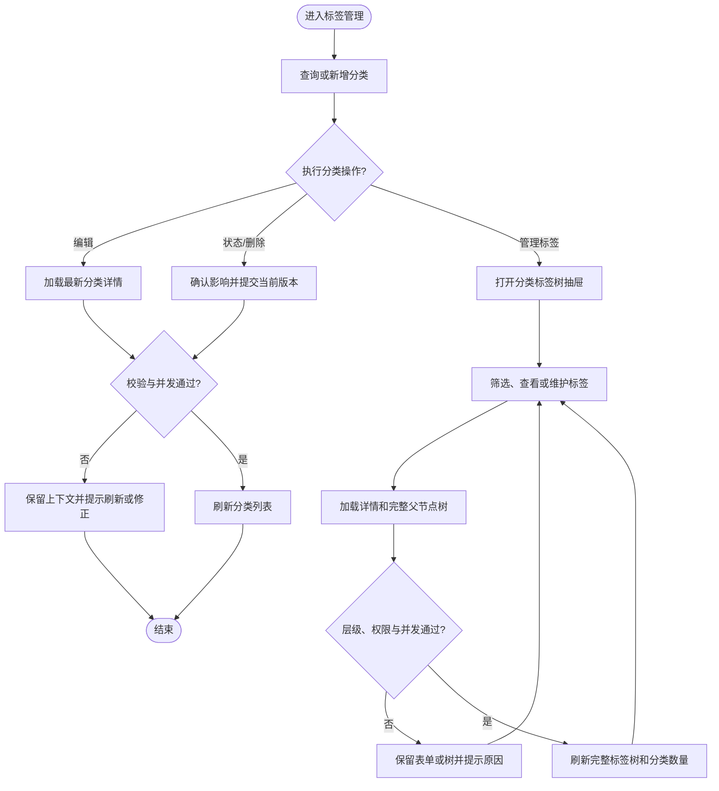

# Saber 标签分类与标签管理需求文档

## 1. 文档信息

| 项目 | 内容 |
| --- | --- |
| 需求名称 | Saber 标签分类与标签管理 |
| 需求编号 | REQ-2026-010 |
| 文档版本 | 0.5 |
| 所属模块 | 系统管理、标签分类、层级标签 |
| 目标版本/迭代 | Saber 5.x / 标签基础能力前端第一阶段 |
| 文档状态 | 开发中（前端实现完成，待联调验收） |
| 产品负责人 | 用户 |
| 技术负责人 | 待指定 |
| 创建日期 | 2026-09-10 |
| 最后更新日期 | 2026-09-10 |
| 关联事项 | [需求索引](../requirements-index.md)；[详细设计](../design/DESIGN-REQ-2026-010-tag-management-frontend.md)；[测试文档](../test/TEST-REQ-2026-010-tag-management-frontend.md)；数据库设计不涉及 |
| 后端基线 | SpringBlade `REQ-2026-002` 0.2、`DESIGN-REQ-2026-002` 0.2 及当前 `blade-system` 标签管理实现 |

## 2. 摘要与目标

### 2.1 摘要

SpringBlade 已实现租户级标签分类、层级标签、有效选项、并发版本和动作权限接口。本次已在 Saber 新增统一的标签
管理页面，使具备权限的租户管理员可以维护分类选择规则，并在分类上下文中查看和调整标签树，同时正确处理状态联动、
删除约束、并发冲突和租户隔离。当前前端实现与工程检查已完成，真实权限、租户和业务流程仍待联调验收。

### 2.2 需求目标

1. 提供“系统管理 > 标签管理”动态菜单入口，并在一个连续工作流中维护分类和分类下标签。
2. 支持分类的分页查询、详情、新增、编辑、启停和空分类删除。
3. 支持标签树查看、树内筛选、新增根标签/子标签、编辑、层级调整、启停和叶子删除。
4. 严格使用字符串 ID 和 `lockVersion`，避免 Long 精度丢失和陈旧写覆盖最新数据。
5. 将前端按钮权限、后端 API Scope、菜单授权和当前租户上下文组合为一致的访问体验。
6. 在 1440px、1024px、375px 视口及浅色、深色主题下保持主要操作可达、状态清晰且无内容重叠。
7. 优先使用 Element Plus 官方组件和现有 Saber 页面容器，仅在业务编排需要时创建模块组件；Ant Design Pro
   仅作为中后台信息架构和交互布局参考。

### 2.3 非目标

- 不建设标签与用户、提示词、文章或其他业务资源的绑定关系。
- 不提供跨租户查询、复制、共享或平台公共标签库。
- 不提供批量新增、批量编辑、批量删除、批量启停、导入导出、合并、别名和统计。
- 不提供拖拽排序或拖拽移动；层级和排序通过编辑表单明确提交。
- 不提供前端自由文本标签、个人私有标签或多语言标签名称。
- 不修改 SpringBlade 标签业务表、Java 业务规则和现有 API 路径。
- 不引入 Ant Design Vue、Ant Design Pro Components 或其他第二套 UI 运行时；只吸收查询表格、详情下钻、
  页级操作区和响应式信息层级等设计原则。

## 3. 用户故事与范围

### 3.1 用户故事

| 故事编号 | 优先级 | 用户故事 | 典型场景 | 依赖 |
| --- | --- | --- | --- | --- |
| US-001 | Must | 作为标签管理员，我希望查询分类并查看其规则和标签数量，以便快速定位需要维护的标签体系。 | 日常巡检、分类检索 | 分类查看权限 |
| US-002 | Must | 作为标签管理员，我希望新增和编辑分类，以便定义稳定编码、单选/多选规则和展示顺序。 | 初始化业务维度、调整规则 | 分类新增/编辑权限 |
| US-003 | Must | 作为标签管理员，我希望在分类上下文中维护标签树，以便直观组织根标签和多级子标签。 | 标签初始化、层级调整 | 分类查看、标签查看/维护权限 |
| US-004 | Must | 作为标签管理员，我希望启用或停用分类和标签，以便控制业务可用选项而不丢失原结构。 | 暂停使用、恢复使用 | 对应状态权限 |
| US-005 | Must | 作为标签管理员，我希望受控删除空分类和叶子标签，以便清理误建数据且不破坏层级。 | 数据清理 | 对应删除权限 |
| US-006 | Must | 作为并发维护人员，我希望系统拒绝陈旧版本并保留当前操作上下文，以便避免覆盖其他管理员的更新。 | 多管理员同时维护 | 后端 `lockVersion` |

### 3.2 范围内

- 新增“系统管理 > 标签管理”菜单页面，目标路径 `/system/tag`。
- 分类按名称、编码、状态分页查询，显示选择模式、最大可选数、标签数量、排序、状态和更新时间。
- 分类新增、查看、编辑、状态切换和单条删除。
- 标签管理通过分类行的“管理标签”入口打开大尺寸抽屉，显示当前分类名称、编码、选择规则和标签数量。
- 标签树按名称、编码、状态在前端筛选，并保留命中节点的祖先路径以维持层级上下文。
- 标签新增根节点、新增子节点、查看、编辑父节点、编辑排序、状态切换和单条删除。
- 编辑父节点时禁止选择自身和后代，显示最大 8 级约束，服务端继续作为最终校验边界。
- 分类和标签编码创建后只读；创建时去除首尾空格、转小写并校验 snake_case。
- 分类和标签状态变化不级联改写下级保存状态；页面说明实际有效性影响。
- 所有写操作携带当前字符串 `lockVersion`，成功后重新加载受影响的列表或完整标签树。
- 新增 `tag_category_*`、`tag_*` 按钮权限和 `system:tag-*:*` API Scope 的联合授权部署要求。
- 增加中文、英文、日文菜单标题。
- 页面控件优先使用 Element Plus 官方 `Form`、`Row/Col`、`Table`、`TreeSelect`、`Descriptions`、
  `Segmented`、`Switch`、`Drawer`、`Dialog`、`Empty`、`Result`、`Alert` 和反馈组件。

### 3.3 范围外

- 使用 `/tag/list` 构建第二套平铺标签分页页面；第一阶段以管理树为唯一标签维护视图。
- 在页面中展示或编辑 `ancestors`、`depth`、tenantId、创建人和更新人等服务端字段。
- 根据创建人、部门或岗位进一步过滤同租户标签数据。
- 前端缓存标签分类或标签树到 Pinia/localStorage；租户切换和重新登录后必须重新请求。
- 自动重试写操作或在冲突后自动合并用户输入。

## 4. 业务流程

### 4.1 流程说明

- 前置条件：用户已登录当前租户，菜单、按钮权限与 API Scope 已完成授权。
- 触发入口：主导航“系统管理 > 标签管理”。
- 最终结果：分类和标签按后端规则保存；失败时不显示成功，不丢失可恢复的表单输入和当前查询上下文。

1. 用户进入标签管理页面，按条件查询分类或创建分类。
2. 用户查看、编辑分类选择规则，或切换分类状态、删除空分类。
3. 用户从分类行进入标签管理抽屉，查看完整标签树并执行树内筛选。
4. 用户创建根/子标签，或编辑名称、父节点、排序和说明。
5. 页面提交当前 `lockVersion`；成功后刷新完整树和分类标签数量，失败时保留上下文供修正或刷新。

### 4.2 业务流程图

### 4.3 异常与替代流程

| 编号 | 触发条件 | 系统行为 | 用户提示 | 数据是否改变 |
| --- | --- | --- | --- | :---: |
| EX-001 | 菜单、按钮或 API Scope 未授权 | 隐藏未授权入口；后端拒绝越权请求 | 无权限或统一接口错误 | 否 |
| EX-002 | 分类/标签详情或树加载失败 | 清空对应旧数据，禁用依赖该数据的提交 | 数据加载失败，请重试 | 否 |
| EX-003 | 分类编码或标签编码重复/已被删除记录占用 | 保留表单输入，不关闭弹窗 | 编码已存在，请更换 | 否 |
| EX-004 | 选择规则、父节点、循环或深度不合法 | 保留表单和原树结构 | 显示后端具体业务错误 | 否 |
| EX-005 | 分类仍有标签或标签仍有子节点 | 保留列表和树，不移除记录 | 先处理下级数据 | 否 |
| EX-006 | `lockVersion` 陈旧 | 不自动覆盖或重放；刷新当前列表/树后要求重新操作 | 数据已变化，请刷新后重试 | 否 |
| EX-007 | 快速切换分类或记录 | 废弃旧目标的迟到响应 | 无 | 否 |
| EX-008 | 用户取消删除或停用确认 | 关闭确认框并保留原状态 | 无 | 否 |

## 5. 功能需求与验收标准

### 5.1 REQ-001 菜单、分类查询与详情

- 关联用户故事：`US-001`
- 优先级：Must
- 页面通过 `/system/tag` 动态路由进入，菜单标题为“标签管理”。
- 分类查询仅提交名称、编码、状态、current 和 size；新查询将页码重置为 1，刷新保留最近一次已执行查询。
- 列表显示分类名称、编码、选择规则、标签数量、排序、状态和更新时间。
- 查看和编辑必须读取详情，不能只依赖可能过期的列表快照。
- 分类查看态使用非表格详情网格展示字段，桌面双列、移动端单列，说明独占整行；编辑态继续使用表单。

验收标准：

- `AC-001`：Given 当前租户存在多个分类，When 按名称、编码或状态查询，Then 页面显示后端返回的匹配记录、稳定分页总数和当前查询条件。
- `AC-002`：Given 当前查询无结果，When 加载结束，Then 显示空状态；有新增权限时提供新增入口，否则只展示空状态。
- `AC-003`：Given 用户快速打开分类 A 后打开分类 B，When A 的详情晚返回，Then 弹窗最终只显示 B 且不允许提交 A 的数据。

### 5.2 REQ-002 分类新增与编辑

- 关联用户故事：`US-002`
- 优先级：Must
- 分类名称必填且最多 100 字符；编码必填、最多 64 字符并匹配 `^[a-z][a-z0-9_]{0,63}$`。
- 单选模式固定最大可选数量为 1；多选模式允许 1~100。
- 排序为非负整数，说明最多 500 字符。
- 新增时编码可编辑；查看和编辑已有分类时编码只读且更新请求不得包含编码。
- 保存成功后关闭弹窗并刷新分类列表；失败保留输入。

验收标准：

- `AC-004`：Given 合法分类数据，When 新增，Then 创建成功、弹窗关闭、列表刷新且状态显示为启用。
- `AC-005`：Given 选择模式为单选，When 用户切换模式或编辑详情，Then 最大可选数量自动为 1 且不可输入其他值。
- `AC-006`：Given 选择模式为多选，When 最大可选数量为空、为 0 或大于 100，Then 前端阻止提交并定位字段。
- `AC-007`：Given 已有分类，When 编辑，Then 编码只读，提交体仅包含后端更新 DTO 允许的字段和字符串 `lockVersion`。

### 5.3 REQ-003 分类状态与删除

- 关联用户故事：`US-004`、`US-005`
- 优先级：Must
- 有状态权限时列表使用开关执行启停；无权限时使用只读状态标签。
- 停用前说明“分类下标签保存状态不变，但全部不再作为有效选项”；启用时说明启用路径可恢复。
- 删除必须单条执行并确认编码删除后不可复用；标签数量大于 0 时明确禁止删除。
- 状态和删除请求使用列表/详情中的当前 `lockVersion`，成功后刷新分类列表。

验收标准：

- `AC-008`：Given 分类启用且有状态权限，When 确认停用，Then 页面只提交一次状态请求，成功后显示停用且标签数量不变。
- `AC-009`：Given 分类已停用，When 重新启用，Then 成功后显示启用，不修改标签自身状态展示。
- `AC-010`：Given 分类标签数量大于 0，When 用户尝试删除，Then 页面不发送删除请求并提示先处理分类下标签。
- `AC-011`：Given 空分类，When 确认删除，Then 删除成功并从当前列表移除；确认文案说明编码不可复用。

### 5.4 REQ-004 标签树与树内筛选

- 关联用户故事：`US-003`
- 优先级：Must
- “管理标签”打开大尺寸抽屉并加载指定分类完整管理树，包含启用和停用节点。
- 抽屉显示分类名称、编码、选择模式、最大可选数和标签总数。
- 树表显示名称、编码、层级、排序、状态和操作；行展开状态在刷新后仅保留仍存在的节点。
- 名称、编码和状态筛选在前端对完整树处理，命中子节点时保留祖先链；重置恢复完整树。

验收标准：

- `AC-012`：Given 分类存在多级标签，When 打开管理抽屉，Then 父子关系、排序、状态和层级与后端管理树一致。
- `AC-013`：Given 仅子节点匹配筛选条件，When 执行筛选，Then 该节点及其祖先可见，不显示无关分支。
- `AC-014`：Given 标签树请求失败，When 页面结束加载，Then 不展示上一分类的树，新增/编辑入口禁用并提供刷新重试。

### 5.5 REQ-005 标签新增、编辑与层级调整

- 关联用户故事：`US-003`
- 优先级：Must
- 支持新增根标签和从节点行新增子标签；新增子标签固定当前分类并预填父节点。
- 标签名称必填且最多 100 字符；编码规则与分类一致；排序非负；说明最多 500 字符。
- 编辑已有标签时编码和所属分类只读，允许修改名称、父节点、排序和说明。
- 父节点选择使用当前完整树，根节点值为字符串 `'0'`；编辑时禁用自身和全部后代。
- 保存成功后重新加载完整标签树；父节点变化时不得只局部更新，因为后代路径和版本可能同时变化。

验收标准：

- `AC-015`：Given 当前分类和合法编码，When 新增根标签，Then 创建成功并在树根按后端顺序显示。
- `AC-016`：Given 某标签节点，When 选择“新增子标签”，Then 分类不可修改、父节点预填为当前节点，成功后显示在对应父节点下。
- `AC-017`：Given 编辑已有标签，When 打开父节点选择，Then 自身和后代不可选，其他同分类节点及根节点可选。
- `AC-018`：Given 标签移动会导致超过 8 级或服务端判断循环，When 保存，Then 页面显示具体错误、保留表单且原树不改变。
- `AC-019`：Given 标签移动成功，When 响应返回，Then 页面重新加载完整树和分类标签数量，不使用旧后代 `lockVersion`。

### 5.6 REQ-006 标签状态与删除

- 关联用户故事：`US-004`、`US-005`
- 优先级：Must
- 标签状态使用独立行操作锁；停用说明其子标签保存状态不变，但该节点及子树不再作为有效选项。
- 删除仅允许叶子标签，确认文案说明标签编码在原分类中不可复用。
- 状态或删除成功后重新加载完整树；失败保留当前展开、筛选和分类上下文。

验收标准：

- `AC-020`：Given 启用父子标签，When 停用父标签，Then 父标签显示停用，子标签自身状态显示保持原值，页面不宣称已级联停用。
- `AC-021`：Given 非叶子标签，When 用户尝试删除，Then 页面不发送删除请求并提示先处理子标签。
- `AC-022`：Given 叶子标签，When 确认删除，Then 删除成功、树刷新、分类标签数量减少且编码不可复用说明已展示。

### 5.7 REQ-007 权限、并发和失败恢复

- 关联用户故事：`US-006`
- 优先级：Must
- 分类按钮权限使用 `tag_category_view/add/edit/status/delete`；标签按钮权限使用 `tag_view/add/edit/status/delete`。
- 后端接口继续使用 `system:tag-category:*` 和 `system:tag:*` API Scope，角色必须同时获得菜单按钮和对应 Scope。
- 列表、详情、树和父节点选项维护独立 loading、failed 和请求序号；迟到响应不得覆盖当前目标。
- 写操作发生 `48112` 冲突时不自动重试，保留表单输入或当前树，提示刷新后重新操作。
- 前端不提交 tenantId、ancestors、depth、创建人等服务端字段。

验收标准：

- `AC-023`：Given 用户只有查看按钮和查看 Scope，When 进入页面，Then 只能查询分类和标签树，所有写入口隐藏。
- `AC-024`：Given 按钮可见但对应 API Scope 被移除，When 执行写操作，Then 后端拒绝，页面不显示成功且数据不改变。
- `AC-025`：Given 两个管理员使用同一旧版本编辑，When 后提交者保存，Then 页面显示并发冲突并要求重新加载，不覆盖先提交结果。
- `AC-026`：Given 用户从分类 A 快速切换到分类 B，When A 的树或详情晚返回，Then B 的页面上下文不被覆盖。

### 5.8 REQ-008 响应式、主题与可访问性

- 关联用户故事：`US-001`~`US-006`
- 优先级：Must
- 1440px 下分类表格和标签树保持紧凑可扫描；1024px 下允许表格横向滚动；375px 下抽屉占满宽度。
- 表单正文独立滚动，标题和底部操作保持可见；状态、危险操作和 loading 具有清晰对比度。
- 图标按钮提供 tooltip 或 aria-label；键盘可以关闭弹窗/抽屉，提交中禁止重复关闭或确认。

验收标准：

- `AC-027`：Given 1440px、1024px、375px 视口，When 查询、打开抽屉和编辑表单，Then 主要操作可达、文本不重叠且表格滚动不改变工具栏尺寸。
- `AC-028`：Given 浅色、深色和一个非默认主色，When 查看状态、开关、确认框和错误提示，Then 文字与危险语义可辨识且无硬编码单色主题问题。
- `AC-029`：Given 详情或提交处于 loading，When 用户连续点击操作，Then 只产生一次有效写请求且可见状态不跳动。

## 6. 业务规则与状态

### 6.1 业务规则

| 规则编号 | 规则 | 适用范围 | 违反时行为 |
| --- | --- | --- | --- |
| BR-001 | 分类和标签 ID、`lockVersion` 始终按字符串处理 | 全部请求与状态 | 禁止数值转换或提交 |
| BR-002 | 编码创建时规范化为小写 snake_case，创建后不可编辑 | 分类、标签 | 前端阻止明显非法输入；服务端最终拒绝 |
| BR-003 | 单选最大可选数固定为 1，多选范围 1~100 | 分类 | 阻止提交并定位字段 |
| BR-004 | 标签所属分类创建后不可修改 | 标签 | 编辑态只读且不进入 update DTO |
| BR-005 | 标签父节点只能为根或同分类非自身/非后代节点 | 标签 | 禁用非法选项，服务端最终校验 |
| BR-006 | 标签最大深度为 8 | 标签 | 显示约束，服务端拒绝超深变更 |
| BR-007 | 分类和标签状态变化不级联改写下级保存状态 | 状态操作 | 页面不得显示虚假的级联变更 |
| BR-008 | 含标签分类和非叶子标签不得删除 | 删除 | 不发送明显非法请求，服务端最终校验 |
| BR-009 | 逻辑删除后原编码不可复用 | 新增/删除 | 删除确认明确说明，重复创建保留表单 |
| BR-010 | 陈旧版本不得自动重试或覆盖 | 写操作 | 提示刷新后人工重试 |

### 6.2 状态与迁移

分类和标签都使用数值状态：`0=停用`、`1=启用`。状态只描述记录自身保存状态；标签实际是否可作为业务选项，
仍取决于分类和完整祖先路径是否全部启用。

| 状态 | 含义 | 页面操作 | 可迁移到 |
| --- | --- | --- | --- |
| 启用 | 记录自身启用，实际有效性仍取决于上级路径 | 查看、编辑、停用、受控删除 | 停用 |
| 停用 | 记录自身停用，不作为有效选项 | 查看、编辑、启用、受控删除 | 启用 |

## 7. 认证与访问边界

### 7.1 资源归属

| 资源 | 归属类型 | 归属字段 | 字段来源 | 说明 |
| --- | --- | --- | --- | --- |
| 标签分类 | 租户级 | `tenant_id` | SpringBlade 安全上下文 | 前端不可查询、填写或修改 |
| 标签 | 租户级 | `tenant_id` | SpringBlade 安全上下文 | 分类和父标签必须属于同一租户 |

### 7.2 当前访问规则

| 操作 | 是否需要登录 | 业务前置条件 | 失败行为 |
| --- | :---: | --- | --- |
| 查询分类 | 是 | 页面菜单、分类查看按钮和分类查看 Scope | 隐藏入口或后端拒绝 |
| 管理标签树 | 是 | 分类查看、标签查看按钮与两个查看 Scope | 不展示树或后端拒绝 |
| 新增/编辑 | 是 | 对应按钮、API Scope、资源归属和合法输入 | 保留输入并显示错误 |
| 状态变更 | 是 | 对应状态按钮、Scope 和最新版本 | 保留原状态并刷新重试 |
| 删除 | 是 | 对应删除按钮、Scope、内部依赖为空和最新版本 | 不移除记录并显示原因 |

### 7.3 权限影响

- 页面菜单：建议使用 `tag_manage`，路径 `/system/tag`。
- 分类按钮：`tag_category_view`、`tag_category_add`、`tag_category_edit`、`tag_category_status`、`tag_category_delete`。
- 标签按钮：`tag_view`、`tag_add`、`tag_edit`、`tag_status`、`tag_delete`。
- API Scope：沿用 SpringBlade `system:tag-category:*`、`system:tag:*`。
- 默认角色：沿用后端当前结论，不默认授予普通租户或平台角色；上线前由部署环境确认授权矩阵。

## 8. 页面与交互要求

### 8.1 页面与操作

| 页面/入口 | 用户目标 | 主要操作 | 可见角色 | 原型链接 |
| --- | --- | --- | --- | --- |
| `/system/tag` 分类列表 | 查询和维护分类 | 查询、重置、新增、查看、编辑、启停、删除、管理标签 | 分类查看及对应动作权限角色 | 无 |
| 标签树抽屉 | 维护当前分类标签结构 | 筛选、新增根/子标签、查看、编辑、启停、删除、刷新 | 标签查看及对应动作权限角色 | 无 |
| 分类表单弹窗 | 维护选择规则 | 名称、编码、模式、最大数量、排序、说明 | 分类新增/编辑权限角色 | 无 |
| 标签表单弹窗 | 维护标签和父节点 | 名称、编码、父标签、排序、说明 | 标签新增/编辑权限角色 | 无 |

### 8.2 页面状态

| 状态 | 展示与行为 |
| --- | --- |
| 加载中 | 列表、树、详情和提交分别显示 loading；依赖数据未完成时禁止确认 |
| 空分类 | 显示空状态和有权限用户的新增分类入口 |
| 空标签树 | 显示当前分类暂无标签和有权限用户的新增根标签入口 |
| 请求失败 | 清空对应旧数据，保留当前目标和刷新/重试入口 |
| 提交失败 | 不关闭表单、不显示成功，保留用户输入 |
| 并发冲突 | 提示刷新最新数据后重新操作，不自动覆盖 |
| 提交成功 | 关闭对应表单，刷新分类列表或完整标签树并显示一次成功提示 |
| 无权限 | 隐藏未授权按钮；后端拒绝时保持当前页面状态 |

## 9. 质量要求与影响

### 9.1 非功能要求

| 类别 | 要求 | 验证标准 |
| --- | --- | --- |
| 一致性 | 标签结构写成功后必须重新读取完整树 | 移动带子树节点后父子结构和版本均来自新响应 |
| 安全 | 不提交 tenantId、Token、祖先路径和服务端审计字段 | Network 检查请求白名单且日志无敏感信息 |
| 兼容性 | Long 标识和版本不发生 JavaScript 精度丢失 | 类型、请求和响应均保持字符串 |
| 可用性 | 失败可重试、表单输入不丢失、状态影响说明明确 | 业务错误、网络错误和冲突场景可恢复 |
| 响应式 | 三档视口和明暗主题主要操作可达 | 1440px、1024px、375px 手工检查 |
| 一致性 | 官方组件承担基础交互，模块组件只组合业务状态和请求 | 依赖、模板和样式检查无重复实现或第二套 UI 库 |

### 9.2 数据与接口影响

| 影响项 | 是否涉及 | 需求层说明 | 关联设计 |
| --- | :---: | --- | --- |
| 新增/修改数据实体 | 否 | Saber 不新增数据库实体 | SpringBlade `DB-REQ-2026-002` |
| 新增/修改 API | 否 | 前端消费后端已实现接口 | [详细设计](../design/DESIGN-REQ-2026-010-tag-management-frontend.md) |
| 历史数据处理 | 否 | 当前前端无标签缓存或历史页面 | 不涉及 |
| 配置或部署变化 | 是 | 需要菜单、按钮、Scope 绑定、角色和顶部菜单配置 | [详细设计](../design/DESIGN-REQ-2026-010-tag-management-frontend.md) |
| 外部依赖 | 否 | 复用现有 Vue、Element Plus、Axios 和 composable | 不涉及 |

### 9.3 依赖、风险与开放问题

| 编号 | 类型 | 内容 | 负责人 | 截止日期 | 状态/结论 |
| --- | --- | --- | --- | --- | --- |
| ITEM-001 | 依赖 | 标签菜单、按钮、Scope 绑定和角色授权初始化 | 后端/部署负责人 | 开发联调前 | 已提供 `blade.mysql.upgrade.5.0.1.tag-menu-permission.sql`；脚本默认不授权角色，待目标库执行 |
| ITEM-002 | 问题 | 默认授予哪些角色尚未确认；后端基线当前不默认授权任何角色 | 产品/安全负责人 | 上线前 | 开放 |
| ITEM-003 | 风险 | 分类标签规模未给出，第一阶段按后端完整树接口加载并在前端筛选 | 技术负责人 | 联调前 | 接受后需验证典型规模 |
| ITEM-004 | 风险 | 后端标签树只返回可挂接节点，异常孤立节点不会成为根节点 | 后端负责人 | 联调前 | 需由后端一致性测试保证不产生 |
| ITEM-005 | 问题 | 是否需要在首期页面展示“有效标签选项预览”尚未提出业务目标 | 产品负责人 | 需求评审 | 当前不纳入 |

## 10. 评审与变更

### 10.1 需求评审清单

- [ ] 单页面分类列表 + 标签树抽屉的工作流已确认。
- [ ] 分类和标签字段、状态语义、删除约束及编码不复用提示已确认。
- [ ] 标签父节点编辑替代拖拽移动的交互已确认。
- [ ] 分类、标签两组按钮权限和两组 API Scope 的联合授权已确认。
- [ ] 菜单路径、菜单编码、默认角色和顶部菜单挂载策略已确认。
- [ ] 29 项验收标准均可执行并已映射测试草稿。
- [ ] 完整树的典型数据量和性能验收口径已确认。
- [ ] 后端 `REQ-2026-002` 未执行用例不会被前端验收替代。

### 10.2 评审结论

| 评审领域 | 结论 | 评审人 | 日期 | 条件/备注 |
| --- | --- | --- | --- | --- |
| 产品范围 | 待评审 | 待指定 | 待指定 | 确认单页面工作流和有效选项预览是否延期 |
| 前端技术 | 待评审 | 待指定 | 待指定 | 确认组件拆分、树筛选和权限编码 |
| 后端/部署 | 待评审 | 待指定 | 待指定 | 补齐菜单、按钮、Scope 绑定和授权方案 |
| 测试可验收性 | 待评审 | 待指定 | 待指定 | 准备多租户、多角色和并发环境 |

### 10.3 变更记录

| 日期 | 版本 | 变更内容 | 原因 | 影响范围 | 修改人 |
| --- | --- | --- | --- | --- | --- |
| 2026-09-10 | 0.1 | 根据 SpringBlade 标签管理后端基线建立 Saber 前端需求，确定分类列表与标签树抽屉方案 | 用户要求开始规划前端功能 | 页面、API、权限、菜单、测试与部署 | Codex |
| 2026-09-10 | 0.2 | 补充 Element Plus 官方组件优先级和 Ant Design Pro 布局参考边界 | 用户要求评估官方组件库和布局复用 | 页面布局、组件选择、依赖边界与验收 | Codex |
| 2026-09-10 | 0.3 | 完成分类列表、分类弹窗、标签树抽屉、标签弹窗、权限控制、请求白名单和三语菜单标题 | 用户要求按最新详细设计开始实现 | 前端页面、API、树算法、工程验证与验收状态 | Codex |
| 2026-09-10 | 0.4 | 关联 SpringBlade 标签菜单配置脚本，明确默认不授权角色或顶部菜单 | 用户要求编写菜单配置 SQL | 菜单、按钮、Scope 绑定、部署准备与测试前置条件 | Codex |
| 2026-09-10 | 0.5 | 分类查看态改为非表格详情网格，并明确桌面双列与移动端单列布局 | 用户要求优化分类查看样式且不使用表格 | 分类详情视觉、响应式与主题验收 | Codex |
