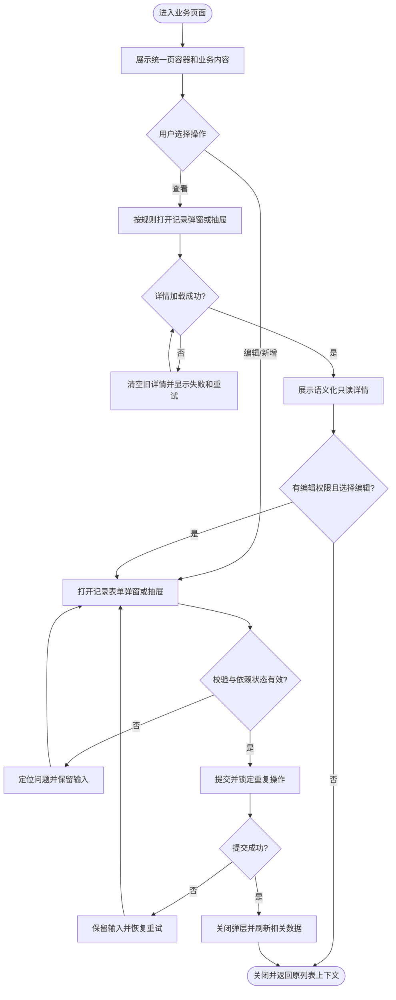

# Saber 中前台视觉体系与记录弹层统一需求文档

## 1. 文档信息

| 项目 | 内容 |
| --- | --- |
| 需求名称 | Saber 中前台视觉体系与记录弹层统一 |
| 需求编号 | REQ-2026-011 |
| 文档版本 | 0.9 |
| 所属模块 | 前端基础能力、主布局、工作台、管理端业务页面、查看与编辑弹层 |
| 目标版本/迭代 | Saber 5.x / 中前台体验升级第一阶段 |
| 文档状态 | 开发中 |
| 产品负责人 | 待指定 |
| 技术负责人 | 待指定 |
| 创建日期 | 2026-09-10 |
| 最后更新日期 | 2026-09-11 |
| 关联事项 | [需求索引](../requirements-index.md)；[详细设计 0.9](../design/DESIGN-REQ-2026-011-pro-style-ui-record-panels.md)；[测试文档 0.9](../test/TEST-REQ-2026-011-pro-style-ui-record-panels.md)；数据库设计不涉及；承接 [REQ-2026-001](REQ-2026-001-element-plus-migration.md) 与 [REQ-2026-007](REQ-2026-007-sidebar-collapse-navigation-theme.md) |

## 2. 摘要与目标

### 2.1 摘要

Saber 已完成 Vue 3、TypeScript、Element Plus 和公共 CRUD 页面能力建设，但主布局、工作台、页级信息层级以及
查看/编辑弹层仍存在新旧样式并存、直接使用 Element Plus 弹层、查看态依赖禁用表单、尺寸与状态反馈不统一等问题。
本需求以 Ant Design Pro 官方中后台产品的信息架构和交互组织为参考，使用 Saber 现有 Element Plus、主题 Token、
动态菜单与公共组件独立实现统一的中前台视觉体系和记录弹层体验。

### 2.2 需求目标

1. 建立适用于 Saber 的 Pro 风格设计基线，统一主框架、页面容器、工作台和管理页面的信息层级。
2. 建立标准记录弹窗与记录抽屉，统一新增、查看、编辑、长详情和复杂配置的容器选择、尺寸与交互。
3. 将查看态从普遍使用禁用表单改为语义化只读展示，提高信息可读性并保持与编辑字段的一致顺序。
4. 让常规页面通过主题 Token 和公共组件继承新风格，减少页面级重复样式和逐页视觉漂移。
5. 保持现有业务字段、API、权限、租户、认证、动态菜单和路由契约不变。

### 2.3 衡量指标

| 指标 | 当前值 | 目标值 | 统计口径 |
| --- | ---: | ---: | --- |
| 活动业务页面 Pro 风格覆盖率 | 未形成统一基线 | 100% | 44 个活动 `src/views/**/*.vue` 页面完成分类、继承或专项适配 |
| 查看/编辑弹层统一覆盖率 | `FormDialog`、`DetailDrawer` 与直接弹层并存 | 100% | 业务弹层使用标准组件或登记经评审的专项例外 |
| 查看态禁用表单使用率 | 多个页面使用 | 标准详情为 0 | 查看态不以整表单 disabled 作为默认展示方式 |
| 主题与响应式验收覆盖 | 按既有需求局部验证 | 100% | 代表页覆盖浅色、深色、非默认主色和 1440/1024/375px |

### 2.4 非目标

- 不引入 Ant Design Vue、Pro Components、Ant Design Icons、React、Umi 或其他第二套 UI 运行时。
- 不复制 Ant Design CSS、Less Token、DOM 结构或使用 `.ant-*` 类；参考范围限于信息架构、密度和交互组织。
- 不建立字段 JSON、动态请求或表达式驱动的通用 CRUD/表单引擎。
- 不修改后端接口、数据库结构、数据模型、权限码、租户规则和认证协议。
- 不在本需求中重新设计品牌 Logo、产品命名或登录认证业务流程。
- 不要求所有复杂工具强制使用居中弹窗；超过标准弹层承载能力的内容允许使用抽屉或独立页面。

## 3. 用户故事与范围

### 3.1 用户故事

| 故事编号 | 优先级 | 用户故事 | 典型场景 | 依赖 |
| --- | --- | --- | --- | --- |
| US-001 | Must | 作为管理端用户，我希望所有页面具有一致的导航、标题和内容层级，以便快速定位模块和操作。 | 登录后浏览不同业务模块 | REQ-2026-007 |
| US-002 | Must | 作为业务操作人员，我希望查看和编辑同一记录时弹层位置、字段顺序和操作语义稳定，以便减少理解和切换成本。 | 列表行查看、编辑 | REQ-2026-001 |
| US-003 | Must | 作为只读用户，我希望详情以清晰文本、状态和分组展示，而不是灰色禁用输入框。 | 查看用户、参数、菜单、日志 | 无 |
| US-004 | Must | 作为表单操作人员，我希望加载、失败、校验、提交和关闭状态明确，以免重复提交或丢失输入。 | 新增、编辑和重试 | 现有 Axios 与 composable |
| US-005 | Should | 作为移动端或窄屏用户，我希望弹窗、抽屉、工具栏和主要操作始终可达。 | 1024px、375px 视口 | 响应式主布局 |
| US-006 | Should | 作为管理人员，我希望首页集中展示业务概览、待办、公告和快捷入口，而不是演示磁贴。 | 登录后进入首页 | 业务数据按实际能力提供 |
| US-007 | Must | 作为开发人员，我希望通用组件只承担稳定展示职责，以便复杂业务仍能显式维护和测试。 | 新增或迁移业务页面 | 现有组件边界 |

### 3.2 范围内

- 主框架导航、顶部栏、标签页、内容区和页级标题层级的视觉与交互统一。
- 主题颜色、背景、文字、边框、阴影、间距、圆角、控件高度和弹层尺寸 Token。
- 页面标题、面包屑、描述、状态、页级操作和内容插槽组成的统一页容器。
- 搜索区、列表工具栏、表格、分页、空状态和失败状态的 Pro 风格收敛。
- 标准记录弹窗、记录抽屉、表单分组、详情分组和字段值展示能力。
- 新增、查看、编辑模式的标题、底部按钮、关闭、加载、失败、重试和提交状态。
- 查看态语义化详情、编辑态表单、查看转编辑及权限判断后的入口。
- 首页工作台的信息结构改造；真实指标不足时只展示有可靠数据来源的模块。
- 活动业务页面弹层盘点、迁移和专项例外登记。
- 浅色、深色、动态主色、键盘交互以及 1440px、1024px、375px 响应式验收。

### 3.3 范围外

- 后端新增统计接口、待办聚合接口或公告接口；如工作台确需新增接口，应另行确认需求和后端契约。
- 移动端原生应用或面向消费者的营销首页。
- 重新定义业务字段、校验规则、表单联动和服务端成功条件。
- 将富文本编辑器、代码编辑器、权限树、导入上传等复杂业务强行抽象为通用字段配置。
- 与本需求无关的 Options API 全量迁移、动态路由重构或国际化资源重写。

## 4. 业务流程

### 4.1 页面使用流程

- 前置条件：用户已登录并拥有目标页面和操作权限。
- 触发入口：动态菜单、首页快捷入口、列表查看/编辑/新增操作。
- 最终结果：用户在一致的页面层级和记录弹层中完成原业务操作，业务结果与改造前保持一致。

1. 用户通过导航进入业务页面，系统展示统一页标题、辅助信息和页级操作。
2. 用户查询并在列表中选择查看、编辑或专项操作。
3. 系统按内容复杂度打开标准弹窗、标准抽屉或已登记的专项容器。
4. 系统加载当前记录；成功后展示只读详情或可编辑表单，失败时清空旧内容并提供重试。
5. 查看态用户可以关闭，具备编辑权限时可以转入编辑；编辑态校验通过后提交。
6. 成功后关闭弹层并按业务规则刷新；失败时保留输入和当前上下文。

### 4.2 业务流程图

### 4.3 异常与替代流程

| 编号 | 触发条件 | 系统行为 | 用户提示 | 数据是否改变 |
| --- | --- | --- | --- | :---: |
| EX-001 | 详情加载失败 | 清空上次详情，禁用依赖详情的操作并保留弹层 | 展示失败状态和重新加载 | 否 |
| EX-002 | 快速切换记录且响应乱序 | 仅最后一次目标响应可以更新弹层 | 无额外提示 | 否 |
| EX-003 | 表单校验失败 | 定位首个错误字段，不发送提交请求 | 展示字段校验信息 | 否 |
| EX-004 | 提交失败 | 弹层保持打开，保留输入并恢复按钮 | 复用 Axios 或业务错误提示 | 由后端决定，前端不宣称成功 |
| EX-005 | 提交期间关闭或重复确认 | 阻止关闭和重复提交 | 按钮保持 loading | 否 |
| EX-006 | 用户关闭存在未保存修改的编辑弹层 | 要求确认放弃修改；取消关闭则保留内容 | 展示未保存修改确认 | 否 |
| EX-007 | 视口不足以承载居中弹窗 | 使用移动端全宽规则或改用标准抽屉 | 无 | 否 |
| EX-008 | 页面属于复杂编辑器或主子表 | 使用专项抽屉或独立页面并登记原因 | 无 | 否 |

## 5. 功能需求与验收标准

### 5.1 REQ-001 Pro 风格参考边界与设计基线

- 关联用户故事：`US-001`、`US-005`、`US-007`
- 优先级：Must
- 处理规则：
  1. 参考 Ant Design Pro 官方的导航、页容器、查询列表、弹层和工作台信息组织。
  2. 实现必须使用 Vue 3、Element Plus、Element Plus Icons 和 Saber Token。
  3. 设计基线统一定义字号、间距、圆角、阴影、边框、内容背景、控件高度和状态层级。
  4. 不以像素级复制第三方页面作为唯一验收标准，优先保证 Saber 业务密度、主题和可访问性。
- 输出：可复用的设计 Token、组件规范和代表页视觉基线。

- `AC-001`：Given 检查依赖、源码和构建产物，When 完成本需求改造，Then 不存在 Ant Design Vue、Pro Components、Ant Design Icons、React、Umi 或 `.ant-*` 活动引用。
- `AC-002`：Given 代表页面使用浅色、深色和非默认主色，When 切换主题，Then 布局层级一致且颜色来自 Saber/Element Plus Token。
- `AC-003`：Given 设计评审对照确认的 Pro 风格基线，When 检查间距、标题、工具栏、表格和弹层，Then 无明显跨页面视觉漂移。

### 5.2 REQ-002 主框架与页容器统一

- 关联用户故事：`US-001`、`US-005`
- 优先级：Must
- 处理规则：
  1. 保留侧边、顶部和混合导航以及现有动态菜单契约；切换导航模式时菜单组件重建，已展开的子菜单状态不得跨模式残留。
  2. 桌面侧边模式不显示顶部栏，锁屏、语言和日志入口位于侧栏左下区域，全屏入口已从侧栏与界面设置中移除；界面设置统一为
     视口右侧悬浮入口，尺寸按视口高度比例取值（下限 44px 保证点击可达，上限 56px 避免与主操作抢视觉），侧栏收起时仍然可达。
  3. 侧栏宽度为 240px、收起宽度为 64px；侧栏与顶栏背景统一使用页面底色 Token；菜单项悬停使用侧栏专用悬停 Token，
     选中态使用主色浅色底，避免灰底上无反馈或使用更亮的弱背景。
  4. 侧栏顶部 Logo 区的下边界只在侧栏内部两侧留白 12px，不再与内容区连成通长线；侧边模式的导航标签栏保持 50px，
     与 Logo 区等高对齐。
  5. 侧栏右边界必须从 Logo 顶部连续贯穿至视口底部，顶栏下边界必须从最左贯穿至最右；容器子元素高度必须与父级内容盒一致
     （父级按 `border-box` 计算），不得因多出 1px 或额外宽度覆盖父级边界。
  6. 收起与展开使用统一动效 Token：收起时文案先退场、容器后收；展开时容器起步快、文案随容器淡入，不得出现文字被窄栏裁切、
     退出残留或“慢半拍”的观感；收起态不保留内联二级菜单。
  7. 侧栏菜单搜索暂时隐藏；`top-search` 组件、`sidebar` 变体样式和 `setting.search` 开关保留，顶栏与混合模式的顶栏搜索不受影响。
  8. 顶部模式桌面端：Logo、一级菜单、搜索和账户工具处于同一行；一级菜单限定在 Logo 与右侧工具之间的固定区域内，
     装不下时在区域外侧显示左右箭头移动，不使用折叠式“更多”，箭头不得覆盖菜单项。
  9. 顶部模式一级菜单悬停即给出底色并展开子菜单，鼠标移开后自动收起；子菜单面板宽度贴合内容、条目隐藏图标并向右内缩，
     面板与父级菜单项左对齐。
  10. 混合模式顶部栏跨越完整视口宽度，只包含 Logo、一级菜单、搜索和账户工具，不再包含固定“首页”入口；侧栏及其右边界从顶栏下方开始。
  11. 992px 及以下保留必要的移动菜单打开条；顶部模式的顶栏在移动端仍渲染在内容区，不随离屏侧栏一起隐藏。
  12. 顶部栏、侧栏、标签页和内容区使用统一高度、边界、背景和操作层级。
  13. 业务页面支持统一的面包屑、标题、描述、状态、页级操作和扩展内容。
  14. 页面内容保持中后台紧凑布局，不引入营销式 Hero、装饰卡片或大面积渐变。
- 输出：稳定的应用壳层和页级信息结构。

- `AC-004`：Given 用户切换侧边、顶部和混合导航，When 访问同一动态菜单页面，Then 侧边模式无桌面顶栏、账户工具位于侧栏底部、界面设置入口为右侧悬浮按钮、侧栏与顶栏底色一致、Logo 下边界在侧栏内两侧留白且侧栏右边界从 Logo 顶部连续贯穿到底部；顶部模式的 Logo、一级菜单、搜索和账户工具处于同一行，一级菜单限定在固定区域内且装不下时用区域外侧的左右箭头移动；混合模式顶栏完整跨页、只含 Logo、一级菜单、搜索和账户工具且不被侧栏竖线贯穿；切换模式后不出现自动展开且无法收起的子菜单，三种模式下路由、权限、标签页和内容状态保持正确。
- `AC-005`：Given 页面提供标题、描述、状态和操作，When 在 1440px 与 1024px 展示，Then 信息层级清晰且主要操作不被遮挡。
- `AC-006`：Given 页面没有描述、状态或页级操作，When 使用页容器，Then 不产生空占位或异常高度。

### 5.3 REQ-003 查询列表与工作台统一

- 关联用户故事：`US-001`、`US-005`、`US-006`
- 优先级：Must
- 处理规则：
  1. 查询区保持自动折叠、响应式列数和稳定操作区。
  2. 列表区统一标题、主操作、批量操作、低频操作、刷新、表格和分页层级。
  3. 工作台以可靠业务数据组织指标、趋势、待办、公告和快捷入口；没有真实数据来源的模块不得伪造业务数字。
  4. 空数据、加载和失败状态保持稳定尺寸，不改变主要工具栏位置。
- 输出：统一管理页面和可用工作台。

- `AC-007`：Given 标准 CRUD 页面，When 查询、展开、重置、刷新和分页，Then 每次用户动作只产生一次有效列表请求且布局稳定。
- `AC-008`：Given 表格横向滚动或移动端换行，When 用户执行行操作和分页，Then 主要操作仍可达且文字无不合理截断。
- `AC-009`：Given 工作台数据源不可用，When 页面加载，Then 对应模块展示可恢复失败状态，不展示伪造指标或旧数据。

### 5.4 REQ-004 标准记录弹窗

- 关联用户故事：`US-002`、`US-003`、`US-004`、`US-007`
- 优先级：Must
- 触发入口：标准新增、查看和编辑操作。
- 处理规则：
  1. 弹窗支持 `add`、`view`、`edit` 模式，统一标题、副标题、状态、正文和底部操作。
  2. 标准尺寸使用语义化档位，不允许页面无规则地新增宽度值。
  3. Header 与 footer 固定，正文独立滚动；动态内容不得改变操作区位置。
  4. 查看态默认显示“关闭”；有编辑权限时允许显示“编辑”。
  5. 新增态显示“取消、创建”，编辑态显示“取消、保存”；危险操作不作为默认确认按钮。
  6. 通用组件不持有业务实体、不调用业务 API、不执行页面表单校验。
- 输出：统一弹窗容器及模式事件。

- `AC-010`：Given 用户依次打开同一实体的查看和编辑，When 弹窗展示，Then 容器位置、宽度、字段顺序和标题层级稳定，无明显跳动。
- `AC-011`：Given 弹窗正文超过视口，When 滚动内容，Then 标题、关闭入口和底部主操作始终可达。
- `AC-012`：Given 用户无编辑权限，When 查看记录，Then 不显示查看转编辑入口。
- `AC-013`：Given 通用弹窗组件单独检查，When 审查 props、事件和依赖，Then 不包含业务 API、权限码、字段配置或实体转换。

### 5.5 REQ-005 查看态语义化详情

- 关联用户故事：`US-002`、`US-003`
- 优先级：Must
- 处理规则：
  1. 标准查看态使用详情分组和只读字段，不以整张 disabled 表单作为默认展示。
  2. 字段顺序和分组与编辑态保持一致；移动端由多列降为单列。
  3. 空值统一显示 `-`；状态、字典、日期和长文本使用合适的只读表达。
  4. 可复制字段使用明确复制入口；敏感字段继续脱敏且不得因统一组件泄露。
  5. 查看内容允许业务插槽承载树、附件、富文本和关联列表。
- 输出：可扫描、可复制且语义明确的记录详情。

- `AC-014`：Given 查看标准记录，When 详情加载成功，Then 页面不显示大面积灰色禁用控件，空值、状态和长文本均可辨识。
- `AC-015`：Given 查看与编辑同一记录，When 对比字段，Then 业务字段顺序、分组和格式语义一致，且编辑态才出现输入控件。
- `AC-016`：Given 字段被定义为敏感信息，When 查看、复制或检查 DOM，Then 不出现未授权完整值。

### 5.6 REQ-006 编辑态、失败恢复与未保存保护

- 关联用户故事：`US-002`、`US-004`
- 优先级：Must
- 处理规则：
  1. 编辑详情、远程选项和提交使用独立状态；任一依赖失败时禁止错误提交。
  2. 快速切换记录时，旧响应不得覆盖新目标。
  3. 校验失败不发请求；提交失败保留输入；成功后关闭并按业务规则刷新。
  4. 提交期间阻止重复确认、Esc、遮罩和关闭按钮造成的冲突关闭。
  5. 页面能够声明是否存在未保存修改；存在修改时关闭需确认。
- 输出：可靠的编辑状态链和恢复路径。

- `AC-017`：Given 详情或远程选项加载失败，When 用户尝试保存，Then 不发送提交请求，并提供重新加载或重新选择路径。
- `AC-018`：Given 用户快速打开记录 A 后记录 B，When A 晚于 B 返回，Then 弹层最终只显示并提交 B。
- `AC-019`：Given 提交失败，When 请求结束，Then 弹层保持打开、输入不丢失、按钮恢复且不显示成功。
- `AC-020`：Given 表单存在未保存修改，When 用户关闭，Then 系统要求确认；选择继续编辑后原输入保持不变。

### 5.7 REQ-007 标准记录抽屉与容器选择

- 关联用户故事：`US-002`、`US-005`、`US-007`
- 优先级：Must
- 处理规则：
  1. 简单和中等字段量的标准记录优先使用居中弹窗。
  2. 长详情、树、权限、主子表和需要保留列表上下文的复杂内容使用右侧抽屉。
  3. 编辑器、报表和无法在标准弹层内安全完成的流程可以使用独立页面或专项全屏容器。
  4. 弹窗和抽屉共享视觉 Token、分组、加载、失败、footer 和移动端规则，但保持独立组件实现。
  5. 不符合默认规则的专项容器必须在设计文档中登记原因和验收范围。
- 输出：一致但不过度合并的记录容器体系。

- `AC-021`：Given 日志长详情或权限树，When 打开记录，Then 使用抽屉并保留原列表查询、页码和选择上下文。
- `AC-022`：Given 标准弹窗与抽屉在相同主题下展示，When 对比标题、正文和操作区，Then 字号、间距、边界和状态表达一致。
- `AC-023`：Given 页面使用专项弹层，When 进入评审，Then 设计文档包含选择原因、关闭规则和响应式验收项。

### 5.8 REQ-008 分阶段迁移与代表页

- 关联用户故事：`US-001` 至 `US-007`
- 优先级：Must
- 处理规则：
  1. 第一阶段使用首页、参数管理、用户管理、菜单管理和监控日志作为代表场景。
  2. 参数管理验证简单弹窗；用户管理验证两列复杂表单和远程选项；菜单管理验证树形关系；日志验证纯查看抽屉。
  3. 代表页完成评审后再迁移其他页面，避免未稳定的 API 批量扩散。
  4. 活动页面必须登记为自动继承、局部适配、专项改造或评审例外之一。
  5. 迁移不得改变现有菜单路径、API、权限码、租户字段和业务成功判定。
- 输出：可复用基线、代表页和全量迁移清单。

- `AC-024`：Given 第一阶段代表页完成，When 执行查询、查看、编辑、失败恢复和主题切换，Then 公共规范能够覆盖简单、复杂、树形和只读场景。
- `AC-025`：Given 全量迁移清单，When 检查活动页面，Then 每个页面都有明确分类且不存在未登记的直接业务弹层。
- `AC-026`：Given 改造前后的同一业务操作，When 比较 Network 请求和业务结果，Then API 路径、参数、权限和数据结果保持一致。

## 6. 业务规则与状态

### 6.1 业务规则

| 规则编号 | 规则 | 适用范围 | 违反时行为 |
| --- | --- | --- | --- |
| BR-001 | Ant Design Pro 仅作为官方设计参考，不作为运行时依赖或代码来源 | 全部前端改造 | 依赖或实现退回 |
| BR-002 | 通用组件只负责容器、布局、展示和状态，不持有业务 API、权限码和实体配置 | 公共组件 | 业务逻辑移回模块 |
| BR-003 | 不建立字段配置驱动的通用 CRUD/表单引擎 | 公共能力 | 设计退回评审 |
| BR-004 | 查看态和编辑态字段顺序、分组和业务含义一致 | 标准记录弹层 | 页面整改后验收 |
| BR-005 | 标准查看态不使用整表单 disabled 作为默认实现 | 标准详情 | 使用详情分组整改 |
| BR-006 | 弹窗和抽屉独立实现，共享 Token 和内容基础组件 | 记录弹层 | 不使用大量 variant 分支强行合并 |
| BR-007 | 弹层尺寸使用 `sm`、`md`、`lg` 或经评审的专项尺寸 | 所有业务弹层 | 未登记尺寸不得合并 |
| BR-008 | 页面原有 API、权限、租户、认证和路由契约保持不变 | 全部业务页面 | 停止发布并修正 |
| BR-009 | 普通错误继续由 `axios.ts` 统一处理，页面负责恢复局部状态 | API 操作 | 移除重复普通错误提示 |
| BR-010 | 只有详情和依赖均成功加载时才允许提交 | 编辑弹层 | 禁用确认并提供重试 |
| BR-011 | 特殊工具允许模块内组件，不为追求复用牺牲业务可读性 | 编辑器、树、主子表 | 使用专项设计 |

### 6.2 弹层状态

| 状态 | 含义 | 允许操作 | 可迁移到 |
| --- | --- | --- | --- |
| CLOSED | 弹层关闭 | 打开目标记录 | LOADING、READY |
| LOADING | 详情或依赖加载中 | 关闭；按业务决定是否取消请求 | READY、FAILED、CLOSED |
| FAILED | 加载失败且旧数据已清空 | 重试、关闭 | LOADING、CLOSED |
| READY | 查看或编辑内容可用 | 关闭、转编辑、提交 | DIRTY、SUBMITTING、CLOSED |
| DIRTY | 编辑内容有未保存变化 | 提交、确认放弃、继续编辑 | SUBMITTING、READY、CLOSED |
| SUBMITTING | 提交进行中 | 无重复提交和冲突关闭 | READY、DIRTY、CLOSED |

## 7. 认证与访问边界

### 7.1 资源归属

本需求不新增资源或归属字段。弹层展示和编辑继续使用目标业务既有实例级、租户级或管理员专项规则，通用组件
不得读取、构造或覆盖 `tenantId`。

### 7.2 当前访问规则

| 操作 | 是否需要登录 | 业务前置条件 | 失败行为 |
| --- | :---: | --- | --- |
| 进入主框架和业务页面 | 是 | 现有菜单和路由权限 | 沿用现有登录和无权限处理 |
| 查看记录 | 是 | 现有 `{module}_view` 或专项权限 | 入口隐藏；接口仍由后端授权 |
| 编辑记录 | 是 | 现有 `{module}_edit` 或专项权限 | 不显示转编辑或保存入口；接口仍由后端授权 |
| 新增、删除和专项操作 | 是 | 现有按钮权限、管理员和业务规则 | 沿用现有拒绝与错误处理 |

### 7.3 后续权限影响

不新增权限码。查看转编辑按钮必须复用页面已有编辑权限，不允许通用组件自行拼装或推断权限。

## 8. 页面与交互要求

### 8.1 页面与操作

| 页面/入口 | 用户目标 | 主要操作 | 可见角色 | 原型/参考 |
| --- | --- | --- | --- | --- |
| 主布局 | 在模块间导航并识别当前位置 | 导航、折叠、搜索、主题、标签页 | 已登录用户 | Ant Design Pro 官方布局原则 |
| 首页工作台 | 获取概览并进入高频业务 | 查看指标、待办、公告、快捷入口 | 已登录用户 | 待形成 Saber 原型 |
| 参数管理 | 验证简单记录弹窗 | 查看、新增、编辑、删除 | 对应权限角色 | 第一阶段代表页 |
| 用户管理 | 验证复杂表单与远程选项 | 查看、编辑、角色配置、导入导出 | 对应权限/管理员 | 第一阶段代表页 |
| 菜单管理 | 验证树形关系 | 查看、编辑、新增子项 | 对应权限角色 | 第一阶段代表页 |
| 监控日志 | 验证长只读详情 | 查看、复制、关闭 | 日志查看角色 | 第一阶段代表页 |
| 其他活动页面 | 继承或适配统一规范 | 原有业务操作 | 原有权限角色 | 迁移清单 |

### 8.2 页面与弹层状态

| 状态 | 展示与行为 |
| --- | --- |
| 页面加载中 | 保持导航、页标题和工具区稳定；内容区显示加载状态 |
| 空数据 | 显示明确空状态；新增入口仅在有权限时出现 |
| 页面请求失败 | 保留查询和页面上下文，提供可重试入口 |
| 弹层加载中 | 标题和关闭入口可见；正文显示骨架或 loading，不展示旧详情 |
| 弹层加载失败 | 显示错误说明和重试；依赖数据未恢复前禁止提交 |
| 查看就绪 | 详情分组清晰；关闭和授权后的编辑入口可达 |
| 编辑就绪 | 表单字段、校验和依赖可用；保存按钮状态明确 |
| 存在修改 | 关闭触发放弃修改确认 |
| 提交中 | 锁定重复提交和冲突关闭，正文不跳动 |
| 提交成功 | 显示成功反馈，关闭弹层并刷新相关数据 |

## 9. 质量要求与影响

### 9.1 非功能要求

| 类别 | 要求 | 验证标准 |
| --- | --- | --- |
| 响应式 | 1440px、1024px、375px 下主要内容和操作可达 | 多视口截图与交互检查 |
| 主题 | 浅色、深色和一个非默认主色下对比度、边界和固定列正常 | 主题切换截图 |
| 可访问性 | 弹层焦点、Esc、Tab、关闭、确认、Tooltip 和 aria 名称可用 | 键盘与 DOM 检查 |
| 状态可靠性 | 乱序响应、失败、重试和重复提交不污染当前上下文 | Network 限速与失败注入 |
| 可维护性 | 页面无重复通用弹层样式，公共组件无业务 API 和字段配置 | 静态审查 |
| 兼容性 | 保留现有 API、权限、租户、动态路由和业务结果 | 代表页前后对照 |

### 9.2 数据与接口影响

| 影响项 | 是否涉及 | 需求层说明 | 关联设计 |
| --- | :---: | --- | --- |
| 新增/修改数据实体 | 否 | 仅前端展示与交互调整 | 不涉及数据库设计 |
| 新增/修改 API | 否 | 工作台只使用现有可靠数据源；新增统计接口需另立需求 | [详细设计](../design/DESIGN-REQ-2026-011-pro-style-ui-record-panels.md) |
| 历史数据处理 | 否 | 不改变业务数据 | 不适用 |
| 配置或部署变化 | 否 | 复用现有主题和布局配置 | 详细设计 |
| 外部依赖 | 否 | 不新增 UI 或图标依赖 | 详细设计 |

### 9.3 依赖、风险与开放问题

| 编号 | 类型 | 内容 | 负责人 | 截止日期 | 状态/结论 |
| --- | --- | --- | --- | --- | --- |
| ITEM-001 | 依赖 | 需确认第一阶段代表页视觉原型后再全量迁移 | 产品/设计负责人 | 开发前 | 开放 |
| ITEM-002 | 风险 | 全局 Element Plus 覆盖可能影响未迁移页面 | 前端负责人 | 公共组件实现前 | 使用 Token 和组件所有权控制 |
| ITEM-003 | 风险 | 18 个 FormDialog 页面和直接弹层存在专项行为，批量替换可能遗漏 | 前端/测试负责人 | 全量迁移前 | 建立弹层清单逐项验收 |
| ITEM-004 | 风险 | 查看态与编辑态分别编写模板可能产生字段漂移 | 前端负责人 | 代表页评审 | 使用共同分组契约和页面检查清单 |
| ITEM-005 | 风险 | 工作台缺少统一统计接口时容易出现演示数据 | 产品/后端负责人 | 工作台设计前 | 只展示可靠数据，新增接口另立需求 |
| ITEM-006 | 问题 | 是否在第一迭代完成全部 44 个页面，需结合代表页复用效果排期 | 产品/技术负责人 | 代表页验收后 | 开放 |

## 10. 评审与变更

### 10.1 需求评审清单

- [x] 摘要、目标、非目标和范围已明确。
- [x] 用户故事覆盖主框架、工作台、查看、编辑、响应式和开发边界。
- [x] 业务流程包含详情失败、提交失败、乱序响应和未保存关闭分支。
- [x] 每项 Must 需求均有可执行验收标准。
- [x] 认证、权限、租户、API 和数据库影响已明确为保持现状。
- [x] 数据库设计明确为不涉及。
- [ ] 产品与设计负责人确认代表页视觉基线。
- [ ] 技术负责人确认公共组件命名、迁移批次和专项例外。
- [ ] 测试负责人确认全量页面清单和验收资源。

### 10.2 评审结论

| 评审领域 | 结论 | 评审人 | 日期 | 条件/备注 |
| --- | --- | --- | --- | --- |
| 产品范围 | 待评审 | 待指定 | 待评审 | 需确认代表页和迭代边界 |
| 技术可行性 | 有条件 | Codex | 2026-09-10 | 保留 Element Plus，先验证公共组件和代表页 |
| 测试可验收性 | 待评审 | 待指定 | 待评审 | 需准备多角色、主题和多视口环境 |

### 10.3 变更记录

| 日期 | 版本 | 变更内容 | 原因 | 影响范围 | 修改人 |
| --- | --- | --- | --- | --- | --- |
| 2026-09-10 | 0.1 | 创建需求，确定 Pro 风格中前台改造、记录弹窗/抽屉统一、查看态语义化和分阶段迁移范围 | 用户要求将讨论结果正式归档 | 主布局、工作台、公共组件和全部活动业务页面 | Codex |
| 2026-09-10 | 0.2 | 进入开发阶段；完成 Phase 1 公共能力，并开始接入参数管理与通用日志代表页 | 用户要求根据最新需求开始改造 | 主题 Token、公共组件、参数管理、监控日志 | Codex |
| 2026-09-10 | 0.3 | 修正导航模式显示规则，侧边、顶部和混合布局统一以 `layout` 为事实来源 | 用户反馈侧边导航栏与实际功能不符 | 主布局、顶部菜单、侧栏菜单 | Codex |
| 2026-09-10 | 0.4 | 固定侧边模式的侧栏布局列、收起宽度和层叠边界，避免顶部栏覆盖侧栏区域 | 用户反馈侧边模式下左侧导航仍被顶部栏遮挡 | 主布局、侧栏、顶部栏 | Codex |
| 2026-09-10 | 0.5 | 将侧栏右边界从菜单滚动区上移至整个侧栏容器，边界贯穿 Logo 与菜单 | 用户截图确认问题是 Logo 区域分隔线断开 | Logo、侧栏菜单、导航边界 | Codex |
| 2026-09-10 | 0.6 | 按侧边/混合模式分别控制右边界：侧边贯穿，混合仅菜单区显示 | 用户反馈混合模式顶部区域不应被侧栏竖线分割 | 主布局、Logo、侧栏菜单 | Codex |
| 2026-09-10 | 0.7 | 侧边模式移除桌面顶栏并将账户工具迁至侧栏底部；混合模式改为跨页完整顶栏 | 用户要求导航结构与 Ant Design Pro 的侧边和混合模式一致 | 主布局、顶部栏、侧栏底部工具、菜单搜索和布局预览 | Codex |
| 2026-09-11 | 0.8 | 侧栏宽度调整为 240px，底色与页面底色统一并新增侧栏悬停 Token；Logo 下边界与标签栏连成通长分割线；侧栏菜单搜索暂时隐藏；底部工具移除全屏、界面设置改为右侧悬浮入口并压缩账户行 | 用户依据 Ant Design Pro 参考截图提出四项侧栏调整 | 主布局、侧栏、Logo、标签栏、账户工具区、界面设置触发器与响应式样式 | Codex |
| 2026-09-11 | 0.9 | 按用户逐轮截图反馈收敛导航细节：Logo 分割线改为两侧留白且修正 1px 覆盖导致的分割线断口、底部工具与账户合并为等距一行、折叠按钮配色与位置调整、新增统一动效 Token 并重做收展节奏（文案先退场、展开不裁切）、顶栏底色与侧栏统一、顶部模式改为 Logo/菜单/搜索/账户同一行并限定区域用左右箭头移动（禁用“更多”折叠）、子菜单面板贴合内容且隐藏图标、界面设置统一为右侧悬浮入口并放大、混合模式顶栏移除固定“首页”项、切换导航模式重建菜单状态 | 用户连续反馈导航视觉与交互问题（分割线断口、菜单自动展开、顶部模式布局与滚动方式、动效与按钮尺寸） | 主布局、侧栏、顶栏、标签栏、菜单与弹层、动效 Token、界面设置触发器 | Codex |
