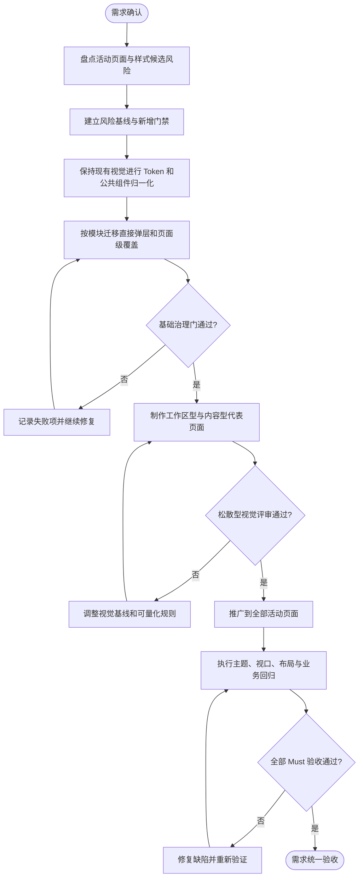
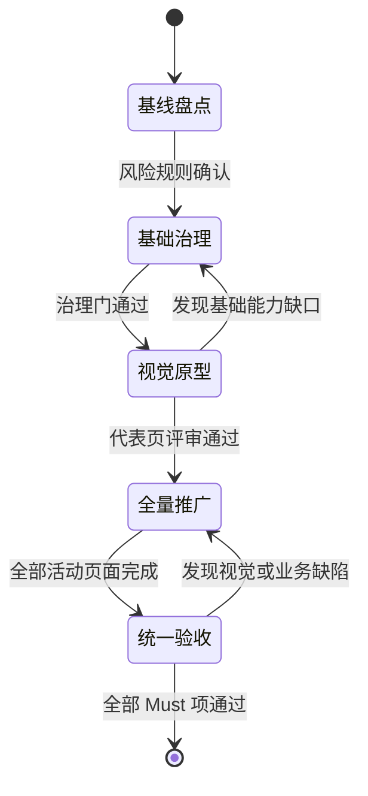

# Saber 界面基础归一化与松散型中前台视觉升级需求文档

## 1. 文档信息

| 项目 | 内容 |
| --- | --- |
| 需求名称 | Saber 界面基础归一化与松散型中前台视觉升级 |
| 需求编号 | REQ-2026-012 |
| 文档版本 | 0.5 |
| 所属模块 | 前端基础能力、主题与主布局、公共组件、登录与公共页面、管理端业务页面、内容型业务页面 |
| 目标版本/迭代 | Saber 5.x / 界面基础治理与视觉升级单阶段 |
| 文档状态 | 开发中 |
| 产品负责人 | 待指定 |
| 技术负责人 | 待指定 |
| 创建日期 | 2026-09-14 |
| 最后更新日期 | 2026-09-14 |
| 关联事项 | [需求索引](../requirements-index.md)；[详细设计 0.4](../design/DESIGN-REQ-2026-012-ui-normalization-spacious-visual-refresh.md)；[测试文档 0.2](../test/TEST-REQ-2026-012-ui-normalization-spacious-visual-refresh.md)；数据库设计不涉及；承接 [REQ-2026-011](REQ-2026-011-pro-style-ui-record-panels.md) 已建立的主题 Token、导航、页容器和记录弹层能力 |

## 2. 摘要与目标

### 2.1 摘要

Saber 已完成 Element Plus 公共页面能力和第一阶段中前台视觉建设，但当前仍存在主题相关颜色、间距、圆角、阴影、
Element Plus 内部样式覆盖以及直接弹窗/抽屉散落在业务页面的问题。如果直接进行白色背景、无边框和圆角视觉改造，
同一设计规则需要在多个页面重复修改，并可能造成浅色/深色主题不一致、局部样式优先级冲突和未迁移页面回归。

本需求作为一个完整实施阶段，内部按“基础归一化与风险治理 -> 松散型视觉升级 -> 全量回归”顺序执行。最终建立一套
兼顾管理工作台、内容浏览、个人中心和偏前台产品页面的统一视觉体系，使页面能够根据业务属性使用工作区型或内容型布局，
同时保持现有业务行为、API、权限、租户、认证和动态路由契约不变。

### 2.2 需求目标

1. 盘点并治理影响主题、公共布局和组件一致性的硬编码、直接弹层和高风险内部样式覆盖。
2. 建立颜色、表面、文字、间距、圆角、阴影、控件尺寸、内容宽度和动效的统一语义规则。
3. 建立可持续的样式检查门禁，阻止业务页面继续新增未登记的主题硬编码和公共组件绕行实现。
4. 将活动页面归类为工作区型、内容型或专项沉浸型，并使用稳定的公共页面和弹层容器。
5. 在基础归一化完成后，将默认视觉升级为留白更充分、层级更柔和、兼顾中前台体验的松散型风格。
6. 保持三种导航模式、浅色/深色主题、动态主色和不同视口下的业务可用性。
7. 保持现有业务字段、接口调用、权限判断、租户边界、认证流程和成功条件不变。

### 2.3 衡量指标

> 初始扫描数量是候选风险项，不等同于缺陷数量；合法的数据色、媒体遮罩和主题预览色需在治理过程中分类登记。

| 指标 | 当前基线 | 目标值 | 统计口径 |
| --- | ---: | ---: | --- |
| 原始颜色候选文件 | 49 | 主题相关未登记项为 0 | 扫描 `src` 中颜色字面量并排除已登记合法例外 |
| 固定间距候选文件 | 42 | 公共布局和业务页面未登记设计间距为 0 | 允许组件局部几何尺寸和已登记专项编辑器例外 |
| 圆角候选文件 | 23 | 业务页面未登记圆角为 0 | 圆角由 Saber/Element Plus Token 或公共组件提供 |
| 阴影候选文件 | 13 | 业务页面未登记阴影为 0 | 浮层和媒体卡片专项阴影需登记语义 |
| 直接 `el-dialog` 文件 | 10 | 标准业务弹窗为 0 | 公共基础组件内部和经评审专项弹窗除外 |
| 直接 `el-drawer` 文件 | 6 | 标准业务抽屉为 0 | 公共基础组件内部和经评审专项抽屉除外 |
| 活动页面布局分类覆盖率 | 未统一登记 | 100% | 每个活动页面明确为工作区型、内容型或专项沉浸型 |
| 代表场景视觉验收覆盖率 | 未形成统一松散基线 | 100% | 标准 CRUD、复杂授权、内容型产品页面均通过主题和视口验收 |

### 2.4 非目标

- 不拆分为两个独立需求、两个长期分支或两套永久并存的“经典/年轻”主题。
- 不在基础治理完成前直接批量修改页面背景、间距、圆角和控件尺寸。
- 不要求清除所有数值和颜色字面量；图表数据色、图片遮罩、主题预览和组件内部几何尺寸允许按规则登记。
- 不把所有页面改成无边框；输入控件、危险操作、表格分隔和需要明确可操作边界的区域仍应保留必要边界。
- 不把所有页面改成营销首页、超大标题、大面积 Hero、装饰性卡片或低信息密度展示。
- 不引入 Ant Design Vue、Avue、第二套 UI 组件库或新的 CSS 运行时。
- 不建立 JSON 配置驱动的通用 CRUD、表单或页面渲染引擎。
- 不修改后端接口、数据库、业务字段、权限码、租户规则、认证协议和动态菜单组件路径。
- 不在本需求中完成与视觉无关的 Options API 全量迁移、路由重构或业务功能重写。

## 3. 用户故事与范围

### 3.1 用户故事

| 故事编号 | 优先级 | 用户故事 | 典型场景 | 依赖 |
| --- | --- | --- | --- | --- |
| US-001 | Must | 作为长期维护 Saber 的开发人员，我希望主题和布局样式来自统一语义规则，以便后续改版不再逐页修改硬编码。 | 新增页面、升级 Element Plus、调整主题 | REQ-2026-011 |
| US-002 | Must | 作为管理操作人员，我希望列表、表单、授权和弹层在不同模块中具有稳定结构，同时有更舒适的行高和留白。 | 日常查询、编辑、授权和查看详情 | 现有公共组件 |
| US-003 | Must | 作为内容浏览或配置人员，我希望详情、个人中心和产品型页面不是被强制压缩成表格后台，以便更自然地阅读和操作。 | 个人中心、提示词、详情和内容页面 | 统一页容器 |
| US-004 | Must | 作为主题使用者，我希望浅色、深色和动态主色下均保持一致层级，不出现局部固定白底、黑字或不可读状态。 | 切换主题与主色 | 现有主题设置 |
| US-005 | Should | 作为窄屏用户，我希望更松散的布局在 1024px 和 375px 下能够有序收缩，而不是发生遮挡或主要操作不可达。 | 平板和移动视口 | 响应式布局 |
| US-006 | Must | 作为评审和测试人员，我希望基础治理和视觉改造具有明确进入条件、例外清单和验收证据，以便区分结构风险和视觉偏好。 | 需求评审、设计评审、回归验收 | 样式审计与测试文档 |

### 3.2 范围内

- 当前活动代码中的主题颜色、文字颜色、背景、边框、圆角、阴影、设计间距和动效候选项盘点。
- 合法硬编码例外分类、登记和后续新增门禁。
- 主布局、登录页、错误页、欢迎页、个人中心、业务页面和专项编辑器的布局类型登记。
- Saber 主题 Token 和必要的 Element Plus 变量映射。
- `PageContainer`、`BasicContainer`、`SearchPanel`、`ListPanel`、`FormDialog`、`DetailDrawer`、表单/详情分组等公共能力收敛。
- 直接使用 Element Plus 弹窗、抽屉和页面级公共结构覆盖的盘点、迁移或专项例外登记。
- 工作区型页面、内容型页面和专项沉浸型页面的宽度、间距和响应式规则。
- 白色主工作区、浅色导航区域、松散间距、分级圆角、柔和选中态和浮层视觉升级。
- 表格、查询表单、普通表单、详情、标签页、菜单、弹窗、抽屉、空状态、加载和失败状态的视觉统一。
- 浅色、深色、动态主色、侧边/顶部/混合导航以及 1440px、1024px、375px 的代表场景验收。
- 现有业务流程、权限、租户、认证、API 和动态路由行为回归。

### 3.3 范围外

- 新增后端统计、内容、个性化主题或用户偏好接口。
- 新增永久视觉版本开关，或长期维护同一页面的两套 DOM/CSS。
- 修改登录方式、Token、OAuth Basic 头、SM2 加密、多租户开关和后端安全边界。
- 修改图表或业务数据本身的颜色含义；本需求只治理其定义位置和主题适配规则。
- 将富文本、代码编辑器、媒体预览、权限树等专项能力强制封装成通用字段组件。
- 对非活动历史文档、构建产物或 Git 历史中的旧 Avue 页面进行视觉迁移。

## 4. 业务流程

### 4.1 流程说明

- 前置条件：REQ-2026-011 已建立的 Vue 3、Element Plus、主题 Token、公共页容器和记录弹层能力可继续复用。
- 触发入口：本需求评审确认后进入同一实施阶段。
- 最终结果：所有活动页面先完成基础归一化并通过治理门，再统一启用松散型视觉，最终作为一个需求整体验收。

1. 团队确认活动页面范围、候选风险扫描规则和合法例外分类。
2. 系统生成当前样式风险基线，阻止继续新增未登记风险项。
3. 在保持视觉和业务行为基本不变的前提下，建立语义 Token 并收敛公共页面、弹窗和抽屉结构。
4. 按模块迁移业务页面，逐步减少风险基线并记录专项例外。
5. 基础归一化达到进入条件后，在代表页面验证松散型工作区和内容型布局。
6. 代表页面评审通过后，通过 Token 和公共组件推广视觉基线，专项页面按登记规则适配。
7. 完成主题、布局、视口、业务状态和静态工程检查后进行统一验收。

### 4.2 业务流程图

### 4.3 异常与替代流程

| 编号 | 触发条件 | 系统行为 | 用户/团队提示 | 业务数据是否改变 |
| --- | --- | --- | --- | :---: |
| EX-001 | 扫描命中图表数据色、媒体遮罩或主题预览 | 标记为候选例外并要求说明用途，不机械替换 | 输出例外原因和所属组件 | 否 |
| EX-002 | 直接弹窗或抽屉无法由公共组件稳定承载 | 评审为专项弹层，复用公共 Token 和状态规则并登记例外 | 在设计和审计基线中记录原因 | 否 |
| EX-003 | 基础归一化导致可见视觉或业务行为变化 | 暂停该批次推广，恢复到原有可观察行为后再进入视觉阶段 | 记录回归页面和差异 | 否 |
| EX-004 | 松散间距导致表格列、工具栏或移动端操作不可达 | 对目标页面使用工作区响应式规则，不退回局部无规则硬编码 | 记录页面级适配结论 | 否 |
| EX-005 | 深色或动态主色下出现不可读状态 | 禁止通过验收，修正语义 Token 或组件状态映射 | 标记主题阻断项 | 否 |
| EX-006 | Element Plus 升级导致内部类覆盖失效 | 优先收敛到公共组件公开结构；确需覆盖时缩小范围并登记 | 记录版本影响和替代方案 | 否 |
| EX-007 | 视觉改造影响业务请求、权限或路由 | 视为阻断回归，恢复原契约并单独处理 | 不允许以视觉需求改变业务结果 | 否 |

## 5. 功能需求与验收标准

### 5.1 REQ-001 界面风险盘点与基线管理

#### 5.1.1 需求说明

- 关联用户故事：`US-001`、`US-006`
- 优先级：Must
- 触发入口：本需求进入开发前的活动代码扫描。
- 处理规则：
  1. 扫描颜色、背景、边框、圆角、阴影、设计间距、动效、直接弹窗/抽屉、`!important` 和 Element Plus 内部结构覆盖。
  2. 扫描结果必须区分主题风险、公共布局风险、组件局部几何、业务数据色、媒体视觉和主题预览，不得把命中数量直接等同于缺陷数量。
  3. 每个保留例外必须包含文件、用途、所有者类型、保留原因和后续处理方式。
  4. 初始基线允许存量问题存在，但后续新增未登记风险项必须被工程检查发现。
- 输出：可持续维护的风险报告、例外清单和新增门禁。

#### 5.1.2 验收标准

- `AC-001`：Given 当前活动源码，When 执行样式风险检查，Then 报告至少覆盖颜色、间距、圆角、阴影、直接弹层和高风险内部覆盖六类结果。
- `AC-002`：Given 扫描命中合法的数据色或主题预览色，When 查看报告，Then 该项具有明确例外分类和原因，不被误报为必须替换的主题缺陷。
- `AC-003`：Given 开发人员在业务页面新增未登记主题颜色、圆角、阴影或直接标准弹层，When 执行工程门禁，Then 检查失败并定位到具体文件和规则。
- `AC-004`：Given 已完成一批迁移，When 更新风险基线，Then 只能减少或显式调整已评审例外，不能静默接受新风险项。

### 5.2 REQ-002 语义 Token 与主题来源统一

#### 5.2.1 需求说明

- 关联用户故事：`US-001`、`US-004`
- 优先级：Must
- 处理规则：
  1. 统一定义画布、导航区域、普通表面、弱表面、浮层、文字、边框、状态、间距、圆角、阴影、尺寸、内容宽度和动效语义。
  2. Element Plus 变量只承担组件库公开主题能力，Saber Token 承担应用布局和业务组件语义，二者映射关系必须明确。
  3. 登录、错误页、个人中心和专项页面允许使用模块 Token，但必须能够追溯到统一明暗主题语义。
  4. 基础归一化阶段先映射为现有可观察值，不借 Token 建设提前改变全局视觉。
- 输出：可被主框架、公共组件和业务页面复用的统一主题来源。

#### 5.2.2 验收标准

- `AC-005`：Given 浅色、深色和动态主色，When 查看主框架、标准页面和公共弹层，Then 主题相关颜色均可追溯到 Saber 或 Element Plus 语义变量。
- `AC-006`：Given 登录页、错误页和个人中心，When 切换明暗主题，Then 不出现固定白底黑字、不可读边界或与主应用完全脱节的状态色。
- `AC-007`：Given 基础归一化阶段完成，When 对比迁移前后的代表页面，Then 除明确缺陷修复外，页面结构、业务行为和主要视觉不发生主动改版。
- `AC-008`：Given 调整统一间距、圆角或浮层 Token，When 检查标准公共组件，Then 无需在多个业务页面重复修改同类样式。

### 5.3 REQ-003 页面类型与统一骨架

#### 5.3.1 需求说明

- 关联用户故事：`US-002`、`US-003`、`US-005`
- 优先级：Must
- 处理规则：
  1. 每个活动页面必须登记为工作区型、内容型或专项沉浸型。
  2. 工作区型用于表格、树表、配置和批量操作，允许使用可用满宽，但仍使用统一页面外边距和 Section 间距。
  3. 内容型用于详情、个人中心、阅读和偏产品配置页面，正文居中并使用统一最大内容宽度。
  4. 专项沉浸型用于代码、富文本、媒体或复杂主子编辑器，允许突破普通宽度，但必须复用主题和响应式规则。
  5. 标准页面统一承担面包屑、标题、描述、状态、页级操作和内容区域，不允许每个页面复制不同标题栏。
- 输出：全部活动页面的布局分类和稳定页面骨架。

#### 5.3.2 验收标准

- `AC-009`：Given 活动业务页面清单，When 完成基础归一化，Then 每个页面都有唯一布局类型和对应公共容器或专项说明。
- `AC-010`：Given 工作区型列表页面，When 在 1440px 和 1024px 展示，Then 表格有效利用宽度，搜索、工具栏和分页保持稳定间距。
- `AC-011`：Given 内容型页面，When 在宽屏展示，Then 内容不会无边界铺满超宽视口，标题、正文和操作区保持可阅读宽度。
- `AC-012`：Given 页面缺少描述、状态或页级操作，When 使用统一页容器，Then 不产生空占位、重复边框或异常高度。

### 5.4 REQ-004 公共容器、弹窗与抽屉归一化

#### 5.4.1 需求说明

- 关联用户故事：`US-001`、`US-002`、`US-005`
- 优先级：Must
- 处理规则：
  1. 标准查询、列表、表单、详情、弹窗和抽屉使用已有公共组件或经设计确认的增强能力。
  2. 修正公共组件属性与实际可见效果不一致的问题，属性必须由拥有可见表面的元素消费。
  3. 标准业务页面不再直接复制 Element Plus 弹层 header、body、footer、滚动、关闭和移动端规则。
  4. 专项弹层可以保留独立业务内容，但应复用公共浮层 Token、关闭保护、加载失败、底部操作和响应式规则。
  5. 公共组件不得持有业务 API、权限码、实体字段配置或模块专用状态。
- 输出：职责稳定且视觉来源统一的公共页面与浮层容器。

#### 5.4.2 验收标准

- `AC-013`：Given 标准新增、编辑、查看和详情场景，When 检查业务页面，Then 使用公共弹窗或抽屉，页面不重复定义通用浮层结构。
- `AC-014`：Given 专项授权、版本、预览或编辑器弹层，When 无法直接使用标准容器，Then 存在经评审的专项原因并复用公共主题和状态规则。
- `AC-015`：Given 弹层正文超过视口，When 用户滚动，Then header、关闭入口和主要底部操作始终可达。
- `AC-016`：Given 提交中、加载失败或存在未保存修改，When 用户重复提交或关闭，Then 行为与公共弹层约定一致且不丢失输入。
- `AC-017`：Given 检查公共组件依赖，When 审查代码，Then 不包含业务 API、模块权限码或实体字段转换。

### 5.5 REQ-005 页面级硬编码与内部覆盖治理

#### 5.5.1 需求说明

- 关联用户故事：`US-001`、`US-004`、`US-006`
- 优先级：Must
- 处理规则：
  1. 主题相关颜色、普通圆角、公共阴影和设计间距从业务页面迁移到 Token、公共组件或组件局部变量。
  2. 不禁止所有 `px`、颜色或 `:deep()`；组件几何、数据色和第三方编辑器必要适配按最小范围保留。
  3. 对 Element Plus 内部结构的覆盖必须优先收敛到公共组件，无法避免时限定在所属组件根类下。
  4. `!important` 仅用于第三方优先级或明确兼容问题，必须能够说明原因。
  5. 页面迁移不得顺带改变接口参数、字段、权限、租户和成功条件。
- 输出：可审计、可维护且不会继续扩散的业务页面样式。

#### 5.5.2 验收标准

- `AC-018`：Given 标准业务页面，When 检查主题相关 CSS，Then 不存在未登记原始颜色、普通阴影和与公共规则重复的圆角。
- `AC-019`：Given 页面需要固定编辑器高度、图表颜色或媒体遮罩，When 检查实现，Then 该值具有局部语义或例外登记，不被错误提升为全局 Token。
- `AC-020`：Given 页面覆盖 Element Plus 内部结构，When 检查选择器，Then 作用域限定在组件根类且不影响无关页面。
- `AC-021`：Given 完成任一模块迁移，When 执行业务回归，Then 请求次数、参数、权限显示、分页和错误恢复与迁移前一致。

### 5.6 REQ-006 基础治理进入门

#### 5.6.1 需求说明

- 关联用户故事：`US-006`
- 优先级：Must
- 处理规则：
  1. 风险门禁可执行，新增未登记风险能够阻断检查。
  2. 所有活动页面完成布局分类。
  3. 标准业务弹层完成迁移，专项弹层完成登记。
  4. 代表模块完成基础归一化并通过类型检查、构建和业务行为检查。
  5. 未达到进入条件前，不允许通过批量修改 Token 启用松散型视觉。
- 输出：进入视觉升级阶段的明确评审结论。

#### 5.6.2 验收标准

- `AC-022`：Given 基础治理准备进入视觉升级，When 执行进入检查，Then 风险门禁、页面分类、标准弹层收敛和代表模块工程检查均有结果记录。
- `AC-023`：Given 仍有未解释的主题硬编码、直接标准弹层或跨页面样式覆盖，When 进行进入评审，Then 结论不得为通过。
- `AC-024`：Given 基础治理门通过，When 开始视觉原型，Then 视觉调整主要通过 Token、公共组件和已登记页面类型完成。

### 5.7 REQ-007 松散型视觉基线

#### 5.7.1 需求说明

- 关联用户故事：`US-002`、`US-003`、`US-004`
- 优先级：Must
- 处理规则：
  1. 浅色主题主工作区以白色为主，导航和次级区域使用极浅中性色形成柔和层级，不使用大面积沉重灰底。
  2. 页面主要通过留白、分组标题和弱分隔组织内容，避免每个 Section 都成为带边框和阴影的卡片。
  3. 普通控件目标高度为 36 至 40px，侧栏菜单为 44 至 48px，普通表格数据行为 48 至 52px。
  4. 桌面页面外边距目标为 24 至 32px，Section 间距为 24 至 32px，表单项纵向间距为 20 至 24px。
  5. 控件、选中态/普通容器和浮层使用约 6px、8px、12px 的分级圆角，不能通过一个全局大圆角覆盖所有组件。
  6. 普通表面默认无阴影；悬浮菜单、弹窗和抽屉使用有层级含义的浮层阴影。
  7. 表单控件、危险操作和需要明确可操作边界的区域保留必要边框，不追求绝对无边框。
- 输出：兼顾效率、阅读和产品感的统一松散型视觉基线。

#### 5.7.2 验收标准

- `AC-025`：Given 浅色主题标准页面，When 用户在主布局中浏览，Then 主工作区为白色主表面，导航区域轻度退后且不存在沉重大面积灰底。
- `AC-026`：Given 同一页面包含查询、列表和详情分组，When 查看布局，Then 层级主要由留白、标题和弱分隔表达，不出现多层卡片嵌套。
- `AC-027`：Given 表格、表单和侧栏菜单，When 与治理阶段基线对比，Then 行高和操作留白明显增加，但常用操作仍可在目标视口有效完成。
- `AC-028`：Given 输入框、下拉、危险操作和弹层，When 查看视觉，Then 可操作边界清晰，不因“无边框”目标丢失可发现性。
- `AC-029`：Given 普通容器与浮层同时出现，When 比较层级，Then 普通容器无无意义阴影，弹窗和抽屉具有明确且克制的浮层层级。

### 5.8 REQ-008 导航、页签与选中反馈升级

#### 5.8.1 需求说明

- 关联用户故事：`US-002`、`US-004`、`US-005`
- 优先级：Must
- 处理规则：
  1. 侧栏选中态使用有内缩的圆角弱主题背景、主题色文字/图标和适度字重，不再依赖贯穿菜单项的硬质左侧色条。
  2. 路由标签可使用圆角弱背景表达当前页；业务内容 Tab 根据场景使用下划线或分段选择，不把所有 Tab 改为胶囊按钮。
  3. hover、active、selected 和 focus-visible 必须可区分，不能只依赖颜色变化表达键盘焦点。
  4. 保持侧边、顶部、混合导航现有路由、展开、折叠、滚动和账户工具行为。
  5. 交互动效使用统一快速和普通时长，不使用弹跳、过度缩放或影响操作响应的动画。
- 输出：柔和、圆角、可辨识且不改变导航契约的交互反馈。

#### 5.8.2 验收标准

- `AC-030`：Given 侧栏存在当前菜单、悬停菜单和键盘焦点菜单，When 逐项操作，Then 三种状态均可明确区分且选中背景不贴满侧栏边缘。
- `AC-031`：Given 路由标签和页面内容 Tab 同时存在，When 查看当前状态，Then 两类控件层级不同，不形成连续多层胶囊视觉。
- `AC-032`：Given 用户切换三种导航模式，When 导航重建和路由变化，Then 原有菜单、标签、搜索和账户工具行为保持正确。
- `AC-033`：Given 用户使用键盘导航，When 焦点进入菜单、页签和图标按钮，Then 存在可见焦点环且不被圆角或 overflow 裁切。

### 5.9 REQ-009 工作区型与内容型页面体验

#### 5.9.1 需求说明

- 关联用户故事：`US-002`、`US-003`、`US-005`
- 优先级：Must
- 处理规则：
  1. 工作区型页面保持查询、工具栏、表格、分页和批量操作效率，不因增加留白导致主要操作折叠或不可达。
  2. 内容型页面使用约 1200 至 1360px 的目标最大内容宽度，标题、描述、分组和正文具有更充分纵向留白。
  3. 详情、个人中心、提示词等偏产品页面可以使用更清晰的信息分组和只读展示，不强制套用标准表格卡片。
  4. 工作区和内容型页面共享主题、字体、按钮、状态和浮层规则，不形成两套产品。
  5. `system/param.vue`、`authority/role.vue`、`asset/prompt.vue` 分别作为标准 CRUD、复杂授权和偏产品页面代表场景。
- 输出：同一视觉体系下兼顾后台效率和前台阅读体验的页面模式。

#### 5.9.2 验收标准

- `AC-034`：Given 参数管理代表页，When 查询、操作、分页和编辑，Then 布局更宽松且一次操作只产生一次有效请求。
- `AC-035`：Given 角色管理代表页，When 使用复杂表单和授权弹层，Then 增加留白后树、表单、Tab 和底部操作仍保持稳定可达。
- `AC-036`：Given 提示词管理代表页，When 浏览、编辑、预览和查看版本，Then 页面具有内容型产品体验且不脱离 Saber 主框架。
- `AC-037`：Given 内容型页面在超宽视口展示，When 查看正文，Then 内容宽度受控；Given 工作区型页面，Then 数据区域可以使用可用满宽。

### 5.10 REQ-010 主题、响应式、可访问性与统一验收

#### 5.10.1 需求说明

- 关联用户故事：`US-004`、`US-005`、`US-006`
- 优先级：Must
- 处理规则：
  1. 浅色、深色和动态主色下均需验证表面、文字、边界、状态、选中、悬停和焦点。
  2. 1440px、1024px、375px 下验证工作区型、内容型、弹窗、抽屉和主导航。
  3. 移动端允许工具栏换行、表格横向滚动、弹窗/抽屉全宽，但主要操作必须可达。
  4. 浮层在移动端贴合屏幕边缘时不得保留造成空隙或内容裁切的不合理圆角。
  5. 改造不得新增第二套 UI 依赖，不得重新引入 Avue 或改变业务契约。
  6. 本需求只有基础治理和视觉升级全部通过后才能标记为已验收。
- 输出：完整工程检查、视觉验收和业务回归结果。

#### 5.10.2 验收标准

- `AC-038`：Given 浅色、深色和至少一种非默认主色，When 浏览代表页面和浮层，Then 不存在不可读文字、固定错误底色或状态混淆。
- `AC-039`：Given 1440px、1024px、375px 视口，When 完成代表页面主流程，Then 文字和控件不重叠，主要操作、关闭和确认入口可达。
- `AC-040`：Given 检查依赖和活动源码，When 完成本需求，Then 不存在 Avue、Ant Design Vue 或第二套 UI 运行时引用。
- `AC-041`：Given 运行类型检查、生产构建和样式门禁，When 任一 Must 工程检查失败，Then 需求不得进入统一验收。
- `AC-042`：Given 登录、权限、租户、文件和业务流程尚未在真实环境完成，When 归档测试结果，Then 对应项保持未执行或阻塞，不使用静态检查推断业务通过。

## 6. 业务规则与状态

### 6.1 业务规则

| 规则编号 | 规则 | 适用范围 | 违反时行为 |
| --- | --- | --- | --- |
| BR-001 | 基础归一化和松散型视觉升级属于同一需求、同一最终验收，但视觉升级必须以基础治理门通过为前置条件 | 全需求 | 不允许绕过治理门批量改视觉 |
| BR-002 | REQ-2026-012 覆盖 REQ-2026-011 的“中后台紧凑布局”视觉基线；REQ-2026-011 已实现且不冲突的导航、弹层和状态行为继续有效 | 需求关系 | 以本需求最新确认的密度和页面模式为准 |
| BR-003 | 主题相关值必须使用语义 Token；数据色、媒体视觉、主题预览和局部几何可以登记为例外 | 样式治理 | 未登记项阻断工程检查 |
| BR-004 | 标准业务弹窗和抽屉使用公共组件；专项弹层必须说明无法标准化的原因 | 业务弹层 | 不允许复制通用浮层结构 |
| BR-005 | 工作区型、内容型和专项沉浸型共享同一品牌、主题和组件状态，不形成独立子产品 | 页面布局 | 设计评审不通过 |
| BR-006 | 无边框只适用于普通内容表面，不适用于所有输入、危险操作和可操作边界 | 全部页面 | 恢复必要边界后验收 |
| BR-007 | 不永久维护经典/年轻双视觉；需要灰度时使用短期发布控制，不复制业务模板 | 发布 | 不接受长期双分支实现 |
| BR-008 | 视觉改造不得改变 API、权限、租户、认证、动态路由和业务成功条件 | 全部业务页面 | 视为阻断回归 |
| BR-009 | 不重新引入 Avue、Ant Design Vue、第二套图标或 UI 组件库 | 全部前端 | 依赖和实现退回 |
| BR-010 | 页面级例外必须最小化作用域并具备明确所有者和移除条件 | 专项页面 | 不允许整文件或整模块无理由放行 |

### 6.2 阶段状态与迁移

| 内部状态 | 含义 | 允许操作 | 进入下一状态条件 |
| --- | --- | --- | --- |
| 基线盘点 | 识别候选风险、活动页面和例外 | 扫描、分类、评审 | 风险基线和检查规则确认 |
| 基础治理 | 归一化 Token、公共组件和页面结构 | 迁移、缺陷修复、减少基线 | AC-001 至 AC-024 通过 |
| 视觉原型 | 在三类代表页面验证松散型视觉 | 调整视觉基线 | 代表页产品与技术评审通过 |
| 全量推广 | 按页面类型应用新视觉 | 批量迁移、专项适配 | 全部活动页面完成 |
| 统一验收 | 工程、视觉和业务回归 | 修复、重试、归档结果 | 全部 Must 验收标准通过 |

## 7. 认证与访问边界

### 7.1 资源归属

| 资源 | 归属类型 | 归属字段 | 字段来源 | 说明 |
| --- | --- | --- | --- | --- |
| 主题和界面设置 | 当前用户浏览器设置 | 不涉及后端归属字段 | 现有 common store 与本地设置 | 不新增服务端个性化接口 |
| 业务页面数据 | 保持各模块现有归属 | 保持现有字段 | 后端业务和安全上下文 | 本需求不改变数据边界 |

### 7.2 当前访问规则

| 操作 | 是否需要登录 | 业务前置条件 | 失败行为 |
| --- | :---: | --- | --- |
| 使用主布局和业务页面 | 是 | 用户已登录并拥有现有菜单/按钮权限 | 沿用现有登录跳转和后端授权错误 |
| 使用登录页和公共错误页 | 否或按现有流程 | 沿用现有路由守卫 | 不改变认证结果和跳转逻辑 |
| 修改界面主题和布局 | 是 | 使用现有界面设置入口 | 保持当前设置或恢复默认，不影响业务数据 |

### 7.3 后续权限影响

- 本需求不新增权限资源、权限动作或角色配置。
- 页面按钮仍使用现有 `{module}_{action}` 权限码，后端仍是最终安全边界。
- 样式门禁属于工程能力，不提供给普通业务用户操作。

## 8. 页面与交互要求

### 8.1 页面与操作

| 页面/入口 | 用户目标 | 主要操作 | 可见角色 | 原型链接 |
| --- | --- | --- | --- | --- |
| 主布局 | 在模块间导航并识别当前位置 | 导航、折叠、标签、搜索、主题、账户工具 | 已登录用户 | 待视觉原型 |
| 工作区型页面 | 高效完成查询、批量处理和配置 | 查询、重置、工具栏、表格、分页、弹层 | 具有现有页面权限的用户 | `system/param.vue` 代表页 |
| 复杂授权页面 | 在较多信息中完成编辑和授权 | 表单、树、Tab、授权、确认 | 具有现有授权权限的用户 | `authority/role.vue` 代表页 |
| 内容型产品页面 | 阅读、编辑和预览较长内容 | 浏览、编辑、预览、版本、详情 | 具有现有页面权限的用户 | `asset/prompt.vue` 代表页 |
| 登录、错误与个人中心 | 完成公共访问和个人信息操作 | 登录、查看错误、维护个人信息 | 按现有访问规则 | 待视觉原型 |

### 8.2 页面状态

| 状态 | 展示与行为 |
| --- | --- |
| 加载中 | 保持页面和工具区稳定尺寸；只对正在加载的区域显示反馈并禁用冲突操作 |
| 空数据 | 使用统一空状态和必要下一步，不因松散布局产生过大空白或伪造内容 |
| 请求失败 | 清空失效旧数据，展示可恢复失败状态并保留安全重试入口 |
| 提交中 | 保持按钮和弹层结构稳定，阻止重复提交与冲突关闭 |
| 提交成功 | 沿用现有业务刷新、关闭或跳转规则，不因视觉改造改变成功条件 |
| 深色主题 | 使用深色语义表面和边界，不直接反转浅色固定值 |
| 窄屏 | 页面间距收缩、工具栏换行、表格可横向滚动、弹层全宽且主要操作可达 |
| 键盘焦点 | 菜单、页签、按钮、输入和浮层操作具有可见焦点，不只依赖 hover |

## 9. 质量要求与影响

### 9.1 非功能要求

| 类别 | 要求 | 验证标准 |
| --- | --- | --- |
| 可维护性 | 新增主题相关样式可被自动检查，公共规则不在业务页面重复实现 | 样式门禁、例外清单和代码审查 |
| 兼容性 | 保持 Vue 3、Element Plus、Pinia、Axios、动态路由和现有浏览器范围 | 类型检查、生产构建和业务回归 |
| 性能 | 不引入第二套 UI/CSS 运行时，不因双主题模板造成长期重复 DOM | 依赖检查、构建产物和页面检查 |
| 可用性 | 松散布局不降低主要操作可达性，加载、失败和提交状态保持稳定 | 代表页面主流程和异常流程测试 |
| 响应式 | 1440px、1024px、375px 下工作区、内容页和弹层均可使用 | 多视口手工验收 |
| 可访问性 | 焦点、选中、危险操作和状态不能只依赖单一颜色表达 | 键盘、焦点和状态检查 |
| 主题 | 浅色、深色和动态主色下表面、文字、边界和选中态可读 | 主题矩阵验收 |
| 安全 | 不改变认证、权限、租户和敏感信息展示规则 | 代码检查和真实环境权限回归 |

### 9.2 数据与接口影响

| 影响项 | 是否涉及 | 需求层说明 | 关联设计 |
| --- | :---: | --- | --- |
| 新增/修改数据实体 | 否 | 不涉及业务实体和持久化模型 | 数据库设计不涉及 |
| 新增/修改 API | 否 | 沿用现有接口和请求参数 | 详细设计待编写 |
| 历史数据处理 | 否 | 不涉及数据迁移 | 不涉及 |
| 前端主题和公共组件 | 是 | 新增/调整语义 Token、页面模式、公共容器和样式门禁 | [详细设计](../design/DESIGN-REQ-2026-012-ui-normalization-spacious-visual-refresh.md) |
| 前端本地设置 | 原则上否 | 继续使用现有主题、主色和布局设置，不增加永久风格版本字段 | [详细设计](../design/DESIGN-REQ-2026-012-ui-normalization-spacious-visual-refresh.md) |
| 配置或部署变化 | 是，工程脚本 | 增加样式检查入口并纳入开发验证流程 | [详细设计](../design/DESIGN-REQ-2026-012-ui-normalization-spacious-visual-refresh.md) |
| 外部依赖 | 否 | 复用现有 Vue、Element Plus、Sass 和 Node.js 能力 | 不涉及 |

### 9.3 依赖、风险与开放问题

| 编号 | 类型 | 内容 | 负责人 | 截止日期 | 状态/结论 |
| --- | --- | --- | --- | --- | --- |
| ITEM-001 | 依赖 | REQ-2026-011 已完成的主题、导航和弹层能力需作为迁移基线，不得在本需求中无理由推翻 | 前端负责人 | 详细设计评审 | 开放 |
| ITEM-002 | 风险 | 过度禁止字面量会误伤图表、媒体、主题预览和局部几何，导致无意义 Token 泛滥 | 前端负责人 | 样式门禁设计前 | 通过分类和例外机制控制 |
| ITEM-003 | 风险 | 复杂授权、提示词编辑和版本预览弹层可能无法直接套用标准组件 | 前端负责人 | 公共弹层设计前 | 允许经评审专项弹层，复用公共状态和 Token |
| ITEM-004 | 风险 | 松散间距可能降低标准后台列表的首屏数据量和批量操作效率 | 产品/前端 | 视觉原型评审 | 使用工作区型页面平衡密度，不要求所有页面同一留白 |
| ITEM-005 | 风险 | 主工作区白色和无边框表面在复杂页面中可能丢失层级 | 设计/前端 | 视觉原型评审 | 使用浅色区域、弱分隔和标题层级，不绝对无边框 |
| ITEM-006 | 风险 | 深色主题不能简单继承白色主工作区规则，浮层和选中态需要独立语义验证 | 前端负责人 | 代表页完成前 | 开放 |
| ITEM-007 | 问题 | 普通控件高度和内容最大宽度需要在松散体验与工作区效率之间取得平衡 | 产品/设计/前端 | 视觉原型评审 | 详细设计选择默认 40px、内容 1280px，待代表页评审确认 |
| ITEM-008 | 依赖 | 当前仓库没有自动化 UI 测试，真实视觉和业务流程需要按测试文档在目标环境验收 | 测试负责人 | 测试准备 | 开放 |

## 10. 评审与变更

### 10.1 需求评审清单

- [x] 需求作为一个实施阶段，基础治理和视觉升级的先后关系已明确。
- [x] 活动页面清单、页面类型和初始风险候选项已登记并生成工程基线。
- [x] 合法硬编码、专项弹层和第三方适配的例外规则已登记并纳入审计配置。
- [x] 基础治理进入门和阻断条件已由严格审计、类型检查和生产构建验证。
- [x] 工作区型、内容型和专项沉浸型页面边界已登记并落实到全部活动路由页。
- [x] 白色主工作区、浅色导航、松散间距和分级圆角已实现并完成代表页面检查。
- [ ] 代表页面及控件高度、内容宽度等开放参数已完成视觉评审。
- [x] `AC-001` 至 `AC-042` 已在详细设计测试矩阵和正式测试文档中建立映射。
- [x] 数据库和后端 API 不涉及，认证、权限、租户与动态路由保持现有契约。
- [ ] REQ-2026-011 与本需求的保留能力和覆盖规则已完成评审。

### 10.2 评审结论

| 评审领域 | 结论 | 评审人 | 日期 | 条件/备注 |
| --- | --- | --- | --- | --- |
| 产品范围 | 待评审 | 待指定 | 待指定 | 确认页面模式、松散程度和代表页 |
| 视觉基线 | 待评审 | 待指定 | 待指定 | 确认白色主工作区、导航层级、圆角与间距范围 |
| 前端技术 | 待评审 | 待指定 | 待指定 | 确认 Token、审计门禁、公共组件和迁移批次 |
| 测试可验收性 | 待评审 | 待指定 | 待指定 | 建立主题、导航、视口、页面类型和业务回归矩阵 |
| 数据库/API | 不适用 | 待指定 | 待指定 | 不涉及数据和接口变化 |

### 10.3 变更记录

| 日期 | 版本 | 变更内容 | 原因 | 影响范围 | 修改人 |
| --- | --- | --- | --- | --- | --- |
| 2026-09-14 | 0.1 | 建立需求初稿，将样式风险治理、公共能力归一化和松散型中前台视觉升级纳入同一实施阶段，并定义治理进入门、页面模式、例外规则和统一验收标准 | 用户确认先修复散落界面和硬编码风险，再进行兼顾前台体验的松散型改造 | 主题、主布局、公共组件、活动业务页面、工程检查和测试验收 | Codex |
| 2026-09-14 | 0.2 | 建立详细设计关联，选定无新增依赖的样式审计、40px 默认控件、1280px 内容宽度、三类页面模式和统一弹层迁移方案 | 用户要求开始编写详细设计 | 需求状态、技术决策、验收映射和文档链 | Codex |
| 2026-09-14 | 0.3 | 进入开发并完成首批 G0-G2 基础实现：建立 12 类样式审计规则、479 项初始基线和精确例外机制，补齐页面布局类型、语义 Token、动态主色色阶、AppDialog、统一关闭保护及公共容器兼容改造；G3-G5 页面迁移和 V1-V3 视觉推广尚未完成 | 用户要求开始实现最新需求 | 工程门禁、主题基础、公共页面容器、公共弹层和代表页布局声明 | Codex |
| 2026-09-14 | 0.4 | 完成 G3-G5 与 V1-V3：全部活动路由页显式分类，直接 Dialog/Drawer 收敛到 AppDialog/DetailDrawer，颜色/间距/圆角/阴影治理和例外登记完成，启用白色画布与松散视觉基线，完成登录、参数、角色、提示词代表页面的桌面/移动端检查并创建正式测试文档 | 用户要求继续执行后续计划 | 全部活动页面、主题、导航、公共组件、弹层、工程门禁和测试归档 | Codex |
| 2026-09-14 | 0.5 | 修复列表操作列内容溢出：ListPanel 内容区允许横向滚动，RowActions 增加标准“更多”槽，树表和多操作页面将第四个低频操作收进下拉菜单；完成菜单管理 2048px 与 1024px 回归 | 用户反馈菜单列表“新增子项”被固定操作列裁剪 | 公共列表、行操作、菜单、部门、字典、顶部菜单、代码生成和标签管理 | Codex |
