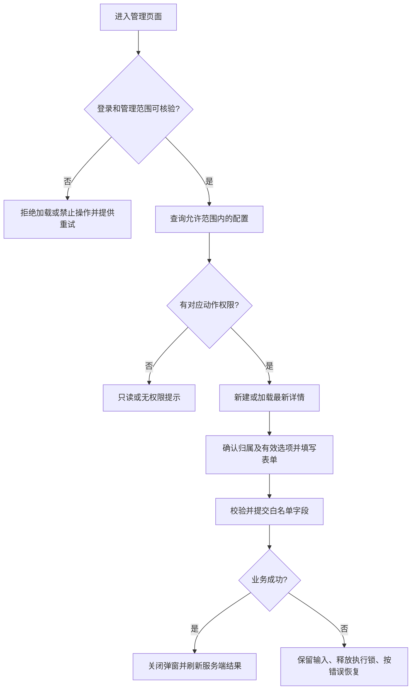

# Saber 大模型供应商与模型配置管理需求文档

## 1. 文档信息

| 项目 | 内容 |
| --- | --- |
| 需求名称 | Saber 大模型供应商与模型配置管理 |
| 需求编号 | REQ-2026-014 |
| 文档版本 | 0.3 |
| 所属模块 | 资产管理、供应商接入、独立模型配置 |
| 目标版本/迭代 | Saber 5.x / 模型配置管理首期，与后端同期交付 |
| 文档状态 | 开发中 |
| 实施阶段 | 第一阶段，完整契约仍待评审 |
| 产品负责人 / 技术负责人 | 待指定 / 待指定 |
| 创建日期 / 最后更新日期 | 2026-09-30 / 2026-09-30 |
| 关联事项 | [需求索引](../requirements-index.md)；[详细设计](../design/DESIGN-REQ-2026-014-ai-model-configuration-frontend.md)；[测试文档](../test/TEST-REQ-2026-014-ai-model-configuration-frontend.md) |
| 数据库设计 | Saber 不涉及；后端表结构、字典与升级由 SpringBlade REQ-2026-008 承接 |
| 后端需求基线 | [SpringBlade REQ-2026-008](../../../SpringBlade/doc/requirements/REQ-2026-008-ai-model-configuration.md) 0.9，最后更新 2026-09-30 |
| 后端设计基线 | [DESIGN-REQ-2026-008](../../../SpringBlade/doc/design/DESIGN-REQ-2026-008-ai-model-configuration.md) 0.4；[DB-REQ-2026-008](../../../SpringBlade/doc/database/DB-REQ-2026-008-ai-model-configuration.md) 0.4 |

根据用户要求，2026-09-30 开始实现第一阶段：管理 API 类型与字段白名单、共享分页失效状态、两个只读列表与详情、
供应商到模型的筛选下钻及三语菜单名称。尚未实现表单和页面写操作，不表示后端已部署或完整功能已就绪。
基线仍取自后端工作区，包含未提交文档和实现；管理上下文、最小归属候选仍待确认。
用户确认补齐菜单后，新增后端只读菜单及查看授权增量脚本，并同步全量种子；实际执行和授权生效待目标环境核验。
不得据此推断评审、迁移或验收已通过。完整写流程开始前须冻结双方契约，具体阶段边界见设计第12节。
跨仓库链接按 Saber 与 SpringBlade 同级检出解析。

## 2. 摘要与目标

### 2.1 摘要

为 SpringBlade 的用户级模型配置能力提供 Saber 管理界面。用户维护自己的供应商接入及独立模型记录；租户管理员
代管本租户用户，平台超级管理员代管所有租户用户。管理页面不读取凭据原值、不调用模型供应商，也不改造现有图片反推。

### 2.2 需求目标

1. 形成供应商配置与模型配置两个可独立授权的管理入口，支持查询、详情、新增、编辑、启停及单记录删除。
2. 管理范围和动作权限相互独立，归属展示、管理员代建及跨租户写入与后端三级范围一致。
3. 供应商凭据只写或替换；模型参数只属于当前模型，不因修改一条记录而改写同供应商的其他模型。
4. 明确默认停用、关联删除限制、编码不复用、并发冲突及依赖失败的可观察反馈。
5. 保持现有 Element Plus、主题、动态菜单及响应式页面体系，不新增运行时依赖。

### 2.3 非目标

- 不提供模型推理、连接测试、自动发现、批量导入导出、效果评测、费用统计、自动路由或默认模型绑定。
- 不调用内部运行配置读取接口，不提供“显示已有密钥”或“清除已有密钥”操作。
- 不修改 `fast-staratlas-ai`、其 YAML 档案、图片反推环境及现有提示词/图片反推流程。
- 不迁移历史模型档案，不新增审计产品、脱敏流程、凭据分发机制或加密方案。
- 不修改认证头、Token 存储、全局租户模式、Axios 错误协议、动态路由装配或全局主题架构。

## 3. 用户故事与范围

### 3.1 用户故事

| 故事编号 | 优先级 | 用户故事 | 典型场景 | 依赖 |
| --- | --- | --- | --- | --- |
| US-001 | Must | 普通用户管理自己的接入与模型，供后续任务使用 | 新增停用配置、维护模型参数 | 登录、管理动作授权 |
| US-002 | Must | 租户管理员为本租户用户代建、修改配置 | 选定同租户所有人 | 已核验管理范围、用户候选 |
| US-003 | Must | 平台超级管理员管理任意租户用户的配置 | 明确目标租户与所有人 | 已核验平台身份、租户与用户候选 |
| US-004 | Must | 配置维护者从有效预设、协议及能力选项录入 | 自定义接入、图文输入模型 | 配置选项 API |
| US-005 | Must | 维护者识别配置状态、并发失败与凭据边界 | 更新失败后保留输入并人工重载 | 业务错误码、版本契约 |

### 3.2 范围内

- 已按用户要求补齐“资产管理 > 供应商配置”和“资产管理 > 模型配置”动态菜单种子；实际数据库部署待执行。
- 供应商按名称、编码、状态查询；模型按编码、供应商、状态查询。管理员按允许范围增加租户或所有人筛选。
- 供应商详情、预设/自定义录入、凭据首次填写与替换、不可变归属展示、启停及关联删除失败反馈。
- 独立模型详情、模型新增和编辑；维护上游标识、API 协议、主要能力、上下文窗口、输入模态及推理档位映射。
- 权限、用户范围、字典选项、详情、提交、行操作分别维护状态；覆盖失败恢复、竞态和误操作确认。
- 形成与后端验收条款对应的前端验收文档，工程检查和真实业务验收分别记录。

### 3.3 范围外

后端数据库、用户范围认证、内部运行身份及凭据读取的实现与验收由后端需求承接。本需求仅提出页面必需的协同缺口，
不在此次规划中修改后端代码或把建议接口写成已存在事实。现有 REQ-2026-013 图片反推仍是独立需求，不扩展其范围。

## 4. 业务流程

### 4.1 流程说明

前置条件：操作者已登录，拥有相应菜单、按钮及后端 API 权限；管理范围能被服务端核验。

1. 进入供应商页，确认当前管理范围并查询允许范围内记录；普通用户不选择租户或他人所有人。
2. 新增供应商：选择有效预设或自定义，填写编码、名称、HTTP(S) 接入地址和可选凭据。管理员代建先明确归属。
3. 保存成功后记录初始“停用”，刷新当前列表；后续可单独确认启用，不能把保存或启用等同于连接成功。
4. 进入模型页，或从供应商行进入带供应商筛选的模型页，加载该供应商管理详情以核验归属。
5. 新增独立模型，保存主要能力与输入模态等单模型参数；模型初始停用。编辑只改变目标记录。
6. 修改、启停和删除均提交当前记录版本；删除供应商前须先处理全部未删除模型。

### 4.2 业务流程图

### 4.3 异常与替代流程

| 编号 | 触发条件 | 系统行为 | 可观察结果 | 数据影响 |
| --- | --- | --- | --- | --- |
| EX-001 | 未登录、动作无权、目标不可见 | 不展示敏感详情；走统一认证/错误流程 | 无权限或重新登录，不假造记录 | 前端不发越权操作；服务端拒绝结果以实际响应为准 |
| EX-002 | 管理范围或归属候选失败 | 不猜测管理员身份，不沿用旧候选 | 操作不可提交，提供局部重试 | 不发依赖未就绪的写请求 |
| EX-003 | 字典或供应商详情失败 | 清空旧选项/详情，禁用依赖字段的保存 | 明确未加载，不自动切到自定义或其他供应商 | 不发依赖未就绪的写请求 |
| EX-004 | 重复编码、存在关联模型 | 保留表单或记录，恢复操作按钮 | 由统一错误提示说明冲突或关联限制 | 按后端拒绝契约不变 |
| EX-005 | 乐观版本冲突 | 不自动覆盖、递增版本或重试写入 | 保留草稿，用户确认后重新加载 | 按后端拒绝契约不变 |
| EX-006 | 写请求超时或网络中断 | 释放锁，不宣称回滚或自动补发 | 结果不确定，先核验最新记录再人工处理 | 可能已写入，须核验 |
| EX-007 | 快速切换记录、供应商、目标租户 | 作废旧上下文，旧响应不回填 | 只展示当前上下文；无旧凭据输入残留 | 无额外写入 |

## 5. 功能需求与验收标准

以下 `AC-001~020` 属于前端 REQ-2026-014；“后端 AC”均指 SpringBlade REQ-2026-008，不能混用编号。

### 5.1 REQ-001 入口、查询与范围

- `AC-001`：Given 账号的菜单、按钮和 API 权限已按角色配置，When 进入任一入口，Then 页面可按动态路由装配；无动作权限的按钮不可操作，内部运行读取入口不存在。
- `AC-002`：Given 供应商页有分页数据，When 按名称、编码、状态查询、重置、分页或刷新，Then 请求只含支持字段，查询/重置回到第一页，刷新保留已执行条件，每次操作只有一次有效列表请求。
- `AC-007`：Given 模型页有多个供应商的记录，When 按编码、供应商、状态查询或从供应商行进入，Then 按服务端分页展示目标模型，不把当前页前端过滤当全量结果，不提交不支持的名称/协议/能力筛选。
- `AC-011`：Given 普通用户已获对应动作授权，When 查询或维护配置，Then 仅展示本人范围，不能选择其他租户或所有人；管理请求不依赖管理员用户列表权限。
- `AC-012`：Given 租户管理员且范围核验成功，When 为本租户其他有效用户代建或维护配置，Then 归属保持该用户，不能选择其他租户；后端拒绝越权后不展示越权详情、不显示成功。
- `AC-013`：Given 平台超级管理员且范围核验成功，When 进行全局查询或跨租户写入，Then 列表明确展示租户与所有人，代建必选目标租户和所有人，更新/启停/删除使用资源实际目标租户，不能以当前会话租户代填。

### 5.2 REQ-002 供应商接入维护

- `AC-003`：Given 当前归属及选项就绪，When 选择预设或自定义并填写合法接入配置，Then 可创建多条接入；预设只辅助名称，地址/凭据由用户提供；默认保存停用且无连接成功声明。
- `AC-004`：Given 供应商已有凭据，When 编辑其他字段并留空新凭据，Then 请求不提交新凭据、已有凭据保留；填写非空新值仅替换，空白输入被拒绝；关闭或成功后清除本地凭据输入。
- `AC-005`：Given 供应商详情已加载，When 编辑并保存，Then 编码、租户、所有人不可修改，提交白名单与当前 `lockVersion`；取消后普通新增不残留上一条详情或代建归属。
- `AC-006`：Given 供应商存在关联模型，When 确认单删，Then 拒绝结果保留列表记录；无关联时仅删除该记录。删除后在同一归属重建原编码仍被拒绝，页面不提供批量、级联或恢复入口。

### 5.3 REQ-003 独立模型配置维护

- `AC-008`：Given 一个可管理的未删除供应商，When 创建合法模型，Then 供应商、租户与所有人一致，模型独立保存且默认停用；停用或缺凭据的供应商仍可维护模型，不要求额外运行验证。
- `AC-009`：Given 同供应商下模型 A/B，When 修改 A 的参数，Then 只写 A；编码、供应商及归属不可改；上下文窗口为空或正整数，输入模态非空且无重复，推理档位为字符串映射，清空可选参数明确持久化为 null，B 不变。
- `AC-010`：Given 已加载的供应商或模型，When 确认启用、停用或模型单删，Then 单次操作带版本并有执行锁；失败保持服务端原显示，成功重查。供应商停用不批量修改模型状态；启用不等于运行可用或供应商连通。

### 5.4 REQ-004 选项、并发与错误恢复

- `AC-014`：Given 三组配置选项已加载，When 查看、录入或字典新增/失效，Then 使用有效 `dictValue`/预设 ID，不使用整数 `dictKey` 猜测；未知稳定值显示原值，旧失效值可只读展示，相关编辑需更换有效值或清空可选预设。
- `AC-015`：Given 正在加载详情或候选，When 快速切换记录、租户、供应商或关闭后新增，Then 旧响应不覆盖新状态，所有人/供应商/模型表单、校验及凭据输入按上下文重置。
- `AC-016`：Given 记录被另一会话更新，When 使用旧版本提交更新、启停或删除，Then 识别 `48406`，不自动覆盖或重试写入；用户确认重载前保留表单草稿，重载时明确放弃未保存输入。
- `AC-017`：Given 管理范围、详情、字典、归属候选依赖失败或 HTTP 成功但业务码非 200，When 操作页面，Then 不展示成功、不将空值当完整数据；相关操作不能提交，旧上下文不可继续使用，失败可局部重试且不重复弹普通错误。
- `AC-018`：Given 写请求进行中或已经返回结果，When 重复点击或恢复网络，Then 同一操作只发一次写请求；只有业务成功且数据完整才关闭/刷新，拒绝保留输入，超时先核验而不宣称自动回滚。

### 5.5 REQ-005 安全、可用性与回归

- `AC-019`：Given 配置管理全流程，When 检查页面、响应、路由、持久缓存和证据，Then 只展示 `credentialConfigured`，管理查询无凭据原值；凭据只在写请求正文中提交，不进入 URL、日志、Pinia、浏览器持久缓存或测试归档；浏览器不调用内部运行读取。
- `AC-020`：Given 浅色/深色主题及 1440px、1024px、375px 视口，When 查询、编辑、确认危险操作或使用键盘，Then 主要操作可达、弹层正文独立滚动且 header/footer 可见；提示词、用户、角色、标签、已有图片反推入口不发生本需求引入的回归。

## 6. 业务规则与状态

### 6.1 业务规则

| 规则编号 | 规则 | 适用范围 | 违反时行为 |
| --- | --- | --- | --- |
| BR-001 | 范围与动作授权是两层条件；不能从按钮授权或字符串包含 admin 推断平台身份 | 全部入口 | 不扩大范围，最终校验在后端 |
| BR-002 | 管理编码在同一租户、所有人下唯一，删除后不复用；模型编码不是仅在单个供应商下唯一 | 新建 | 以服务端重复结果为准 |
| BR-003 | 供应商与模型创建后编码和归属不可更改，模型不能改挂供应商 | 编辑 | 不提供变更入口，不提交不可变字段 |
| BR-004 | 新配置默认停用；父供应商停用不批量改变子模型状态 | 创建、启停 | 展示独立状态及运行限制说明 |
| BR-005 | 可在停用供应商下维护模型；无凭据仍可保存和启用配置，但不满足运行读取条件 | 维护 | 提示配置缺项，不伪造已连通状态 |
| BR-006 | 主要能力与输入模态不同；文本模型允许同时接受文本和图像输入 | 模型表单 | 不强制二者相同 |
| BR-007 | 凭据留空保留；新值替换；无清除接口，不用掩码或空白占位覆盖 | 供应商更新 | 保留或拒绝非法输入 |
| BR-008 | 所有写操作有锁和成功判断，更新/启停/删除携带版本 | 全部写入 | 失败恢复，不自动重试 |

### 6.2 状态与迁移

| 状态 | 含义 | 允许操作 | 迁移 |
| --- | --- | --- | --- |
| 停用（0） | 已保存但不供运行读取 | 按权限查看、编辑、启用、删除 | 单记录启用 |
| 启用（1） | 状态启用，不代表供应商、模型及凭据联合校验已通过 | 按权限查看、编辑、停用、删除 | 单记录停用 |
| 已删除 | 管理与运行均不可见，编码保留 | 无恢复能力 | 无 |

“凭据已配置/未配置”是供应商配置标记，不是启停状态；不增加“连接成功”“可运行”或“已测试”状态。

## 7. 认证与访问边界

### 7.1 资源归属

| 资源 | 归属字段 | 创建来源 | 更新边界 |
| --- | --- | --- | --- |
| 供应商配置 | tenantId、ownerUserId | 本人或经校验的管理员代建目标 | 不可更改；实际创建人不等于所有人 |
| 模型配置 | providerId、tenantId、ownerUserId | 从已核验供应商继承 | 不可改挂或跨归属 |
| 全局选项 | 无个人归属 | 后端有效字典 | 不携带个人配置或凭据 |

### 7.2 当前访问规则

普通用户仅本人；租户管理员仅当前租户；平台超级管理员全部租户。每类身份仍需相应动作权限。
前端只做可见性和操作前校验，后端核验有效用户、角色及资源归属。后端用户服务不可核验时拒绝管理读写。
新增的管理员选择控件应遵循 `website.tenantMode`，但关闭该界面开关不取消后端租户归属校验，也不硬编码平台租户编号。

### 7.3 权限与协同影响

拟新增按钮编码 `ai_provider_{view,add,edit,delete}`、`ai_model_{view,add,edit,delete}`；启停共用 edit。
后端使用不同的 `ai:model:provider:*`、`ai:model:config:*` API Scope，须分别绑定菜单和角色。
`ai:model:runtime:read` 不绑定前端按钮，不因管理员身份自动开放。
菜单种子、Scope 的 `menu_id` 及可用管理范围/候选接口均需协同确认，详见详细设计。

## 8. 页面与交互要求

### 8.1 页面与操作

| 页面/入口 | 用户目标 | 主要操作 | 可见角色 | 原型 |
| --- | --- | --- | --- | --- |
| 资产管理 > 供应商配置（拟） | 管理接入账号 | 查询、详情、新增、编辑、启停、单删、进入关联模型 | 已授权且范围可核验的用户 | 文档信息架构，无独立视觉稿 |
| 资产管理 > 模型配置（拟） | 管理独立模型 | 查询、详情、新增、编辑、启停、单删 | 已授权且范围可核验的用户 | 文档信息架构，无独立视觉稿 |

详情展示归属 ID 与可取得的显示名，不能伪造后端未返回的名称。模型页面不提供后端未支持的名称查询、协议筛选或能力筛选。
表单使用现有记录弹层，接入凭据使用密码输入且默认隐藏；管理员目标归属与接入/参数字段分组，不设计额外仪表盘。

### 8.2 页面状态

| 状态 | 展示与行为 |
| --- | --- |
| 加载中 | 列表、详情、选项分别指示；保留固定搜索与工具区域 |
| 空数据 | 显示无匹配记录；仅向有权限用户提供新增入口 |
| 列表失败 | 同一查询可保留已成功结果并标记未刷新；身份/租户切换必须清除旧结果 |
| 详情或选项失败 | 清空旧上下文，局部重试，禁用依赖其数据的保存 |
| 未登录/无权/不存在 | 统一会话处理或无权提示；不展示之前的目标详情 |
| 已删除 | 无恢复/编码释放能力；刷新后移出列表 |
| 提交中 | 保存或对应行操作禁用，不可重复请求或切换归属 |
| 提交成功 | 成功反馈、清除凭据输入、关闭弹层，按已执行条件刷新 |

## 9. 质量要求与影响

### 9.1 非功能要求

| 类别 | 要求 | 验证标准 |
| --- | --- | --- |
| 安全 | 前端不读取内部运行凭据，不扩大身份范围 | 管理响应、请求路径、缓存及越权用例证据 |
| 正确性 | Long ID 与 lockVersion 全程字符串；不猜测默认模型、地址或参数 | Network 类型和完整状态链验证 |
| 可用性 | 异常可恢复；慢响应不污染新上下文 | 快速切换、失败重试与重复提交用例 |
| 兼容性 | 当前 Element Plus 技术栈与主题；既有业务保持不变 | 类型检查及人工响应式、回归验收 |

### 9.2 数据与接口影响

| 影响项 | 是否涉及 | 说明 | 关联设计 |
| --- | --- | --- | --- |
| 新增前端页面、模块类型及 API | 是 | 管理接口、详情、表单和选项消费 | [前端详细设计](../design/DESIGN-REQ-2026-014-ai-model-configuration-frontend.md) |
| 前端数据库、历史数据迁移 | 否 | 不涉及，不创建空数据库设计 | 不涉及 |
| 后端数据库与 API | 依赖 | 两表及管理接口已写入后端工作区，未视为目标环境就绪 | 后端设计基线 |
| 菜单、按钮与 API Scope 授权 | 是 | 需与后端部署同步，无默认全员授权 | 前端详细设计 |
| 外部服务、推理及 fast 档案 | 否 | 首期不调用、不迁移 | 不涉及 |

### 9.3 依赖、风险与开放问题

| 编号 | 类型 | 内容 | 负责人 | 截止日期 | 状态/结论 |
| --- | --- | --- | --- | --- | --- |
| ITEM-001 | 对接缺口 | 当前管理 API 没有向浏览器提供已核验三级管理范围；管理范围 Feign 仅限内部。须确认安全的前端上下文契约 | 后端/认证待指定 | 实现前 | 开放，不能仅靠 authority.includes('admin') 区分平台/租户管理员 |
| ITEM-002 | 对接缺口 | 管理员代建需要限定范围、最小字段的租户与用户候选。现有 user/list 需管理员角色且返回用户管理 VO；不能作为普通用户页面前置依赖 | 后端/前端待指定 | 实现前 | 开放，优先评审专用候选；不临时开放全量用户权限 |
| ITEM-003 | 发布依赖 | 已补两页、两查看按钮、查看 Scope 页面绑定及种子超管只读授权；写权限未开放 | 后端/部署待指定 | 联调前 | 只读脚本已补齐，迁移、顶部菜单配置与真实授权验证待执行 |
| ITEM-004 | 基线状态 | 后端需求正文待评审与索引开发中并存，文档及实现未全部提交 | 产品/后端待指定 | 完整写流程前 | 开放；用户要求开始只读及工程基础阶段，不代表完整契约已确认 |
| ITEM-005 | 产品评审 | 两个菜单及供应商到模型的下钻结构、管理员选择体验 | 产品/前端待指定 | 写流程前 | 用户已确认补齐两个入口；管理员选择体验仍待确认，不扩展到任务模型绑定 |
| ITEM-006 | 环境依赖 | 数据库迁移、Nacos、用户范围核验及字典有效性尚须后端联调 | 后端/测试待指定 | 验收前 | 开放，不能以静态检查替代 |

## 10. 评审与变更

### 10.1 需求评审清单

- [x] 已核对后端最新工作区需求、设计、DTO/VO、Controller 与权限种子。
- [x] 目标、非目标、状态规则、访问边界和可观察验收条款已写明。
- [x] 已关联详细设计与待执行测试文档，数据库不涉及。
- [x] 已识别管理范围、归属候选及菜单授权缺口，没有冒充已完成能力。
- [x] 用户已要求补齐资产管理下两个只读菜单及查看授权脚本。
- [ ] 产品确认管理员代建交互及后续写流程。
- [ ] 后端确认前端上下文/候选契约及两套权限授权方案。
- [ ] 双方冻结接口基线并安排实现与人工验收。

### 10.2 评审结论

| 评审领域 | 结论 | 评审人 | 日期 | 条件/备注 |
| --- | --- | --- | --- | --- |
| 产品范围 | 待评审 | 待指定 | 待评审 | 确认两个入口及归属选择 |
| 技术可行性 | 待评审 | 待指定 | 待评审 | 先关闭 ITEM-001~004 |
| 测试可验收性 | 待评审 | 待指定 | 待评审 | 22 项用例均未执行 |

### 10.3 变更记录

| 日期 | 版本 | 变更内容 | 原因 | 影响范围 | 修改人 |
| --- | --- | --- | --- | --- | --- |
| 2026-09-30 | 0.1 | 根据后端需求 0.8、详细设计 0.3 及工作区实现建立前端规划初稿 | 用户要求开始前端需求与设计规划 | 新需求、独立设计、验收依据与协同缺口 | Codex |
| 2026-09-30 | 0.2 | 开始第一阶段实现：13个API请求契约、分页clear/failed、两页只读查询/详情/下钻和菜单名称；记录未开放写流程及契约缺口 | 用户要求按最新详细设计开始实现 | 需求进入开发中；22项业务用例保持未执行，不标记已确认或已验收 | Codex |
| 2026-09-30 | 0.3 | 补齐后端只读菜单、查看按钮、Scope页面绑定及默认种子超管授权脚本；登记增量部署、冲突阻断和回滚说明 | 用户反馈菜单不可见并要求补齐 | 不执行数据库，不开放写操作或内部运行权限；实际菜单与授权生效仍待验收 | Codex |
